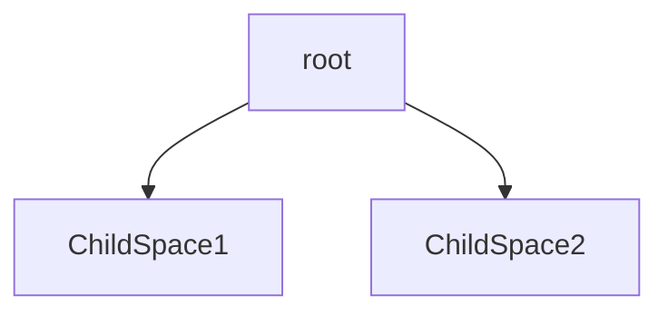
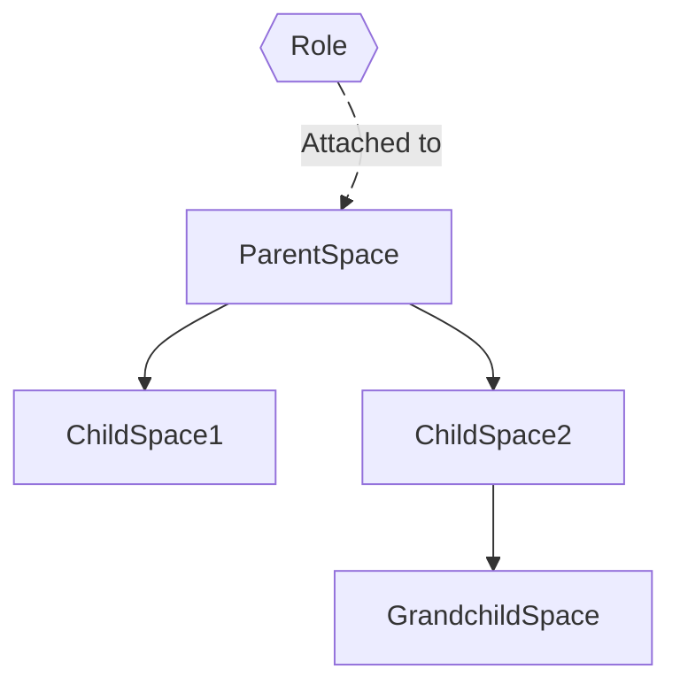
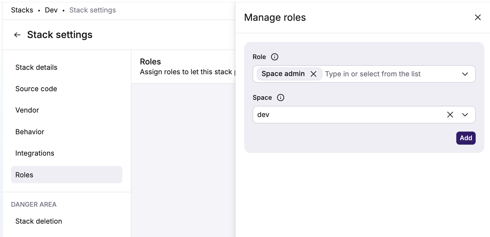

# Stack role bindings

Stacks can receive role bindings to perform operations with elevated permissions, similar to how users, API keys, and IdP groups receive permissions through [Spacelift's RBAC system](rbac-system.md).

Stack role attachments replace the deprecated [Administrative](../stack/stack-settings.md#administrative) flag, providing a more flexible, auditable, and powerful approach to granting stacks elevated permissions.

## Why use stack role attachments

Stack role attachments offer significant advantages over the deprecated administrative flag:

### Cross-space access

**Administrative flag limitation**: Can only create resources in the stack's own space and subspaces.

**Role attachments advantage**: Can attach roles to sibling spaces, enabling horizontal access across the space tree. In the example below, a stack in `ChildSpace1` can be granted access to `ChildSpace2`:



### Fine-grained access control

**Administrative flag limitation**: All-or-nothing approach - grants full Space Admin permission with every available permission.

**Role attachments advantage**: Use custom roles with specific permissions (for example, only `context:create` and `workerpool:create`).

This means a stack can create contexts and worker pools, but cannot manage any other resources, such as policies or webhooks.

### Enhanced audit trail

**Administrative flag**: Basic audit trail with stack actor information.

**Role attachments advantage**: Audit trail webhooks include role information in the `actor_roles` field (array of role slugs).

This provides better visibility into what permissions the stack was using when performing actions. See the [audit trail documentation](../../integrations/audit-trail.md#usage) for details.

### Modern RBAC consistency

Role attachments align stacks with the broader role-based access model already used by [users](./assigning-roles-users.md), [IdP groups](./assigning-roles-groups.md), and [API keys](./assigning-roles-api-keys.md), providing a consistent permission management experience across all actors.

## Assign roles to stacks

### Prerequisites

To attach a role to a stack, you need:

- `StackManage` [permission](./rbac-system.md#actions-the-building-blocks-of-permissions) (or Space admin permission as fallback) to the stack's space
- Space admin permission to the binding space (the space where the role will be effective)

!!! info "Why both permissions are required"
    Creating a role binding that grants permissions to a space effectively allows the stack to act in that space. To prevent privilege escalation, you must have admin access to both spaces: the space where the stack resides and the space where the role will be effective.

### Using the Web UI

1. Navigate to the stack's **Settings** page, then choose **Roles** on the left
2. Click **Manage Roles** on the top right
3. In the sidebar, select the desired role and the target space
4. Click **Add**

### Using the Terraform provider

Use the `spacelift_role_attachment` resource:

```hcl
resource "spacelift_space" "devops" {
  name            = "devops"
  description     = "A space for devops engineers"
  parent_space_id = "root"
}

resource "spacelift_stack" "devops_admin" {
  name        = "Admin stacks for Devs"
  repository  = "stacks-for-devs"
  space_id    = spacelift_space.devops.id
  description = "Only has permissions to create another stacks in the dev space"
  branch      = "main"
}

resource "spacelift_role" "stack_creator" {
  name        = "Stack creator"
  description = "A role solely for managing stacks"
  actions     = ["STACK_MANAGE"]
}

resource "spacelift_space" "dev" {
  name            = "dev"
  description     = "A space for development stacks"
  parent_space_id = "root"
}

resource "spacelift_role_attachment" "stack_creator_to_devops_admin_stack" {
  stack_id = spacelift_stack.devops_admin.id # (1)
  role_id  = spacelift_role.stack_creator.id # (2)
  space_id = spacelift_space.dev.id # (3)
}
```

1. The stack receiving the role attachment.
2. The [role](./rbac-system.md#roles) to attach to the stack.
3. The target space: this is where the role will be effective.

In the above scenario, the `devops_admin` stack will have the `Stack creator` role effective in the `dev` space, allowing it to create and manage stacks within that space.

For more information, see the [Spacelift Terraform provider documentation](https://search.opentofu.org/provider/spacelift-io/spacelift/latest/docs/resources/role_attachment){: rel="nofollow"}.

## Permission cascading

Role attachments cascade down to child spaces, similar to how the administrative flag worked:



If a role is attached to `ParentSpace`, the same role will be effective in `ChildSpace1`, `ChildSpace2`, and `GrandchildSpace` as well.

!!! danger "Root space caution"
    Since the `root` space is the parent of all spaces, attaching roles to it affects **all spaces** in your account. Use this with extreme caution and only when necessary.

### Root space restriction

You can only assign a role to the `root` space if the stack itself is located in the `root` space. This restriction prevents unintentional access elevation - a stack in a _child-of-root_ space cannot be granted permissions that cascade to all spaces in your account.
If you need a stack in a child space to access resources across multiple spaces, attach roles to specific spaces rather than the root space.

## Administrative flag precedence

The administrative flag takes precedence over role attachments:

- If `administrative = true`, any attached roles will be **completely ineffective**
- You **must** set `administrative = false` for role attachments to take effect
- This is critical for migration - disable the administrative flag after creating role attachments

## Policy integration

Policies can react to stack role attachments through the `stack.roles` field in [policy inputs](../policy/approval-policy.md#data-input-schema). This enables policy-based logic based on what roles a stack has attached.

### Example: Reject Space Admin role usage

=== "Rego v1"
    ```rego
    package spacelift

    reject_with_note contains "Don't use the Space Admin role!" if {
      some role in input.stack.roles
      role.id == "space-admin" # (1)
    }
    ```

=== "Rego v0"
    ```rego
    package spacelift

    reject_with_note["Don't use the Space Admin role!"] {
      role := input.stack.roles[_]
      role.id == "space-admin" # (1)
    }
    ```

1. Role slug. Use either "Copy Slug" button in the UI or the [`spacelift_role` data source](https://search.opentofu.org/provider/spacelift-io/spacelift/latest/docs/datasources/role){: rel="nofollow"} to retrieve it.

## Multiple roles

Stacks can have multiple role bindings:

- Different roles in different spaces for varied access levels
- Multiple roles in the same space (permissions are additive)
- Combinations of Space Admin in own space and Reader in other spaces

### Example: Multiple role attachments

```hcl
# Admin access to development space
resource "spacelift_role_attachment" "dev_admin" {
  stack_id = spacelift_stack.platform.id
  role_id  = "space-admin"
  space_id = "development-space-id"
}

# Read access to production space
resource "spacelift_role_attachment" "prod_reader" {
  stack_id = spacelift_stack.platform.id
  role_id  = "space-reader"
  space_id = "production-space-id"
}
```

## External state access

External state access allows you to read the state of a stack from outside authorized runs and tasks. See the documentation [here](../../vendors/terraform/external-state-access.md) for further details.

In order for your stack to access another stack's OpenTofu/Terraform state, the stack needs to have **Space writer** role to the target stack's space. This can be achieved by attaching the **Space writer** role to the stack for the target stack's space.

Example:

```hcl
resource "spacelift_stack" "consumer" {
  # Properties are omitted for brevity
}

data "spacelift_role" "space_writer" {
  slug = "space-writer"
}

resource "spacelift_role_attachment" "space_writer" {
  stack_id = spacelift_stack.consumer.id
  role_id  = data.spacelift_role.space_writer.id
  space_id = spacelift_stack.provider.space_id
}

resource "spacelift_stack" "provider" {
  # Properties are omitted for brevity
  terraform_external_state_access = true
}
```

!!! note
    The Space admin role also includes Space writer permissions.

## Migration from administrative flag

On June 1st, 2026, Spacelift will automatically disable all administrative flags and attach the Space Admin role to each stack's own space. This automatic migration is **100% backward compatible** and ensures no functionality loss.

However, **manual migration is strongly recommended** to avoid breaking the OpenTofu/Terraform state: since the administrative flag will be disabled during this process, the stacks will experience a drift. The administrative flag will be ineffective (even if set to true, it'll return false), so the only solution to reconcile will be to attach the Space Admin role to the stack's own space.

!!! note
    The Space admin role is a built-in system role so you don't need to create it manually, it already exists in your Spacelift account.

### What happens on June 1st, 2026

On June 1st, 2026, Spacelift will automatically:

- Disable all administrative flags
- Attach the Space Admin role to each stack's own space (100% backward compatible)
    - Note: if you move the stack to a different space later, the role attachment remains unchanged and will not follow the stack's new space
- Remove the administrative flag from the UI
- Make the flag ineffective in the GraphQL API (even if set to `true`, it will behave as `false`)

### Step-by-step migration guide

#### 1. Identify stacks with administrative flag

List all stacks with `administrative = true` in your account. You can do this through the Spacelift UI (by filtering on the stacks page) or by searching your Terraform code for the `administrative` attribute.

#### 2. For each stack, create role attachment

Attach the Space Admin role to the stack using the stack's own space as the binding space:

**Using the Terraform provider:**

```hcl
data "spacelift_role" "admin_role" {
  slug = "space-admin"
}
      
resource "spacelift_role_attachment" "stack_admin" {
  stack_id = spacelift_stack.management.id
  space_id = spacelift_stack.management.space_id
  role_id  = data.spacelift_role.admin_role.id
}
```

**Using the Web UI:**

1. Navigate to the stack's **Settings** page, then choose **Roles**
2. Click **Manage Roles** on the top right
3. In the drawer, select the **Space admin** role and the stack's own Space as the target
4. Click **Add**

Assuming your stack is in the `dev` [Space](../spaces/README.md), the role attachment will grant **Space admin** permissions in the `dev` space:



#### 3. Remove the administrative attribute

Once you've verified the roles have been attached, remove the administrative attibute:

```diff
resource "spacelift_stack" "management" {
   name           = "Management Stack"
-  administrative = true
}
```

!!! important
    The administrative flag takes precedence over role attachments. If `administrative = true`, any attached roles will be ignored. You must either set `administrative = false`, or entirely remove the administrative attribute (recommended) for role attachments to take effect.

#### 4. Verify the role attachment

After creating the role attachment, verify that the stack can perform the same operations as before. Trigger a tracked run and ensure it succeeds.

#### 5. Adjust policies if necessary

If any of your policies reference the `stack.administrative` field, update them to use the `stack.roles` field instead. For example:

=== "Rego v1"
    ```rego
    # Old policy:
    deny contains "Administrative stacks are not allowed" if {
      stack := input.spacelift.stack
      stack.administrative == true
    }

    # Would become:
    deny contains "Administrative stacks are not allowed" if {
      some role in input.spacelift.stack.roles
      role.id == "space-admin" # (1)
    }
    ```

=== "Rego v0"
    ```rego
    # Old policy:
    deny["Administrative stacks are not allowed"] {
      stack := input.spacelift.stack
      stack.administrative == true
    }

    # Would become:
    deny["Administrative stacks are not allowed"] {
      role := input.spacelift.stack.roles[_]
      role.id == "space-admin" # (1)
    }
    ```

1. Role slug. Use either "Copy Slug" button in the UI or the [`spacelift_role` data source](https://search.opentofu.org/provider/spacelift-io/spacelift/latest/docs/datasources/role){: rel="nofollow"} to retrieve it.

### Rollback procedure

If you need to roll back during migration:

1. Set `administrative = true` again
2. The administrative flag takes precedence, so role attachments will be ignored
3. Test that everything works as before
4. You can leave the role attachments in place and try migration again later

## Edge cases

### Stack moving between spaces

When a stack moves to a different space, existing role bindings remain unchanged. This is intentional and important for Terraform provider stability.

If you want to update role bindings after moving a stack, you need to explicitly modify the role attachments.
