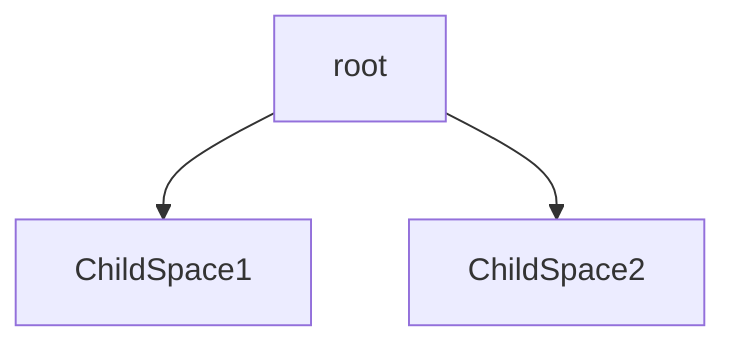
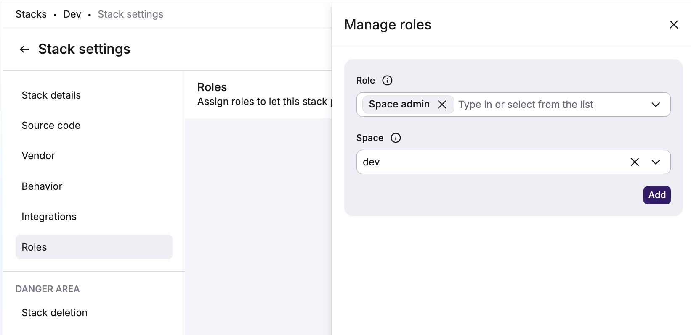

# Stack role attachments

Stacks can receive role bindings to perform operations with elevated permissions, similar to how users, API keys, and IdP groups receive permissions through [Spacelift's RBAC system](rbac-system.md).

Stack role attachments replace the deprecated [Administrative](../stack/stack-settings.md#administrative) flag, providing a more flexible, auditable, and powerful approach to granting stacks elevated permissions.

## Why use stack role attachments

Stack role attachments offer significant advantages over the deprecated administrative flag:

### Cross-space access

**Administrative flag limitation**: Can only create resources in the stack's own space and subspaces.

**Role attachments advantage**: Can attach roles to sibling spaces, enabling horizontal access across the space tree. In the example below, a stack in `ChildSpace1` can be granted access to `ChildSpace2`:


```mermaid
graph TD
    A[root] --> B[ChildSpace1]
    A --> C[ChildSpace2]
```

### Fine-grained access control

**Administrative flag limitation**: All-or-nothing approach - grants full Space Admin permission with every available permission.

**Role attachments advantage**: Use custom roles with specific permissions (for example, only `context:create` and `workerpool:create`).

This means a stack can create contexts and worker pools, but cannot manage any other resources, such as policies or webhooks.

### Enhanced audit trail

**Administrative flag**: Basic audit trail with stack actor information.

**Role attachments advantage**: Audit trail webhooks include role information in the `ActorRoles` field (array of role slugs).

This provides better visibility into what permissions the stack was using when performing actions. See the [audit trail documentation](../../integrations/audit-trail.md) for details.

### Modern RBAC consistency

Role attachments align stacks with the broader role-based access model already used by [users](./assigning-roles-users.md), [IdP groups](./assigning-roles-groups.md), and [API keys](./assigning-roles-api-keys.md), providing a consistent permission management experience across all actors.

## Assign roles to stacks

### Prerequisites

To attach a role to a stack, you need:

- `StackManage` permission (or `SpaceAdmin` permission as fallback) to the stack's space
- `SpaceAdmin` permission to the binding space (the space where the role will be effective)

!!! info "Why both permissions are required"
    Creating a role binding that grants permissions to a space effectively allows the stack to act in that space. To prevent privilege escalation, you must have admin access to both spaces: the space where the stack resides and the space where the role will be effective.

### Using the Web UI

1. Navigate to the stack's **Settings** page, then choose **Roles** on the left
2. Click **Manage Roles** on the top right
3. In the sidebar, select the desired role and the target space
4. Click **Add**

### Using the Terraform provider

Use the `spacelift_role_attachment` resource:

```hcl
resource "spacelift_stack" "admin" {
  name        = "Admin stack"
  repository  = "spacelift-resources"
  description = "Only has permissions to create another stacks in the dev space"
  branch      = "main"
}

resource "spacelift_role" "stack_creator" {
  name        = "Stack creator"
  description = "A role solely for creating stacks"
  actions     = ["STACK_MANAGE"]
}

resource "spacelift_space" "dev" {
  name            = "dev"
  parent_space_id = "root"
}

resource "spacelift_role_attachment" "stack_creator_to_admin_stack" {
  stack_id = spacelift_stack.admin.id
  role_id  = spacelift_role.stack_creator.id
  space_id = spacelift_space.dev.id
}
```

For more information, see the [Spacelift Terraform provider documentation](https://search.opentofu.org/provider/spacelift-io/spacelift/latest/docs/resources/role_attachment){: rel="nofollow"}.

## Permission cascading

Role attachments cascade down to child spaces, similar to how the administrative flag worked:

```text
parentSpace
├── childSpace1
└── childSpace2
    └── grandchildSpace
```

If a role is attached to `parentSpace`, the same role will be effective in `childSpace1`, `childSpace2`, and `grandchildSpace`.

!!! warning "Root space caution"
    Since the `root` space is the parent of all spaces, attaching roles to it affects **all spaces** in your account. Use this with extreme caution and only when necessary.

## Administrative flag precedence

The administrative flag takes precedence over role attachments:

- If `administrative = true`, any attached roles will be **completely ineffective**
- You **must** set `administrative = false` for role attachments to take effect
- This is critical for migration - disable the administrative flag after creating role attachments

## Policy integration

Policies can react to stack role attachments through the `stack.roles` field in [policy inputs](../policy/approval-policy.md#data-input-schema). This enables policy-based logic based on what roles a stack has attached.

### Example: Reject Space Admin role usage

```rego
package spacelift

reject_with_note["Don't use the Space Admin role!"] {
  role := input.stack.roles[_]
  role.id == "space-admin" # Role slug. Use the "Copy Slug" button in the UI to get it.
}
```

## Multiple roles

Stacks can have multiple role bindings:

- Different roles in different spaces for varied access levels
- Multiple roles in the same space (permissions are additive)
- Combinations of Space Admin in own space and Reader in other spaces

### Example: Multiple role attachments

```hcl
# Admin access to development space
resource "spacelift_role_attachment" "dev_admin" {
  stack_id = spacelift_stack.platform.id
  role_id  = "space-admin"
  space_id = "development-space-id"
}

# Read access to production space
resource "spacelift_role_attachment" "prod_reader" {
  stack_id = spacelift_stack.platform.id
  role_id  = "space-reader"
  space_id = "production-space-id"
}
```

## External state access

External state access allows you to read the state of the stack from outside authorized runs and [tasks](../../concepts/run/task.md). See the documentation [here](../../vendors/terraform/external-state-access.md) for further details.

In order for your stack to access another stack's OpenTofu/Terraform state, the stack needs to have **Space writer** role to the target stack's space. This can be achieved by attaching the **Space writer** role to the stack for the target stack's space.

Example:

```hcl
data "spacelift_role" "space_writer" {
  slug = "space-writer"
}

resource "spacelift_role_attachment" "space_writer" {
  stack_id = spacelift_stack.consumer.id
  role_id  = data.spacelift_role.space_writer.id
  space_id = spacelift_stack.provider.space_id
}
```

!!! note
    The **Space admin** role also includes **Space writer** permissions.

## Migration from administrative flag

!!! warning "Automatic Migration on June 1st, 2026"
    On June 1st, 2026, Spacelift will automatically disable all administrative flags and attach the Space Admin role to each stack's own space. This automatic migration is **100% backward compatible** and ensures no functionality loss.

    However, **manual migration is strongly recommended** to take advantage of advanced features like cross-space access and fine-grained permissions that are not available with automatic migration.

### What happens on June 1st, 2026

On June 1st, 2026, Spacelift will automatically:

- Disable all administrative flags
- Attach the Space Admin role to each stack's own space (100% backward compatible)
    - Note: if you move the stack to a different space later, the role attachment remains unchanged and will not follow the stack's new space
- Remove the administrative flag from the UI
- Make the flag ineffective in the GraphQL API (even if set to `true`, it will behave as `false`)

### Step-by-step migration guide

#### 1. Identify stacks with administrative flag

List all stacks with `administrative = true` in your account. You can do this through the Spacelift UI (by filtering on the stacks page) or by searching your Terraform code for the `administrative` attribute.

#### 2. For each stack, create role attachment

Attach the Space Admin role to the stack using the stack's own space as the binding space:

**Using the Terraform provider:**

```hcl
data "spacelift_role" "admin_role" {
  slug = "space-admin"
}
      
resource "spacelift_role_attachment" "stack_admin" {
  stack_id = spacelift_stack.management.id
  space_id = spacelift_stack.management.space_id
  role_id  = data.spacelift_role.admin_role.id
}
```

**Using the Web UI:**

1. Navigate to the stack's **Settings** page, then choose **Roles**
2. Click **Manage Roles** on the top right
3. In the drawer, select the **Space admin** role and the stack's own Space as the target
4. Click **Add**

Assuming your stack is in the `dev` [Space](../spaces/README.md), the role attachment will grant **Space admin** permissions in the `dev` space:



#### 3. Disable the administrative flag

Once you've verified the roles have been attached, disable the administrative flag:

```hcl
resource "spacelift_stack" "management" {
  # [... other stack settings ...]
  administrative = false
}
```

!!! important
    The administrative flag takes precedence over role attachments. If `administrative = true`, any attached roles will be ignored. You must set `administrative = false` for role attachments to take effect.

#### 4. Verify the role attachment

After creating the role attachment, verify that the stack can perform the same operations as before. Trigger a tracked run and ensure it succeeds.

#### 5. Adjust policies if necessary

If any of your policies reference the `stack.administrative` field, update them to use the `stack.roles` field instead. For example:

```rego
# Old policy:
deny_with_note["Administrative stacks are not allowed"] {
  stack := input.stack
  stack.administrative == true
}

# Would become:
deny_with_note["Administrative stacks are not allowed"] {
  role := input.stack.roles[_]
  role.id == "space-admin" # Role slug. Use the "Copy Slug" button in the UI to get it.
}
```

### Rollback procedure

If you need to roll back during migration:

1. Set `administrative = true` again
2. The administrative flag takes precedence, so role attachments will be ignored
3. Test that everything works as before
4. You can leave the role attachments in place and try migration again later

## Edge cases

### Stack moving between spaces

When a stack moves to a different space, existing role bindings remain unchanged. This is intentional and important for Terraform provider stability.

If you want to update role bindings after moving a stack, you need to explicitly modify the role attachments.
