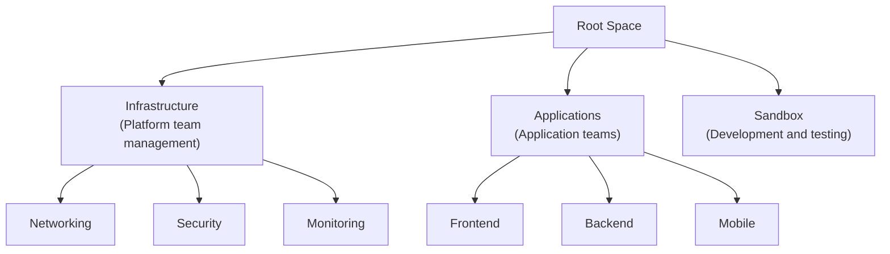

# Role-Based Access Control (RBAC)

Up until recently, Spacelift used **legacy system roles** with broad roles (Reader, Writer, Admin) to manage user permissions.
This approach worked for many organizations but lacked the granularity and flexibility needed for modern infrastructure management.
With the introduction of the **Custom RBAC** system, Spacelift has transformed how permissions are managed, enabling a more
fine-grained, composable approach to advanced access control.

## Custom RBAC vs legacy system roles

### Legacy system roles (previous approach)

The legacy system used three broad roles:

- **Reader**: View-only access to resources.
- **Writer**: Reader permissions + ability to trigger runs and modify environment variables.
- **Admin**: Writer permissions + ability to create/modify stacks and attachable entities.

!!! note "Migration to custom RBAC"
    Existing legacy system role assignments have been automatically migrated to equivalent custom RBAC roles:

    | Legacy Role | RBAC Equivalent |
    | ----------- | --------------- |
    | Reader      | Space Reader    |
    | Writer      | Space Writer    |
    | Admin       | Space Admin     |

### Custom RBAC (current approach)

Custom RBAC decomposes these broad roles into **individual, composable actions**.

!!! example "Custom RBAC Example"
    Instead of giving an actor, like an API key, full **Writer** access (which includes many permissions that are not needed), you can create a custom "Deployment Operator" role with just these permissions:

    - `run:trigger`: Can trigger stack runs.
    - `run:read`: Can view run details.

    This approach provides exactly the access needed for deployment operations without extra permissions.

## Core architecture

In Spacelift's RBAC system, **actors** are entities that perform **actions** on **subjects** within **spaces**. This architecture allows for precise control over who can do what, where, and how.

### Actors: who performs actions

Actors include users, API keys, and IdP groups.

#### Users

Individual team members who are authenticated through your identity provider (GitHub, GitLab, Microsoft, Google, or SAML/OIDC
SSO).

##### User patterns

- Use IdP groups for role assignment when possible.
- Limit individual user role assignments to exceptional cases.
- Regular access reviews and cleanup.

#### API Keys

Programmatic access tokens for automation and CI/CD integration.

##### API key patterns

- Create purpose-specific keys with minimal required permissions.
- Use specific custom roles rather than broad predefined roles.
- Use environment-specific keys rather than shared keys.
- Use descriptive names that indicate purpose (e.g., "terraform-ci-prod").
- Include environment or project context in the name.
- Implement key rotation policies.
- Document the purpose and owner of each API key.
- Monitor API key usage through audit trails.

#### IdP Groups

Groups of users as defined by your identity provider.

##### Examples of group sources

**GitHub Teams**:

- Passed in the users' token.

**SAML/OIDC Groups**:

- Defined by your enterprise identity provider.
- Mapped through SAML assertions or OIDC claims.
- Group membership determined by your IdP's group policies.

##### IdP group patterns

**Functional Groups**: Organize groups by job function across the organization.

- `platform-engineers` → Full infrastructure management
- `application-developers` → Deployment capabilities only
- `security-auditors` → Read-only access across all spaces

**Project Groups**: Organize groups by project or product.

- `project-alpha-team` → Full access to "Project Alpha" space
- `project-beta-team` → Full access to "Project Beta" space

**Hybrid Approach**: Combine functional and project-based groups.

- Base permissions from functional groups.
- Additional project-specific permissions from project groups.

#### Stacks

[Stacks](../stack/README.md) that can assume roles to manage resources programmatically inside Spacelift via the [Spacelift Terraform Provider](https://search.opentofu.org/provider/spacelift-io/spacelift/latest){: rel="nofollow"}.

For more information, see [Assigning Roles to Stacks](./assigning-roles-stacks.md).

### Actions: the building blocks of permissions

Actions are the smallest unit of permission granularity in Spacelift's RBAC system. Each action defines a specific operation that can be performed. Actions are organized by subject type (the resource they operate on).

!!! info "Legacy role fallbacks"
    When a user doesn't have an explicit action permission through a custom role, the system falls back to checking their legacy space access level (Reader/Writer/Admin). The "Legacy Fallback" column indicates which legacy role is required when custom action permissions are not granted.

#### Space actions

| Action              | Description                                                | Legacy Fallback |
| ------------------- | ---------------------------------------------------------- | --------------- |
| `space:admin`       | Full administrative access to a space                      | Admin           |
| `space:read`        | Grants visibility into stacks, runs, and other resources within an assigned space. Required to view any subjects within a space | Reader |
| `space:write`       | Write access to space resources                            | Writer          |
| `space:share-module`| Allow modules to be shared with an assigned space from other spaces | Writer |

#### Run actions

| Action                                    | Description                                                   | Legacy Fallback |
| ----------------------------------------- | ------------------------------------------------------------- | --------------- |
| `run:cancel`                              | Cancel runs in a given space                                  | Reader          |
| `run:cancel-blocking`                     | Cancel blocking runs in a given space                         | Writer          |
| `run:comment`                             | Comment on runs in a given space                              | Reader          |
| `run:confirm`                             | Confirm a plan and apply changes                              | Writer          |
| `run:discard`                             | Discard planned changes                                       | Writer          |
| `run:prioritize-set`                      | Prioritize a run in a given space                             | Writer          |
| `run:promote`                             | Trigger a tracked run for the same Git commit as a proposed run | Writer        |
| `run:propose-local-workspace`             | Trigger a proposed run based on local workspace               | Writer          |
| `run:propose-with-overrides`              | Trigger a proposed run with environment variable overrides    | Writer          |
| `run:retry`                               | Retry runs in a given space                                   | Reader          |
| `run:retry-blocking`                      | Retry blocking runs in a given space                          | Writer          |
| `run:review`                              | Review planned changes and submit review (approval/rejection) | Writer          |
| `run:stop`                                | Stop runs in a given space                                    | Reader          |
| `run:stop-blocking`                       | Stop blocking runs in a given space                           | Writer          |
| `run:targeted-replan`                     | Replan a targeted run in a given space                        | Writer          |
| `run:trigger`                             | Trigger stack runs in a given space                           | Writer          |
| `run:trigger-with-custom-runtime-config`  | Trigger stack runs with custom runtime config                 | Admin           |

#### Task actions

| Action         | Description                         | Legacy Fallback |
| -------------- | ----------------------------------- | --------------- |
| `task:create`  | Trigger tasks for stacks in a given space | Writer    |

#### Stack actions

| Action                        | Description                                                | Legacy Fallback |
| ----------------------------- | ---------------------------------------------------------- | --------------- |
| `stack:add-config`            | Add or update stack environment variables and mounted files| Writer          |
| `stack:create`                | Create stacks in a given space                             | Admin           |
| `stack:delete`                | Delete stacks in a given space                             | Admin           |
| `stack:delete-config`         | Delete stack environment variables and mounted files       | Writer          |
| `stack:disable`               | Disable a stack                                            | Admin           |
| `stack:enable`                | Enable a disabled stack                                    | Admin           |
| `stack:lock`                  | Lock a stack for exclusive use                             | Writer          |
| `stack:manage`                | Manage stacks in a given space                             | Admin           |
| `stack:managed-state-import`  | Import managed state for a stack                           | Admin           |
| `stack:managed-state-rollback`| Rollback managed state for a stack                         | Admin           |
| `stack:reslug`                | Re-slug stacks in a given space                            | Admin           |
| `stack:set-current-commit`    | Set stack current commit in a given space                  | Writer          |
| `stack:set-star`              | Star or unstar a stack                                     | Reader          |
| `stack:state-download`        | Download the state file for a stack                        | Writer          |
| `stack:state-read`            | Read the state file for a stack                            | Writer          |
| `stack:sync-commit`           | Sync the tracked branch head commit with stack head commit | Writer          |
| `stack:unlock`                | Unlock a previously locked stack (same user only)         | Writer          |
| `stack:unlock-force`          | Unlock any locked stack, including those locked by others  | Admin           |
| `stack:update`                | Update stacks (details, source, behavior, vendor)          | Admin           |
| `stack:upload-local-workspace`| Generate upload URLs for local previews                    | Writer          |
| `stack:workspace-lock`        | Lock the workspace for a stack                             | Admin           |
| `stack:workspace-unlock`      | Unlock the workspace for a stack                           | Admin           |

#### Context actions

| Action            | Description                        | Legacy Fallback |
| ----------------- | ---------------------------------- | --------------- |
| `context:create`  | Create contexts in a given space   | Admin           |
| `context:delete`  | Delete contexts in a given space   | Admin           |
| `context:update`  | Update contexts in a given space   | Admin           |

#### Worker Pool actions

| Action                   | Description                           | Legacy Fallback |
| ------------------------ | ------------------------------------- | --------------- |
| `worker:drain-set`       | Drain or undrain workers in a given space | Admin       |
| `worker-pool:create`     | Create worker pools in a given space  | Admin           |
| `worker-pool:cycle`      | Cycle worker pools in a given space   | Admin           |
| `worker-pool:delete`     | Delete worker pools in a given space  | Admin           |
| `worker-pool:reset`      | Reset worker pools in a given space   | Admin           |
| `worker-pool:update`     | Update worker pools in a given space  | Admin           |

#### Module actions

| Action                    | Description                    | Legacy Fallback |
| ------------------------- | ------------------------------ | --------------- |
| `module:create`           | Create a module                | Admin           |
| `module:disable`          | Disable a module               | Admin           |
| `module:enable`           | Enable a module                | Admin           |
| `module:mark-as-bad`      | Mark a module as bad           | Writer          |
| `module:publish`          | Publish a module               | Admin           |
| `module:trigger-version`  | Trigger a module version       | Writer          |

#### Terraform Provider actions

| Action                                        | Description                                      | Legacy Fallback |
| --------------------------------------------- | ------------------------------------------------ | --------------- |
| `terraform-provider:create`                   | Create Terraform provider in a given space       | Admin           |
| `terraform-provider:delete`                   | Delete Terraform provider in a given space       | Admin           |
| `terraform-provider:set-visibility`           | Set visibility for Terraform providers           | Admin           |
| `terraform-provider:update`                   | Update Terraform provider in a given space       | Admin           |
| `terraform-provider-version:create`           | Create Terraform provider version                | Writer          |
| `terraform-provider-version:delete`           | Delete Terraform provider version                | Writer          |
| `terraform-provider-version:publish`          | Publish Terraform provider version               | Writer          |
| `terraform-provider-version:register-platform`| Register platform for Terraform provider versions| Writer          |
| `terraform-provider-version:revoke`           | Revoke Terraform provider version                | Writer          |
| `terraform-provider-version:update`           | Update Terraform provider version                | Writer          |

#### Intent actions

Intent actions are used for managing [Intent-based infrastructure](../../product/intent/README.md).

| Action                                          | Description                                    | Legacy Fallback |
| ----------------------------------------------- | ---------------------------------------------- | --------------- |
| `intent-dependencies:add`                       | Add dependencies to intent project             | Admin           |
| `intent-dependencies:remove`                    | Remove dependencies from intent project        | Admin           |
| `intent-policy:create`                          | Create new intent policies                     | Admin           |
| `intent-policy:delete`                          | Delete intent policies                         | Admin           |
| `intent-policy:update`                          | Update existing intent policies                | Admin           |
| `intent-project:cloud-integration-attach`       | Attach AWS integration to intent project       | Admin           |
| `intent-project:cloud-integration-detach`       | Detach AWS integration from intent project     | Admin           |
| `intent-project:config-add`                     | Add configuration to intent project            | Admin           |
| `intent-project:config-delete`                  | Delete configuration from intent project       | Admin           |
| `intent-project:config-update`                  | Update configuration in intent project         | Admin           |
| `intent-project:create`                         | Create a new intent project                    | Admin           |
| `intent-project:delete`                         | Delete an intent project                       | Admin           |
| `intent-project:disable`                        | Disable an intent project                      | Admin           |
| `intent-project:enable`                         | Enable an intent project                       | Admin           |
| `intent-project:lock`                           | Lock an intent project                         | Admin           |
| `intent-project:policy-attach`                  | Attach a policy to intent project              | Admin           |
| `intent-project:policy-detach`                  | Detach a policy from intent project            | Admin           |
| `intent-project:unlock`                         | Unlock an intent project                       | Admin           |
| `intent-project:update`                         | Update an intent project                       | Admin           |
| `intent-resource:create`                        | Create new cloud resources                     | Admin           |
| `intent-resource:delete`                        | Delete cloud resources                         | Admin           |
| `intent-resource:import`                        | Import existing cloud resources into state     | Admin           |
| `intent-resource:refresh`                       | Refresh cloud resource state                   | Admin           |
| `intent-resource:resume`                        | Resume intent resource operations              | Admin           |
| `intent-resource:update`                        | Update existing cloud resources                | Admin           |
| `intent-resource-operation:review`              | Review an intent resource operation            | Admin           |
| `intent-state:eject`                            | Eject resources from state                     | Admin           |
| `intent-state:read`                             | Read intent state details                      | Admin           |

#### Spacelift VCS actions

| Action                           | Description                           | Legacy Fallback |
| -------------------------------- | ------------------------------------- | --------------- |
| `spacelift-vcs:commit-files`     | Commit files to Spacelift VCS integration | Writer      |
| `spacelift-vcs:create`           | Create Spacelift VCS integration      | Admin           |
| `spacelift-vcs:delete`           | Delete Spacelift VCS integration      | Admin           |
| `spacelift-vcs:update`           | Update Spacelift VCS integration      | Writer          |

!!! note "Action catalog expansion"
    Spacelift continuously adds new actions based on user feedback and use cases. If you need an action that isn't currently available, please contact Spacelift support.

### Subjects: what actions are performed on

Subjects are the resources that actors interact with, for example:

- **Stacks**: Stacks managing infrastructure, runs, and associated metadata.
- **Contexts**: Environment variables, mounted files, and configuration collections.
- **Policies**: Rules governing Spacelift behavior (approval, notification, etc.).

!!! warning "Space-level granularity"
    Currently, RBAC operates at the [**space level**](../spaces/access-control.md). All roles are bound to specific spaces and apply equally to all subjects within that space. Entity-level granularity (e.g., permissions for individual stacks) is not yet supported.

#### Stack access patterns

**Development Stacks**:

- Developers need full management capabilities.
- Frequent deployments and experimentation.
- Less restrictive approval requirements.

**Production Stacks**:

- Limited management access to senior engineers.
- Strict approval workflows.
- Enhanced audit and monitoring.

**Shared Infrastructure Stacks**:

- Platform team management.
- Application team read access.
- Cross-team coordination requirements.

#### Policy access patterns

**Centralized Governance**:

- Security team manages all policies.
- Consistent rules across the organization.
- Limited policy creation permissions.

**Federated Governance**:

- Teams manage policies for their own spaces.
- Organization-wide baseline policies.
- Team-specific additional policies.

### Spaces: the scope of permissions

All RBAC roles are **space-bound**, meaning:

- Roles are assigned to specific spaces.
- Permissions apply to all subjects within that space.
- Users need appropriate roles in each space they need to access.

#### Space hierarchy

Spaces can be organized hierarchically to reflect your organizational structure:

#### Space design patterns

**Isolation requirements**:

- Separate spaces for different environments (dev/staging/prod).
- Separate spaces for different teams or projects.
- Separate spaces for different compliance requirements.

**Permission boundaries**:

- Align space boundaries with permission requirements.
- Consider who needs access to what resources.
- Plan for space hierarchy and inheritance patterns.

## Roles

### System roles

System roles provide standard, least-privileged permission policies for granting access to specific pieces of Spacelift functionality.
For example, the `Worker pool controller` role contains the correct permissions to allow the Kubernetes controller to manage worker pools automatically.

System roles are immutable and cannot be modified or deleted, ensuring consistent baseline permissions across all accounts.

#### Space reader

**Actions**: Basic read permissions

- View stacks, contexts, policies, and runs.
- Add comments to runs for feedback.
- Cannot trigger actions or modify resources.
- Equivalent to legacy **Reader** role.

#### Space writer

**Actions**: Space Reader + multiple execution permissions

- All Space Reader permissions.
- Trigger stack runs.
- Execute tasks.
- Modify stack environment variables.
- Equivalent to legacy **Writer** role.

#### Space admin

**Actions**: Space Writer + management permissions

- All Space Writer permissions.
- Create and modify stacks.
- Create and modify contexts and policies.
- Create and modify Intent projects.
- Manage space settings (when assigned to specific space).
- View all roles, users, API keys, and IdP group mappings in the organization (read-only).
- Manage role bindings (assign/remove roles) for users, API keys, and IdP groups within the spaces they administer.
- Equivalent to legacy **Admin** role.

!!! info "Root Space Admin vs Non-root Space Admin"
    **Root Space Admins** (Space Admin role on the **root** space) have account-wide privileges including:

    - All Space Admin permissions across all spaces
    - SSO setup, VCS configuration, audit trail management
    - Invite/revoke users and create/modify/delete roles
    - Create/modify/delete API keys and IdP group mappings
    - Manage role bindings across all spaces

    **Non-root Space Admins** (Space Admin role on any non-root space) have limited privileges:

    - Space Admin permissions only within the spaces they administer
    - Can view all roles, users, API keys, and IdP group mappings
    - Can manage role bindings only for the spaces they administer
    - Cannot invite/revoke users, create/modify/delete roles, or create/modify/delete API keys and IdP group mappings

#### Worker pool controller

**Actions**:

- Space
    - Read
- Workerpool
    - Create
    - Update
    - Delete

### Custom roles

#### Create custom roles using the web UI

1. Go to **Organization Settings** → **Access Control Center** → **Roles**.
2. Click **Create Role** to start defining a new role.
3. **Define Role Properties**:
    - **Name**: Descriptive role name (e.g., "Infrastructure Developer").
    - **Description**: Clear explanation of the role's purpose.
    - **Actions**: Select specific permissions needed.

!!! note "Read access baseline"
    The `space:read` action is required to view any subjects within a space. Without it, users cannot see other resources even if they have permissions for them.

#### Create custom roles using the Terraform provider

Refer to the [Spacelift Terraform provider documentation](https://registry.terraform.io/providers/spacelift-io/spacelift/latest/docs/resources/role) for detailed instructions on creating custom roles programmatically.

## Role bindings (assigning roles to actors)

View more detailed instructions for assigning roles to:

- [Individual users](./assigning-roles-users.md)
- [API keys](./assigning-roles-api-keys.md)
- [IdP groups](./assigning-roles-groups.md)
- [Stacks](./assigning-roles-stacks.md)
