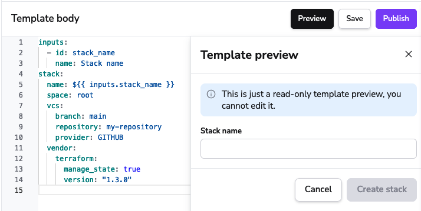
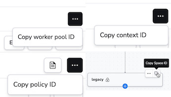

# Blueprint

There are multiple ways to create [stacks](../stack/README.md) in Spacelift. Our recommended way is to use [our Terraform provider](../../vendors/terraform/terraform-provider.md) and programmatically create stacks using an [administrative](../stack/stack-settings.md#administrative) stack.

However, sometimes you might want to create a stack manually, or you might want to create a stack temporarily (like pulling up a test environment, then destroying it). In these cases managing a stack from a VCS system and Terraform could be clumsy, this is where Blueprints come in handy.

## What is a Blueprint?

A Blueprint is a template for a stack and its configuration. The template can contain variables that can be filled in by providing inputs when creating a stack from the Blueprint. The template can also contain a list of other resources that will be created when the stack is created.

You can configure the following resources in a Blueprint:

- All [stack settings](../stack/stack-settings.md) including:
    - Name, description, labels, [Space](../spaces/README.md)
    - Behavioral settings: administrative, auto-apply, auto-destroy, hooks, runner image etc.
- [VCS configuration](../../integrations/source-control/README.md)
- Vendor configuration for your IaaC provider
- [Environment variables](../configuration/environment.md#environment-variables), both non-sensitive and sensitive
- [Mounted files](../configuration/environment.md#mounted-files)
- Attaching [Contexts](../configuration/context.md)
- Attaching [Policies](../policy/README.md)
- Attaching [AWS](../../integrations/cloud-providers/aws.md), [GCP](../../integrations/cloud-providers/gcp.md) and [Azure](../../integrations/cloud-providers/azure.md) integrations
- Schedules:
    - [Drift detection](../stack/drift-detection.md)
    - [Task](../stack/scheduling.md#scheduled-task)
    - [Delete](../stack/scheduling.md#scheduled-delete-stack-ttl)

## Blueprint states

There are two states: draft and published. Draft is the default state, it means that the blueprint "development" is in progress and not meant to be used. You cannot create a stack from a draft blueprint.

Published means that the blueprint is ready to be used. You can publish a blueprint by clicking the `Publish` button in the UI.

A published blueprint cannot be moved back to draft state. You need to clone the blueprint, edit it and publish it.

## Permissions

Blueprints permissions are managed by [Spaces](../spaces/README.md). You can only create, update and delete a blueprint in a Space you have **admin** access to but can be read by anyone with **read** access to the Space.

Once the blueprint is published and you want to create a stack from it, the **read** access will be enough as long as you have **admin** access to the Space where the stack will be created.

## How to create a Blueprint

Choose `Blueprints` on the left menu and click on `Create blueprint`. As of now, we only support YAML format. The template engine will be familiar for those who used GitHub Actions before.

The absolute minimum you'll need to provide is `name`, `space`, `vcs` and `vendor`; all others are optional. Here's a small working example:

```yaml
inputs:
  - id: stack_name
    name: Stack name
stack:
  name: ${{ inputs.stack_name }}
  space: root
  vcs:
    branch: main
    repository: my-repository
    provider: GITHUB
  vendor:
    terraform:
      manage_state: true
      version: "1.3.0"
```

<p align="center" >
    
</p>
<figure markdown> <!-- markdownlint-disable-line MD033 -->
  <figcaption>Preview of a Blueprint</figcaption> <!-- markdownlint-disable-line MD033 -->
</figure>

The `Create a stack` button is inactive because the blueprint is in draft state. You can publish it by clicking the `Publish` button. After that, you can create a stack from the blueprint.

Now, let's look at a massive example that covers all the available configuration options:

<details> <!-- markdownlint-disable-line MD033 -->
<summary>Click to expand</summary> <!-- markdownlint-disable-line MD033 -->

```yaml
inputs:
  - id: environment
    name: Environment to deploy to
    # type is not mandatory, defaults to short_text
  - id: app
    name: App name (used for naming convention)
    type: short_text
  - id: description
    name: Description of the stack
    type: long_text
    # long_text means you'll have a bigger text area in the UI
  - id: tf_version
    name: Terraform version of the stack
    type: select
    options:
      - "0.12.0"
      - "1.3.0"
  - id: manage_state
    name: Should Spacelift manage the state of Terraform
    default: true
    type: boolean
  - id: destroy_task_epoch
    name: Epoch timestamp of when to destroy the resources
    type: number
options:
  # If true, a tracked run will be triggered right after the stack is created
  trigger_run: true
stack:
  name: ${{ inputs.app }}-{{ inputs.environment }}-stack
  space: root
  # The single-quote is needed to avoid YAML parsing errors since the question mark
  # and the colon is a reserved character in YAML.
  description: '${{ inputs.environment == "prod" ? "Production stack" : "Non-production stack" }}. Stack created at ${{ string(context.time) }}.'
  is_disabled: ${{ inputs.environment != 'prod' }}
  labels:
    - Environment/${{ inputs.environment }}
    - Vendor/Terraform
    - Owner/${{ context.user.login }}
    - Blueprint/${{ context.blueprint.name }}
  administrative: false
  allow_promotion: false
  auto_deploy: false
  auto_retry: false
  local_preview_enabled: true
  protect_from_deletion: false
  runner_image: public.ecr.aws/mycorp/spacelift-runner:latest
  worker_pool: 01GQ29K8SYXKZVHPZ4HG00BK2E
  attachments:
    contexts:
      - id: my-first-context-vnfq2
        priority: 1
    clouds:
      aws:
        id: 01GQ29K8SYXKZVHPZ4HG00BK2E
        read: true
        write: true
      azure:
        id: 01GQ29K8SYXKZVHPZ4HG00BK2E
        read: true
        write: true
        subscription_id: 12345678-1234-1234-1234-123456789012
    policies:
      - my-push-policy-1
      - my-approval-policy-1
  environment:
    variables:
      - name: MY_ENV_VAR
        value: my-env-var-value
        description: This is my env var
      - name: MY_SECRET_ENV_VAR
        value: my-secret-env-var-value
        description: This is my encrypted env var
        secret: true
    mounted_files:
      - path: a.json
        content: |
          {
            "a": "b"
          }
        description: This is the configuration of x feature
  hooks:
    apply:
      before: ["sh", "-c", "echo 'before apply'"]
      after: ["sh", "-c", "echo 'after apply'"]
    init:
      before: ["sh", "-c", "echo 'before init'"]
      after: ["sh", "-c", "echo 'after init'"]
    plan:
      before: ["sh", "-c", "echo 'before plan'"]
      after: ["sh", "-c", "echo 'after plan'"]
    perform:
      before: ["sh", "-c", "echo 'before perform'"]
      after: ["sh", "-c", "echo 'after perform'"]
    destroy:
      before: ["sh", "-c", "echo 'before destroy'"]
      after: ["sh", "-c", "echo 'after destroy'"]
    run:
      # There is no before hook for run
      after: ["sh", "-c", "echo 'after run'"]
  schedules:
    drift:
      cron:
        - "0 0 * * *"
        - "5 5 * * 0"
      reconcile: true
      ignore_state: true # If true, the schedule will run even if the stack is in a failed state
      timezone: UTC
    tasks:
      # You need to provide either a cron or a timestamp_unix
      - command: "terraform apply -auto-approve"
        cron:
          - "0 0 * * *"
      - command: "terraform apply -auto-approve"
        timestamp_unix: ${{ int(timestamp('2024-01-01T10:00:20.021-05:00')) }}
    delete:
      delete_resources: ${{ inputs.environment == 'prod' }}
      timestamp_unix: ${{ inputs.destroy_task_epoch - 86400 }}
  vcs:
    branch: master
    project_root: modules/apps/${{ inputs.app }}
    namespace: "my-namespace"
    # Note that this is just the name of the repository, not the full URL
    repository: my-repository
    provider: GITHUB # Possible values: GITHUB, GITLAB, BITBUCKET_DATACENTER, BITBUCKET_CLOUD, GITHUB_ENTERPRISE, AZURE_DEVOPS
  vendor:
    terraform:
      manage_state: ${{ inputs.manage_state }}
      version: ${{ inputs.tf_version }}
      workspace: workspace-${{ inputs.environment }}
      use_smart_sanitization: ${{ inputs.environment != 'prod' }}
    ansible:
      playbook: playbook.yml
    cloudformation:
      entry_template_file: cf/main.yml
      template_bucket: template_bucket
      stack_name: ${{ inputs.app }}-${{ inputs.environment }}
      region: '${{ inputs.environment.contains("prod") ? "us-east-1" : "us-east-2" }}'
    kubernetes:
      namespace: ${{ inputs.app }}
    pulumi:
      stack_name: ${{ inputs.app }}-${{ inputs.environment }}
      login_url: https://app.pulumi.com
```

</details>

As you noticed if we attach an existing resource to the stack (such as Worker Pool, Cloud integration, Policy or Context) we use the unique identifier of the resource. Typically, there is a button for it in the UI but you can also find it in the URL of the resource.

<p align="center" >
    
</p>
<figure markdown> <!-- markdownlint-disable-line MD033 -->
  <figcaption>Example of resource IDs</figcaption> <!-- markdownlint-disable-line MD033 -->
</figure>

## Template engine

We built our own variable substitution engine based on [Google CEL](https://github.com/google/cel-spec). The library is available on [GitHub](https://github.com/spacelift-io/celplate/).

### Functions, objects

In the giant example above, you might have noticed something interesting: inline functions! CEL supports a couple of functions, such as: `contains`, `startsWith`, `endsWith`, `matches`, `size` and a bunch of others. You can find the full list in the [language definition](https://github.com/google/cel-spec/blob/v0.7.1/doc/langdef.md). It also supports some basic operators, such as: `*`, `/`, `-`, `+`, relations (`==`, `!=`, `<`, `<=`, `>`, `>=`), `&&`, `||`, `!`, `?:` (yes, it supports the ternary operator 🎉) and `in`.

!!! hint
    It could be useful to look into [the unit tests](https://github.com/google/cel-go/blob/v0.13.0/cel/cel_test.go) of the library. Look for the invocations of `interpret` function.

There is one caveat to keep in mind: keep the YAML syntax valid.

### YAML syntax validity

There are reserved characters in YAML, such as `>` (multiline string) `|` (multiline string), `:` (key-value pair marker), `?` (mapping key) [etc](https://www.tutorialspoint.com/yaml/yaml_syntax_characters.htm). If you use these characters as part of a CEL expression, you'll need to use quotes around the expression to escape it. For example:

Invalid template:

```yaml
stack:
  name: ${{ 2 > 1 ? "yes" : "no" }}-my-stack
```

See how the syntax highlighter is confused?

Valid template:

```yaml
stack:
  name: '${{ 2 > 1 ? "yes" : "no" }}-my-stack'
```

Results in:

```yaml
stack:
  name: 'yes-my-stack'
```

## Variables

Since you probably don't want to create stacks with the exact same name and configuration, you'll use variables.

### Inputs

Inputs are defined in the `inputs` section of the template. You can use them in the template by prefixing them with `${{ inputs.` and suffixing them with `}}`. For example, `${{ inputs.environment }}` will be replaced with the value of the `environment` input. You can use these variables in CEL functions as well. For example, `trigger_run: ${{ inputs.environment == 'prod' }}` will be replaced with `trigger_run: true` or `trigger_run: false` depending on the value of the `environment` input.

The input object has `id`, `name`, `description`, `type`, `default` and `options` fields. The mandatory fields are `id` and `name`.

The `id` is used to refer to the input in the template. The `name` and the `description` are just helper fields for the user in the Stack creation tab. The `type` is the [type of the input](#input-types). The `default` is an optional default value of the input. The `options` is a list of options for the `select` input type.

Example:

```yaml
inputs:
  - id: app_name
    name: The name of the app
stack:
  name: ${{ inputs.app_name }}-my-stack
```

#### Input types

If the input `type` is not provided, it defaults to `short_text`. Other options are:

| Type         | Description                                                                      |
| ------------ | -------------------------------------------------------------------------------- |
| `short_text` | A short text input.                                                              |
| `long_text`  | A long text input. Typically used for multiline strings.                         |
| `number`     | An integer input.                                                                |
| `boolean`    | A boolean input.                                                                 |
| `select`     | A multi option input. In case of `select`, it is mandatory to provide `options`. |
| `float`      | A float input.                                                                   |

An example including all the types:

```yaml
inputs:
  - id: app_name
    name: The name of the stack
    # No type provided, defaults to short_text
  - id: description
    name: The description of the stack
    type: long_text
  - id: number_of_instances
    name: The number of instances
    type: number
  - id: delete_protection
    name: Is delete protection enabled?
    type: boolean
  - id: environment
    name: The environment to deploy to
    type: select
    options:
      - prod
      - staging
      - dev
  - id: scale_factor
    name: The scale factor of the app
    type: float
    # You can optionally provide a default value
    default: 1.5
```

### Context

We also provide an input object called `context`. It contains the following properties:

| Property                 | Type                        | Description                                                                                        |
| ------------------------ | --------------------------- | -------------------------------------------------------------------------------------------------- |
| `time`                   | `google.protobuf.Timestamp` | UTC time of the evaluation of the template.                                                        |
| `random_string`          | `string`                    | A random string of 6 characters (numbers and letters, no special characters).                      |
| `random_number`          | `int`                       | A random number between 0 and 1000000.                                                             |
| `random_uuid`            | `string`                    | A random UUID.                                                                                     |
| `user.login`             | `string`                    | The login of the person who triggered the blueprint creation; as provided by the SSO provider.     |
| `user.name`              | `string`                    | The full name of the person who triggered the blueprint creation; as provided by the SSO provider. |
| `user.account`           | `string`                    | The account subdomain of the user who triggered the blueprint creation.                            |
| `blueprint.name`         | `string`                    | The name of the blueprint that was used to create the stack.                                       |
| `blueprint.created_at`   | `google.protobuf.Timestamp` | The time when the blueprint was created.                                                           |
| `blueprint.updated_at`   | `google.protobuf.Timestamp` | The time when the blueprint was last updated.                                                      |
| `blueprint.published_at` | `google.protobuf.Timestamp` | The time when the blueprint was published.                                                         |
| `blueprint.labels`       | `list(string)`              | The labels of the blueprint.                                                                       |

Here is an example of using a few of them:

```yaml
stack:
  name: integration-tests-${{ inputs.app }}-${{ context.random_string }}
  description: |
    Temporary integration test stack for ${{ inputs.app }}. Deployed in ${{ context.time.getFullYear() }}.
    The base blueprint was created at ${{ string(context.blueprint.created_at) }}.
  labels:
    - owner/${{ context.user.login }}
    - blueprints/${{ context.blueprint.name }}
  environment:
    variables:
      - name: DEPLOYMENT_ID
        value: ${{ context.random_uuid }}
  schedules:
    delete:
      delete_resources: ${{ context.random_number % 2 == 0 }} # Russian roulette
      timestamp_unix: ${{ int(context.time) + duration(30m).getSeconds() }} # Delete the stack in 30 minutes
```

Results in:

```yaml
stack:
  name: integration-tests-my-app-vG3j3a
  description: |
    Temporary integration test stack for my-app. Deployed in 2023.
    The base blueprint was created at 2020-01-01T10:00:20.021-05:00.
  labels:
    - owner/johndoe
    - blueprints/my-blueprint
  environment:
    variables:
      - name: DEPLOYMENT_ID
        value: 6c9c4e3e-6b5d-4b3a-9c9c-4e3e6b5d4b3a
  schedules:
    delete:
      delete_resources: true # Russian roulette
      timestamp_unix: 1674139424 # Delete the stack in 30 minutes
```

Note that this is not a working example as it misses a few things (`inputs` section, `vcs` etc.), but it should give you an idea of what you can do.

!!! tip
    What can you do with `google.protobuf.Timestamp` and `google.protobuf.Duration`? Check out the [language definition](https://github.com/google/cel-spec/blob/v0.7.1/doc/langdef.md#list-of-standard-definitions), it contains all the methods and type conversions available.

## Validation

We do not validate drafted blueprints, you can do whatever you want with them. However, if you publish your blueprint, we'll make sure it includes the required fields and you'll get an error if it doesn't.

**One caveat**: we cannot validate fields that have variables because we don't know the value of the variable. On the other hand, if you try to create a stack from the blueprint and supply the inputs to the template, we'll be able to do the full validation. Let's say:

```yaml
inputs:
  - id: timestamp
    name: Delete timestamp of the stack
    type: number
stack:
  schedules:
    delete:
      timestamp_unix: ${{ inputs.timestamp }}
```

We cannot make sure that the input variable is indeed a proper 10 digit epoch timestamp, we will only find out once you supply the actual input.

### Schema

The up-to-date schema of a Blueprint is available through a [GraphQL query](../../integrations/api.md) for authenticated users:

```graphql
{
  blueprintSchema
}
```

!!! tip
    Remember that there are multiple ways to interract with Spacelift. You can use the [GraphQL API](../../integrations/api.md), the [CLI](https://github.com/spacelift-io/spacectl), the [Terraform Provider](https://registry.terraform.io/providers/spacelift-io/spacelift/latest/docs) or the web UI itself if you're feeling fancy.

For simplicity, here is the current schema here, but it might change in the future:

<details> <!-- markdownlint-disable-line MD033 -->
<summary>Click to expand</summary> <!-- markdownlint-disable-line MD033 -->

```json
{
    "$schema": "http://json-schema.org/draft-07/schema#",
    "title": "Blueprint",
    "type": "object",
    "additionalProperties": false,
    "required": [
        "stack"
    ],
    "properties": {
        "inputs": {
            "$ref": "#/definitions/inputs"
        },
        "stack": {
            "$ref": "#/definitions/stack"
        },
        "options": {
            "$ref": "#/definitions/options"
        }
    },
    "definitions": {
        "inputs": {
            "type": "array",
            "items": {
                "$ref": "#/definitions/input"
            }
        },
        "input": {
            "type": "object",
            "oneOf": [
                {
                    "additionalProperties": false,
                    "required": [
                        "id",
                        "name"
                    ],
                    "properties": {
                        "id": {
                            "type": "string"
                        },
                        "name": {
                            "type": "string"
                        },
                        "description": {
                            "type": "string"
                        },
                        "default": {
                            "oneOf": [
                                {
                                    "type": "string"
                                },
                                {
                                    "type": "number"
                                },
                                {
                                    "type": "boolean"
                                }
                            ]
                        },
                        "type": {
                            "type": "string",
                            "enum": [
                                "short_text",
                                "long_text",
                                "boolean",
                                "number",
                                "float"
                            ]
                        }
                    }
                },
                {
                    "additionalProperties": false,
                    "required": [
                        "id",
                        "name",
                        "type",
                        "options"
                    ],
                    "properties": {
                        "id": {
                            "type": "string"
                        },
                        "name": {
                            "type": "string"
                        },
                        "description": {
                            "type": "string"
                        },
                        "default": {
                            "oneOf": [
                                {
                                    "type": "string"
                                },
                                {
                                    "type": "number"
                                },
                                {
                                    "type": "boolean"
                                }
                            ]
                        },
                        "type": {
                            "type": "string",
                            "enum": [
                                "select"
                            ]
                        },
                        "options": {
                            "type": "array",
                            "minItems": 1,
                            "items": {
                                "type": "string"
                            }
                        }
                    }
                }
            ]
        },
        "stack": {
            "type": "object",
            "additionalProperties": false,
            "required": [
                "name",
                "space",
                "vcs",
                "vendor"
            ],
            "properties": {
                "name": {
                    "type": "string",
                    "minLength": 1
                },
                "description": {
                    "type": "string"
                },
                "labels": {
                    "type": "array",
                    "items": {
                        "type": "string"
                    }
                },
                "administrative": {
                    "type": "boolean"
                },
                "allow_promotion": {
                    "type": "boolean"
                },
                "auto_deploy": {
                    "type": "boolean"
                },
                "auto_retry": {
                    "type": "boolean"
                },
                "is_disabled": {
                    "type": "boolean"
                },
                "local_preview_enabled": {
                    "type": "boolean"
                },
                "protect_from_deletion": {
                    "type": "boolean"
                },
                "runner_image": {
                    "type": "string"
                },
                "space": {
                    "type": "string",
                    "minLength": 1
                },
                "worker_pool": {
                    "type": "string"
                },
                "attachments": {
                    "$ref": "#/definitions/attachment"
                },
                "environment": {
                    "type": "object",
                    "additionalPropertiess": false,
                    "properties": {
                        "mounted_files": {
                            "type": "array",
                            "items": {
                                "$ref": "#/definitions/mounted_file"
                            }
                        },
                        "variables": {
                            "type": "array",
                            "items": {
                                "$ref": "#/definitions/variable"
                            }
                        }
                    }
                },
                "hooks": {
                    "type": "object",
                    "additionalProperties": false,
                    "properties": {
                        "apply": {
                            "$ref": "#/definitions/before_after_hook"
                        },
                        "init": {
                            "$ref": "#/definitions/before_after_hook"
                        },
                        "plan": {
                            "$ref": "#/definitions/before_after_hook"
                        },
                        "perform": {
                            "$ref": "#/definitions/before_after_hook"
                        },
                        "destroy": {
                            "$ref": "#/definitions/before_after_hook"
                        },
                        "run": {
                            "$ref": "#/definitions/after_hook"
                        }
                    }
                },
                "schedules": {
                    "type": "object",
                    "additionalProperties": false,
                    "properties": {
                        "drift": {
                            "$ref": "#/definitions/drift_detection_schedule"
                        },
                        "tasks": {
                            "type": "array",
                            "items": {
                                "$ref": "#/definitions/task_schedule"
                            }
                        },
                        "delete": {
                            "$ref": "#/definitions/delete_schedule"
                        }
                    }
                },
                "vcs": {
                    "type": "object",
                    "additionalProperties": false,
                    "required": [
                        "branch",
                        "repository",
                        "provider"
                    ],
                    "properties": {
                        "branch": {
                            "type": "string",
                            "minLength": 1
                        },
                        "project_root": {
                            "type": "string"
                        },
                        "provider": {
                            "type": "string",
                            "enum": [
                                "GITHUB",
                                "GITLAB",
                                "BITBUCKET_DATACENTER",
                                "BITBUCKET_CLOUD",
                                "GITHUB_ENTERPRISE",
                                "SHOWCASE",
                                "AZURE_DEVOPS"
                            ]
                        },
                        "namespace": {
                            "type": "string"
                        },
                        "repository": {
                            "type": "string",
                            "minLength": 1
                        }
                    }
                },
                "vendor": {
                    "type": "object",
                    "additionalProperties": false,
                    "properties": {
                        "ansible": {
                            "$ref": "#/definitions/ansible_vendor"
                        },
                        "cloudformation": {
                            "$ref": "#/definitions/cloudformation_vendor"
                        },
                        "kubernetes": {
                            "$ref": "#/definitions/kubernetes_vendor"
                        },
                        "pulumi": {
                            "$ref": "#/definitions/pulumi_vendor"
                        },
                        "terraform": {
                            "$ref": "#/definitions/terraform_vendor"
                        }
                    }
                }
            }
        },
        "attachment": {
            "type": "object",
            "additionalProperties": false,
            "properties": {
                "contexts": {
                    "type": "array",
                    "items": {
                        "$ref": "#/definitions/context"
                    }
                },
                "clouds": {
                    "type": "object",
                    "additionalProperties": false,
                    "properties": {
                        "aws": {
                            "$ref": "#/definitions/aws_attachment"
                        },
                        "azure": {
                            "$ref": "#/definitions/azure_attachment"
                        }
                    }
                },
                "policies": {
                    "type": "array",
                    "items": {
                        "type": "string"
                    }
                }
            }
        },
        "aws_attachment": {
            "type": "object",
            "additionalProperties": false,
            "required": [
                "id",
                "read",
                "write"
            ],
            "properties": {
                "id": {
                    "type": "string"
                },
                "read": {
                    "type": "boolean"
                },
                "write": {
                    "type": "boolean"
                }
            }
        },
        "azure_attachment": {
            "type": "object",
            "additionalProperties": false,
            "required": [
                "id",
                "read",
                "write",
                "subscription_id"
            ],
            "properties": {
                "id": {
                    "type": "string"
                },
                "read": {
                    "type": "boolean"
                },
                "write": {
                    "type": "boolean"
                },
                "subscription_id": {
                    "type": "string"
                }
            }
        },
        "context": {
            "type": "object",
            "additionalProperties": false,
            "required": [
                "id"
            ],
            "properties": {
                "id": {
                    "type": "string"
                },
                "priority": {
                    "type": "integer",
                    "minimum": 0
                }
            }
        },
        "mounted_file": {
            "type": "object",
            "additionalProperties": false,
            "required": [
                "path",
                "content"
            ],
            "properties": {
                "path": {
                    "type": "string"
                },
                "content": {
                    "type": "string"
                },
                "description": {
                    "type": "string"
                },
                "secret": {
                    "type": "boolean"
                }
            }
        },
        "variable": {
            "type": "object",
            "additionalProperties": false,
            "required": [
                "name",
                "value"
            ],
            "properties": {
                "name": {
                    "type": "string"
                },
                "value": {
                    "type": "string"
                },
                "description": {
                    "type": "string"
                },
                "secret": {
                    "type": "boolean"
                }
            }
        },
        "after_hook": {
            "type": "object",
            "additionalProperties": false,
            "properties": {
                "after": {
                    "type": "array",
                    "items": {
                        "type": "string"
                    },
                    "minLength": 1
                }
            }
        },
        "before_after_hook": {
            "type": "object",
            "additionalProperties": false,
            "properties": {
                "before": {
                    "type": "array",
                    "items": {
                        "type": "string"
                    },
                    "minLength": 1
                },
                "after": {
                    "type": "array",
                    "items": {
                        "type": "string"
                    },
                    "minLength": 1
                }
            }
        },
        "drift_detection_schedule": {
            "type": "object",
            "additionalProperties": false,
            "required": [
                "cron",
                "reconcile"
            ],
            "properties": {
                "cron": {
                    "type": "array",
                    "items": {
                        "$ref": "#/definitions/cron_schedule",
                        "maxLength": 1
                    }
                },
                "reconcile": {
                    "type": "boolean"
                },
                "ignore_state": {
                    "type": "boolean"
                },
                "timezone": {
                    "type": "string"
                }
            }
        },
        "task_schedule": {
            "type": "object",
            "additionalProperties": false,
            "required": [
                "command"
            ],
            "oneOf": [
                {
                    "required": [
                        "command",
                        "cron"
                    ]
                },
                {
                    "required": [
                        "command",
                        "timestamp_unix"
                    ]
                }
            ],
            "properties": {
                "command": {
                    "type": "string",
                    "minLength": 1
                },
                "cron": {
                    "type": "array",
                    "items": {
                        "$ref": "#/definitions/cron_schedule",
                        "minLength": 1
                    }
                },
                "timestamp_unix": {
                    "type": "number",
                    "minimum": 1600000000
                },
                "timezone": {
                    "type": "string"
                }
            }
        },
        "cron_schedule": {
            "type": "string",
            "pattern": "^(\\*|\\d+|\\d+-\\d+|\\d+\\/\\d+)(\\s+(\\*|\\d+|\\d+-\\d+|\\d+\\/\\d+)){4}$"
        },
        "delete_schedule": {
            "type": "object",
            "additionalProperties": false,
            "required": [
                "timestamp_unix"
            ],
            "properties": {
                "delete_resources": {
                    "type": "boolean"
                },
                "timestamp_unix": {
                    "type": "number",
                    "minimum": 1600000000
                }
            }
        },
        "ansible_vendor": {
            "type": "object",
            "additionalProperties": false,
            "required": [
                "playbook"
            ],
            "properties": {
                "playbook": {
                    "type": "string",
                    "minLength": 1
                }
            }
        },
        "cloudformation_vendor": {
            "type": "object",
            "additionalProperties": false,
            "required": [
                "entry_template_file",
                "template_bucket",
                "stack_name",
                "region"
            ],
            "properties": {
                "entry_template_file": {
                    "type": "string",
                    "minLength": 1
                },
                "template_bucket": {
                    "type": "string",
                    "minLength": 1
                },
                "stack_name": {
                    "type": "string",
                    "minLength": 1
                },
                "region": {
                    "type": "string",
                    "minLength": 1
                }
            }
        },
        "kubernetes_vendor": {
            "type": "object",
            "additionalProperties": false,
            "required": [
                "namespace"
            ],
            "properties": {
                "namespace": {
                    "type": "string",
                    "minLength": 1
                }
            }
        },
        "pulumi_vendor": {
            "type": "object",
            "additionalProperties": false,
            "required": [
                "stack_name",
                "login_url"
            ],
            "properties": {
                "stack_name": {
                    "type": "string",
                    "minLength": 1
                },
                "login_url": {
                    "type": "string",
                    "minLength": 1
                }
            }
        },
        "terraform_vendor": {
            "type": "object",
            "additionalProperties": false,
            "required": [
                "manage_state"
            ],
            "properties": {
                "version": {
                    "type": "string"
                },
                "workspace": {
                    "type": "string"
                },
                "use_smart_sanitization": {
                    "type": "boolean"
                },
                "manage_state": {
                    "type": "boolean"
                }
            }
        },
        "options": {
            "type": "object",
            "additionalProperties": false,
            "properties": {
                "trigger_run": {
                    "type": "boolean"
                }
            }
        }
    }
}
```

</details>
