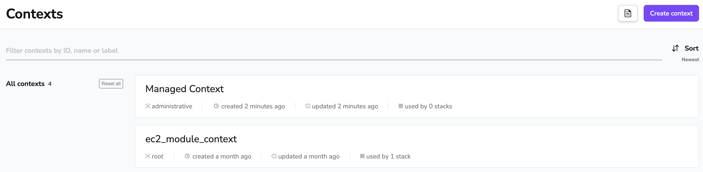
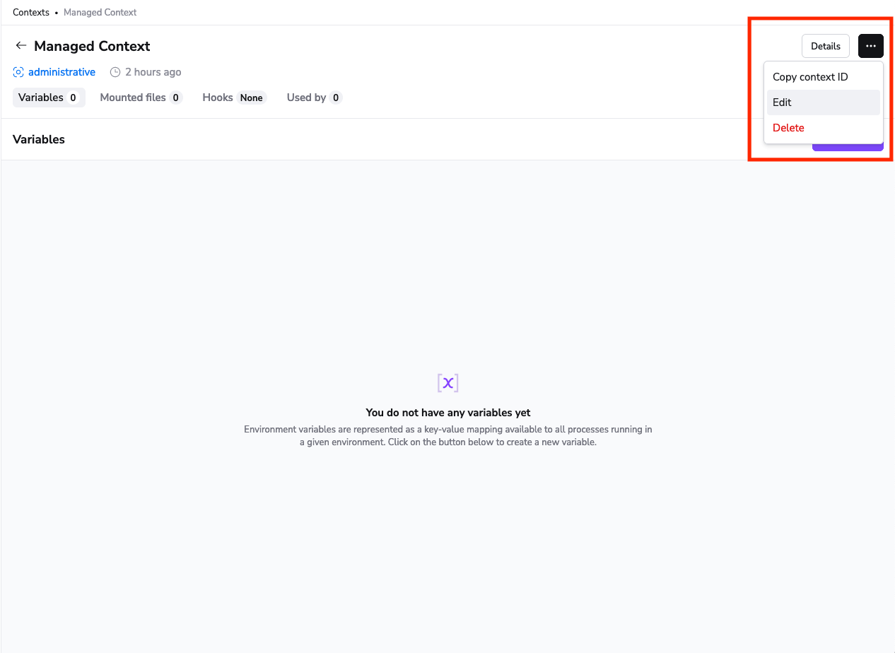
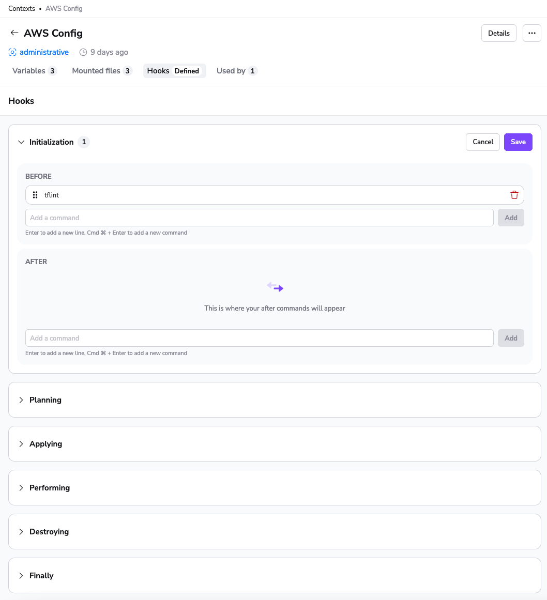

# Context

!!! note
    For the sake of brevity we'll be using the term _projects_ to refer to both stacks and modules.

## Introduction


On a high level, context is a bundle of configuration elements ([environment variables](environment.md#environment-variables) and [mounted files](environment.md#mounted-files)) independent of any [stack](../stack/README.md) that can be managed separately and [attached](context.md#attaching-a-context) to as many or as few stacks as necessary. Contexts are only directly accessible to administrators from the account view:

The list of contexts merely shows the name and description of the context. Clicking on the name allows you to [edit it](context.md#editing-a-context).

On a high level, context is a bundle of configuration elements ([environment variables](environment.md#environment-variables), [mounted files](environment.md#mounted-files) and [hooks](../stack/stack-settings.md#customizing-workflow)) independent of any [stack](../stack/README.md) that can be managed separately and [attached](context.md#attaching-a-context) to as many or as few projects as necessary. Contexts are only directly accessible to administrators from the account view:

The list of contexts merely shows the name, description and labels of the context. You can [edit a context](context.md#editing-a-context) from the list by clicking on the three-dot menu on the right hand side of the context row and selecting the _Edit_ option, you can also [delete a context](context.md#deleting) from the same menu.


## Management

Managing a context is quite straightforward - you can [create](context.md#creating), [edit](context.md#editing), [attach, detach](context.md#attaching-and-detaching) and [delete](context.md#deleting) it. The below paragraphs will focus on doing that through the web GUI but doing it programmatically using [our Terraform provider](../../vendors/terraform/terraform-provider.md) is an attractive alternative.

### Creating


As an account administrator you can create a new context from the Contexts screen as seen on the above screenshot by pressing the Add context button:

This takes you to a simple form where the only inputs are name and description:

The required _name_ is what you'll see in the context list and in the dropdown when attaching the context. Make sure that it's informative enough to be able to immediately communicate the purpose of the context, but short enough so that it fits nicely in the dropdown, and no important information is cut off.

The optional _description_ is completely free-form and it supports [Markdown](https://daringfireball.net/projects/markdown/){: rel="nofollow"}. This is a good place perhaps for a thorough explanation of the purpose of the stack, perhaps a link or two, and/or a funny GIF. In the web GUI this description will only show on the Contexts screen so it's not a big deal anyway.

!!! warning
    Based on the original _name_, Spacelift generates an immutable slug that serves as a unique identifier of this context. If the name and the slug diverge significantly, things may become confusing.

    So even though you can change the context name at any point, we strongly discourage all non-trivial changes.

As an account administrator you can create a new context from the Contexts screen as seen on the screenshot below by pressing the _AddCreate context_ button:

This takes you to a creation form where you can configure various aspects of the context.

#### Step 1 - Context details

This is the only mandatory step in the context creation process; the remaining steps are optional.

The required _name_ is what you'll see in the context list and in the dropdown when attaching the context to projects. Ensure it's informative enough to immediately convey the purpose of the context, yet short enough to fit neatly in dropdowns without cutting off important information.

The last required field in this step is _space_, allowing you to choose which [space](../spaces/) the context will belong to.

The optional _description_ is free-form and supports [Markdown](https://daringfireball.net/projects/markdown/){: rel="nofollow"}. This is an ideal place for a thorough explanation of the context's purpose, perhaps with links or a humorous GIF. In the web GUI, this description appears in several places: on the context list, in the context view, and in the list of attached contexts on the stack view.

Lastly you can add _labels_ to the context. Labels are a great way to organize your contexts and make them easier to find. They also provide a powerful feature of [auto-attaching](#auto-attachments) contexts to projects. If you'll be using `autoattach` labels, all projects that would be automatically attached to the context will be listed below in the collapsible section:

!!! warning
    Based on the original _name_, Spacelift generates an immutable slug that serves as a unique identifier for this context. If the name and the slug diverge significantly, things may become confusing.

    Even though you can change the context name at any point, we strongly discourage all non-trivial changes.

#### Step 2 - Attach context (optional)

This step enables you to attach the context to projects without navigating to their respective "Contexts" views. Simply select the project from the dropdown and click the _Attach_ button.

#### Step 3 - Setup environment (optional)

In this step, you have the option to configure environment variables and mounted files if you already have them ready during the creation of the context.

| Environment variables | Mounted files |
| - | - |
|  |  |

#### Step 4 - Add hooks (optional)

Hooks are optional scripts that can be set up to run before and/or after different project phases, automating tasks at specific points in the project lifecycle.

To add a hook simply select the phase at which it should be run and enter the command in the text box inside either "Before" or "After" section, click the _Add_ button and you're done. You can add as many hooks as you like, and they will run in the order they appear.

After adding a hook, you can easily rearrange it within a section or move it to the other section by dragging and dropping:

That's it! Press the _Create context_ button to save the context and go to its view.


### Editing


Editing the context is only a little more exciting. You can edit the context from its dedicated view by pressing the Edit button:

This switches the context into editing mode where you can change the name and description but also manage configuration elements the same way you'd do for the [stack environment](environment.md), only much simpler - without overrides and [computed values](environment.md#computed-values):


You can edit various aspects of a context, such as its details, attached projects, environment variables, mounted files and hooks. The only immutable aspect is the context's slug.

#### Editing the details

To edit the details of a context, go to its dedicated view and press the _Edit_ button from the three-dot menu:

This will open a drawer with the details form pre-populated with the current values:

Note: The same form is also accessible from the context list view.

#### Editing environment variables

The first tab in the context view is the _Variables_ tab. Here, you'll find a list of all the environment variables associated with this context.

!!!note
    Plain values are accessible in the web GUI and through the API, and secret ones aren't - they're only made available to [Runs](../run/README.md) and [Tasks](../run/task.md).

To edit a variable, click the three-dot menu on the right-hand side of the variable row and select the _Edit_ option.

This will open a drawer where you can edit the variable's properties such as value, description, and sensitivity.

Remember, changes to environment variables will affect all projects using this context. Be cautious when making changes to avoid unintended side effects.

#### Editing mounted files

To manage mounted files associated with a context, navigate to the second tab in the context view – _Mounted files_.

You can preview the contents of a non-secret mounted file by clicking on the file name. To edit it, click the three-dot menu on the right-hand side of the file row and select the _Edit_ option.

!!!note
    You can preview and edit the content of a mounted file only if it wasn't saved as a secret. Such files can be overwritten by uploading a new file or entering content directly in the editor.

Adding a new mounted file involves two steps:

1. Provide the file's name, description, and specify whether it's a secret.
    

2. Then, provide the file's content by either uploading a file or entering it manually.
    

When ready to save the mounted file, click the _Save_ button. To discard it completely, click _Cancel_.

#### Editing hooks

In the context view, navigate to the _Hooks_ tab, the third tab dedicated to managing hooks. Hooks are categorized neatly by different project phases, each represented as a collapsible section with "Before" and "After" lists.

Open the section corresponding to the specific phase you wish to modify by clicking on its name.

You can add a new command, adjust its position within the same section, or even move it to the other section using a simple drag-and-drop mechanism. Once you've made the necessary adjustments, click _Save_ to apply the edits.

Remember, the order of hooks matters; they run in the sequence they appear in the list.


### Attaching and detaching


Attaching and detaching contexts actually happens from the [stack](../stack/README.md) management view. To attach a context, select the Contexts tab. This should show you a dropdown with all the contexts available for attaching, and a slider to set the [priority of the attachment](context.md#a-note-on-priority):

!!! info
    A context can only be attached once to a given stack, so if it's already attached, it will not be visible in the dropdown menu.

OK, let's attach the context with priority 0 and see what gives:

Now this attached context will also contribute to the [stack environment](environment.md)...

...and be visible on the list of attached contexts:

In order to detach the context, you can just press the _Detach_ button and the context will stop contributing to the [stack's environment](environment.md):


Attaching and detaching contexts actually happens from the [stack](../stack/README.md) view. To attach a context, go to the _Contexts_ tab. This tab lists all manually and auto-attached contexts to the stack, and allows you to attach new ones:

OK, let's attach the context with priority 0 and see what gives:

Now this attached context will also contribute to the [stack environment](environment.md)...

...and be visible on the list of attached contexts:

In order to detach a context, go back to the Contexts tab, click on the context's priority picker and select the _Detach_ option which will stop the context from contributing to the [stack's environment](environment.md):





#### Auto-attachments

The `autoattach` label is a powerful tool in contexts and policies that enables automatic attachment of these entities to projects based on shared labels. This comes in handy, especially when multiple projects require the same context.

Instead of manually attaching a context to every stack or module, simply define an `autoattach` label on the context. For example, adding the label `autoattach:XYZ` to a context will cause the system to automatically attach that context to all projects with the matching `XYZ` label.

!!! Note
    You only need the `autoattach:` prefix for the context label; the projects only need the specific label (`XYZ`) to activate the automatic attachment.

Here's how you can set it up:

1. Navigate to the context view and open the context [details drawer](context.md#editing-the-details).

2. Define an `autoattach` label to the context. For instance, `autoattach:XYZ`.
   

3. Ensure that your projects have the matching label. In this case, it should be `XYZ`.
   

Once complete, Spacelift will automatically link the context to all projects sharing the `XYZ` label.

!!! tip
    If you want to attach a context to all projects, you can use the `autoattach:*` label on the context. This will attach the context to all projects, regardless of their labels.


#### A note on priority

You may be wondering what the priority sliderpicker is for. A priority is a property of context-stack relationship - in fact, the only property. All the contexts attached to a stack are sorted by priority (lowest first), though values don't need to be unique. This ordering establishes [precedence rules](environment.md#a-note-on-precedence) between contexts should there be a conflict and multiple contexts define the same value.

### Deleting


Deleting a context is straightforward - by pressing the Delete button in the context view you can get rid of an unnecessary context:


Deleting a context is straightforward - by selecting the _Delete_ option from the three-dot menu in the context view you can get rid of an unnecessary context:

As a safety measure, you'll be asked to confirm the deletion:



!!! warning
    Deleting a context will also automatically detach it from all the projects it was attached to. Make sure you only delete contexts that are no longer useful. For security purposes we do not store historical stuff and actually remove the deleted data from all of our data storage systems.

## Use cases

We can see two main use cases for contexts, depending on whether the context data is [supplied externally](context.md#shared-setup) or [produced by Spacelift](context.md#remote-state-alternative).

### Shared setup

If the data is external to Spacelift, it's likely that this is a form of shared setup - that is, configuration elements that are common to multiple stacks, and grouped as a context for convenience. One example of this use case is cloud provider configuration, either for Terraform or Pulumi. Instead of attaching the same values - some of them probably secret and pretty sensitive - to individual stacks, contexts allow you to define those once and then have admins attach them to the stacks that need them.

A variation of this use case is collections of [Terraform input variables](https://www.terraform.io/docs/configuration/variables.html#assigning-values-to-root-module-variables){: rel="nofollow"} that may be shared by multiple stacks - for example things relating to a particular system environment (staging, production etc). In this case the collection of variables can specify things like environment name, DNS domain name or a reference to it (eg. zone ID), tags, references to provider accounts and similar settings. Again, instead of setting these on individual stacks, an admin can group them into a context, and attach to the eligible stacks.

### Remote state alternative (Terraform-specific)

If the data in the context is produced by one or more Spacelift stacks, contexts can be an attractive alternative to the Terraform [remote state](https://www.terraform.io/docs/providers/terraform/d/remote_state.html){: rel="nofollow"}. In this use case, contexts can serve as outputs for stacks that can be consumed by (attached to) other stacks. So, instead of exposing the entire state, a stack can use Spacelift Terraform provider to define values on a context - either managed by the same stack , or managed externally. Managing a context externally can be particularly useful when multiple stacks contribute to a particular context.

!!! info
    In order to use the Terraform provider to define contexts or its configuration elements the stack has to be marked as [administrative](../stack/README.md#administrative).

As an example of one such use case, let's imagine an organization where shared infrastructure (VPC, DNS, compute cluster etc.) is centrally managed by a DevOps team, which exposes it as a service to be used by individual product development teams. In order to be able to use the shared infrastructure, each team needs to address multiple entities that are generated by the central infra repo. In vanilla Terraform one would likely use remote state provider, but that might expose secrets and settings the DevOps team would rather keep it to themselves. Using a context on the other hand allows the team to decide (and hopefully document) what constitutes their "external API".

The proposed setup for the above use case would involve two administrative stacks - one to manage all the stacks, and the other for the DevOps team. The management stack would programmatically define the DevOps one, and possibly also its context. The DevOps team would receive the context ID as an input variable, and use it to expose outputs as [`spacelift_environment_variable`](https://github.com/spacelift-io/terraform-provider-spacelift#spacelift_environment_variable-resource){: rel="nofollow"} and/or [`spacelift_mounted_file`](https://github.com/spacelift-io/terraform-provider-spacelift#spacelift_mounted_file-resource){: rel="nofollow"} resources. The management stack could then simply attach the context populated by the DevOps stack to other stacks it defines and manages.

### Extending Terraform CLI Configuration (Terraform-specific)

For some of our Terraform users, a convenient way to configure the Terraform CLI behavior is through customizing the `~/.terraformrc` file.

Spacelift allows you to extend terraform CLI configuration through the use of [mounted files](../../vendors/terraform/cli-configuration.md#using-mounted-files).
