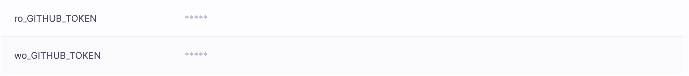

# Environment

If you take a look at the Environment screen of a stack you will notice it's pretty busy - in fact it's the second busiest view in Spacelift ([run](../run/README.md) being the undisputed winner). Ultimately though, all the records here are either [environment variables](environment.md#environment-variables) or [mounted files](environment.md#mounted-files). The main part of the view represents the synthetic outcome determining what your run will "see" when executed. If this does not make sense yet, please hang on and read the remainder of this article.

## Environment variables

The concept of environment variables is instinctively understood by all programmers. It's represented as a key-value mapping available to all processes running in a given environment. Both with Pulumi and Terraform, environment variables are frequently used to configure providers. Additionally, when prefixed with `TF_VAR_` they are used in Terraform to [use environment variables as Terraform](https://www.terraform.io/docs/configuration/variables.html#environment-variables){: rel="nofollow"} _input variables_.

!!! info
    Spacelift does not provide a dedicated mechanism of defining [Terraform input variables](https://www.terraform.io/docs/language/values/variables.html){: rel="nofollow"} because the combination of `TF_VAR_` environment variables and mounted files should cover all use cases without the need to introduce an extra entity.

Adding an environment variable is rather straightforward - don't worry yet about the visibility (difference between _plain_ and _secret_ variables). This is described in a [separate section](environment.md#a-note-on-visibility):

...and so is editing:

### Environment variable interpolation

Note that environment variables can refer to other environment variables using simple interpolation. For example, if you have an environment variable `FOO` with a value of `bar` you can use it to define another environment variable `BAZ` as `${FOO}-baz` which will result in `bar-baz` being set as the value of `BAZ`. This interpolation is lazily and dynamically evaluated on the worker, and will work between environment variables defined in different ways, including [contexts](context.md).

### Computed values

You will possibly notice some environment variables being marked as `<computed>`, which means that their value is only computed at runtime. These are not directly set on the stack but come from various integrations - for example, AWS credentials (`AWS_ACCESS_KEY_ID` and friends) are set by the [AWS integration](../../integrations/cloud-providers/aws.md) and `SPACELIFT_API_TOKEN` is injected into each run to serve a number of purposes.

You cannot set a computed value but you can override it - that is, explicitly set an environment variable on a stack that has the same name as the variable that comes from integration. This is due to precedence rules that warrant its own [dedicated section](environment.md#a-note-on-visibility).

Overriding a computed value is almost like editing a regular stack variable, although worth noticing is _Override_ replacing _Edit_ and the lack of _Delete_ action:

.png>)

When you click _Override_, you can replace the value computed at runtime with a static one:

.png>)

Note how it becomes a regular write-only variable upon saving:

.png>)

If you delete this variable, it will again be replaced by the computed one. If you want to get rid of the computed variable entirely, you will need to disable the integration that originally led to its inclusion in this list.

### Spacelift environment

The _Spacelift environment_ section lists a special subset of [computed values](environment.md#computed-values) that are injected into each run and that provide some Spacelift-specific metadata about the context of the job being executed. These are prefixed so that they can be used directly as input variables to Terraform configuration, and their names always clearly suggest the content:

.png>)

!!! info
    Unless you know exactly what you're doing, we generally **discourage overriding** these dynamic variables, to avoid confusion.

### Per-stage environment variables

The Spacelift flow can be broken down into a number of stages - most importantly:

- [Initializing](../run/README.md#initializing), where we prepare the workspace;
- [Planning](../run/proposed.md#planning), which calculates the changes;
- [Applying](../run/tracked.md#applying), which makes the actual changes;

In this model, only the [_Applying_](../run/tracked.md#applying) phase makes any actual changes to your resources and your state and needs the credentials that support it. Yet frequently, the practice is to pass the same credentials to all stages. The reason for that is either the lack of awareness or - more often - the limitations in the tooling. Depending on your flow, this may be a potential security issue because even if you [manually review every job](../run/tracked.md#approval-flow) before it reaches the [_Applying_](../run/tracked.md#applying) stage, [the Planning phase can do a lot of damage](https://alex.kaskaso.li/post/terraform-plan-rce){: rel="nofollow"}.

Spacelift supports a more security-conscious approach by allowing users to define variables that are passed to read (in practice, everything except for [Applying](../run/tracked.md#applying)) and write stages. By default, we pass an environment variable to all stages, but prefixes can be used to change the default behavior.

An environment variable whose name starts with the `ro_` prefix is only passed to read stages but not to the write ([_Applying_](../run/tracked.md#applying)) stage. On the other hand, an environment variable whose name starts with the `wo_` prefix is only passed to the write ([_Applying_](../run/tracked.md#applying)) stage but not to the read ones.

Combining the two prefixes makes it easy to create flows that limit the exposure of admin credentials to the code that has been thoroughly reviewed. The example below uses a `GITHUB_TOKEN` environment variable used by the [GitHub Terraform provider](https://registry.terraform.io/providers/integrations/github/latest/docs){: rel="nofollow"} variable split into two separate environment variables:

The first token will potentially be exposed to less-trusted code, so it makes sense to create it with read-only permissions. The second token on the other hand will only be exposed to the reviewed code and can be given write or admin permissions.

A similar approach can be used for AWS, GCP, Azure, or any other cloud provider credentials.

## Mounted files

Every now and then an environment variable is not what you need - you need a file instead. Terraform Kubernetes provider is a great example - one of the common ways of configuring it involves setting a [`KUBECONFIG` variable pointing to the actual config file](https://www.terraform.io/docs/providers/kubernetes/index.html#config_path){: rel="nofollow"} which needs to be present in your workspace as well.

It's almost like creating an environment variable, though instead of typing (or pasting) the value you'll be uploading a file:

.png>)

.png>)

!!! info
    Notice how you can give your file a name that's different to the name of the uploaded entity. In fact, you can use `/` characters in the file path to nest it deeper in directory tree - for example `a/b/c/d/e.json` is a perfectly valid file path.

Similar to environment variables, mounted files can have different visibility settings - you can learn more about it [here](environment.md#a-note-on-visibility). One thing to note here is that plaintext files can be downloaded back straight from the UI or API while secret ones will only be visible to the [run](../run/README.md) executed for the [stack](../stack/README.md).

!!! info
    Mounted files are limited to 2 MB in size. If you need to inject larger files into your workspace, we suggest that you make them part of the [Docker runner image](../../integrations/docker.md#customizing-the-runner-image), or retrieve them dynamically using something like _wget_ or _curl_.

### Project structure

When discussing mounted files, it is important to understand the structure of the Spacelift workspace. Every Spacelift workload gets a dedicated directory `/mnt/workspace/`, which also serves as a root for all the mounted files.

Your Git repository is cloned into `/mnt/workspace/source/`, which also serves as the working directory for your project, unless explicitly overridden by the project root configuration setting (either on the [stack level](../stack/stack-settings.md#project-root) or on in the [runtime configuration](runtime-configuration/README.md#project_root-setting)).

!!! warning
    Mounted files may be put into `/mnt/workspace/source/` as well and it's a legitimate use case, for example, to dynamically inject backend settings or even add extra infra definitions. Just **beware of path clashes** as mounted files will **override your project source code** in case of conflict. Sometimes this is what you want, sometimes not.

## Attached contexts

While contexts are important enough to [warrant their own dedicated article](context.md), it's also crucial to understand how they interact with [environment variables](environment.md#environment-variables) and [mounted files](environment.md#mounted-files) set directly on the [stack](../stack/README.md), as well as with [computed values](environment.md#computed-values). Perhaps you've noticed the blue labels on one of the earlier screenshots. If you haven't, here they are again, with a proper highlight:

The highlighted label is the name of the [attached context](context.md#attaching-contexts) that supplies those values. The sorted list of attached contexts is located below the calculated environment view, and each entry can be unfurled to see its exact content.

Similar to [computed values](environment.md#computed-values), those coming from contexts can also be overridden. Here's an example:

.png>)

.png>)

.png>)

Note how we can now _Delete_ the variable - this would revert it to the value defined by the context. Contexts can both provide [environment variables](environment.md#environment-variables) as well as [mounted files](environment.md#mounted-files), and both can be overridden directly on the stack.

!!! info
    If you want to get rid of the context-provided variable or file entirely, you will need to [detach the context itself](context.md).

## A note on visibility

Perhaps you may have noticed how [environment variables](environment.md#environment-variables) and [mounted files](environment.md#mounted-files) come in two flavors - _plain_ and _secret_. Here they are in the form for the new environment variable:

.png>)

...and here they are in the form for the new mounted file:

.png>)

Functionally, the difference between the two is pretty simple - plain values are accessible in the web GUI and through the [API](../../integrations/api.md), and secret ones aren't - they're only made available to [Runs](../run/README.md) and [Tasks](../run/task.md). Here's an example of two environment variables in the GUI - one plain, and one secret (also referred to as _write-only_):

.png>)

Mounted files are similar - plain can be downloaded from the web GUI or through the [API](../../integrations/api.md), and secret can't. Here's the difference in the GUI:

.png>)

While the content of secret (write-only) environment variables and mounted files is not accessible through the GUI or [API](../../integrations/api.md), the checksums are always available so if you have the value handy and just want to check if that's the same value as the one set in Spacelift, you can compare its checksum with the one reported by us - check out the most recent [GraphQL API](../../integrations/api.md#graphql-schema-s) schema for more details.

!!! info
    Though all of our data is [encrypted both at rest and in transit](../../product/security.md#encryption), secret (write-only) values enjoy two extra layers of protection.
