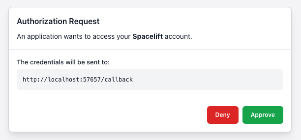
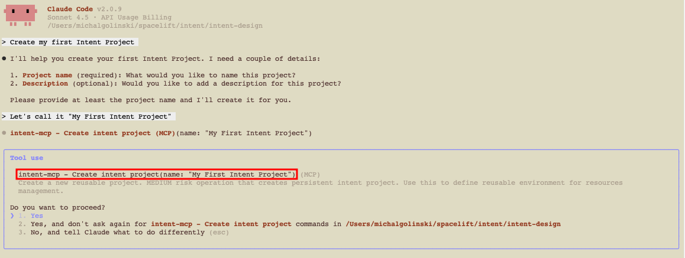
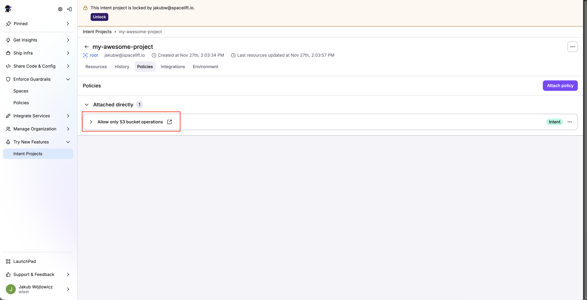
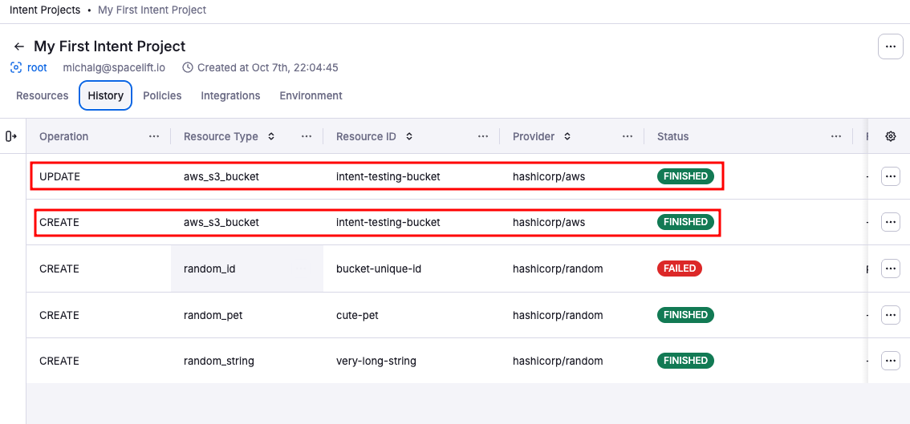
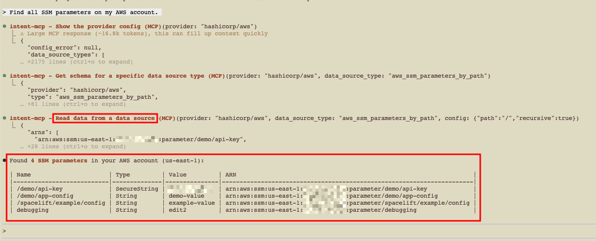

# Spacelift Intent

!!! info "Beta feature"

    Spacelift Intent is currently in early access beta. We recommend you only use this feature on testing and pre-production environments.

**Spacelift Intent** lets you provision and manage infrastructure by describing what you need in natural language. Instead of writing Terraform/OpenTofu code, your MCP client (e.g. Claude Code) calls Spacelift Intent, which directly interacts with provider schemas under Spacelift’s guardrails (policies, audit trail, state, permissions).

## **Key concepts**

- **Natural language**: Describe your infrastructure needs in natural language; Intent translates it directly into the infrastructure you want.
- **Policies**: Spacelift enforces governance (OPA/Rego policies) before execution to deny unsafe operations and allow compliant ones.
- **State & audit built-in**: Centralize state management and view the complete operation history without manual backend configuration.
- **Separate policy writing & resource changes:** With [Spaces](../spaces/README.md) and our [access control features](../authorization/rbac-system.md), you can assign precise roles and permissions so authors and operators stay clearly separated.

### **Architecture (high level)**

Spacelift Intent connects your AI client to your cloud infrastructure through a secure, policy-governed pipeline:

1. **MCP Client (Claude Code, ChatGPT, VS Code, etc.):** You describe infrastructure in natural language.
2. **Intent MCP Serve**r: Translates requests into provider operations, discovers Terraform providers from OpenTofu registry, learns resource schemas.
3. **Spacelift Control Plane:** Enforces policies (OPA/Rego), manages state, records audit history, handles cloud authentication, provides resource visibility.
4. **Cloud Providers (AWS, etc.):** Executes approved operations via cloud integrations with scoped permissions.

**Key flow:** You send a natural language prompt describing infrastructure changes. Intent interprets the request, discovers relevant Terraform providers from the OpenTofu registry, and learns their schemas to plan operations. Attached policies then evaluate the plan against governance rules—allowing or denying based on resource types, operations, or attributes.

If approved, Intent executes changes via cloud integrations with scoped credentials. State updates automatically and full operation history is recorded for audit and rollback.


---

## Supported clients & endpoint

- **MCP server URL:** `https://<account-name>.app.spacelift.io/intent/mcp`
- **Tested clients:** Claude Code, Claude Desktop (custom connectors), Gemini, Codex
- **Coming soon:** VS Code, Cursor

---

## Prerequisites

- **Claude Code**
- **Spacelift account** with access to Intent
    - for Early Access, we require `root` space admin access
- _(Optional for AWS tests)_ An **AWS account**
- [**AWS integration** configured in Spacelift](../../getting-started/integrate-cloud/AWS.md) if you plan to create AWS resources

---

## Set up Spacelift Intent

📽️ Quick demo of Spacelift Intent with Claude Code below.

[](https://www.youtube.com/watch?v=UvF-_gbW9Gk)

### Step 1. Add Intent MCP server to MCP Client

#### 1.1 Claude Code

You can add the MCP server via command-line interface (CLI) _or_ by editing your config file.

**CLI:**

```bash
claude mcp add intent-mcp -t http https://<account-name>.app.spacelift.io/intent/mcp
```

**Config file (`.mcp.json` at repo root):**

```json
{
  "mcpServers": {
    "intent-mcp": {
      "type": "http",
      "url": "https://<account-name>.app.spacelift.io/intent/mcp"
    }
  }
}
```

---

#### 1.2 Gemini

You can add the MCP server via command-line interface (CLI) _or_ by editing your config file.

**CLI:**

```bash
gemini mcp add --transport http intent-mcp https://<account-name>.app.spacelift.io/intent/mcp
```

**Config file (`.gemini/settings.json` at repo root):**

```json
{
  "mcpServers": {
    "intent-mcp": {
      "httpUrl": "https://<account-name>.app.spacelift.io/intent/mcp"
    }
  }
}
```

---

#### 1.3 Codex

You can add the MCP server by editing your config file.

**Config file (`~/.codex/config.toml`):**

```toml
[features]
rmcp_client = true

[mcp_servers.intent-mcp]
url = "https://<account-name>.app.spacelift.io/intent/mcp"
startup_timeout_sec = 20.0
experimental_use_rmcp_client = true
enabled = true
```

Once configured run `codex mcp login intent-mcp` to authenticate in intent-mcp server.

---

### Step 2. Authenticate via MCP

1. Start your MCP client, e.g. **Claude Code**.
2. Run the `/mcp` command.
3. Select **`intent-mcp`** and press **Enter** to log in (status shows _disconnected – Enter to login_).
4. Complete the browser-based OAuth flow → “Authorization successful”.
5. Back in Claude Code, run `/mcp` again to confirm status is **connected**.

  
_Claude Code: Spacelift Intent server prior to authentication_

  
_Claude Code: Authenticating Spacelift Intent MCP Server_

  
_Claude Code: Opening the browser for authentication_

  
_Claude Code: Browser authorization request_

  
_Claude Code: Successful authentication callback_

  
_Claude Code: Spacelift Intent MCP Server successfully connected_

### Step 3. Create & use an Intent project

Projects scope your work and policy. You can create and lock a project entirely through natural language.

**Create a project** (via chat prompt):

```text
Create a project called "my-project".
```

Claude Code will call `project-create` for you.

  
_Claude Code: Creating a project using Spacelift Intent_

Then **lock** the project for exclusive access:

```text
Use the project "my-project".
```

This calls `project-use` and locks the project to your user. Locks expire after a short period of inactivity; you can unlock via UI or API.

  
_Claude Code: Locking a project using Spacelift Intent_

💡 Creating a project via MCP currently places it in the root Space. To create it in a different Space, [use the Spacelift UI](../spaces/README.md).

---

### Step 4. Create resources (random provider)

Try something safe first using the **random** provider:

```text
Create two resources — one very long random string and a cute pet.
```

Intent discovers the provider schema, proposes the operations, and applies them under policy. You’ll get a short summary in chat once the resources are created.

  
_Claude Code: Creating two random provider resources - discovering resources_

  
_Claude Code: Creating resources_

  
_Claude Code: Resources successfully created_

---

## Use Spacelift Intent

### 1. Explore the Spacelift Intent UI

❗ Please note that we've made some updates to the navigation — you can now find **Intent Projects** under **"Try New Features" → "Intent Projects."**

Open **Spacelift → Intent Projects → my-project**. You'll see:

- **Resources:** Current resources in project.
- **History:** Timeline of operations (create, update, delete, import).
- **Policies:** Attach Intent [policies to govern operations](../policy/README.md).
- **Integrations:** Attach [cloud accounts](../../integrations/cloud-providers/README.md) (AWS supported today).
- **Environments:** [Environment variables](../configuration/environment.md) for the project.

You will also see if the project is locked and who locked it.


_Spacelift UI: Intent Projects, locking projects and resources list_

---

### 2. Create & attach Intent policy

Policies are your guardrails. Create a policy in **Policies** and attach it to your project. A simple example:

```rego
package spacelift

import rego.v1

sample = true

# Deny any resource that isn't an S3 bucket
deny contains message if {
  input.resource.resource_type != "aws_s3_bucket"
  message := sprintf(
    "Only aws_s3_bucket resources are allowed. Resource type %q is not permitted",
    [input.resource.resource_type],
  )
}

# Allow all operations on S3 buckets
allow contains message if {
  input.resource.resource_type == "aws_s3_bucket"
  message := sprintf(
    "Operation %q on aws_s3_bucket is allowed",
    [input.resource.operation],
  )
}
```

  
_Spacelift UI: Creating your first Intent policy_

  
_Spacelift UI: Intent policy payload_

Once the policy is created, attach it to your project. Use the `Policies` tab in your Intent Project view.

  
_Spacelift UI: Attaching policy to the project_

  
_Spacelift UI: Finding the right policy_

  
_Spacelift UI: Intent policy attached_

---

### 3. Attach AWS integration

Follow [AWS integration setup](../../getting-started/integrate-cloud/AWS.md), then attach the integration to your Intent project:

- Choose an **AWS region** for tests
- Grant **Read + Write**

  
_Spacelift UI: Attaching AWS integration to the project_

  
_Spacelift UI: AWS integration attached_

---

### 4. Provision AWS resources (S3, EC2)

With the policy above:

- Creating an **S3 bucket** should **succeed**.
- Creating an **EC2 instance** should **fail** with a policy denial.

**Create an S3 bucket** (via chat):

```text
Create an S3 bucket named "dev-attachments-123" with SSE enabled.
```


**Update the S3 bucket:**

You can continue the conversation to modify existing resources:

```text
Add tags to the dev-attachments-123 bucket: Environment=dev, Owner=platform-team.
```

Intent updates the resource configuration and applies the changes. You’ll see the updated values in both your AWS account and the Spacelift UI (Resources view shows current config; History tab records the update operation).


**Verify in Spacelift UI & AWS:**

Confirm the resource lifecycle in both systems.

1. **In the Spacelift UI**, **n**avigate to your Intent project.
    - **Resources tab:** Shows the S3 bucket with current configuration including the tags you just added.

    

    - **History tab:** Lists all operations (create, update) with timestamps, operation details, and who/what triggered them.

    

2. In the **AWS Console**, go to S3:
    - Find your bucket (e.g., `dev-attachments-123`).
    - Verify it exists with the correct configuration.
    - Check the Tags section to confirm `Environment=dev` and `Owner=platform-team` are present.

    

As we've seen, Intent creates resources directly in your cloud, while Spacelift provides access control, policy governance, state management, and full auditability.

**Try an EC2 instance** (to see policy denial):

```text
Create a t3.micro EC2 instance in us-east-1.
```


💡 Iterate on the policy to allow additional resource types when ready (e.g., allow aws_instance for non-prod).

---

### 5. Import existing resources

You can **discover** and **import** pre-existing resources into Intent state, then manage them going forward.

**Example (SSM Parameters):**

```text
List SSM parameters in my account and import them into the project.
```

- Review the discovery result.



- Select items to **import** into Intent state.


- Manage them via natural language and policy from now on.

**Check Spacelift UI after import:**

Once resources are imported, verify them in the Spacelift UI.

- **Resources tab:** Shows newly imported SSM parameters alongside your existing S3 bucket.


- **History tab:** Records the import operation with full details of what was imported and when.


---

### 6. Delete resources safely

When deleting, Intent evaluates **dependencies**, requests **confirmation**, and enforces **policy**.

**Example:**

```text
Delete the random resources we created earlier.
```

Typical flow:

1. Tool computes dependency order.
2. Client asks for **explicit confirmation** (by default).
3. Apply proceeds or is **blocked by policy**.


If policy prevents deletion, update the policy to allow the `random` resources. You can do this using Spacelift Intent, but make sure to review the next section: Session Locks, Permissions & Safety.


**Auditability:** Even after deletion, the **History** tab shows attempted and successful deletions, with full receipts.


---

### 7. Session locks & safety

- **Project lock:** Only one active session can operate on a project at a time (prevents conflicting changes). Locks auto-expire after inactivity.
- **Client controls:** You can configure your MCP client to always ask before invoking tools.

---

### 8. Access control

Intent projects use Spacelift's [Role-Based Access Control (RBAC)](../authorization/rbac-system.md) system to manage permissions. This allows you to control who can create, modify, and delete Intent projects, as well as who can operate on resources within them.

#### Managing Intent projects

By default, [Space Admins](../authorization/rbac-system.md#space-admin) have full access to manage Intent projects within their spaces. However, you can create more granular permissions using [custom roles](../authorization/rbac-system.md#custom-roles) with specific Intent project actions. Intent specific actions can be found under the `Intent` category in the role creation page.

---

## Troubleshooting

- **I don't see `intent-mcp` in `/mcp`.**

    - Re-run the add command; confirm the URL and account name.
    - Verify `.mcp.json` path and JSON validity.

- **OAuth window didn't open.**

    - Check pop-up blockers. Try re-auth via `/mcp` → select server again.

- **`project-use` fails / lock busy.**

    - Another session may hold the lock. Wait for timeout, or unlock via UI/API.

- **Policy denies everything.**

    - Start with allow-list for one resource type and expand.
    - Use a separate test project/Space while iterating.
    - Enable policy sampling by adding `sample = true` to your policy to capture evaluation events and debug in the Policy Workbench (UI → Policies → select policy → Show simulation panel).

- **AWS creation fails.**

    - Verify integration is attached **to the project**, region matches prompts, and access is **Read+Write**.

---

## FAQ

- **Can I use a client other than Claude Code?**

    Yes—Claude Desktop (custom connector), VS Code, Cursor. Any MCP-capable client should work with the same URL.

- **Where are the Terraform files?**

    Intent works at a higher abstraction—your agent calls provider operations under Spacelift governance. No IaC files are required for day‑1 usage.

- **Can I export to Terraform/OpenTofu later?**

    Export/migration is on the roadmap; for now, use Intent for discovery/management and codify stable architectures in your IaC repos over time.

- **How do I keep things safe in production?**

    For this early access beta, we do not recommend to run things in production.
