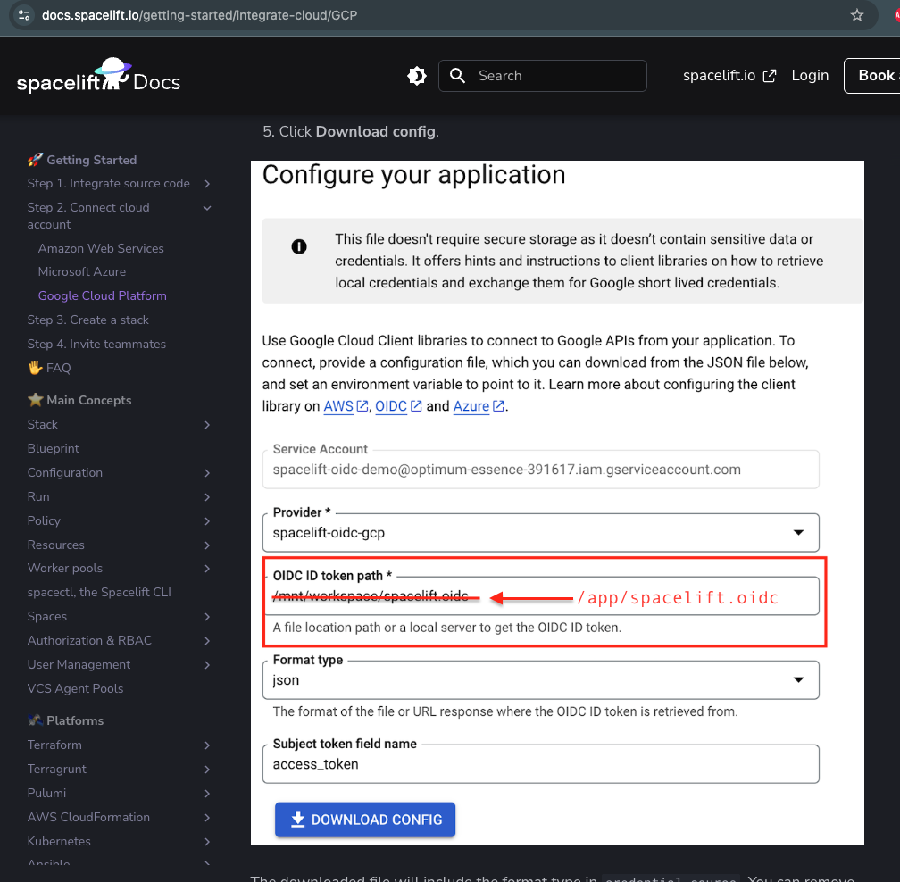
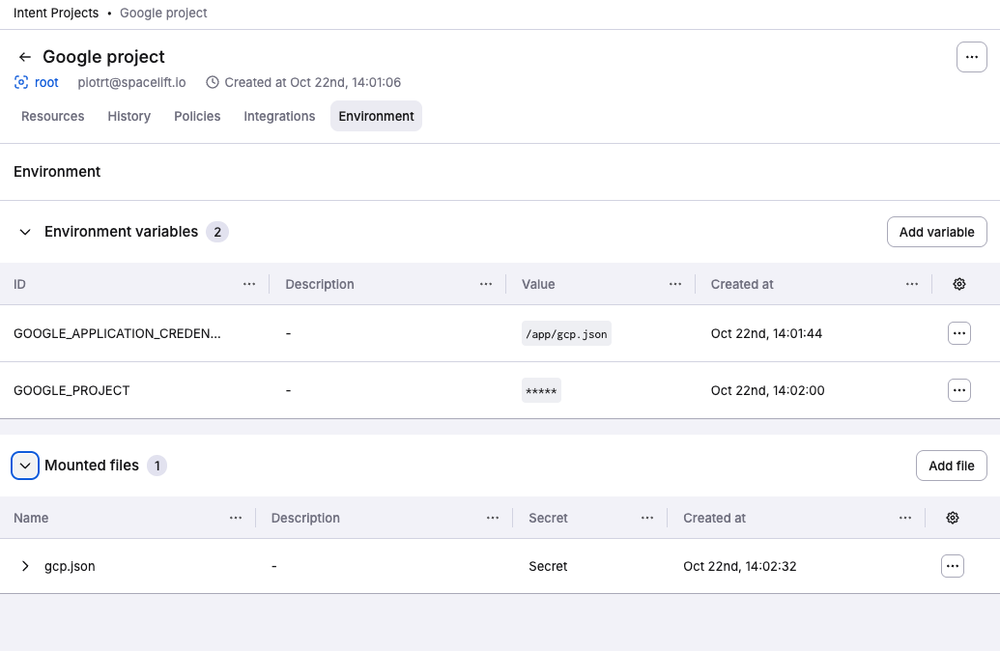

# Setting up Azure and GCP credentials for Spacelift Intent

## Azure credencials

- Get tenant id:

```jsx
    $ az account show --query 'tenantId'`
    "<YOUR-TENANT-ID>"
```

- Get subscription id:

```jsx
  $ az account subscription list --query '[].{name:displayName,id:id}'
    [ ... , { "id": "<YOUR-SUBSCRIPTION-ID>", "name": "..." }, ... ]
```

- Optionally - create a role (role.json):

```jsx
    {
      "Name": "example-role”,
      "IsCustom": true,
      "Description": "example-role",
      "Actions": [
        "Microsoft.Resources/subscriptions/<ACTIONS…>"
      ],
      "NotActions": [],
      "DataActions": [],
      "NotDataActions": [],
      "AssignableScopes": [
        "/subscriptions/<YOUR-SUBSCRIPTION-ID>"
      ]
    }

    $ az role definition create --role-definition role.json
```

- Create service principal:

```jsx
    $ az ad sp create-for-rbac --name "example-name" --role "example-role" --scopes "/subscriptions/<YOUR-SUBSCRIPTION-ID>"
    {
     "appId": "<YOUR-CLIENT-ID>",
     "displayName": "example-name",
     "password": "<YOUR-CLIENT-PASSWORD>",
     "tenant": "<YOUR-TENANT-ID>"
    }
```

- Get client id and client password from above and setup env vars:

```jsx
   ARM_CLIENT_ID="<YOUR-CLIENT-ID>"
   ARM_CLIENT_SECRET="<YOUR-CLIENT-PASSWORD>"
   ARM_TENANT_ID="<YOUR-TENANT-ID>"
   ARM_SUBSCRIPTION_ID="<YOUR-SUBSCRIPTION-ID>"
```


## Google credencials

We need to follow [docs](../../getting-started/integrate-cloud/GCP.md) - with slightly change (file path to `spacelift.oidc` and `gcp.json`):


Setup OIDC file location (intent workspace is in `/app` instead of `/mnt/workspace`):



Setup JSON configuration (`/app` as well):


At the end we need:

- `GOOGLE_APPLICATION_CREDENCIALS=<pointing-to-JSON-configuration-file>`
- `GOOGLE_PROJECT=<project name>` (optional)
- `gcp.json` - JSON configuration file
- `spacelift.oidc` will be automatically mounted.


