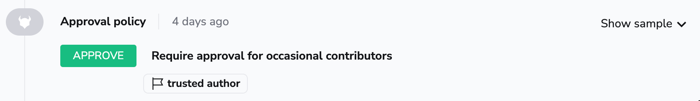

# Policy

## Introduction

Policy-as-code is the idea of expressing rules using a high-level programming language and treating them as you normally treat code, which includes version control as well as continuous integration and deployment. This approach extends the infrastructure-as-code approach to also cover the rules governing this infrastructure, and the platform that manages it.

Spacelift as a development platform is built around this concept and allows defining policies that involve various decision points in the application. User-defined policies can decide:

- Login: [who gets to log in](login-policy.md) to your Spacelift account and with what level of access;
- Access: [who gets to access individual Stacks](stack-access-policy.md) and with what level of access;
- Approval: [who can approve or reject a run](approval-policy.md) and how a run can be approved;
- Initialization: [which Runs and Tasks can be started](run-initialization-policy.md);
- Notification: [routing and filtering notifications](notification-policy.md);
- Plan: [which changes can be applied](terraform-plan-policy.md);
- Push: [how Git push events are interpreted](push-policy/README.md);
- Task: [which one-off commands can be executed](task-run-policy.md);
- Trigger: [what happens when blocking runs terminate](trigger-policy.md);

Please refer to the following table for information on what each policy types returns, and the rules available within each policy.

| Type                                           | Purpose                                                                                        | Types                 | Returns            | Rules                                                     |
|------------------------------------------------|------------------------------------------------------------------------------------------------|-----------------------|--------------------|-----------------------------------------------------------|
| [Login](login-policy.md)                       | Allow or deny login, grant admin access                                                        | Positive and negative | `boolean`          | `allow`, `admin`, `deny`, `deny_admin`                    |
| [Access](stack-access-policy.md)               | Grant or deny appropriate level of stack access                                                | Positive and negative | `boolean`          | `read`, `write`, `deny`, `deny_write`                     |
| [Approval](approval-policy.md)                 | Who can approve or reject a run and how a run can be approved                                  | Positive and negative | `boolean`          | `approve, reject`                                         |
| [Initialization](run-initialization-policy.md) | Blocks suspicious [runs](../run/README.md) before they [start](../run/README.md#initializing)  | Negative              | `set<string>`      | `deny`                                                    |
| [Notification](notification-policy.md)         | Routes and filters notifications                                                               | Positive              | `map<string, any>` | `inbox`, `slack`, `webhook`                               |
| [Plan](terraform-plan-policy.md)               | Gives feedback on [runs](../run/README.md) after [planning](../run/proposed.md#planning) phase | Negative              | `set<string>`      | `deny`, `warn`                                            |
| [Push](push-policy/README.md)                     | Determines how a Git push event is interpreted                                                 | Positive and negative | `boolean`          | `track`, `propose`, `ignore`, `ignore_track`, `notrigger`, `notify` |
| [Task](task-run-policy.md)                     | Blocks suspicious [tasks](../run/task.md) from running                                         | Negative              | `set<string>`      | `deny`                                                    |
| [Trigger](trigger-policy.md)                   | Selects [stacks](../stack/README.md) for which to trigger a [tracked run](../run/tracked.md)   | Positive              | `set<string>`      | `trigger`                                                 |

!!! tip
    We maintain a [library of example policies](https://github.com/spacelift-io/spacelift-policies-example-library){: rel="nofollow"} that are ready to use or that you could tweak to meet your specific needs.

    If you cannot find what you are looking for, please reach out to [our support](../../product/support/README.md#contact-support) and we will craft a policy to do exactly what you need.

## How it works

Spacelift uses an open-source project called [**Open Policy Agent**](https://www.openpolicyagent.org/){: rel="nofollow"} and its rule language, [**Rego**](https://www.openpolicyagent.org/docs/latest/policy-language/){: rel="nofollow"}**,** to execute user-defined pieces of code we call **Policies** at various decision points. Policies come in different flavors that we call **types**, with each type being executed at a different decision point.

You can think of policies as snippets of code that receive some JSON-formatted input and are allowed to produce some output in a predefined form. This input normally represents the data that should be enough to make some decision in its context. Each policy type exposes slightly different data, so please refer to their respective schemas for more information.

Except for [login policies](login-policy.md) that are global, all other policy types operate on the [stack](../stack/README.md) level, and they can be attached to multiple stacks, just as [contexts](../configuration/context.md) are, which both facilitates code reuse and allows flexibility. Policies only affect stacks they're attached to. Please refer to the [relevant section of this article](#attaching-policies) for more information about attaching policies.

Multiple policies of the same type can be attached to a single stack, in which case they are evaluated separately to avoid having their code (like local variables and helper rules) affect one another. However, once these policies are evaluated against the same input, their results are combined. So if you allow user login from one policy but deny it from another, the result will still be a denial.

### Version

We update the version of OPA that we are using regularly, to find out the version we are currently running, you can use the following query:

```graphql
query getOPAVersion{
    policyRuntime {
        openPolicyAgentVersion
    }
}
```

For more detailed information about the GraphQL API and its integration, please refer to the [API documentation](../../integrations/api.md).

### Policy language

[Rego](https://www.openpolicyagent.org/docs/latest/policy-language/){: rel="nofollow"} - the language that we're using to execute policies - is a very elegant, Turing incomplete data query language. It takes a few hours (tops) to get your head around all of its quirks but if you can handle SQL and the likes of [`jq`](https://stedolan.github.io/jq/){: rel="nofollow"}, you'll find Rego pretty familiar. For each policy, we also give you plenty of examples that you can tweak to achieve your goals, and each of those examples comes with a link allowing you to execute it in [the Rego playground](https://play.openpolicyagent.org/){: rel="nofollow"}.

### Constraints

To keep policies functionally pure and relatively snappy, we disabled some Rego built-ins that can query external or runtime data. These are:

- `http.send`
- `opa.runtime`
- `rego.parse_module`
- `time.now_ns`
- `trace`

Disabling `time.now_ns` may seem surprising at first - after all, what's wrong with getting the current timestamp? Alas, depending on the current timestamp will make your policies impure and thus tricky to test - and we encourage you to [test your policies thoroughly](#testing-policies)! You will notice though that the current timestamp in Rego-compatible form (Unix nanoseconds) is available as `request.timestamp_ns` in every policy payload, so please use it instead.

Policies must be self-contained and cannot refer to external resources (e.g., files in a VCS repository).

## Return Types

There are currently nine types of supported policies and while each of them is different, they have a lot in common. In particular, they can fall into a few groups based on what rules are expected to return.

### Boolean

[Login](login-policy.md) and [access](stack-access-policy.md) policies expect rules to return a **boolean value** (_true_ or _false_). Each type of policy defines its own set of rules corresponding to different access levels. In these cases, various types of rules can be positive or negative - that is, they can explicitly **allow** or **deny** access.

### Set of Strings

The second group of policies ([initialization](run-initialization-policy.md), [plan](terraform-plan-policy.md), and [task](task-run-policy.md)) is expected to generate a [**set of strings**](https://www.openpolicyagent.org/docs/latest/policy-language/#generating-sets){: rel="nofollow"} that serve as _direct feedback_ to the user. Those rules are generally negative in that they **can only block** certain actions - it's only their lack that counts as an implicit success.

Here's a practical difference between the two types:

```opa title="boolean.rego"
package spacelift

# This is a simple deny rule.
# When it matches, no feedback is provided.
deny {
  true
}
```

```opa title="string.rego"
package spacelift

# This is a deny rule with string value.
# When it matches, that value is reported to the user.
deny["the user will see this"] {
  true
}
```

For the policies that generate a set of strings, you want these strings to be both informative and relevant, so you'll see this pattern a lot in the examples:

```opa
package spacelift

we_dont_create := { "scary", "resource", "types" }

# This is an example of a plan policy.
deny[sprintf("some rule violated (%s)", [resource.address])] {
  some resource
  created_resources[resource]

  we_dont_create[resource.type]
}
```

### Complex objects

Final group of policies ([notification](notification-policy.md)) will generate and return more complex objects. These are typically JSON objects.
In terms of syntax they are still very similar to other policies which return sets of strings, but they provide additional information inside the returned decision. For example here is a rule which will return a JSON object to be used when creating a custom notification:

```opa
package spacelift

inbox[{
  "title": "Tracked run finished!",
  "body": sprintf("Run ID: %s", [run.id]),
  "severity": "INFO",
}] {
  run := input.run_updated.run
  run.type == "TRACKED"
  run.state == "FINISHED"
}
```

## Helper Functions

The following helper functions can be used in Spacelift policies:

| Name                     | Description                                                                                                                                                                            |
| ------------------------ | -------------------------------------------------------------------------------------------------------------------------------------------------------------------------------------- |
| `output := sanitized(x)` | `output` is the string `x` sanitized using the same algorithm we use to sanitize secrets.                                                                                              |
| `result := exec(x)`      | Executes the command `x`. `result` is an object containing `status`, `stdout` and `stderr`. Only applicable for run initialization policies for [private workers](../worker-pools.md). |

## Creating policies

There are two ways of creating policies - through the web UI and through the [Terraform provider](../../vendors/terraform/terraform-provider.md). We generally suggest the latter as it's much easier to manage down the line and [allows proper unit testing](#testing-policies). Here's how you'd define a plan policy in Terraform and attach it to a stack (also created here with minimal configuration for completeness):

```opa
resource "spacelift_stack" "example-stack" {
  name       = "Example stack"
  repository = "example-stack"
  branch     = "master"
}

# This example assumes that you have Rego policies in a separate
# folder called "policies".
resource "spacelift_policy" "example-policy" {
  name = "Example policy"
  body = file("${path.module}/policies/example-policy.rego")
  type = "TERRAFORM_PLAN"
}

resource "spacelift_policy_attachment" "example-attachment" {
  stack_id  = spacelift_stack.example-stack.id
  policy_id = spacelift_policy.example-policy.id
}
```

On the other hand, if you want to create a policy in the UI, here's how you could go about that. **Note that you must be a Spacelift admin to manage policies**. First, go to the Policies screen in your account view, and click the _Add policy_ button:

.png>)

This takes you to the policy creation screen where you can choose the type of policy you want to create, and edit its body. For each type of policy you're also given an explanation and a few examples. We'll be creating an [access policy](stack-access-policy.md) that gives members of the _Engineering_ GitHub team read access to a stack:


Once you're done, click on the _Create policy_ button to save it. Don't worry, policy body is mutable so you'll always be able to edit it if need be.

## Attaching policies

### Automatically

Policies, with the exception of [Login policies](login-policy.md), can be automatically attached to stacks using the `autoattach:label` special label where `label` is the name of a label attached to stacks and/or modules in your Spacelift account you wish the policy to be attached to.

#### Policy Attachment Example

In the example below, the policy will be automatically attached to all stacks/modules with the label `production`.


#### Wildcard Policy Attachments

In addition to being able to automatically attach policies using a specific label, you can also choose to attach a policy to stacks/modules in the account using a wildcard, for example using `autoattach:*` as a label on a policy, will attach the policy to all stacks/modules.

### Manually

In the web UI attaching policies is done in the stack management view, in the Policies tab:


## Policy workbench

One thing we've noticed while working with policies in practice is that it takes a while to get them right. This is not only because the concept or the underlying language introduce a learning curve, but also because the feedback cycle can be slow: write a plan policy, make a code change, trigger a run, verify policy behavior... rinse and repeat. This can easily take hours.

Enter **policy workbench**. Policy workbench allows you to capture policy evaluation events so that you can adjust the policy independently and therefore shorten the entire cycle. In order to make use of the workbench, you will first need to [sample policy inputs](#sampling-policy-inputs).

### Sampling policy inputs

Each of Spacelift's policies supports an additional boolean rule called `sample`. Returning `true` from this rule means that the input to the policy evaluation is captured, along with the policy body at the time and the exact result of the policy evaluation. You can for example just capture every evaluation with a simple:

```opa
sample { true }
```

If that feels a bit simplistic and spammy, you can adjust this rule to capture only certain types of inputs. For example, in this case we will only want to capture evaluations that returned in an empty list for `deny` reasons (eg. with a [plan](terraform-plan-policy.md) or [task](task-run-policy.md) policy):

```opa
sample { count(deny) == 0 }
```

You can also sample a certain percentage of policy evaluations. Given that we don't generally allow nondeterministic evaluations, you'd need to depend on a source of randomness internal to the input. In this example we will use the timestamp - note that since it's originally expressed in nanoseconds, we will turn it into milliseconds to get a better spread. We'll also want to sample every 10th evaluation:

```opa
sample {
  millis := round(input.request.timestamp_ns / 1e6)
  millis % 100 <= 10
}
```

### Why sample?

Capturing all evaluations sounds tempting but it will also be extremely messy. We're only showing **100 most recent evaluations from the past 7 days**, so if you capture everything then the most valuable samples can be drowned by irrelevant or uninteresting ones. Also, sampling adds a small performance penalty to your operations.

### Policy workbench in practice

In order to show you how to work with the policy workbench, we are going to use a [task policy](task-run-policy.md) that whitelists just two tasks - an innocent `ls`, and tainting a particular resource. It also only samples successful evaluations, where the list of `deny` reasons is empty:

!!! info
    This example comes from our [test repo](https://github.com/spacelift-io/terraform-starter){: rel="nofollow"}, which gives you hands-in experience with most Spacelift functionalities within 10-15 minutes, depending on whether you like to RTFM or not. We strongly recommend you give it a go.


In order to get to the policy workbench, first click on the Edit button in the upper right hand corner of the policy screen:

.png>)

Then, click on the Show simulation panel link on the right hand side of the screen:


If your policy has been used evaluated and sampled, your screen should look something like this:


On the left hand side you have the policy body. On the right hand side there's a dropdown with timestamped evaluations (inputs) of this policy, color-coded for their ultimate outcome. Selecting one of the inputs allows you to simulate the evaluation:


While running simulations, you can edit both the input and the policy body. If you edit the policy body, or choose an input that has been evaluated with a different policy body, you will get a warning like this:


Clicking on the _Show changes_ link within that warning shows you the exact difference between the policy body in the editor panel, and the one used for evaluating the selected input:


Once you're happy with your new policy body, you can click on the _Save changes_ button to make sure that the new body is used for future evaluations.

### Is it safe?

Yes, policy sampling is perfectly safe. Session data may contain some personal information like username, name and IP, but that data is only persisted for 7 days. Most importantly, in [plan policies](terraform-plan-policy.md) the inputs hash all the string attributes of resources, ensuring that no sensitive data leaks through this means.


Last but not least, the policy workbench - including access to previous inputs - is only available to **Spacelift account administrators**.

## Testing policies

!!! info
    In the examples for each type of policy we invite you to play around with the policy and its input [in the Rego playground](https://play.openpolicyagent.org/){: rel="nofollow"}. While certainly useful, we won't consider it proper unit testing.

The whole point of policy-as-code is being able to handle it as code, which involves everyone's favorite bit - testing. Testing policies is crucial because you don't want them accidentally allow the wrong crowd to do the wrong things.

Luckily, Spacelift uses a well-documented and well-supported open source language called Rego, which has built-in support for testing. Testing Rego is extensively covered in [their documentation](https://www.openpolicyagent.org/docs/latest/policy-testing/){: rel="nofollow"} so in this section we'll only look at things specific to Spacelift.

Let's define a simple [login policy](login-policy.md) that denies access to [non-members](login-policy.md#account-membership), and write a test for it:

```opa title="deny-non-members.rego"
package spacelift

deny { not input.session.member }
```

You'll see that we simply mock out the `input` received by the policy:

```opa title="deny-non-members_test.rego"
package spacelift

test_non_member {
    deny with input as { "session": { "member": false } }
}

test_member_not_denied {
    not deny with input as { "session": { "member": true } }
}
```

We can then test it in the console using `opa test` command (note the glob, which captures both the source and its associated test):

```bash
❯ opa test deny-non-members*
PASS: 2/2
```

Testing policies that provide feedback to the users is only slightly more complex. Instead of checking for boolean values, you'll be testing for set equality. Let's define a simple [run initialization policy](run-initialization-policy.md) that denies commits to a particular branch (because why not):

```opa title="deny-sandbox.rego"
package spacelift

deny[sprintf("don't push to %s", [branch])] {
  branch := input.commit.branch
  branch == "sandbox"
}
```

In the respective test, we will check that the set return by the **deny** rule either has the expected element for the matching input, or is empty for non-matching one:

```opa title="deny-sandbox_test.rego"
package spacelift

test_sandbox_denied {
  expected := { "don't push to sandbox" }

  deny == expected with input as { "commit": { "branch": "sandbox" } }
}

test_master_not_denied {
  expected := set()

  deny == expected with input as { "commit": { "branch": "master" } }
}
```

Again, we can then test it in the console using `opa test` command (note the glob, which captures both the source and its associated test):

```bash
❯ opa test deny-sandbox*
PASS: 2/2
```

!!! success
    We suggest you always unit test your policies and apply the same continuous integration principles as with your application code. You can set up a CI project using the vendor of your choice for the same repository that's linked to the Spacelift project that's defining those policies, to get an external validation.

## Policy flags

By default, each policy is completely self-contained and does not depend on the result of previous policies. There are at times situations where you want to introduce a chain of policies passing some data to one another. Different types of policies have access to different types of data required to make a decision, and you can use policy flags to pass that data (or more likely, a useful digest of that data) between them.

Let's take a look at a simple example. Let's say you have a [push policy](./push-policy/README.md) with access to the list of files affected by a push or a PR event. You want to introduce a form of ownership control where changes to different files need approval from different users. For example, a change in the `network` directory may require approval from the network team, while a change in the `database` directory needs an approval from the DBAs.

Approvals are handled by an [approval policy](./approval-policy.md) but the problem is that it no longer retains access to the list of affected files. This is a great use case to use flags. Let's have the push policy set arbitrary review flags on the run. This can be a separate push policy as in this example, or part of one of your pre-existing push policies. For the sake of simplicity, the example below will only focus on the `network` bit.

```rego title="flag_for_review.rego"
package spacelift

network_review_flag = "review:network"

flag[network_review_flag] {
  startswith(input.push.affected_files[_], "network/")
}

flag[network_review_flag] {
  startswith(input.pull_request.diff[_], "network/*")
}
```

Now, we can introduce a network approval policies using this flag.

```rego title="network-review.rego"
package spacelift

network_review_required {
  input.run.flags[_] == "review:network"
}

approve { not network_review_required }
approve {
  input.reviews.current.approvals[_].session.teams[_] == "DBA"
}
```

There are a few things worth knowing about flags:

- They are **arbitrary strings** and Spacelift makes no assumptions about their format or content.
- They are **immutable**. Once set, they cannot be changed or unset;
- They are **passed between policy types**. If you have multiple policies of the same type, they will not be able to see each other's flags;
- They can be set by any policies that explicitly **touch a run**: [push](./push-policy/README.md), [approval](./approval-policy.md), [plan](./terraform-plan-policy.md) and [trigger](./trigger-policy.md);
- They are always accessible through `run`'s `flags` property whenever the `run` resource is present in the input document;

Also worth noting is the fact that flags are shown in the GUI, so even if you're not using them to explicitly pass the data between different types of policies, they can still be useful for debugging purposes. Below is an example of an approval policy exposing decision-making details:



## Backwards-compatibility

Policies, like the rest of Spacelift functionality, are generally kept fully backwards-compatible. Input fields of policies aren't removed and existing policy "invocation sites" are kept in place.

Occasionally policies might be deprecated, and once unused, disabled, but this is a process in which we work very closely with any affected users to make sure they have ample time to migrate and aren't negatively affected.

However, we do reserve the right to add new fields to policy inputs and introduce additional invocation sites. E.g. we could introduce a new input event type to the Push Policy, and existing Push Policies will start getting those events. Thus, users are expected to write their policies in a way that new input types are handled gracefully, by checking for the event type in their rules.

For example, in a Push Policy, you might write a rule as follows:

```rego title="backwards-compatibility.rego"
track {
  not is_null(input.pull_request)
  input.pull_request.labels[_] == "deploy"
}
```

As you can see, the first line in the `track` rule makes sure that we only respond to events that contain the pull_request field.
