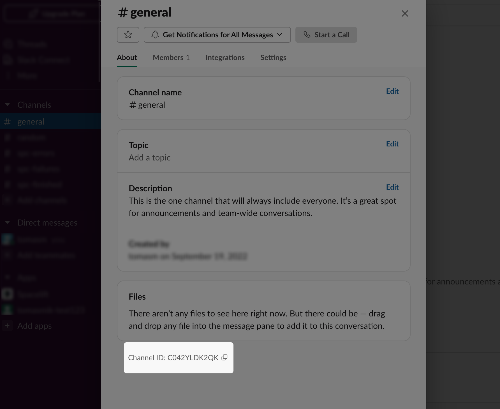
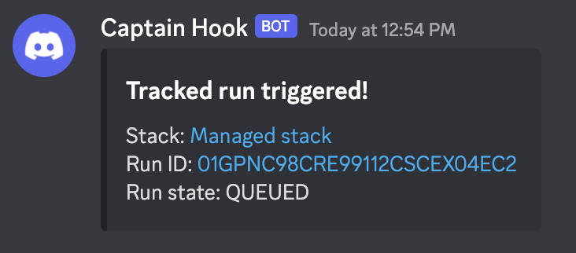

# Notification policy

## Purpose

Notification [policies](./README.md) can be used to filter, route and adjust the body of notification messages sent by Spacelift. The policy works at the [Space level](../spaces/README.md)
meaning that it does not need to be attached to a specific [stack](../stack/README.md), but rather is always evaluated if the Space it's in can be accessed by whatever action is being evaluated.
It's also important to note that all notifications go through the policy evaluation.
This means any of them can be redirected to the routes defined in the policy.

A notification policy can define the following rules:

- **inbox** - allows messages to be routed to the Spacelift notification inbox;
- **slack** - allows messages to be routed to a given slack channel;
- **webhook** - allows messages to be routed to a given webhook;
- **pull_request** - allows messages to be routed to one or more pull requests;

If no rules match no action is taken.

## Data input

This is the schema of the data input that each policy request can receive:

```json
{
  "account": {
    "name": "string"
  },
  "module_version": {
    "module": {
      "id": "string - unique ID of the module",
      "administrative": "boolean - is the module administrative",
      "branch": "string - tracked branch of the module",
      "labels": ["string - list of arbitrary, user-defined selectors"],
      "namespace": "string - repository namespace, only relevant to GitLab repositories",
      "name": "string - name of the module",
      "project_root": "optional string - project root as set on the Module, if any",
      "repository": "string - name of the source repository",
      "terraform_provider": "string - name of the main Terraform provider used by the module",
      "space": {
        "id": "string - id of a space",
        "labels": ["string - list of arbitrary, user-defined selectors"],
        "name": "string - name of a the space"
      },
      "worker_pool": {
        "public": "boolean - worker pool information",
        "id": "string - unique ID of the worker pool",
        "name": "string - name of the worker pool",
        "labels": ["string - list of arbitrary, user-defined selectors"]
      }
    },
    "version": {
      "commit": {
        "author": "string",
        "branch": "string",
        "created_at": "number (timestamp in nanoseconds)",
        "hash": "string",
        "message": "string",
        "url": "string"
      },
      "created_at": "number - creation Unix timestamp in nanoseconds",
      "id": "string - id of the version being created",
      "latest": "boolean - is the module version latest",
      "number": "string - semver version number",
      "state": "string - current module state: ACTIVE, FAILED",
      "test_runs": [{
        "created_at": "number (timestamp in nanoseconds)",
        "id": "string - id of the test",
        "state": "string - state of the test",
        "title": "string - title of the test",
        "updated_at": "number (timestamp in nanoseconds)",
      }]
    }
  },
  "run_updated": {
    "state": "string",
    "username": "string",
    "note": "string",
    "run":{
      "based_on_local_workspace": "boolean - whether the run stems from a local preview",
      "branch": "string - the branch the run was triggered from",
      "changes": [
        {
          "action": "string enum - added | changed | deleted",
          "entity": {
            "address": "string - full address of the entity",
            "data": "object - detailed information about the entity, shape depends on the vendor and type",
            "name": "string - name of the entity",
            "type": "string - full resource type or \"output\" for outputs",
            "entity_vendor": "string - the name of the vendor",
            "entity_type": "string - the type of entity, possible values depend on the vendor"
          },
          "phase": "string enum - plan | apply"
        }
      ],
      "command": "string",
      "commit": {
        "author": "string",
        "branch": "string",
        "created_at": "number (timestamp in nanoseconds)",
        "hash": "string",
        "message": "string",
        "url": "string"
      },
      "created_at": "number (timestamp in nanoseconds)",
      "creator_session": {
        "admin": "boolean",
        "creator_ip": "string",
        "login": "string",
        "name": "string",
        "teams": ["string"],
        "machine": "boolean - whether the run was kicked off by a human or a machine"
      },
      "drift_detection": "boolean",
      "flags": ["string"],
      "id": "string",
      "runtime_config": {
        "after_apply": ["string"],
        "after_destroy": ["string"],
        "after_init": ["string"],
        "after_perform": ["string"],
        "after_plan": ["string"],
        "after_run": ["string"],
        "before_apply": ["string"],
        "before_destroy": ["string"],
        "before_init": ["string"],
        "before_perform": ["string"],
        "before_plan": ["string"],
        "environment": "map[string]string",
        "project_root": "string",
        "runner_image": "string",
        "terraform_version": "string"
      },
      "policy_receipts": [{
         "flags": ["string - flag assigned to the policy"],
         "name": "string - name of the policy",
         "outcome": "string - outcode of the policy",
         "type": "string - type of the policy"
       }],
      "state": "string",
      "triggered_by": "string or null",
      "type": "string - PROPOSED or TRACKED",
      "updated_at": "number (timestamp in nanoseconds)",
      "user_provided_metadata": ["string"]
    },
    "stack": {
      "administrative": "boolean",
      "autodeploy": "boolean",
      "autoretry": "boolean",
      "branch": "string",
      "id": "string",
      "labels": ["string"],
      "locked_by": "string or null",
      "name": "string",
      "namespace": "string or null",
      "project_root": "string or null",
      "repository": "string",
      "space": {
        "id": "string",
        "labels": ["string"],
        "name": "string"
      },
      "state": "string",
      "terraform_version": "string or null",
      "tracked_commit": {
        "author": "string",
        "branch": "string",
        "created_at": "number (timestamp in nanoseconds)",
        "hash": "string",
        "message": "string",
        "url": "string"
      }
    }
  },
  "state": "string",
  "timing": [
    {
      "duration": "number (in nanoseconds)",
      "state": "string"
    }
  ],
  "username": "string",
  "webhook_endpoints": [
    {
      "id": "custom-hook2",
      "labels": [
        "example-label1",
        "example-label2"
      ]
    }
  ],
  "internal_error": {
    "error": "string",
    "message": "string",
    "severity": "string - INFO, WARNING, ERROR"
  }
}
```

The final JSON object received as input will depend on the type of notification being sent. Event-dependent objects will only be present when those events happen. The best way to see what input your Notification policy received is to [enable sampling](../policy/README.md#sampling-policy-inputs) and check the [Policy Workbench](../policy/README.md#policy-workbench-in-practice), but you can also use the table below as a reference:

| Object Received     | Event                                                                |
|---------------------|----------------------------------------------------------------------|
| `account`           | Any event                                                            |
| `webhook_endpoints` | Any event                                                            |
| `run_updated`       | [Run](../run/README.md) Updated                                      |
| `internal_error`    | Internal error occurred                                               |
| `module_version`    | [Module](../../vendors/terraform/module-registry.md) version updated |

## Policy in practice

Using the notification policy, you can completely re-write notifications or control where and when they are sent. Let's look into how
the policy works for each of the defined routes.

### Choosing a Space for your policy

When creating notification policies you should take into account the Space in which you're creating them.
Generally the policy follows the same conventions as any other Spacelift component, with a few small caveats.

#### Determining Space for run update notifications

Run update messages will rely on the Space that the run is happening in.
It will check any policies in that Space including policies inherited from other Spaces.

#### Determining Space for internal errors

Most internal errors will check for notification policies inside of the root Space.
However if the policy is reporting about a component that belongs to a certain Space
and it can determine to which one it is, then it will check for policies in that or any inherited Space.
Here is a list of components it will check in order:

- Stack
- Worker pool
- AWS integration
- Policy

!!! info
    If you are new to spaces, consider further exploring our documentation about them [here](../spaces/README.md)

### Inbox notifications

Inbox notifications are what you receive in your [Spacelift notification inbox](../../product/notifications.md). By default, these are errors that happened during
some kind of action execution inside Spacelift and are always sent even if you do not have a policy created.
However using the policy allows you to alter the body of those errors to add additional context, or even more importantly
it allows you to create your own unique notifications.

The inbox rule accepts multiple configurable parameters:

- `title` - a custom title for the message (**Optional**)
- `body` - a custom message body (**Optional**)
- `severity` - the severity level for the message (**Optional**)

#### Creating new inbox notifications

For example here is a inbox rule which will send `INFO` level notification messages to your inbox
when a tracked run has finished:

```opa
package spacelift

 inbox[{
  "title": "Tracked run finished!",
  "body": sprintf("http://example.app.spacelift.io/stack/%s/run/%s has finished", [stack.id, run.id]),
  "severity": "INFO",
 }] {
   stack := input.run_updated.stack
   run := input.run_updated.run
   run.type == "TRACKED"
   run.state == "FINISHED"
 }
```

[View the example in the rego playground](https://play.openpolicyagent.org/p/WGRgvTbU77){: rel="nofollow"}.

### Slack messages

[Slack](../../integrations/chatops/slack.md) messages can also be controlled using the notification policy, but before creating any policies that interact with Slack
you will need to [add the slack integration to your Spacelift account](../../integrations/chatops/slack.md#linking-your-spacelift-account-to-the-slack-workspace).

!!! info
    The documentation section about [Slack](../../integrations/chatops/slack.md) includes additional information like: available actions,
    slack access policies and more. Consider exploring that part of documentation first.

Another important point to mention is that the rules for Slack require a `channel_id` to be defined. This can be found at the bottom of a channel's _About_ section in Slack:



Now you should be ready to define rules for routing Slack messages. Slack rules allow you to make the same filtering
decisions as any other rule in the policy. They also allow you to edit the message bodies themselves in order to create custom messages.

The Slack rules accept multiple configurable parameters:

- `channel_id` - the Slack channel to which the message will be delivered (**Required**)
- `message` - a custom message to be sent (**Optional**)

#### Filtering and routing messages

For example if you wanted to receive only finished runs on a specific Slack channel you would define a rule like this:

```opa
package spacelift

slack[{"channel_id": "C0000000000"}] {
  input.run_updated != null

  run := input.run_updated.run
  run.state == "FINISHED"
}
```

[View the example in the rego playground](https://play.openpolicyagent.org/p/kPtk55QHPK){: rel="nofollow"}.

#### Changing the message body

Together with filtering and routing messages you can also alter the message body itself, here is an example
for sending a custom message where a run which tries to attach a policy requires confirmation:

```opa
package spacelift

slack[{
  "channel_id": "C0000000000",
  "message": sprintf("http://example.app.spacelift.io/stack/%s/run/%s is trying to attach a policy!", [stack.id, run.id]),
}] {
  stack := input.run_updated.stack
  run := input.run_updated.run
  run.type == "TRACKED"
  run.state == "UNCONFIRMED"
  change := run.changes[_]
  change.phase == "plan"
  change.entity.type == "spacelift_policy_attachment"
}
```

[View the example in the rego playground](https://play.openpolicyagent.org/p/KyN5EHeyhk){: rel="nofollow"}.

### Webhook requests

!!! info
    This section of documentation requires you have configured at least one [Named Webhook](../../integrations/webhooks.md).
    Consider exploring that part of documentation first.

Webhook notifications are a very powerful part of the notification policy. Using them, one is able to not only
receive webhooks on specific events that happen in Spacelift, but also craft unique requests to be consumed
by some third-party.

The notification policy relies on named webhooks which can be created and managed in the [Webhooks section of Spacelift](../../integrations/webhooks.md).
Any policy evaluation will always receive a list of possible webhooks together with their labels as input.
The data received in the policy input should be used to determine which webhook will be used when sending the request.

The webhook policy accepts multiple configurable parameters:

- `endpoint_id` - endpoint id (slug) to which the webhook will be delivered  (**Required**)
- `headers` - a key value map which will be appended to request headers (**Optional**)
- `payload` - a custom valid JSON object to be sent as request body (**Optional**)
- `method` - a HTTP method to use when sending the request (**Optional**)

#### Filtering webhook requests

Filtering and selecting webhooks can be done by using the received input data. Rules can be created where only
specific actions should trigger a webhook being sent.
For example we could define a rule which would allow a webhook to be sent about any drift detection run:

```opa
package spacelift

webhook[{"endpoint_id": endpoint.id}] {
  endpoint := input.webhook_endpoints[_]
  endpoint.id == "drift-hook"
  input.run_updated.run.drift_detection == true
  input.run_updated.run.type == "PROPOSED"
}
```

[View the example in the rego playground](https://play.openpolicyagent.org/p/qiMTWbTJxm){: rel="nofollow"}.

#### Creating a custom webhook request

All requests sent will always include the default headers for verification, a payload which is
appropriate for the message type and the `method` set as `POST`. However, by using the webhook rule
we can modify the body of the request, change the method or add additional headers.
For example, if we wanted to define a completely custom request for a [tracked run](../run/README.md) we would define a rule like this:

```opa
package spacelift

webhook[wbdata] {
  endpoint := input.webhook_endpoints[_]
  endpoint.id == "testing-notifications"
  wbdata := {
    "endpoint_id": endpoint.id,
    "payload": {
      "custom_field": "This is a custom message",
      "run_type": input.run_updated.run.type,
      "run_state": input.run_updated.run.state,
      "updated_at": input.run_updated.run.updated_at,
    },
    "method": "PUT",
    "headers": {
      "custom-header": "custom",
    },
  }

  input.run_updated.run.type == "TRACKED"
}
```

[View the example in the rego playground](https://play.openpolicyagent.org/p/fbfiiYEots){: rel="nofollow"}.

Using custom webhook requests also makes it quite easy to integrate Spacelift with any third-party webhook consumer.

#### Custom webhook requests in action

##### Discord integration

Discord can be integrated to receive updates about Spacelift by simply creating a new webhook endpoint in your Discord server's integrations
section and providing that as the endpoint when creating a new [named webhook](../../integrations/webhooks.md).

!!! info
    <!-- markdown-link-check-disable -->
    For more information about making Discord webhooks follow their [official webhook guide](https://support.discord.com/hc/en-us/articles/228383668){: rel="nofollow"}.

After creating the webhook on both Discord and Spacelift you will need to define a new webhook rule like this:

```opa
# Send updates about tracked runs to discord.
webhook[wbdata] {
  endpoint := input.webhook_endpoints[_]
  endpoint.id == "YOUR_WEBHOOK_ID_HERE"
  stack := input.run_updated.stack
  run := input.run_updated.run
  wbdata := {
    "endpoint_id": endpoint.id,
    "payload": {
      "embeds": [{
        "title": "Tracked run triggered!",
        "description": sprintf("Stack: [%s](http://example.app.spacelift.io/stack/%s)\nRun ID: [%s](http://example.app.spacelift.io/stack/%s/run/%s)\nRun state: %s", [stack.name,stack.id,run.id,stack.id, run.id,run.state]),
        }]
     }
  }
  input.run_updated.run.type == "TRACKED"
}
```

And that's it! You should now be receiving updates about tracked runs to your Discord server:



### Pull request notifications

Pull request notifications are a very powerful part of the notification policy.
Using them, one is able to not only target a single pull request but also pull requests targeting a specific branch or commit.

The pull request rule accepts multiple configurable parameters:

- `id` - a pull request ID (**Optional**)
- `commit` - a target commit SHA (**Optional**)
- `branch` - a target branch (**Optional**)
- `body` - a custom comment body (**Optional**)

#### Creating a pull request comment

For example here is a rule which will add a comment (containing a default body) to the pull request that triggered the run:

```opa
package spacelift

pull_request[{"id": run.commit.pull_request_id}] {
  run := input.run_updated.run
  run.state == "FINISHED"
}
```

[View the example in the rego playground](https://play.openpolicyagent.org/p/nIjFbXKLsn){: rel="nofollow"}.

#### Adding a comment to pull requests targeting a specific commit

You specify a target commit SHA using the `commit` parameter:

```opa
package spacelift

pull_request[{
  "commit": run.commit.hash,
  "body": sprintf("https://%s.app.spacelift.io/stack/%s/run/%s has finished", [input.account.name, stack.id, run.id]),
}] {
  stack := input.run_updated.stack
  run := input.run_updated.run
  run.state == "FINISHED"
}
```

[View the example in the rego playground](https://play.openpolicyagent.org/p/VbWmH1Y1Kd){: rel="nofollow"}.

#### Adding a comment to pull requests targeting a specific branch

Provide the branch name using the `branch` parameter:

```opa
package spacelift

pull_request[{
  "branch": "main",
  "body": sprintf("https://%s.app.spacelift.io/stack/%s/run/%s has finished", [input.account.name, stack.id, run.id]),
}] {
  stack := input.run_updated.stack
  run := input.run_updated.run
  run.state == "FINISHED"
}
```

!!! hint
    Please note that `branch` is the base branch of the pull request. For example, if it's `"branch": input.run_updated.stack.branch`, that'd mean that the policy would comment into every pull request that targets the tracked branch of the stack.

[View the example in the rego playground](https://play.openpolicyagent.org/p/p9v2tiwjOT){: rel="nofollow"}.

#### Changing the comment body

You can customize the comment body, even include logs from the [planning](../run/proposed.md#planning) or [applying](../run/tracked.md#applying) phase.

A `spacelift::logs::planning` placeholder in the comment body will be replaced with logs from the [planning](../run/proposed.md#planning) phase. The same applies to `spacelift::logs::applying` and the [applying](../run/tracked.md#applying) phase.

```opa
package spacelift

pull_request[{
  "id": run.commit.pull_request_id,
  "body": body,
}] {
  stack := input.run_updated.stack
  run := input.run_updated.run
  run.state == "FINISHED"

  body := sprintf(`https://%s.app.spacelift.io/stack/%s/run/%s has finished

## Planning logs

%s
spacelift::logs::planning
%s
`, [input.account.name, stack.id, run.id, "```", "```"])
}
```

[View the example in the rego playground](https://play.openpolicyagent.org/p/usG1dBTiEw){: rel="nofollow"}.
