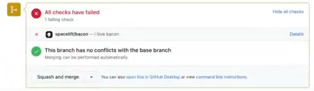

# Push policy

## Purpose

Git push policies are triggered on a per-stack basis to determine the action that should be taken for each individual [Stack](../../stack/README.md) or [Module](../../../vendors/terraform/module-registry.md) in response to a Git push or Pull Request notification. There are three possible outcomes:

- **track**: set the new head commit on the [stack](../../stack/README.md) / [module](../../../vendors/terraform/module-registry.md) and create a [tracked](../../run/README.md#where-do-runs-come-from) [Run](../../run/README.md), ie. one that can be [applied](../../run/README.md#applying);
- **propose**: create a [proposed Run](../../run/README.md#where-do-runs-come-from) against a proposed version of infrastructure;
- **ignore**: do not schedule a new Run;

Using this policy it is possible to create a very sophisticated, custom-made setup. We can think of two main - and not mutually exclusive - use cases. The first one would be to ignore changes to certain paths - something you'd find useful both with classic monorepos and repositories containing multiple Terraform projects under different paths. The second one would be to only attempt to apply a subset of changes - for example, only commits tagged in a certain way.

### Git push policy and tracked branch

Each stack and module points at a particular Git branch called a [tracked branch](../../stack/README.md#repository-and-branch). By default, any push to the tracked branch that changes a file in the project root triggers a tracked [Run](../../run/README.md) that can be [applied](../../run/README.md#applying). This logic can be changed entirely by a Git push policy, but the tracked branch is always reported as part of the Stack input to the policy evaluator and can be used as a point of reference.


When a push policy does not track a new push, the head commit of the stack/module will not be set to the tracked branch head commit. We can address this by navigating to that stack and pressing the sync button (this syncs the tracked branch head commit with the head commit of the stack/module).

### Push and Pull Request events

Spacelift can currently react to two types of events - _push_ and _pull request_ (also called _merge request_ by GitLab). Push events are the default - even if you don't have a push policy set up, we will respond to those events. Pull request events are supported for some VCS providers and are generally received when you open, synchronize (push a new commit), label, or merge the pull request.

There are some valid reasons to use _pull request_ events in addition or indeed instead of push ones. One is that when making decisions based on the paths of affected files, push events are often confusing:

- they contain affected files for all commits in a push, not just the head commit;
- they are not context-aware, making it hard to work with pull requests - if a given push is ignored on an otherwise relevant PR, then the Spacelift status check is not provided;

But there are more reasons depending on how you want to structure your workflow. Here are a few samples of PR-driven policies from real-life use cases, each reflecting a slightly different way of doing things.

First, let's only trigger proposed runs if a PR exists, and allow any push to the tracked branch to trigger a tracked run:

```opa
package spacelift

track   { input.push.branch == input.stack.branch }
propose { not is_null(input.pull_request) }
ignore  { not track; not propose }
```

If you want to enforce that tracked runs are _always_ created from PR merges (and not from direct pushes to the tracked branch), you can tweak the above policy accordingly to just ignore all non-PR events:

```opa
package spacelift

track   { is_pr; input.push.branch == input.stack.branch }
propose { is_pr }
ignore  { not is_pr }
is_pr   { not is_null(input.pull_request) }
```

Here's another example where you respond to a particular PR label ("deploy") to automatically deploy changes:

```opa
package spacelift

track   { is_pr; labeled }
propose { true }
is_pr   { not is_null(input.pull_request) }
labeled { input.pull_request.labels[_] == "deploy" }
```

!!! info
    When a run is triggered from a **GitHub** Pull Request and the Pull Request is **mergeable** (ie. there are no merge conflicts), we check out the code for something they call the "potential merge commit" - a virtual commit that represents the potential result of merging the Pull Request into its base branch. This should provide better quality, less confusing feedback.

    Let us know if you notice any irregularities.

#### Deduplicating events

If you're using pull requests in your flow, it is possible that we'll receive duplicate events. For example, if you push to a feature branch and then open a pull request, we first receive a _push_ event, then a separate _pull request (opened)_ event. When you push another commit to that feature branch, we again receive two events - _push_ and _pull request (synchronized)._ When you merge the pull request, we get two more - _push_ and _pull request_ _(closed)_.

It is possible that push policies resolve to the same actionable (not _ignore_) outcome (eg. _track_ or _propose_). In those cases instead of creating two separate runs, we debounce the events by deduplicating runs created by them on a per-stack basis.

The deduplication key consists of the commit SHA and run type. If your policy returns two different actionable outcomes for two different events associated with a given SHA, both runs will be created. In practice, this would be an unusual corner case and a good occasion to revisit your workflow.

When events are deduplicated and you're sampling policy evaluations, you may notice that there are two samples for the same SHA, each with different input. You can generally assume that it's the first one that creates a run.

### Canceling in-progress runs

The push policy can also be used to have the new run pre-empt any runs that are currently in progress. The input document includes the `in_progress` key, which contains an array of runs that are currently either still [queued](../../run/README.md#queued) or are [awaiting human confirmation](../../run/tracked.md#unconfirmed). You can use it in conjunction with the cancel rule like this:

```opa
cancel[run.id] { run := input.in_progress[_] }
```

Of course, you can use a more sophisticated approach and only choose to cancel a certain type of run, or runs in a particular state. For example, the rule below will only cancel proposed runs that are currently queued (waiting for the worker):

```opa
cancel[run.id] {
  run := input.in_progress[_]
  run.type == "PROPOSED"
  run.state == "QUEUED"
}
```

You can also compare branches and cancel proposed runs in queued state pointing to a specific branch using this example policy:

```opa
cancel[run.id] {
  run := input.in_progress[_]
  run.type == "PROPOSED"
  run.state == "QUEUED"
  run.branch == input.pull_request.head.branch
}
```

Please note that you cannot cancel module test runs. Only proposed and tracked stack runs can be canceled.

!!! info
    Note that run preemption is _best effort_ and not guaranteed. If the run is either picked up by the worker or approved by a human in the meantime then the cancellation itself is canceled.

### Corner case: track, don't trigger

The `track` decision sets the new head commit on the affected stack or [module](../../../vendors/terraform/module-registry.md). This head commit is what is going to be used when a tracked run is [manually triggered](../../run/README.md#where-do-runs-come-from), or a [task](../../run/task.md) is started on the stack. Usually what you want in this case is to have a new tracked Run, so this is what we do by default.

Sometimes, however, you may want to trigger those tracked runs in a specific order or under specific circumstances - either manually or using a [trigger policy](../trigger-policy.md). So what you want is an option to set the head commit, but not trigger a run. This is what the boolean `notrigger` rule can do for you. `notrigger` will only work in conjunction with `track` decision and will prevent the tracked run from being created.

Please note that `notrigger` does not depend in any way on the `track` rule - they're entirely independent. Only when interpreting the result of the policy, we will only look at `notrigger` if `track` evaluates to _true_. Here's an example of using the two rules together to always set the new commit on the stack, but not trigger a run - for example, because it's either always triggered [manually](../../run/tracked.md#triggering-manually), through [the API](../../../integrations/api.md), or using a [trigger policy](../trigger-policy.md):

```opa
track     { input.push.branch == input.stack.branch }
propose   { not track }
notrigger { true }
```

### Take Action from Comment(s) on Pull Request(s)

For more information on taking action from comments on Pull Requests, please view [the documentation on pull request comments](../../run/pull-request-comments.md).

### Customize Spacelift Ignore Event Behavior

#### Customize VCS Check Messages for Ignored Run Events

If you would like to customize messages sent back to your VCS when Spacelift runs are ignored, you can do so using the `message` function within your Push policy. Please see the example policy below as a reference for this functionality.

#### Customize Check Status for Ignored Run Events

By default, ignored runs on a stack will return a "skipped" status check event, rather than a fail event. If you would like ignored run events to have a failed status check on your VCS, you can do so using the `fail` function within your Push policy. If a `fail` result is desired, set this value to true.

#### Example Policy

The following Push policy does not trigger any run within Spacelift. Using this policy, we can ensure that the status check within our VCS (in this case, GitHub) fails and returns the message "I love bacon."

```opa
fail { true }
message["I love bacon"] { true }
```

As a result of the above policy, users would then see this behavior within their GitHub status check:



!!! info
    Note that this behavior (customization of the message and failing of the check within the VCS), **is only applicable when runs do not take place within Spacelift.**

### Tag-driven Terraform Module Release Flow

Some users prefer to manage their Terraform Module versions using git tags, and would like git tag events to push their module to the Spacelift module registry. Using a fairly simple Push policy, this is supported. To do this, you'll want to make sure of the `module_version` block within a Push policy attached your module, and then set the version using the tag information from the git push event.

For example, the following example Push policy will trigger a tracked run when a tag event is detected. The policy then parses the tag event data and uses that value for the module version (in the below example we remove a git tag prefixed with `v` as the Terraform Module Registry only supports versions in a numeric `X.X.X` format.

```opa
package spacelift

module_version := version {
    version := trim_prefix(input.push.tag, "v")
}

propose { true }
track { input.push.tag != "" }
```

### Allow forks

By default, we don't trigger runs when a forked repository opens a pull request against your repository. This is because of a security concern: if let's say your infrastructure is open source, someone forks it, implements some unwanted junk in there, then opens a pull request for the original repository, it'd run automatically with the prankster's code included.

!!! info
    The cause is very similar to GitHub Actions where they don't expose repository secrets when forked repositories open pull requests.

If you still want to allow it, you can explicitly do it with `allow_fork` rule. For example, if you trust certain people or organizations:

```opa
propose { true }
allow_fork {
  validOwners := {"johnwayne", "microsoft"}
  validOwners[input.pull_request.head_owner]
}
```

In the above case, we'll allow a forked repository to run, **only** if the owner of the forked repository is either `johnwayne` or `microsoft`.

`head_owner` field means different things in different VCS providers:

#### GitHub / GitHub Enterprise

In GitHub, `head_owner` is the organization or the person owning the forked repository. It's typically in the URL: `https://github.com/<head_owner>/<forked_repository>`

#### GitLab

In GitLab, it is the group of the repository which is typically the URL of the repository: `https://gitlab.com/<head_owner>/<forked_repository>`

#### Azure DevOps

Azure DevOps is a special case because they don't provide us the friendly name of the `head_owner`. In this case, we need to refer to `head_owner` as the ID of the forked repository's project which is a UUID. One way to figure out this UUID is to open `https://dev.azure.com/<organization>/_apis/projects` website which lists all projects with their unique IDs. You don't need any special access to this API, you can just simply open it in your browser.

[Official documentation](https://docs.microsoft.com/en-us/rest/api/azure/devops/core/projects/list) of the API.

#### Bitbucket Cloud

In Bitbucket Cloud, `head_owner` means [workspace](https://support.atlassian.com/bitbucket-cloud/docs/what-is-a-workspace/). It's in the URL of the repository: `https://www.bitbucket.org/<workspace>/<forked_repository>`.

#### Bitbucket Datacenter/Server

In Bitbucket Datacenter/Server, it is the project key of the repository. The project key is not the display name of the project, but the abbreviation in all caps.

.png>)

### Approval and Mergeability

The `pull_request` property on the input to a push policy contains the following fields:

- `approved` - indicates whether the PR has been approved.
- `mergeable` - indicates whether the PR can be merged.
- `undiverged` - indicates that the PR branch is not behind the target branch.

The following example shows a push policy that will automatically deploy a PR's changes once it has been approved, any required checks have completed, and the PR has a `deploy` label added to it:

```rego
package spacelift

# Trigger a tracked run if a change is pushed to the stack branch
track {
  affected
  input.push.branch == input.stack.branch
}

# Trigger a tracked run if a PR is approved, mergeable, undiverged and has a deploy label
track {
  is_pr
  is_clean
  is_approved
  is_marked_for_deploy
}

# Trigger a proposed run if a PR is opened
propose {
  is_pr
}

is_pr {
  not is_null(input.pull_request)
}

is_clean {
  input.pull_request.mergeable
  input.pull_request.undiverged
}

is_approved {
  input.pull_request.approved
}

is_marked_for_deploy {
  input.pull_request.labels[_] == "deploy"
}
```

Each source control provider has slightly different features, and because of this the exact definition of `approved` and `mergeable` varies slightly between providers. The following sections explain the differences.

#### Azure DevOps <!-- markdownlint-disable-line MD024 -->

- `approved` means the PR has at least one approving review (including approved with suggestions).
- `mergeable` means that the PR branch has no conflicts with the target branch, and any blocking policies are approved.

!!! info
    Please note that we are unable to calculate divergance across forks in Azure DevOps, so the `undiverged` property will always be `false` for PRs created from forks.

#### Bitbucket Cloud <!-- markdownlint-disable-line MD024 -->

- `approved` means that the PR has at least one approving review from someone other than the PR author.
- `mergeable` means that the PR branch has no conflicts with the target branch.

#### Bitbucket Datacenter/Server <!-- markdownlint-disable-line MD024 -->

- `approved` means that the PR has at least one approving review from someone other than the PR author.
- `mergeable` means that the PR branch has no conflicts with the target branch.

#### GitHub / GitHub Enterprise <!-- markdownlint-disable-line MD024 -->

- `approved` means that the PR has at least one approval, and also meets any minimum approval requirements for the repo.
- `mergeable` means that the PR branch has no conflicts with the target branch, and any branch protection rules have been met.

#### GitLab <!-- markdownlint-disable-line MD024 -->

- `approved` means that the PR has at least one approval. If approvals are required, it is only `true` when all required approvals have been made.
- `mergeable` means that the PR branch has no conflicts with the target branch, any blocking discussions have been resolved, and any required approvals have been made.

## Data input

As input, Git push policy receives the following document:

```json
{
  "in_progress": [{
    "based_on_local_workspace": "boolean - whether the run stems from a local preview",
    "branch": "string - the branch this run is based on",
    "created_at": "number - creation Unix timestamp in nanoseconds",
    "triggered_by": "string or null - user or trigger policy who triggered the run, if applicable",
    "type": "string - run type: proposed, tracked, task, etc.",
    "state": "string - run state: queued, unconfirmed, etc.",
    "updated_at": "number - last update Unix timestamp in nanoseconds",
    "user_provided_metadata": ["string - blobs of metadata provided using spacectl or the API when interacting with this run"]
  }],
  "pull_request": {
    "action": "string - opened, reopened, closed, merged, edited, labeled, synchronize, unlabeled",
    "action_initiator": "string",
    "approved": "boolean - indicates whether the PR has been approved",
    "author": "string",
    "base": {
      "affected_files": ["string"],
      "author": "string",
      "branch": "string",
      "created_at": "number (timestamp in nanoseconds)",
      "message": "string",
      "tag": "string"
    },
    "closed": "boolean",
    "diff": ["string - list of files changed between base and head commit"],
    "draft": "boolean - indicates whether the PR is marked as draft",
    "head": {
      "affected_files": ["string"],
      "author": "string",
      "branch": "string",
      "created_at": "number (timestamp in nanoseconds)",
      "message": "string",
      "tag": "string"
    },
    "head_owner": "string",
    "id": "number",
    "labels": ["string"],
    "mergeable": "boolean - indicates whether the PR can be merged",
    "title": "string",
    "undiverged": "boolean - indicates whether the PR is up to date with the target branch"
  }
  "push": {
    // For Git push events, this contains the pushed commit.
    // For Pull Request events,
    // this contains the head commit or merge commit if available (merge event).
    "affected_files": ["string"],
    "author": "string",
    "branch": "string",
    "created_at": "number (timestamp in nanoseconds)",
    "message": "string",
    "tag": "string"
  },
  "stack": {
    "administrative": "boolean",
    "autodeploy": "boolean",
    "branch": "string",
    "id": "string",
    "labels": ["string - list of arbitrary, user-defined selectors"],
    "locked_by": "optional string - if the stack is locked, this is the name of the user who did it",
    "name": "string",
    "namespace": "string - repository namespace, only relevant to GitLab repositories",
    "project_root": "optional string - project root as set on the Stack, if any",
    "repository": "string",
    "state": "string",
    "terraform_version": "string or null",
    "tracked_commit": {
      "author": "string",
      "branch": "string",
      "created_at": "number (timestamp in nanoseconds)",
      "hash": "string",
      "message": "string"
    },
    "worker_pool": {
      "public": "boolean - indicates whether the worker pool is public or not"
    }
  }
}
```

Based on this input, the policy may define boolean `track`, `propose` and `ignore` rules. The positive outcome of at least one `ignore` rule causes the push to be ignored, no matter the outcome of other rules. The positive outcome of at least one `track` rule triggers a _tracked_ run. The positive outcome of at least one `propose` rule triggers a _proposed_ run.

!!! warning
    If no rules are matched, the default is to **ignore** the push. Therefore it is important to always supply an exhaustive set of policies - that is, making sure that they define what to **track** and what to **propose** in addition to defining what they **ignore**.

It is also possible to define an auxiliary rule called `ignore_track`, which overrides a positive outcome of the `track` rule but does not affect other rules, most notably the `propose` one. This can be used to turn some of the pushes that would otherwise be applied into test runs.

## Examples

!!! tip
    We maintain a [library of example policies](https://github.com/spacelift-io/spacelift-policies-example-library/tree/main/push) that are ready to use or that you could tweak to meet your specific needs.

    If you cannot find what you are looking for below or in the library, please reach out to [our support](../../../product/support/README.md#contact-support) and we will craft a policy to do exactly what you need.

### Ignoring certain paths

Ignoring changes to certain paths is something you'd find useful both with classic monorepos and repositories containing multiple Terraform projects under different paths. When evaluating a push, we determine the list of affected files by looking at all the files touched by any of the commits in a given push.

!!! info
    This list may include false positives - eg. in a situation where you delete a given file in one commit, then bring it back in another commit, and then push multiple commits at once. This is a safer default than trying to figure out the exact scope of each push.

Let's imagine a situation where you only want to look at changes to Terraform definitions - in HCL or [JSON](https://www.terraform.io/docs/configuration/syntax-json.html){: rel="nofollow"}  - inside one the `production/` or `modules/` directory, and have track and propose use their default settings:

```opa
package spacelift

track   { input.push.branch == input.stack.branch }
propose { input.push.branch != "" }
ignore  { not affected }

affected {
  some i, j, k

  tracked_directories := {"modules/", "production/"}
  tracked_extensions := {".tf", ".tf.json"}

  path := input.push.affected_files[i]

  startswith(path, tracked_directories[j])
  endswith(path, tracked_extensions[k])
}
```

As an aside, note that in order to keep the example readable we had to define `ignore` in a negative way as per [the Anna Karenina principle](https://en.wikipedia.org/wiki/Anna_Karenina_principle){: rel="nofollow"}. A minimal example of this policy is available [here](https://play.openpolicyagent.org/p/2jjy1kSGBM){: rel="nofollow"}.

### Status checks and ignored pushes

By default when the push policy instructs Spacelift to ignore a certain change, no commit status check is sent back to the VCS. This behavior is explicitly designed to prevent noise in monorepo scenarios where a large number of stacks are linked to the same Git repo.

However, in certain cases one may still be interested in learning that the push was ignored, or just getting a commit status check for a given stack when it's set as required as part of [GitHub branch protection](https://docs.github.com/en/github/administering-a-repository/managing-a-branch-protection-rule){: rel="nofollow"} set of rules, or simply your internal organization rules.

In that case, you may find the `notify` rule useful. The purpose of this rule is to override default notification settings. So if you want to notify your VCS vendor even when a commit is ignored, you can define it like this:

```opa
package spacelift

# other rules (including ignore), see above

notify { ignore }
```

!!! info
    The notify rule (_false_ by default) only applies to ignored pushes, so you can't set it to `false` to silence commit status checks for [proposed runs](../../run/proposed.md).

## Applying from a tag

Another possible use case of a Git push policy would be to apply from a newly created tag rather than from a branch. This in turn can be useful in multiple scenarios - for example, a staging/QA environment could be deployed every time a certain tag type is applied to a tested branch, thereby providing inline feedback on a GitHub Pull Request from the actual deployment rather than a plan/test. One could also constrain production to only apply from tags unless a Run is explicitly triggered by the user.

Here's an example of one such policy:

```opa
package spacelift

track   { re_match(`^\d+\.\d+\.\d+$`, input.push.tag) }
propose { input.push.branch != input.stack.branch }
```

## Default Git push policy

If no Git push policies are attached to a stack or a module, the default behavior is equivalent to this policy:

```opa
package spacelift

track {
  affected
  input.push.branch == input.stack.branch
}

propose {
  affected
  input.push.branch != ""
}

ignore { input.push.branch == "" }

affected {
  strings.any_prefix_match(input.push.affected_files, input.stack.project_root)
}
```

## Waiting for CI/CD artifacts

There are cases where you want pushes to your repo to trigger a run in Spacelift, but only after a CI/CD pipeline (or a part of it) has completed.
An example would be when you want to trigger an infra deploy after some docker image has been built and pushed to a registry.
This is achievable via push policies by using the [External Dependencies](run-external-dependencies.md) feature.
