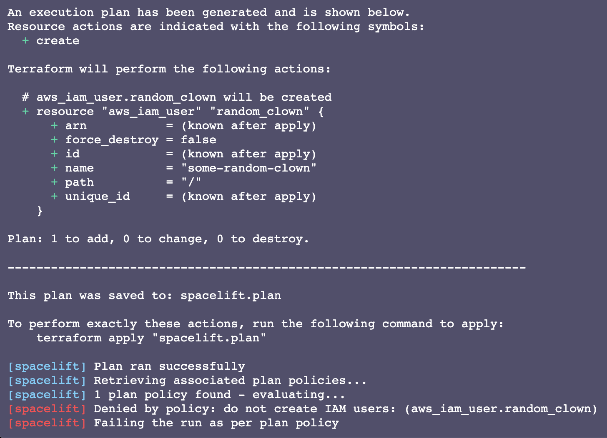
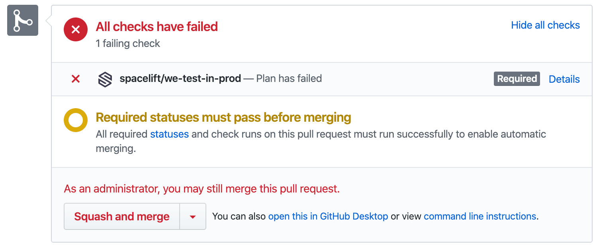
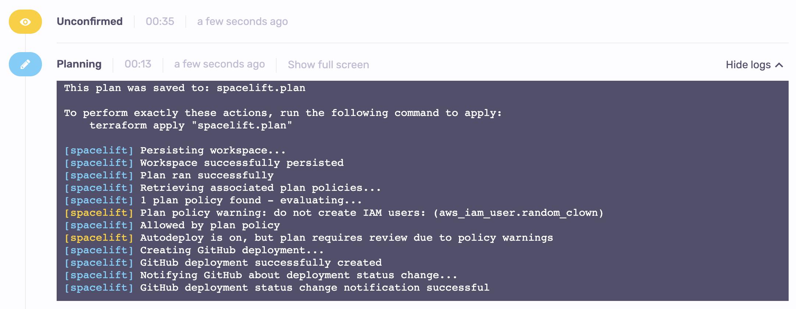

# Plan policy

## Purpose

Plan policies are evaluated during a planning phase after vendor-specific change preview command (eg. `terraform plan`) executes successfully. The body of the change is exported to JSON and parts of it are combined with Spacelift metadata to form the data input to the policy.

Plan policies are the only ones that have access to the actual changes to the managed resources, so this is probably the best place to enforce organizational rules and best practices as well as do automated code review. There are two types of rules here that Spacelift will care about: **deny** and **warn**. Each of them must come with an appropriate message that will be shown in the logs. Any **deny** rules will print in red and will automatically fail the run, while **warn** rules will print in yellow and will at most mark the run for human review if the change affects the tracked branch and the Stack is set to [autodeploy](../stack/README.md#autodeploy).

Here is a super simple policy that will show both types of rules in action:

```opa
package spacelift

deny["you shall not pass"] {
  true # true means "match everything"
}

warn["hey, you look suspicious"] {
  true
}

```

Let's create this policy, attach it to a Stack and take it for a spin by [triggering a run](../run/tracked.md#triggering-manually):


Yay, that works (and it fails our plan, too), but it's not terribly useful - unless of course you want to block all changes to your Stack in a really clumsy way. Let's look a bit deeper into the [document](terraform-plan-policy.md#data-input) that each plan policy receives, two possible [use cases](terraform-plan-policy.md#use-cases) - [rule enforcement](terraform-plan-policy.md#organizational-rule-enforcement) and [automated code review](terraform-plan-policy.md#automated-code-review) - and some [cookbook examples](terraform-plan-policy.md#cookbook).

## Data input

This is the schema of the data input that each policy request will receive.
If the policy is executed for the first time, the `previous_run` field will be missing.

!!! tip "Official Schema Reference"
    For the most up-to-date and complete schema definition, please refer to the [official Spacelift policy contract schema](https://app.spacelift.io/.well-known/policy-contract.json){: rel="nofollow"} under the `PLAN` policy type.

```json
{
  "spacelift": {
    "commit": {
      "author": "string - GitHub login if available, name otherwise",
      "branch": "string - branch to which the commit was pushed",
      "created_at": "number  - creation Unix timestamp in nanoseconds",
      "hash": "string - the commit hash",
      "message": "string - commit message"
    },
    "request": {
      "timestamp_ns": "number - current Unix timestamp in nanoseconds"
    },
    "previous_run": {
      "based_on_local_workspace": "boolean - whether the run stems from a local preview",
      "branch": "string - the branch the run was triggered from",
      "changes": [
        {
          "action": "string enum - added | changed | deleted",
          "entity": {
            "address": "string - full address of the entity",
            "name": "string - name of the entity",
            "type": "string - full resource type or \"output\" for outputs",
            "entity_vendor": "string - the name of the vendor",
            "entity_type": "string - the type of entity, possible values depend on the vendor",
            "data": "object - detailed information about the entity, shape depends on the vendor and type"
          },
          "phase": "string enum - plan | apply"
        }
      ],
      "commit": {
        "author": "string - GitHub login if available, name otherwise",
        "branch": "string - branch to which the commit was pushed",
        "created_at": "number  - creation Unix timestamp in nanoseconds",
        "hash": "string - the commit hash",
        "message": "string - commit message"
      },
      "created_at": "number - creation Unix timestamp in nanoseconds",
      "drift_detection": "boolean - is this a drift detection run",
      "flags" : ["string - list of flags set on the run by other policies" ],
      "id": "string - the run ID",
      "runtime_config": {
        "before_init": ["string - command to run before run initialization"],
        "project_root": "string - root of the Terraform project",
        "runner_image": "string - Docker image used to execute the run",
        "terraform_version": "string - Terraform version used to for the run"
      },
      "state": "string - the current run state",
      "triggered_by": "string or null - user or trigger policy who triggered the run, if applicable",
      "type": "string - type of the run",
      "updated_at": "number - last update Unix timestamp in nanoseconds",
      "user_provided_metadata": [
        "string - blobs of metadata provided using spacectl or the API when interacting with this run"
      ]
    },
    "run": {
      "based_on_local_workspace": "boolean - whether the run stems from a local preview",
      "branch": "string - the branch the run was triggered from",
      "changes": [
        {
          "action": "string enum - added | changed | deleted",
          "entity": {
            "address": "string - full address of the entity",
            "name": "string - name of the entity",
            "type": "string - full resource type or \"output\" for outputs",
            "entity_vendor": "string - the name of the vendor",
            "entity_type": "string - the type of entity, possible values depend on the vendor",
            "data": "object - detailed information about the entity, shape depends on the vendor and type"
          },
          "phase": "string enum - plan | apply"
        }
      ],
      "commit": {
        "author": "string - GitHub login if available, name otherwise",
        "branch": "string - branch to which the commit was pushed",
        "created_at": "number  - creation Unix timestamp in nanoseconds",
        "hash": "string - the commit hash",
        "message": "string - commit message"
      },
      "created_at": "number - creation Unix timestamp in nanoseconds",
      "drift_detection": "boolean - is this a drift detection run",
      "flags" : ["string - list of flags set on the run by other policies" ],
      "id": "string - the run ID",
      "runtime_config": {
        "before_init": ["string - command to run before run initialization"],
        "project_root": "string - root of the Terraform project",
        "runner_image": "string - Docker image used to execute the run",
        "terraform_version": "string - Terraform version used to for the run"
      },
      "state": "string - the current run state",
      "triggered_by": "string or null - user or trigger policy who triggered the run, if applicable",
      "type": "string - type of the run",
      "updated_at": "number - last update Unix timestamp in nanoseconds",
      "user_provided_metadata": [
        "string - blobs of metadata provided using spacectl or the API when interacting with this run"
      ]
    },
    "stack": {
      "administrative": "boolean - is the stack administrative",
      "autodeploy": "boolean - is the stack currently set to autodeploy",
      "branch": "string - tracked branch of the stack",
      "labels": ["string - list of arbitrary, user-defined selectors"],
      "name": "string - name of the stack",
      "repository": "string - name of the source GitHub repository",
      "state": "string - current state of the stack",
      "terraform_version": "string or null - last Terraform version used to apply changes",
      "tracked_commit": {
        "author": "string - GitHub login if available, name otherwise",
        "branch": "string - branch to which the commit was pushed",
        "created_at": "number  - creation Unix timestamp in nanoseconds",
        "hash": "string - the commit hash",
        "message": "string - commit message"
      },
      "worker_pool": {
        "id": "string - the worker pool ID, if it is private",
        "labels": ["string - list of arbitrary, user-defined selectors, if the worker pool is private"],
        "name": "string - name of the worker pool, if it is private",
        "public": "boolean - is the worker pool public"
      }
    }
  },
  "terraform": {
    "resource_changes": [
      {
        "address": "string - full address of the resource, including modules",
        "type": "string - type of the resource, eg. aws_iam_user",
        "locked_by": "optional string - if the stack is locked, this is the name of the user who did it",
        "name": "string - name of the resource, without type",
        "namespace": "string - repository namespace, only relevant to GitLab repositories",
        "project_root": "optional string - project root as set on the Stack, if any",
        "provider_name": "string - provider managing the resource, eg. aws",
        "change": {
          "actions": ["string - create, update, delete or no-op"],
          "before": "optional object - content of the resource",
          "after": "optional object - content of the resource"
        }
      }
    ],
    "terraform_version": "string"
  }
}
```

### Aliases

In addition to our [helper functions](./README.md#helper-functions), we provide aliases for commonly used parts of the input data:

| Alias                 | Description |
|-----------------------|-------------|
| `affected_resources`  | List of the resources that will be created, deleted, and updated by Terraform |
| `created_resources`   | List of the resources that will be created by Terraform |
| `deleted_resources`   | List of the resources that will be deleted by Terraform |
| `recreated_resources` | List of the resources that will be deleted and then created by Terraform |
| `updated_resources`   | List of the resources that will be updated by Terraform |

## String Sanitization

Sensitive properties in `"before"` and `"after"` objects will be sanitized to protect secret values. Sanitization hashes the value with the sha256 algorithm and takes the last 8 bytes of the hash.

If you need to compare a string property to a constant, you can use the `sanitized(string)` helper function.

```opa
package spacelift

deny["must not target the forbidden endpoint: forbidden.endpoint/webhook"] {
  resource := input.terraform.resource_changes[_]

  actions := {"create", "delete", "update"}
  actions[resource.change.actions[_]]

  resource.change.after.endpoint == sanitized("forbidden.endpoint/webhook")
}
```

## Custom inputs

Sometimes you might want to pass some additional data to your policy input. For example, you may want to pass the `configuration` data from the OpenTofu/Terraform plan, the result of a third-party API or tool call. You can do that by generating a JSON file with the data you need at the root of your project. The file name must follow the pattern `$key.custom.spacelift.json` and must represent a valid JSON _object_. The object will be merged with the rest of the input data, as `input.third_party_metadata.custom.$key`. Be aware that the file name is case-sensitive. Below are two examples, one exposing OpenTofu/Terraform configuration and the other exposing the result of a third-party security tool.

!!! Tip
    To learn more about integrating security tools with Spacelift using custom inputs, please refer to our [blog post](https://spacelift.io/blog/integrating-security-tools-with-spacelift){: rel="nofollow"}.

### Example: exposing OpenTofu/Terraform configuration to the plan policy

Let's say you want to expose the OpenTofu/Terraform configuration to the plan policy to ensure that only the "blessed" modules are used to provision resources. You would then add the following command to the list of [`after_plan` hooks](../stack/stack-settings.md#customizing-workflow):

```bash
terraform show -json spacelift.plan | jq -c '.configuration' > configuration.custom.spacelift.json
```

The data will be available in the policy input as `input.third_party_metadata.custom.configuration`. Note that this depends on the `jq` tool being available in the runner image (it is installed by default on our standard image).

### Example: passing custom tool output to the plan policy

For this example, let's use the awesome open-source OpenTofu/Terraform security scanner called [_tfsec_](https://github.com/aquasecurity/tfsec){: rel="nofollow"}. What you want to accomplish is to generate `tfsec` warnings as JSON and have them reported and processed using the plan policy. In this case, you can run `tfsec` as a [`before_init` hook](../stack/stack-settings.md#customizing-workflow) and save the output to a file:

```bash
tfsec -s --format=json . > tfsec.custom.spacelift.json
```

The data will be available in the policy input as `input.third_party_metadata.custom.tfsec`. Note that this depends on the `tfsec` tool being available in the runner image - you will need to install it yourself, either directly on the image, or as part of your `before_init` hook.

Some vulnerability scanning tools, like tfsec, will return a non-zero exit code when they encounter vulnerabilities, which will result in a stack failure. As the majority of these tools provide a soft scanning option that will show all the vulnerabilities without considering the command as failed, we can leverage those.

However, if there is a tool that doesn't offer that possibility, you can easily overcome this by appending `|| true` at the end of the command as this will always return a zero exit code.

## Use cases

Since plan policies get access to the changes to your infrastructure that are about to be introduced, they are the right place to run all sorts of checks against those changes. We believe that there are two main use cases for those checks - [hard rule enforcement](terraform-plan-policy.md#organizational-rule-enforcement) preventing shooting yourself in the foot and [automated code review](terraform-plan-policy.md#automated-code-review) that augments human decision-making.

### Organizational rule enforcement

In every organization, there are things you just don't do. Hard-won knowledge embodied by lengthy comments explaining that if you touch this particular line the site will go hard down and the on-call folks will be after you. Potential security vulnerabilities that can expose all your infra to the wrong crowd. Spacelift allows turning them into policies that simply can't be broken. In this case, you will most likely want to exclusively use **deny** rules.

Let's start by introducing a very simple and reasonable rule - never create static AWS credentials:

```opa
package spacelift

# Note that the message here is dynamic and captures resource address to provide
# appropriate context to anyone affected by this policy. For the sake of your
# sanity and that of your colleagues, please always add a message when denying a change.
deny[sprintf(message, [resource.address])] {
  message := "static AWS credentials are evil (%s)"

  resource := input.terraform.resource_changes[_]
  resource.change.actions[_] == "create"

  # This is what decides whether the rule captures a resource.
  # There may be an arbitrary number of conditions, and they all must
  # succeed for the rule to take effect.
  resource.type == "aws_iam_access_key"
}
```

Here's a minimal example of this rule in the [Rego playground](https://play.openpolicyagent.org/p/kNUYOa4vX4){: rel="nofollow"}.

If that makes sense, let's try defining a policy that implements a slightly more sophisticated piece of knowledge - that when some resources are recreated, they should be [created before they're destroyed](https://developer.hashicorp.com/terraform/language/meta-arguments/lifecycle#create_before_destroy){: rel="nofollow"} or an outage will follow. We found that to be the case with the [`aws_batch_compute_environment`](https://www.terraform.io/docs/providers/aws/r/batch_compute_environment.html){: rel="nofollow"}, among others. So here it is:

```opa
package spacelift

# This is what Rego calls a set. You can add further elements to it as necessary.
always_create_first := { "aws_batch_compute_environment" }

deny[sprintf(message, [resource.address])] {
  message  := "always create before deleting (%s)"
  resource := input.terraform.resource_changes[_]

  # Make sure the type is on the list.
  always_create_first[resource.type]

  some i_create, i_delete
  resource.change.actions[i_create] == "create"
  resource.change.actions[i_delete] == "delete"


  i_delete < i_create
}
```

Here's the obligatory [Rego playground example](https://play.openpolicyagent.org/p/9XaB9PDHez){: rel="nofollow"}.

While in most cases you'll want your rules to only look at resources affected by the change, you're not limited to doing so. You can also look at all resources and force teams to remove certain resources. Here's an example - until all AWS resources are removed all in one go, no further changes can take place:

```opa
package spacelift

deny[sprintf(message, [resource.address])] {
  message  := "we've moved to GCP, find an equivalent there (%s)"
  resource := input.terraform.resource_changes[_]

  resource.provider_name == "aws"

  # If you're just deleting, all good.
  resource.change.actions != ["delete"]
}
```

Feel free to play with a minimal example of this policy in [the Rego playground](https://play.openpolicyagent.org/p/LUokYD0NoU){: rel="nofollow"}.

### Automated code review

OK, so rule enforcement is very powerful, sometimes you want something more sophisticated. Instead of (or in addition to) enforcing hard rules, you can use plan policy rules to help humans understand changes better, and make informed decisions what looks good and what does not. This time we'll be adding more color to our policies and start using **warn** rules in addition to **deny** ones we've already seen in action.

You've already seen **warn** rules in the [first section of this article](terraform-plan-policy.md#purpose) but here it is in action again:

.png>)

It won't fail your plan and it looks relatively benign, but this little yellow note can provide great help to a human reviewer, especially when multiple changes are introduced. Also, if a stack is set to [autodeploy](../stack/README.md#autodeploy), the presence of a single warning is enough to flag the run for a human review.

The best way to use warn and deny rules together depends on your preferred Git workflow. We've found short-lived feature branches with Pull Requests to the tracked branch to work relatively well. In this scenario, the `type` of the `run` is important - it's _PROPOSED_ for commits to feature branches, and _TRACKED_ on commits to the tracked branch. You will probably want at least some of your rules to take that into account and use this mechanism to balance comprehensive feedback on Pull Requests and flexibility of being able to deploy things that humans deem appropriate.

As a general rule when using plan policies for code review, **deny** when run type is _PROPOSED_ and **warn** when it is _TRACKED_. Denying tracked runs unconditionally may be a good idea for most egregious violations for which you will not consider an exception, but when this approach is taken to an extreme it can make your life difficult.

We thus suggest that you _at most_ **deny** when the run is _PROPOSED_, which will send a failure status to the GitHub commit, but will give the reviewer a chance to approve the change nevertheless. If you want a human to take another look before those changes go live, either set [stack autodeploy](../stack/README.md#autodeploy) to _false_, or explicitly **warn** about potential violations. Here's an example of how to reuse the same rule to **deny** or **warn** depending on the run type:

```opa
package spacelift

proposed := input.spacelift.run.type == "PROPOSED"

deny[reason] { proposed; reason := iam_user_created[_] }
warn[reason] { not proposed; reason := iam_user_created[_] }

iam_user_created[sprintf("do not create IAM users: (%s)", [resource.address])] {
  resource := input.terraform.resource_changes[_]
  resource.change.actions[_] == "create"

  resource.type == "aws_iam_user"
}
```

Predictably, this fails when committed to a non-tracked (feature) branch:



...but as a GitHub repo admin you can still merge it if you've set your branch protection rules accordingly:



Cool, let's merge it and see what happens:



Cool, so the run stopped in its tracks and awaits human decision. At this point we still have a choice to either [confirm](../run/README.md#discarded) or [discard](../run/README.md#discarded) the run. In the latter case, you will likely want to revert the commit that caused the problem - otherwise all subsequent runs will be affected.

The minimal example for the above rule is available in the [Rego playground](https://play.openpolicyagent.org/p/IpwP5nWB6f){: rel="nofollow"}.

## Examples

!!! tip
    We maintain a [library of example policies](https://github.com/spacelift-io/spacelift-policies-example-library/tree/main/examples/plan){: rel="nofollow"} that are ready to use or that you could tweak to meet your specific needs.

    If you cannot find what you are looking for below or in the library, please reach out to [our support](../../product/support/README.md#contact-support) and we will craft a policy to do exactly what you need.

### Require human review when resources are deleted or updated

Adding resources may ultimately cost a lot of money but it's generally pretty safe from an operational perspective. Let's use a `warn` rule to allow changes with only added resources to get automatically applied, and require all others to get a human review:

```opa
package spacelift

warn[sprintf(message, [action, resource.address])] {
  message := "action '%s' requires human review (%s)"
  review  := {"update", "delete"}

  resource := input.terraform.resource_changes[_]
  action   := resource.change.actions[_]

  review[action]
}
```

[Here's](https://play.openpolicyagent.org/p/w1RIAu6RgG){: rel="nofollow"} a minimal example to play with.

### Automatically deploy changes from selected individuals

Sometimes there are folks who really know what they're doing and changes they introduce can get deployed automatically, especially if they already went through code review. Below is an example that allows commits from whitelisted individuals to be deployed automatically (assumes Stack is set to [autodeploy](../stack/README.md#autodeploy)):

```opa
package spacelift

warn[sprintf(message, [author])] {
  message     := "%s is not on the whitelist - human review required"
  author      := input.spacelift.commit.author
  whitelisted := { "alice", "bob", "charlie" }

  not whitelisted[author]
}
```

Here's the [playground example](https://play.openpolicyagent.org/p/IW8EfP7rwj){: rel="nofollow"} for your enjoyment.

### Require commits to be reasonably sized

Massive changes make reviewers miserable. Let's automatically fail all changes that affect more than 50 resources. Let's also allow them to be deployed with mandatory human review nevertheless:

```opa
package spacelift

proposed := input.spacelift.run.type == "PROPOSED"

deny[msg] { proposed; msg := too_many_changes[_] }
warn[msg] { not proposed; msg := too_many_changes[_] }

too_many_changes[msg] {
  threshold := 50

  res := input.terraform.resource_changes
  ret := count([r | r := res[_]; r.change.actions != ["no-op"]])
  msg := sprintf("more than %d changes (%d)", [threshold, ret])

  ret > threshold
}
```

Here's the above example in the [Rego playground](https://play.openpolicyagent.org/p/fhLBskzd13){: rel="nofollow"}, with the threshold set to 1 for simplicity.

### Back-of-the-envelope blast radius

This is a fancy contrived example building on top of the previous one. However, rather than just looking at the total number of affected resources, it attempts to create a metric called a "blast radius" - that is how much the change will affect the whole stack. It assigns special multipliers to some types of resources changed and treats different types of changes differently: deletes and updates are more "expensive" because they affect live resources, while new resources are generally safer and thus "cheaper". As per our [automated code review](terraform-plan-policy.md#automated-code-review) pattern, we will fail Pull Requests with changes violating this policy, but require human action through **warnings** when these changes hit the tracked branch.

```opa
package spacelift

proposed := input.spacelift.run.type == "PROPOSED"

deny[msg] { proposed; msg := blast_radius_too_high[_] }
warn[msg] { not proposed; msg := blast_radius_too_high[_] }

blast_radius_too_high[sprintf("change blast radius too high (%d/100)", [blast_radius])] {
  blast_radius := sum([blast |
                        resource := input.terraform.resource_changes[_];
                        blast := blast_radius_for_resource(resource)])

  blast_radius > 100
}

blast_radius_for_resource(resource) = ret {
  blasts_radii_by_action := { "delete": 10, "update": 5, "create": 1, "no-op": 0 }

    ret := sum([value | action := resource.change.actions[_]
                    action_impact := blasts_radii_by_action[action]
                    type_impact := blast_radius_for_type(resource.type)
                    value := action_impact * type_impact])
}

# Let's give some types of resources special blast multipliers.
blasts_radii_by_type := { "aws_ecs_cluster": 20, "aws_ecs_user": 10, "aws_ecs_role": 5 }

# By default, blast radius has a value of 1.
blast_radius_for_type(type) = 1 {
    not blasts_radii_by_type[type]
}

blast_radius_for_type(type) = ret {
    blasts_radii_by_type[type] = ret
}
```

You can play with a minimal example of this policy in [The Rego Playground](https://play.openpolicyagent.org/p/8pzR7jHAWU){: rel="nofollow"}.

### Cost management

Thanks to our Infracost integration, [you can take cost information into account](../../vendors/terraform/infracost.md#plan-policies) when deciding whether to ask for human approval or to block changes entirely.
