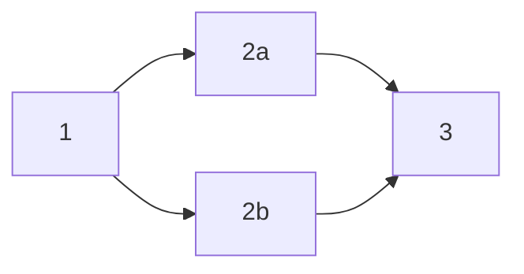

# Trigger policy

## Purpose

Frequently, your infrastructure consists of a number of projects ([stacks](../stack/README.md) in Spacelift parlance) that are connected in some way - either depend logically on one another, or must be deployed in a particular order for some other reason - for example, a rolling deploy in multiple regions.

Enter trigger policies. Trigger policies are evaluated at the end of each stack-blocking run (which includes [tracked runs](../run/tracked.md) and [tasks](../run/task.md)) as well as on module version releases and allow you to decide if some tracked Runs should be triggered. This is a very powerful feature, effectively turning Spacelift into a Turing machine.

!!! warning
    Note that in order to support various use cases this policy type is currently evaluated every time a blocking Run reaches a **terminal state**, which includes states like [Canceled](../run/README.md#canceled), [Discarded](../run/tracked.md#discarded), [Stopped](../run/README.md#stopping-runs) or [Failed](../run/README.md#failed) in addition to the more obvious [Finished](../run/README.md#finished). This allows for very interesting and complex workflows (eg. automated retry logic) but please be aware of that when writing your own policies.

All runs triggered - directly or indirectly - by trigger policies as a result of the same initial run are grouped into a so-called workflow. In the trigger policy you can access all other runs in the same workflow as the currently finished run, regardless of their Stack. This lets you coordinate executions of multiple Stacks and build workflows which require multiple runs to finish in order to commence to the next stage (and trigger another Stack).

## Data input

When triggered by a _run_, this is the schema of the data input that each policy request will receive:

```json
{
  "run": { // the run metadata
    "based_on_local_workspace": "boolean - whether the run stems from a local preview",
    "branch": "string - the branch the run was triggered from",
    "changes": [
      {
        "action": "string enum - added | changed | deleted",
        "entity": {
          "address": "string - full address of the entity",
          "name": "string - name of the entity",
          "type": "string - full resource type or \"output\" for outputs",
          "entity_vendor": "string - the name of the vendor",
          "entity_type": "string - the type of entity, possible values depend on the vendor",
          "data": "object - detailed information about the entity, shape depends on the vendor and type"
        },
        "phase": "string enum - plan | apply"
      }
    ],
    "commit": {
      "author": "string - GitHub login if available, name otherwise",
      "branch": "string - branch to which the commit was pushed",
      "created_at": "number  - creation Unix timestamp in nanoseconds",
      "hash": "string - the commit hash",
      "message": "string - commit message"
    },
    "created_at": "number - creation Unix timestamp in nanoseconds",
    "creator_session": {
      "admin": "boolean - is the current user a Spacelift admin",
      "creator_ip": "string - IP address of the user who created the session",
      "login": "string - username of the creator",
      "name": "string - full name of the creator",
      "teams": ["string - names of teams the creator was a member of"],
      "machine": "boolean - whether the run was initiated by a human or a machine"
    },
    "drift_detection": "boolean - is this a drift detection run",
    "id": "string - the run ID",
    "runtime_config": {
      "before_init": ["string - command to run before run initialization"],
      "project_root": "string - root of the Terraform project",
      "runner_image": "string - Docker image used to execute the run",
      "terraform_version": "string - Terraform version used to for the run"
    },
    "state": "string - the current run state",
    "triggered_by": "string or null - user or trigger policy who triggered the run, if applicable",
    "type": "string - type of the run",
    "updated_at": "number - last update Unix timestamp in nanoseconds",
    "user_provided_metadata": [
      "string - blobs of metadata provided using spacectl or the API when interacting with this run"
    ]
  },
  "stack": {
    "administrative": "boolean - is the stack administrative",
    "autodeploy": "boolean - is the stack currently set to autodeploy",
    "branch": "string - tracked branch of the stack",
    "id": "string - unique stack identifier",
    "labels": ["string - list of arbitrary, user-defined selectors"],
    "locked_by": "optional string - if the stack is locked, this is the name of the user who did it",
    "name": "string - name of the stack",
    "namespace": "string - repository namespace, only relevant to GitLab repositories",
    "project_root": "optional string - project root as set on the Stack, if any",
    "repository": "string - name of the source GitHub repository",
    "state": "string - current state of the stack",
    "terraform_version": "string or null - last Terraform version used to apply changes",
    "tracked_commit": {
      "author": "string - GitHub login if available, name otherwise",
      "branch": "string - branch to which the commit was pushed",
      "created_at": "number  - creation Unix timestamp in nanoseconds",
      "hash": "string - the commit hash",
      "message": "string - commit message"
    },
    "worker_pool": {
      "id": "string - the worker pool ID, if it is private",
      "labels": ["string - list of arbitrary, user-defined selectors, if the worker pool is private"],
      "name": "string - name of the worker pool, if it is private",
      "public": "boolean - is the worker pool public"
    }
  },
  "stacks": [
    {
      "administrative": "boolean - is the stack administrative",
      "autodeploy": "boolean - is the stack currently set to autodeploy",
      "branch": "string - tracked branch of the stack",
      "id": "string - unique stack identifier",
      "labels": ["string - list of arbitrary, user-defined selectors"],
      "locked_by": "optional string - if the stack is locked, this is the name of the user who did it",
      "name": "string - name of the stack",
      "namespace": "string - repository namespace, only relevant to GitLab repositories",
      "project_root": "optional string - project root as set on the Stack, if any",
      "repository": "string - name of the source GitHub repository",
      "state": "string - current state of the stack",
      "terraform_version": "string or null - last Terraform version used to apply changes",
      "tracked_commit": {
        "author": "string - GitHub login if available, name otherwise",
        "branch": "string - branch to which the commit was pushed",
        "created_at": "number  - creation Unix timestamp in nanoseconds",
        "hash": "string - the commit hash",
        "message": "string - commit message"
      },
      "worker_pool": {
        "id": "string - the worker pool ID, if it is private",
        "labels": ["string - list of arbitrary, user-defined selectors, if the worker pool is private"],
        "name": "string - name of the worker pool, if it is private",
        "public": "boolean - is the worker pool public"
      }
    }
  ],
  "workflow": [
    {
      "id": "string - Unique ID of the Run",
      "stack_id": "string - unique stack identifier",
      "state": "state - one of the states of the Run",
      "type": "string - TRACKED or TASK"
    }
  ]
}
```

!!! info
    Note the presence of two similar keys: `stack` and `stacks`. The former is the Stack that the newly finished Run belongs to. The other is a list of all Stacks in the account. The schema for both is the same.

When triggered by a _new module version_, this is the schema of the data input that each policy request will receive:

```json
{
  "module": { // Module for which the new version was released
    "id": "string - unique ID of the module",
    "administrative": "boolean - is the stack administrative",
    "branch": "string - tracked branch of the module",
    "labels": ["string - list of arbitrary, user-defined selectors"],
    "namespace": "string - repository namespace, only relevant to GitLab repositories",
    "project_root": "optional string - project root as set on the Module, if any",
    "repository": "string - name of the source repository",
    "terraform_provider": "string - name of the main Terraform provider used by the module",
    "version": { // Newly released module version
      "number": "string - semver version number",
      "created_at": "number - creation Unix timestamp in nanoseconds",
    }
  }
  "stacks": [ // List of consumers of the newest available module version
    {
      "administrative": "boolean - is the stack administrative",
      "autodeploy": "boolean - is the stack currently set to autodeploy",
      "branch": "string - tracked branch of the stack",
      "id": "string - unique stack identifier",
      "labels": ["string - list of arbitrary, user-defined selectors"],
      "locked_by": "optional string - if the stack is locked, this is the name of the user who did it",
      "name": "string - name of the stack",
      "namespace": "string - repository namespace, only relevant to GitLab repositories",
      "project_root": "optional string - project root as set on the Stack, if any",
      "repository": "string - name of the source GitHub repository",
      "state": "string - current state of the stack",
      "terraform_version": "string or null - last Terraform version used to apply changes",
      "tracked_commit": {
        "author": "string - GitHub login if available, name otherwise",
        "branch": "string - branch to which the commit was pushed",
        "created_at": "number  - creation Unix timestamp in nanoseconds",
        "hash": "string - the commit hash",
        "message": "string - commit message"
      },
      "worker_pool": {
        "id": "string - the worker pool ID, if it is private",
        "labels": ["string - list of arbitrary, user-defined selectors, if the worker pool is private"],
        "name": "string - name of the worker pool, if it is private",
        "public": "boolean - is the worker pool public"
      }
    }
  ]
}
```

## Use cases

Since trigger policies turn Spacelift into a Turing machine, you could probably use them to implement Conway's [Game of Life](https://en.wikipedia.org/wiki/Conway's_Game_of_Life){: rel="nofollow"}, but there are a few more obvious use cases. Let's have a look at two of them - interdependent Stacks and automated retries.

### Interdependent stacks

The purpose here is to create a complex workflow that spans multiple Stacks. We will want to trigger a predefined list of Stacks when a Run finishes successfully. Here's our first take:

```opa
package spacelift

trigger["stack-one"]   { finished }
trigger["stack-two"]   { finished }
trigger["stack-three"] { finished }

finished {
  input.run.state == "FINISHED"
  input.run.type == "TRACKED"
}

```

Here's a minimal example of this rule in the [Rego playground](https://play.openpolicyagent.org/p/gz547MYtfN){: rel="nofollow"}. But it's **far from ideal**. We can't be guaranteed that stacks with these IDs still exist in this account. Spacelift will handle that just fine, but you'll likely find if confusing. Also, for any new Stack that appears you will need to explicitly add it to the list. That's annoying.

We can do better, and to do that, we'll use Stack [labels](../stack/README.md#labels). Labels are completely arbitrary strings that you can attach to individual Stacks, and we can use them to do something magical - have "client" Stacks "subscribe" to "parent" ones.

So how's that:

```opa
package spacelift

trigger[stack.id] {
  stack := input.stacks[_]
  input.run.state == "FINISHED"
  input.run.type == "TRACKED"
  stack.labels[_] == concat("", ["depends-on:", input.stack.id])
}
```

Here's a minimal example of this rule in the [Rego playground](https://play.openpolicyagent.org/p/2fFcGNXycg){: rel="nofollow"}. The benefit of this policy is that you can attach it to all your stacks, and it will just work for your entire organization.

Can we do better? Sure, we can even have stacks use labels to decide which types of runs or state changes they care about. Here's a mind-bending example:

```opa
package spacelift

trigger[stack.id] {
  stack := input.stacks[_]
  input.run.type == "TRACKED"
  stack.labels[_] == concat("", [
    "depends-on:", input.stack.id,
    "|state:", input.run.state],
  )
}
```

[Another Rego example to play with](https://play.openpolicyagent.org/p/R35tO7nvCB){: rel="nofollow"}. Now, how cool is that?

### Automated retries

Here's another use case - sometimes Terraform or Pulumi deployments fail for a reason that has nothing to do with the code - think eventual consistency between various cloud subsystems, transient API errors etc. It would be great if you could restart the failed run. Oh, and let's make sure new runs are not created in a crazy loop - since policy-triggered runs trigger another policy evaluation:

```opa
package spacelift

trigger[stack.id] {
  stack := input.stack
  input.run.state == "FAILED"
  input.run.type == "TRACKED"
  is_null(input.run.triggered_by)
}
```

!!! info
    Note that this will also prevent user-triggered runs from being retried. Which is usually what you want in the first place, because a triggering human is probably already babysitting the Stack anyway.

### Diamond Problem

The diamond problem happens when your stacks and their dependencies form a shape like in the following diagram:



Which means that Stack 1 triggers both Stack 2a and 2b, and we only want to trigger Stack 3 when both predecessors finish. This can be elegantly solved using workflows.

First we'll have to create a trigger policy for Stack 1:

```opa
package spacelift

trigger["stack-2a"] {
  tracked_and_finished
}

trigger["stack-2b"] {
  tracked_and_finished
}

tracked_and_finished {
  input.run.state == "FINISHED"
  input.run.type == "TRACKED"
}
```

This will trigger both Stack 2a and 2b whenever a run finishes on Stack 1.

Now onto a trigger policy for Stack 2a and 2b:

```opa
package spacelift

trigger["stack-3"] {
  run_a := input.workflow[_]
  run_b := input.workflow[_]
  run_a.stack_id == "stack-2a"
  run_b.stack_id == "stack-2b"
  run_a.state == "FINISHED"
  run_b.state == "FINISHED"
}
```

Here we trigger Stack 3, whenever the runs in Stack 2a and 2b are both finished.

You can also easily extend this to work with a label-based approach, so that you could define Stack 3's dependencies by attaching a `depends-on:stack-2a,stack-2b`label to it:

```opa
package spacelift

# Helper with stack_id's of workflow runs which have already finished.
already_finished[run.stack_id] {
  run := input.workflow[_]
  run.state == "FINISHED"
}

trigger[stack.id] {
  input.run.state == "FINISHED"
  input.run.type == "TRACKED"

  # For each Stack which has a depends-on label,
  # get a list of its dependencies.
  stack := input.stacks[_]
  label := stack.labels[_]
  startswith(label, "depends-on:")
  dependencies := split(trim_prefix(label, "depends-on:"), ",")

  # The current Stack is one of the dependencies.
  input.stack.id == dependencies[_]

  finished_dependencies := [dependency |
                                       dependency := dependencies[_]
                                       already_finished[dependency]]

  # Check if all dependencies have finished.
  count(finished_dependencies) == count(dependencies)
}
```

### Module updates

Trigger policies can be attached to modules as well. Modules track the consumers of each of their versions. When a new module version is released, the consumers of the previously newest version are assumed to be potential consumers of the newly released one. Hence, the trigger policy for a module can be used to trigger a run on all of these stacks. The module version will be updated as long as the version constraints allow the newest version to be used.

Here is a simple trigger policy that will trigger a run on all stacks that use the latest version of the module when a new version is released:

```opa
package spacelift

trigger[stack.id] { stack := input.stacks[_] }
```
