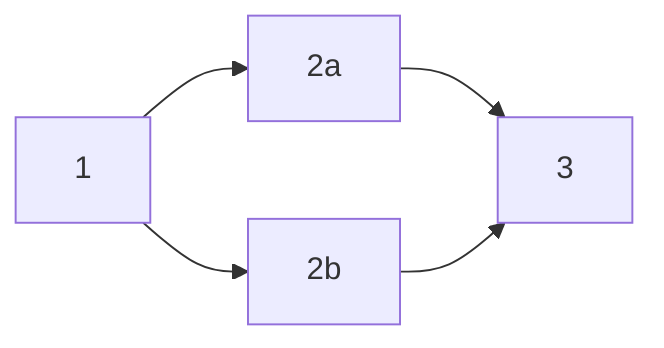

# Trigger policy

!!! tip
    While trigger policies are still available, [stack dependencies](../stack/stack-dependencies.md) are a simpler, more intuitive way to define dependencies between stacks.

Often, infrastructure consists of a number of interconnected projects (which we call [stacks](../stack/README.md)). Some projects depend logically on one another, and others must be deployed in a particular order (for example, a rolling deploy in multiple regions).

Trigger policies allow you to decide if some tracked runs should be triggered. They are evaluated every time a stack-blocking run (which includes [tracked runs](../run/tracked.md) and [tasks](../run/task.md)) reaches a **terminal state**. This allows for very interesting and complex workflows (e.g. automated retry logic). Terminal states include:

- [Finished](../run/README.md#finished)
- [Canceled](../run/README.md)
- [Discarded](../run/tracked.md#discarded)
- [Stopped](../run/README.md#stopping-runs)
- [Failed](../run/README.md#failed)

Workflows contain one initial run and all other runs triggered directly or indirectly by the initial run. In the trigger policy, you can access all runs in the same workflow as the currently finished run, regardless of their stack. This lets you coordinate executions of multiple stacks and build workflows that require multiple runs to finish to begin the next stage (and trigger another stack).

## Data input schema

### Triggered by run

When triggered by a _run_, each policy request will receive this data input schema:

!!! tip "Official Schema Reference"
    For the most up-to-date and complete schema definition, refer to the [official Spacelift policy contract schema](https://app.spacelift.io/.well-known/policy-contract.json){: rel="nofollow"} under the `TRIGGER` policy type.

```json
{
  "run": {
    "based_on_local_workspace": "boolean - whether the run stems from a local preview",
    "branch": "string - the branch the run was triggered from",
    "changes": [
      {
        "action": "string enum - added | changed | deleted",
        "entity": {
          "address": "string - full address of the entity",
          "name": "string - name of the entity",
          "type": "string - full resource type or 'output' for outputs",
          "entity_vendor": "string - the name of the vendor",
          "entity_type": "string - the type of entity, possible values depend on the vendor",
          "data": "object - detailed information about the entity, shape depends on the vendor and type"
        },
        "phase": "string enum - plan | apply"
      }
    ],
    "commit": {
      "author": "string - GitHub login if available, name otherwise",
      "branch": "string - branch to which the commit was pushed",
      "created_at": "number - creation Unix timestamp in nanoseconds",
      "hash": "string - the commit hash",
      "message": "string - commit message"
    },
    "created_at": "number - creation Unix timestamp in nanoseconds",
    "creator_session": {
      "admin": "boolean - is the current user a Spacelift admin",
      "creator_ip": "string - IP address of the user who created the session",
      "login": "string - username of the creator",
      "name": "string - full name of the creator",
      "teams": ["string - names of teams the creator was a member of"],
      "machine": "boolean - whether the run was initiated by a human or a machine"
    },
    "drift_detection": "boolean - is this a drift detection run",
    "flags": ["string - list of flags set on the run by other policies"],
    "id": "string - the run ID",
    "runtime_config": {
      "before_init": ["string - command to run before run initialization"],
      "project_root": "string - root of the Terraform project",
      "runner_image": "string - Docker image used to execute the run",
      "terraform_version": "string - Terraform version used for the run"
    },
    "state": "string - the current run state",
    "states_history": [
      {
        "new_state": "string - state transition that occurred"
      }
    ],
    "triggered_by": "string - user or trigger policy who triggered the run, if applicable",
    "type": "string - type of the run",
    "updated_at": "number - last update Unix timestamp in nanoseconds",
    "user_provided_metadata": [
      "string - blobs of metadata provided using spacectl or the API when interacting with this run"
    ]
  },
  "stack": {
    "administrative": "boolean - is the stack administrative",
    "autodeploy": "boolean - is the stack currently set to autodeploy",
    "branch": "string - tracked branch of the stack",
    "id": "string - unique stack identifier",
    "labels": ["string - list of arbitrary, user-defined selectors"],
    "locked_by": "optional string - if the stack is locked, this is the name of the user who did it",
    "name": "string - name of the stack",
    "namespace": "string - repository namespace, only relevant to GitLab repositories",
    "project_root": "optional string - project root as set on the Stack, if any",
    "repository": "string - name of the source GitHub repository",
    "state": "string - current state of the stack",
    "terraform_version": "string or null - last Terraform version used to apply changes",
    "tracked_commit": {
      "author": "string - GitHub login if available, name otherwise",
      "branch": "string - branch to which the commit was pushed",
      "created_at": "number - creation Unix timestamp in nanoseconds",
      "hash": "string - the commit hash",
      "message": "string - commit message"
    },
    "worker_pool": {
      "id": "string - the worker pool ID, if it is private",
      "labels": ["string - list of arbitrary, user-defined selectors, if the worker pool is private"],
      "name": "string - name of the worker pool, if it is private",
      "public": "boolean - is the worker pool public"
    }
  },
  "stacks": [
    {
      "administrative": "boolean - is the stack administrative",
      "autodeploy": "boolean - is the stack currently set to autodeploy",
      "branch": "string - tracked branch of the stack",
      "id": "string - unique stack identifier",
      "labels": ["string - list of arbitrary, user-defined selectors"],
      "locked_by": "optional string - if the stack is locked, this is the name of the user who did it",
      "name": "string - name of the stack",
      "namespace": "string - repository namespace, only relevant to GitLab repositories",
      "project_root": "optional string - project root as set on the Stack, if any",
      "repository": "string - name of the source GitHub repository",
      "state": "string - current state of the stack",
      "terraform_version": "string or null - last Terraform version used to apply changes",
      "tracked_commit": {
        "author": "string - GitHub login if available, name otherwise",
        "branch": "string - branch to which the commit was pushed",
        "created_at": "number - creation Unix timestamp in nanoseconds",
        "hash": "string - the commit hash",
        "message": "string - commit message"
      },
      "worker_pool": {
        "id": "string - the worker pool ID, if it is private",
        "labels": ["string - list of arbitrary, user-defined selectors, if the worker pool is private"],
        "name": "string - name of the worker pool, if it is private",
        "public": "boolean - is the worker pool public"
      }
    }
  ],
  "workflow": [
    {
      "id": "string - Unique ID of the Run",
      "stack_id": "string - unique stack identifier",
      "state": "state - one of the states of the Run",
      "type": "string - TRACKED or TASK"
    }
  ]
}

```

!!! info
    The schema includes two similar keys: `stack` and `stacks`.

    - `stack`: The stack that the newly finished run belongs to.
    - `stacks`: A list of all stacks in the account.

    The schema for both is the same.

### Triggered by new module version

When triggered by a _new module version_, each policy request will receive this data input schema:

```json

{
  "module": { // Module for which the new version was released
    "administrative": "boolean - is the stack administrative",
    "branch": "string - tracked branch of the module",
    "labels": ["string - list of arbitrary, user-defined selectors"],
    "current_version": "Newly released module version",
    "id": "string - unique ID of the module",
    "name": "string - name of the stack",
    "namespace": "string - repository namespace, only relevant to GitLab repositories",
    "project_root": "optional string - project root as set on the Module, if any",
    "repository": "string - name of the source GitHub repository",
    "space": {
        "id": "string",
        "labels": ["string"],
        "name": "string"
      },
    "terraform_version": "string or null - last Terraform version used to apply changes",
    "worker_pool": {
      "id": "string - the worker pool ID, if it is private",
      "labels": ["string - list of arbitrary, user-defined selectors, if the worker pool is private"],
      "name": "string - name of the worker pool, if it is private",
      "public": "boolean - is the worker pool public"
    }
  }

  "stacks": [ // List of consumers of the newest available module version
    {
      "administrative": "boolean - is the stack administrative",
      "autodeploy": "boolean - is the stack currently set to autodeploy",
      "branch": "string - tracked branch of the stack",
      "id": "string - unique stack identifier",
      "labels": ["string - list of arbitrary, user-defined selectors"],
      "locked_by": "optional string - if the stack is locked, this is the name of the user who did it",
      "name": "string - name of the stack",
      "namespace": "string - repository namespace, only relevant to GitLab repositories",
      "project_root": "optional string - project root as set on the Stack, if any",
      "repository": "string - name of the source GitHub repository",
      "state": "string - current state of the stack",
      "terraform_version": "string or null - last Terraform version used to apply changes",
      "tracked_commit": {
        "author": "string - GitHub login if available, name otherwise",
        "branch": "string - branch to which the commit was pushed",
        "created_at": "number  - creation Unix timestamp in nanoseconds",
        "hash": "string - the commit hash",
        "message": "string - commit message"
      },
      "worker_pool": {
        "id": "string - the worker pool ID, if it is private",
        "labels": ["string - list of arbitrary, user-defined selectors, if the worker pool is private"],
        "name": "string - name of the worker pool, if it is private",
        "public": "boolean - is the worker pool public"
      }
    }
  ]
}
```

## Examples

!!! tip
    We maintain a [library of example policies](https://github.com/spacelift-io/spacelift-policies-example-library/tree/main/examples/trigger){: rel="nofollow"} that are ready to use or alter to meet your specific needs.

    If you cannot find what you are looking for below or in the library, please reach out to [our support](../../product/support/README.md#contact-support) and we will craft a policy to do exactly what you need.

### Interdependent stacks

In this example use case, we'll create a complex workflow that spans multiple stacks. We want to trigger a predefined list of stacks when a run finishes successfully. Here's our first take:

```opa
package spacelift

trigger["stack-one"]   { finished }
trigger["stack-two"]   { finished }
trigger["stack-three"] { finished }

finished {
  input.run.state == "FINISHED"
  input.run.type == "TRACKED"
}
```

However, this example is not ideal. We can't be guaranteed that stacks with these IDs still exist in this account, and any new stack will need to be explicitly added to the list.

To fix those issues in the policy, we'll use stack [labels](../stack/stack-settings.md#labels). Labels are completely arbitrary strings that you can attach to individual stacks, and we can use them to have "client" stacks subscribe to "parent" ones.

```opa
package spacelift

trigger[stack.id] {
  stack := input.stacks[_]
  input.run.state == "FINISHED"
  input.run.type == "TRACKED"
  stack.labels[_] == concat("", ["depends-on:", input.stack.id])
}
```

You can attach this trigger policy to all your stacks and it will work for your entire organization.

We could even have stacks use labels to decide which types of runs or state changes they care about:

```opa
package spacelift

trigger[stack.id] {
  stack := input.stacks[_]
  input.run.type == "TRACKED"
  stack.labels[_] == concat("", [
    "depends-on:", input.stack.id,
    "|state:", input.run.state],
  )
}
```

### Automated retries

Sometimes OpenTofu/Terraform or Pulumi deployments fail for a reason that has nothing to do with the code, like eventual consistency between various cloud subsystems, transient API errors, etc. It would help if you could restart the failed run while ensuring new runs aren't created in a loop (since policy-triggered runs trigger another policy evaluation).

```opa
package spacelift

trigger[stack.id] {
  stack := input.stack
  input.run.state == "FAILED"
  input.run.type == "TRACKED"
  is_null(input.run.triggered_by)
}
```

This policy will also prevent user-triggered runs from being retried.

### Diamond problem

The diamond problem happens when your stacks and their dependencies form a shape like this:



Stack 1 triggers both Stack 2a and 2b, and we only want to trigger Stack 3 when both predecessors finish. This can be solved using workflows.

First, create a trigger policy for Stack 1:

```opa
package spacelift

trigger["stack-2a"] {
  tracked_and_finished
}

trigger["stack-2b"] {
  tracked_and_finished
}

tracked_and_finished {
  input.run.state == "FINISHED"
  input.run.type == "TRACKED"
}
```

This will trigger both Stack 2a and 2b whenever a run finishes on Stack 1.

Now, create a trigger policy for Stack 2a and 2b:

```opa
package spacelift

trigger["stack-3"] {
  run_a := input.workflow[_]
  run_b := input.workflow[_]
  run_a.stack_id == "stack-2a"
  run_b.stack_id == "stack-2b"
  run_a.state == "FINISHED"
  run_b.state == "FINISHED"
}
```

This will trigger Stack 3 whenever the runs in Stack 2a and 2b are both finished.

You can extend this with labels so you could define Stack 3's dependencies by attaching a `depends-on:stack-2a,stack-2b` label to it:

```opa
package spacelift

# Helper with stack_id's of workflow runs which have already finished.
already_finished[run.stack_id] {
  run := input.workflow[_]
  run.state == "FINISHED"
}

trigger[stack.id] {
  input.run.state == "FINISHED"
  input.run.type == "TRACKED"

  # For each Stack which has a depends-on label,
  # get a list of its dependencies.
  stack := input.stacks[_]
  label := stack.labels[_]
  startswith(label, "depends-on:")
  dependencies := split(trim_prefix(label, "depends-on:"), ",")

  # The current Stack is one of the dependencies.
  input.stack.id == dependencies[_]

  finished_dependencies := [dependency |
                                       dependency := dependencies[_]
                                       already_finished[dependency]]

  # Check if all dependencies have finished.
  count(finished_dependencies) == count(dependencies)
}
```

### Module updates

Trigger policies can be attached to modules, which track the consumers of each of their versions. When a new module version is released, the consumers of the previously newest version are assumed to be potential consumers of the newly released one. The trigger policy for a module can be used to trigger a run on all of these stacks. The module version will be updated as long as the version constraints allow the newest version to be used.

This simple policy will trigger a run on all stacks that use the latest version of the module when a new version is released:

```opa
package spacelift

trigger[stack.id] { stack := input.stacks[_] }
```

The stack would need to be have been triggered successfully (initialized) once, before the module starts tracking it. You can also combine this policy with a tag-driven module version release push policy. [Here is an example](https://github.com/spacelift-solutions/demo/blob/main/admin/policies.tf){: rel="nofollow"}.
