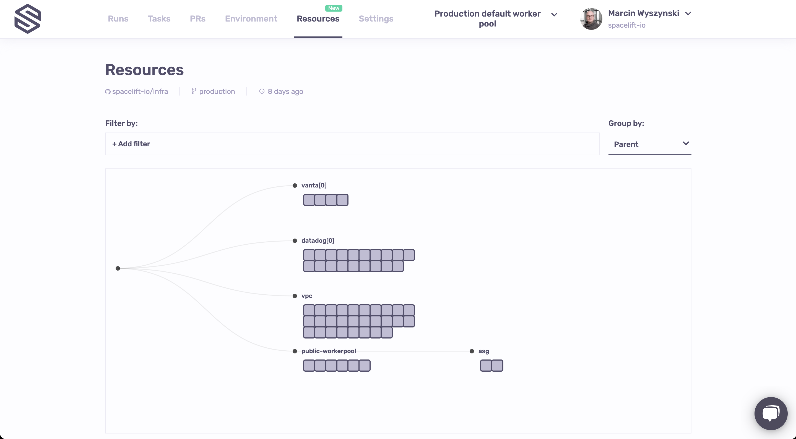
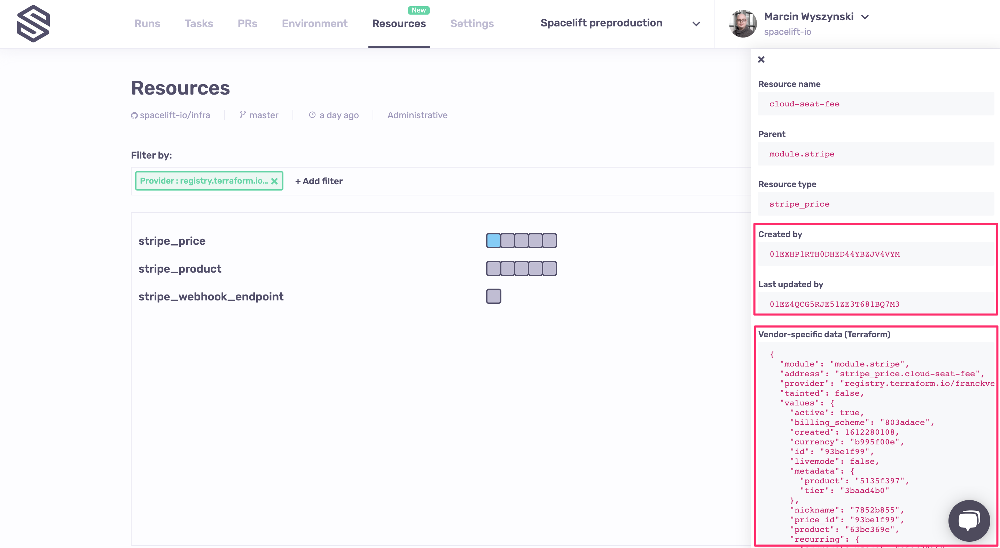
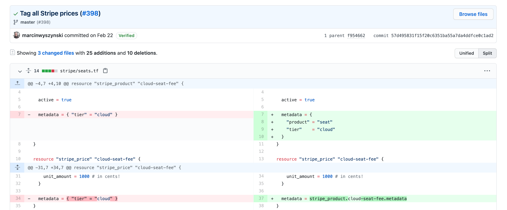
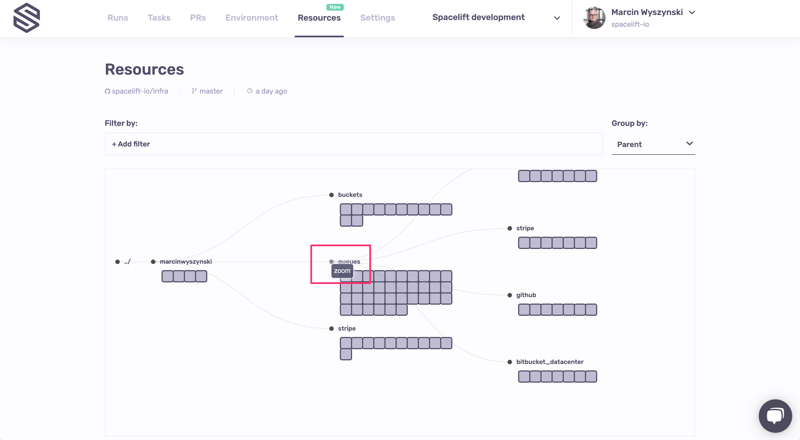
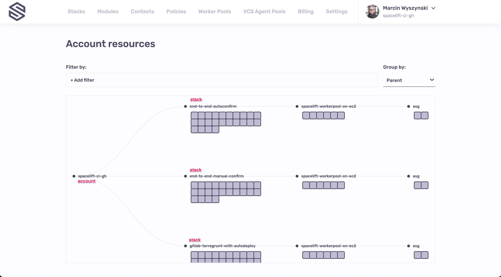
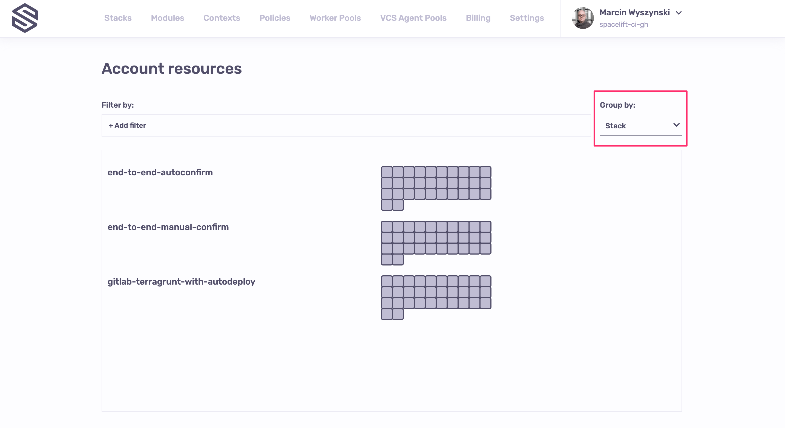

# Resources

One major benefit of specialized tools like Spacelift - as opposed to general-purpose CI/CD platforms - is that they intimately understand the material they're working with. With regards to infra-as-code, the most important part of this story is understanding your managed resources in-depth. Both from the current perspective, but also being able to put each resource in its historical context.

The Resources view is the result of multiple months of meticulous work understanding and documenting the lifecycle of each resource managed by Spacelift, regardless of the technology used - Terraform, Terragrunt, Pulumi or CloudFormation.

## Stack-level resources

This screen shows you the stack-level resources view. By default, resources are shown grouped in a hierarchical manner, grouped by parent. This allows you to see the structure of each of your infrastructure projects:

Depending on the architecture as well as technology used, your tree may look slightly different - for example, Pulumi trees are generally deeper:

.png>)

Apart from being grouped by parent, resources can be grouped provider and type. Let's group one of our small stacks by provider:

.png>)

We can see lots of AWS resources, a few from Stripe, and a lonely one from Datadog. Let's now filter just the Datadog ones, and group them by type:

.png>)

Let's now take a look at one of the resources, for example a single `stripe_price`:

The panel that is now showing on the right hand side of the Resources view shows the details of a single resource, which is now highlighted using a light blue overlay. On this panel, we see two noteworthy things.

Starting with the lower right hand corner, we have the vendor-specific representation of the resource. Note how for security purposes all string values are sanitized. In fact, we never get to see them directly - we only see first 7 characters of their checksum. If you know the possible value, you can easily do the comparison. If you don't, then the secret is safe. As a side note, we do not need to sanitize anything with Pulumi because the team there did an exceptional job with regards to secret management:

.png>)

More importantly, though, you can drill down to see the runs that either created, or last updated each of the managed resources. Let's now go back to our stripe\_price, and click on the ID of the run shown in the _Last updated by_ section. You will notice a little menu pop up:

.png>)

Clicking on this menu item will take you to the run in question:

.png>)

One extra click on the commit SHA will take you to the GitHub commit. Depending on your Git flow, the commit may be linked to a Pull Request, giving you the ultimate visibility into the infrastructure change management process:

### Navigating the resource tree

When grouping by resources parent - that is, seeing them as a tree, you can easily click into each subtree, like if you were changing your working directory. You can do this by clicking on the dot representing each node in the tree:

Once you click into the subtree, you will be able to click out by clicking on the new virtual root, as if you were running `cd ..` in your terminal:

.png>)

One important aspect about navigating the resource tree is that once you click into the subtree, you are effectively filtering by the ancestor. Which means that grouping and filtering options will now operate on a subset of resources within that subtree:

.png>)

## Account-level resources

!!! warning
    Account-level resource view is still a work in progress, so some of the UX may change frequently.

A view similar to stack-level resources is available for the entire account, too. For this presentation we will use a very _symmetrical_ account - our automated testing instance repeatedly creating and updating the same types of resources in different ways to quickly detect potential regressions:

By default we group by parent, giving you the same hierarchical view as for stack-level resources. But you will notice that there's a new common account root serving as a "virtual" parent for stacks.

In this view you can also filter and group by different properties, with one extra property being the Stack:

