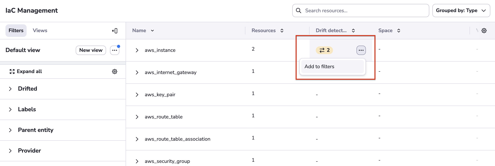

# Resources

One major benefit of specialized tools like Spacelift - as opposed to general-purpose CI/CD platforms - is that they intimately understand the material they're working with. With regards to infra-as-code, the most important part of this story is understanding your managed resources in-depth. Both from the current perspective, but also being able to put each resource in its historical context.

The Resources view is the result of multiple months of meticulous work understanding and documenting the lifecycle of each resource managed by Spacelift, regardless of the technology used - Terraform, Terragrunt, Pulumi or AWS CloudFormation.

## Stack-level resources

This screen shows you the stack-level resources view. By default, resources are grouped to help you understand the structure of each of your infrastructure projects.

Resources can be grouped by provider and type. Let's group by provider:

We can see lots of AWS resources, `random`, `null_resource`, and a one from TLS. Let's now filter just the TLS one.

Let's now take a look at this one:

The panel that is now showing on the right hand side of the Resources view shows the details of a single resource, which is now highlighted using a blue background color. On this panel, we see two noteworthy things.

Starting with the lower right hand corner, we have the vendor-specific representation of the resource. Note how for security purposes all string values are sanitized. In fact, we never get to see them directly - we only see first 7 characters of their checksum. If you know the possible value, you can easily do the comparison. If you don't, then the secret is safe.

More importantly, though, you can drill down to see the runs that either created, or last updated each of the managed resources. Let's now go back to our `tls-key`, and click on the ID of the run shown in the _Updated by_ section.
This will take you to the run in question:

One extra click on the commit SHA will take you to the GitHub commit. Depending on your Git flow, the commit may be linked to a Pull Request, giving you the ultimate visibility into the infrastructure change management process:

## Account-level resources

A view similar to stack-level resources is available for the entire account, too.

We can unfold stack resources by clicking on the arrow:

By default we group by stack, giving you the same view as for stack-level resources. But you will notice that there are more rows in the table representing different stacks.

In this view you can also filter and group by different properties.

## Shared via a link

You can share a resource via a link by clicking the icon in the top-right corner.

The other way is to click on three dots on the table row and choose the _Copy link_ option.

It's possible from both views - stack-level and account-level.

## Add to filters - cell option

On the left side, you can see the filter menu.
You can also use filters by clicking on the three dots for a column.

