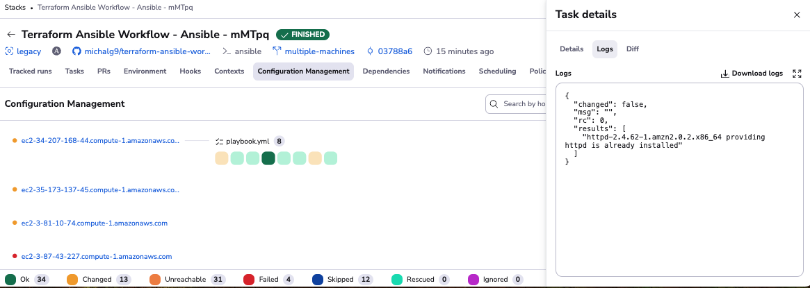
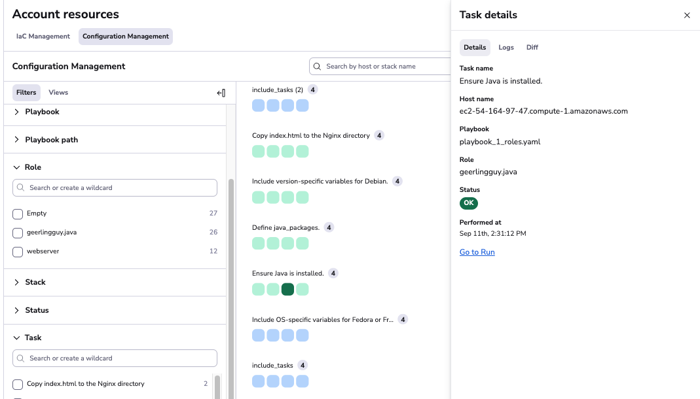
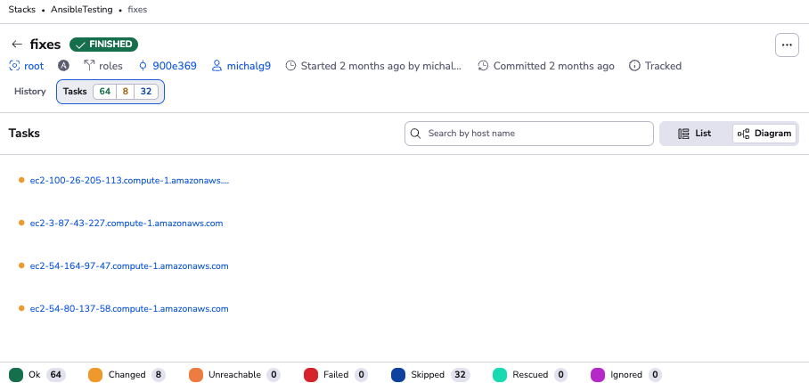

# Configuration Management

We’re excited to introduce the **Configuration Management View**, a new feature designed to enhance visibility, control, and monitoring of Ansible tasks across your stacks and runs.

This feature replaces or supplements the existing **Resources View** for Ansible stacks, offering a more focused way to monitor the last status of each item in your Ansible inventory. Below is an overview of the updates and functionality:

## Where You’ll Find It

### Stack View

The Configuration Management View is available in the Stack View, replacing the Resources View for Ansible stacks.

!!! Info
    Since the new changes replace _Resources View_ you will not be able to see _Resources View_ in Ansible stacks by default. If you'd like to see it (e.g. because you have some historical resources you want to investigate there), you can toggle between the _Configuration Management View_ and the previous _Resources View_ using the “Enable configuration management view” toggle.

### Resources View

The Configuration Management View is also added as a separate tab in the Resources View.

### Run View

The Tasks Tab in the Run View provides detailed visibility into Ansible task execution during a run.

## Key Features

### Task Monitoring

- View the last status of every item in your Ansible inventory, showing the outcome of the most recent run.
- Navigate seamlessly through tasks to analyze their status, logs, and execution details.

### Enhanced Run List View

- The updated run list now includes Ansible statuses, providing immediate insights without diving into individual runs.

### Detailed Logs in Task Details

Access detailed logs for task execution in the task details tab to diagnose and debug issues efficiently.

## Why Use the Configuration Management View?

- Increase Visibility: Unified workflows for all tools, including Terraform, OpenTofu, and Ansible.
- Encourage Automation: Seamlessly integrate infrastructure control and configuration management with stack dependencies.
- Improve Audit Capabilities: Collect, analyze, and filter data from execution logs.
- Understand Tasks Intuitively: Visualize and filter tasks with ease.
