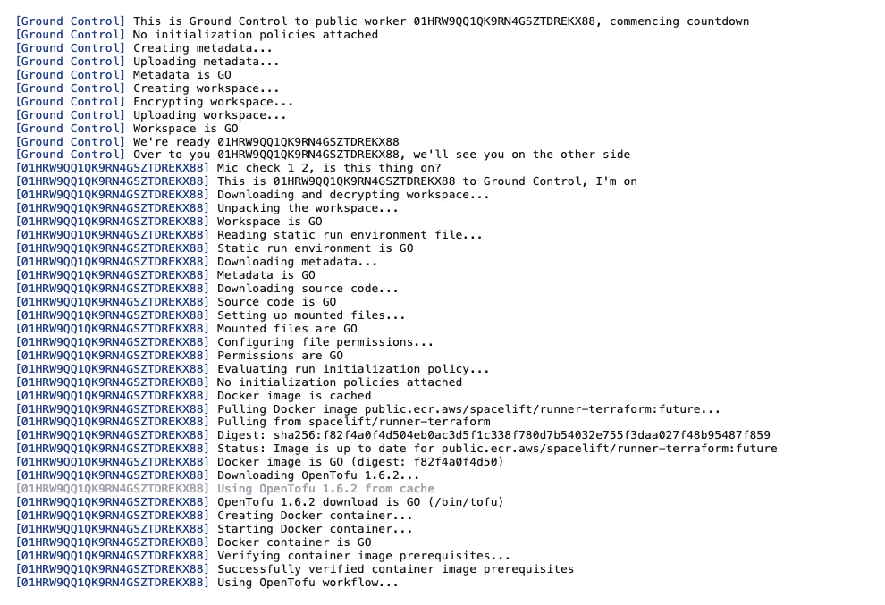

# Run

Every job that can touch your Spacelift-managed infrastructure is called a Run. There are four main types of runs, and each of them warrants a separate section.

Three of them are children of [Stacks](../stack/README.md):

- [task](task.md), which is a freeform command you can execute on your infrastructure;
- [proposed run](proposed.md), which serves as a preview of introduced changes;
- [tracked run](tracked.md), which is a form of deployment;

There's also a fourth type of run - [module test case](test-case.md). Very similar to a tracked run, it's executed on an OpenTofu/Terraform module.

## Execution model

In Spacelift, each run is executed on a worker node, inside a Docker container. We maintain a number of these worker nodes (collectively known as the _public worker pool_) that are available to all customers, but also allow individual customers to run our agent on their end, for their exclusive use. You can read more about worker pools [here](../worker-pools).

Regardless of whether you end up using a private or a public worker pool, each Spacelift run involves a handover between _spacelift.io_ (which we like to call _the mothership_) and the worker node. After the handover, the worker node is fully responsible for running the job and communicating the results of the job back to _the mothership_.

!!! info
    It's important to know that it's always the worker node executing the run and accessing your infrastructure, never the mothership.

## Common run states

Regardless of the type of the job performed, some phases and terminal states are common. We discuss them here, so that we can refer to them when describing various types of runs in more detail.

### Queued

Queued means that the run is not [Ready](#ready) for processing, as it's either blocked, waiting for dependencies to finish, or requires additional action from a user.

Spacelift serializes all state-changing operations to the Stack. Both tracked runs and tasks have the capacity to change the state, they're never allowed to run in parallel. Instead, each of them gets an exclusive lock on the stack, blocking others from starting.

If your run or task is **currently blocked** by something else holding the lock on the stack, you'll see the link to the blocker in run state list:

There can also be other reasons why the run is in this state and is not being promoted to state [Ready](#ready):

- It needs to be approved
- It's waiting for dependant stacks to finish
- It's waiting for external dependencies to finish

Queued is a _passive state_ meaning no operations are performed while a run is in this state. The user can also discard the run while it's still queued, transitioning it to the terminal [Discarded](#discarded) state.

### Ready

Ready state means that the run is eligible for processing and is waiting for a worker to become available. A run will stay in this state until
it's picked up by a worker.

When using the public worker pool, you will have to wait until a worker becomes available. For private workers,
please refer to the [worker pools documentation](../worker-pools) for troubleshooting advice.

Ready is a _passive state_ meaning no operations are performed while a run is in this state. When a worker is available, the state will automatically transition to [Preparing](#preparing). The user is also able to discard the run even if it's ready for processing, transitioning it to the terminal [Discarded](#discarded) state.

### Discarded

Discarded state means that the user has manually stopped a [Queued](#queued) run or task even before it had the chance to be picked up by the worker.

Discarded is a _passive state_ meaning no operations are performed while a run is in this state. It's also a _terminal state_ meaning that no further state can follow it.

### Preparing

The _preparing_ state is the first one where real work is done. At this point both the run is eligible for processing and there's a worker node ready to process it. The preparing state is all about the handover and dialog between _spacelift.io_ and the worker.

Here's an example of one such handover:

Note that Ground Control refers to the bit directly controlled by us, in a nod to late [David Bowie](https://www.youtube.com/watch?v=tRMZ_5WYmCg){: rel="nofollow"}. The main purpose of this phase is for Ground Control to make sure that the worker node gets everything that's required to perform the job, and that it can take over the execution.

Once the worker is able to pull the Docker image and use it to start the container, this phase is over and the [initialization](#initializing) phase begins. If the process fails for whatever reason, the run is marked as [failed](#failed).

### Initializing

The last phase where actual work is done and which is common to all types of run is the _initialization_. This phase is handled exclusively by the worker and involves running [pre-initialization hooks](../stack/stack-settings.md#customizing-workflow) and vendor-specific initialization process. For OpenTofu/Terraform stacks it would mean running `tofu/terraform init`, in the right directory and with the right parameters.

Important thing to note with regards to pre-initialization hooks and the rest of the initialization process is that all these run in the same shell session, so environment variables exported by pre-initialization hooks are accessible to the vendor-specific initialization process. This is often the desired outcome when working with external secret managers like HashiCorp Vault.

If this phase fails for whatever reason, the run is marked as [failed](#failed). Otherwise, the next step is determined by the type of the run being executed.

### Failed

If a run transitions into the _failed_ state means that something, at some point went wrong and this state can follow any state. In most cases this will be something related to your project like:

- errors in the source code;
- [pre-initialization checks](../stack/stack-settings.md#before-init-scripts) failing;
- [plan policies](../policy/terraform-plan-policy.md) rejecting your change;
- deployment-time errors;

In rare cases errors in Spacelift application code or third party dependencies can also make the job fail. These cases are clearly marked by a notice corresponding to the failure mode, reported through our exception tracker and immediately investigated.

_Failed_ is a passive state meaning no operations are performed while the run is in this state. It's also a _terminal state_ meaning that no further state can supersede it.

### Finished

Finished state means that the run was successful, though the success criteria will depend on the type of run. Please read the documentation for the relevant run type for more details.

Finished is a _passive state_ meaning no operations are performed while a run is in this state. It's also a _terminal state_ meaning that no further state can supersede it.

### Full List of Potential Run States

NONE - The stack is created but no initial runs have been triggered. This is not offically a run state but is listed in the UI for informational purposes.

QUEUED - The run is queued and is either waiting for an available worker or for the stack lock to be released by another run.

CANCELED - The run has been canceled by the user.

INITIALIZING - The run's workspace is currently initializing on the worker.

PLANNING - The worker is planning the run.

FAILED - The run has failed.

FINISHED - The run or task has finished successfully.

UNCONFIRMED - The run has planned successfully, it reports changes and is waiting for the user to review those.

DISCARDED - The run's plan has been rejected by the user.

CONFIRMED - The run's plan has been confirmed by the user. The run is now waiting for the worker to pick it up and start processing.

APPLYING - A worker is currently applying the run's changes.

PERFORMING - The worker is currently performing the task requested by the user.

STOPPED - The run has been stopped by the user.

DESTROYING - The worker is currently performing a destroy operation on the managed resources.

PREPARING - The workspace is currently being prepared for the run.

PREPARING_APPLY - The workspace is currently being prepared for the change deployment.

SKIPPED - The run was skipped.

REPLAN_REQUESTED - The run is pending a replan and should get picked up by the scheduler.

PENDING - Deprecated state.

PREPARING_REPLAN - The run is being prepared to be replanned.

READY - The run is ready to be started.

PENDING_REVIEW - The proposed run is waiting for post-planning approval policy sign-off.

## Stopping runs

Some types of runs in some phases may safely be interrupted. We allow sending a stop signal from the GUI and API to the run, which is then passed to the worker handling the job. It's then up to the worker to handle or ignore that signal.

Stopped state indicates that a run has been stopped while [Initializing](#initializing) or [Planning](./proposed.md#planning), either manually by the user or - for proposed changes - also by Spacelift. Proposed changes will automatically be stopped when a newer version of the code is pushed to their branch. This is mainly designed to limit the number of unnecessary API calls to your resource providers, though it saves us a few bucks on EC2, too.

Here's an example of a run manually stopped while [Initializing](#initializing):

Stopped is a _passive state_ meaning no operations are performed while a run is in this state. It's also a _terminal state_ meaning that no further state can supersede it.

## Logs Retention

Run logs are kept for 60 days.

## Run prioritization

Runs have different priorities based on their type.

The highest priority is assigned to blocking runs (tracked runs, destroy runs, and tasks), followed by proposed runs, and then drift detection runs.
Runs of the same type are processed in the order they were created, oldest first.

You can manually change the priority of a run while it's in a [non-terminal state](#common-run-states) if a private worker pool is processing the run. We will process prioritized runs before runs from other stacks. However, a stack's standard order of run types (tasks, tracked, and proposed runs) execution will still be respected.

The priority of a run can be changed from the run's view and in the worker pool queue view.

### Run view

### Worker pool queue view

Runs can be prioritized manually or automatically, using a [push policy](../policy/push-policy/README.md#prioritization). Note that we only recommend automatic prioritization in special circumstances. For most users, the default prioritization (tracked runs, then proposed runs, then drift detection runs) provides an optimal user experience.

## Limit Runs

You can also limit the number of runs being created for a VCS event by navigating to Organization settings and clicking on Limits.

You can set a maximum number of 500 runs to be triggered by a VCS event for your account.

If the number of runs that are going to be triggered exceeds the limit you have set in Spacelift, you will be able to see this as the reason for failure in your VCS provider.

## Zero Trust Model

For your most sensitive Stacks you can use additional verification of Runs based on arbitrary metadata you can provide to Runs when creating or confirming them.

This metadata can be passed through the API or by using the spacectl CLI to create or confirm runs. Every time such an interaction happens, you can add a new piece of metadata, which will form a list of metadata blobs inside of the Run. This will then be available in policies, including the private-worker side initialization policy.

This way you can i.e. sign the runs when you confirm them and later verify this signature inside of the private worker, through the initialization policy. There you can use the exec function, which lets you run an arbitrary binary inside of the docker image. This binary would verify that the content of the run and signature match and that the signature is a proper signature of somebody from your company.

This works for any kind of Run, including tasks.
