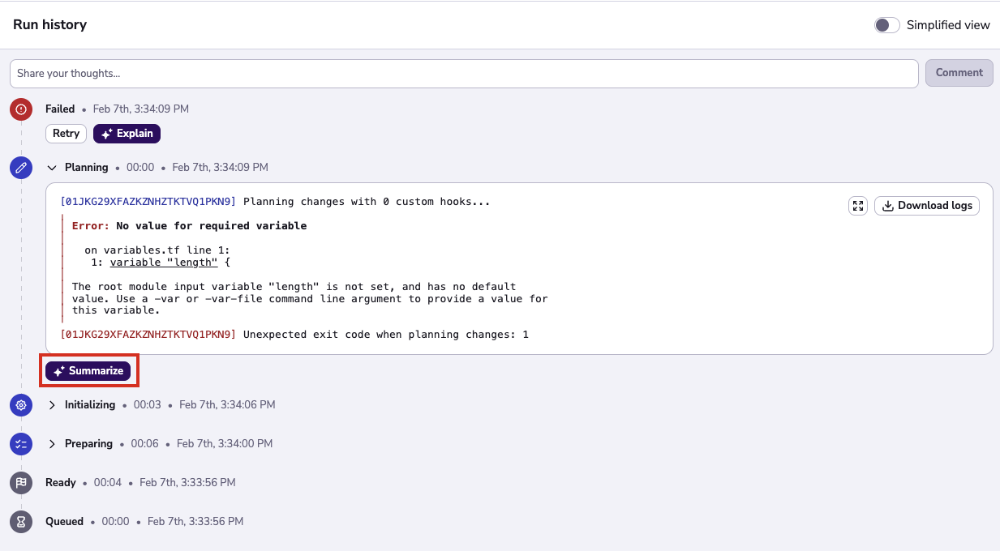

# AI

Spacelift now provides a way to harvest the power of AI to summarize failed runs. By clicking the `Explain` button in the runs history page, Saturnhead will use an advanced LLM to digest the logs of your failed runs and provide useful insights into what went wrong.

## Enabling Saturnhead features


!!! Info
    This feature is only available to Enterprise plan. Please check out our [pricing page](https://spacelift.io/pricing){: rel="nofollow"} for more information.


Saturnhead features have to be enabled by an admin user. Admins can locate the settings screen in `Organization settings > Artificial Intelligence`. When enabling the Saturnhead Assist features for the first time, you'll be asked to accept the Terms and Conditions. Once accepted, all the users with read access to runs will be able to ask for assistance on failed runs.

Furthermore, admins can select the LLM model that will be used to provide assistance. Play around with different models to see which one works best for your organization.

## AI empowered run summaries

After enabling the feature, the users with read access to the runs will be able to summarize failed executions.

!!! Info
    This feature is only supported on stacks using OpenTofu or Terraform.

The results of a summary change on each case due to the LLM being non-deterministic, but they generally provide the following information:

- Human readable summary of the logs.
- Detailed information on what went wrong
- Code snippet suggestions to help solve the issue.

There are 2 types of summary: **Summarize** and **Explain**.

- **Summarize** uses the output logs of the current phase to generate a human-readable summary. They're faster to execute and provide guidance on what went wrong in a specific step.

- By clicking **Explain**, Saturnhead will use the logs of the "Initialize", "Plan" and "Apply" phases combined to generate a global summary. This is ideal for catching issues that span across multiple phases. This summary is slower to run, but it is very helpful when dealing with more complex issues.

Once Saturnhead has analyzed the results of the run, it will display a message with the cause of the issue and potential fix solutions for the problem.

