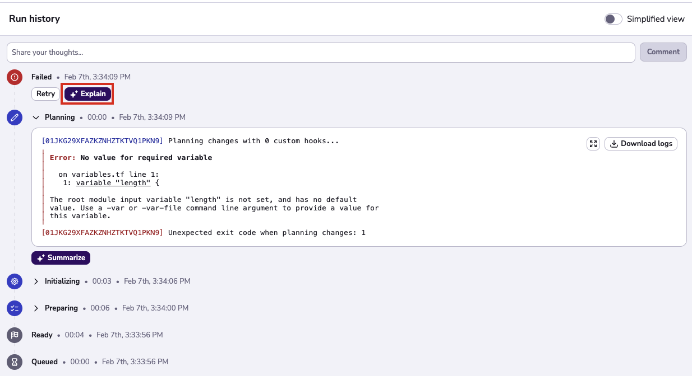

# AI

!!! warning
    This feature is still in beta testing. It will be available soon to Enterprise plan.

Spacelift now provides a way to harvest the power of AI to summarize failed runs. The clicking the AI summary button will send the logs of the failed run to an LLM and provide useful insights on what went wrong.

## Enabling AI features

!!! info
    This feature is only available to Enterprise plan. Please check out our [pricing page](https://spacelift.io/pricing) for more information.

AI features have to be enabled by an admin user. Admins can locate the AI settings screen in `Organization settings > Artificial Intelligence`. When enabling the AI assist features for the first time, you'll be asked to accept the Terms and Conditions. Once accepted, all the users with write access to runs will be able to ask for assistance on failed runs.

## AI empowered run summaries

After enabling the feature, the users with write access to the runs will be able to summarize failed executions.

The results of a summary change on each case due to the LLM being non-deterministic, but they generally provide the following information:

- Human readable summary of the logs.
- Detailed information on what went wrong
- Code snippet suggestions to help solve the issue.

There are 2 types of summary: **Stage based** and **Run based**.

- **Phase based** summaries are based on the output logs of the current phase. They're faster to execute and provide guidance on what went wrong in a specific step.

- You can also execute a **Run based** summary. This summary uses the logs of the "Initialize", "Plan" and "Apply" phases combined and is ideal for catching issues that span across multiple stages. This summary is slower to run, but it is very helpful when dealing with more complex issues.

Once the LLM has analysed the results of the run, it will display a message with the cause of the issue and potential fix solutions for the problem.

