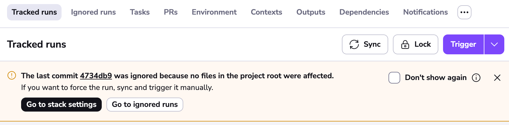
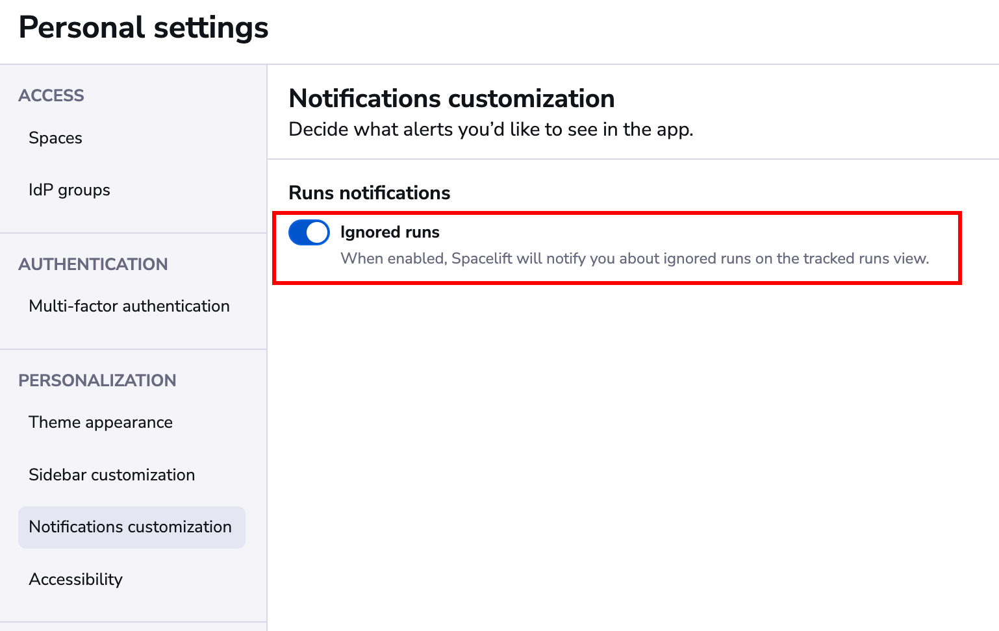
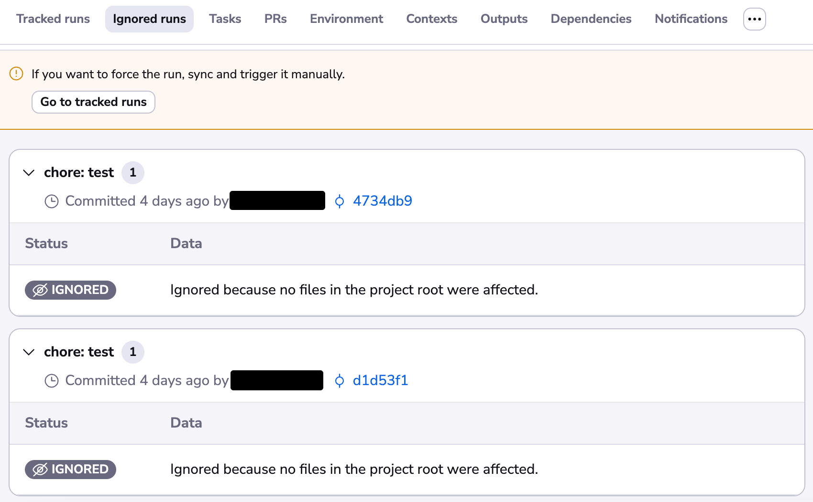

# Ignored run warnings

Ignored run warnings will help you identify why a run has not been triggered when a commit is pushed to your repository.

A run can be ignored because of the following reasons:

- A change has been made outside of the project root.
- A tag is pushed.
- The default push policy is disabled, and no custom push policies are attached.
- One or many custom push policies were applied and dismissed the commit.

## Limitations

- The capability to see ignored runs requires at least an active [Starter+ tier](https://spacelift.io/pricing){: rel="nofollow"} subscription. <!-- markdownlint-disable-next-line MD032 -->
- We are currently only showing ignored runs for commits pushed to stack tracked branches.

## Tracked runs tab

If you go to the main stack view where you can see the list of runs, a warning box will be shown in case your stack is not in sync. This warning will explain why the commit has been ignored.

The warning will automatically disappear if you push another commit that triggers a run. You can also dismiss this warning box, and click on the checkbox to not show ignored run warnings again.

In case you want to re-enable it, you can find a toggle in your personal settings.

## Ignored runs tab

If you want to go back in time and try to understand why a run has not been triggered, you can open the Ignored runs tab.

!!! info
    The retention period for those ignored runs is **7 days**.

