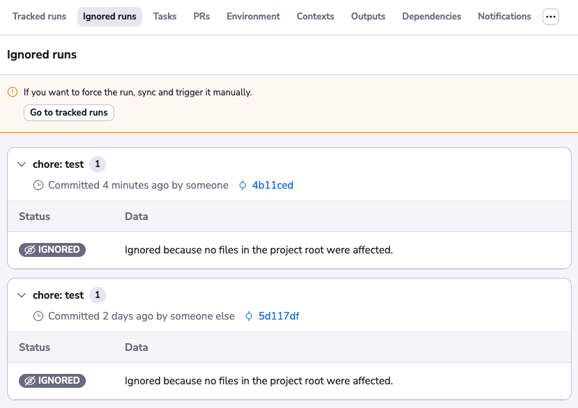

# Ignored run triggers


## Prerequisites

The capability to see ignored run requires at least an active [Starter+ tier](https://spacelift.io/pricing){: rel="nofollow"} subscription.



This feature will help you to identify why a run has not been triggered when a commit is pushed to your repository.

For example, if you have made changes outside of the project root, or if you have attached a custom push policy to the stack that is ignoring commits for some reason.

!!! info
    We are currently only showing ignored run for VCS push that happened on the tracked branch.

## Tracked runs tab

If you go to the main stack view where you can see the list of run, a warning box will be shown in case your stack is not in sync. This warning will explain why the commit has been ignored.

The warning will automatically disappear if you push another commit that will trigger a run. You can also dismiss this warning box, and click on the checkbox to don't show this kind of information again.

In case you want to enable it, you can find a toggle in your personal settings

## Ignored runs tab

If you want to go back in time and try understand why a run has not been triggered, you can open the Ignored runs tab and go back in time.

!!! info
    The retention period for those ignored runs is currently of **7 days**.

