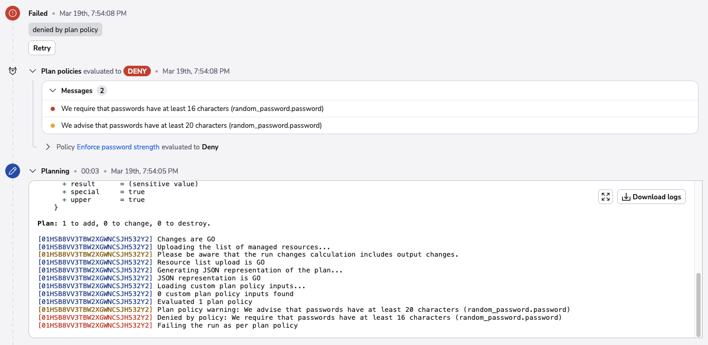

# Proposed run (preview)

Proposed runs are previews of changes that would be applied to your infrastructure if the new code was to become canonical, for example by pushing it to the [tracked branch](../stack/stack-settings.md#vcs-integration-and-repository).

Proposed runs are generally triggered by Git push events. By default, whenever a push occurs to any branch other than the [tracked branch](../stack/stack-settings.md#vcs-integration-and-repository), a proposed run is started, one for each of the affected stacks. This default behavior can be extensively customized using [push policies](../policy/push-policy/README.md).

The purpose of proposed runs is to preview and report changes to your infrastructure during the [planning](#planning) phase, not to make the changes.

## Planning

Once the workspace is prepared by the [initializing](./README.md#initializing) phase, planning runs a vendor-specific preview command and interprets the results. For OpenTofu that command is `tofu plan`; for Terraform, `terraform plan`; for Pulumi, `pulumi preview`; etc. The result of the planning phase is the collection of currently managed resources and outputs as well as planned changes. This is used as an input to [plan policies](proposed.md#plan-policies) (optional) and to [calculate the delta](proposed.md#delta).

The planning phase can be safely [stopped by the user](./README.md#stopped).

On Ansible stacks, this phase can be skipped without execution by setting the `SPACELIFT_SKIP_PLANNING` environment variable to _true_ in the stack's [environment variables](../configuration/environment.md).

## Plan policies

If any [plan policies](../policy/terraform-plan-policy.md) are attached to the current stack, each of these policies is evaluated to automatically determine whether the change is acceptable according to the rules adopted by your organization. Here is an example of an otherwise successful planning phase that still fails due to policy violations:

You can read more about plan policies [here](../policy/terraform-plan-policy.md).

## Pending review

If any [plan policy](../policy/terraform-plan-policy.md) results in a warning and there are [approval policies](../policy/approval-policy.md) attached, the run will enter a _pending review_ state after planning to evaluate approval policies. The run will only finish once all approval policies approve.

This stage is useful to block pull requests related to a proposed run when the changes made by the run should be reviewed by another team, like security.

## Delta

If the planning phase is successful (which includes policy evaluation), Spacelift analyses the differences and counts the resources and outputs that would be added, changed, and deleted if the changes were to be applied. Here's one example of a run delta being reported:

## Success criteria

The planning phase will fail if:

- Infrastructure definitions are incorrect, e.g. malformed, invalid, etc.
- External APIs (e.g. AWS, GCP, Azure, etc.) fail when previewing changes.
- Plan policies return one or more _deny_ reasons.
- A worker node crashes, such as if you kill a private worker node while it's executing the job.

If that happens, the run will transition to the [failed](./README.md#failed) state. Otherwise, the proposed run terminates in the [finished](./README.md#finished) state.

## Reporting

The results of proposed runs are reported in multiple ways:

- Always in VCS, as commit statuses and pull request comments. Refer to [GitHub](../../integrations/source-control/github.md) and [GitLab](../../integrations/source-control/gitlab.md) documentation for the exact details.
- If configured, through [Slack notifications](../../integrations/chatops/slack.md).
- If configured, through [webhooks](../../integrations/webhooks.md).
