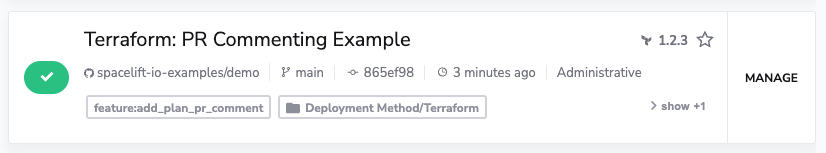
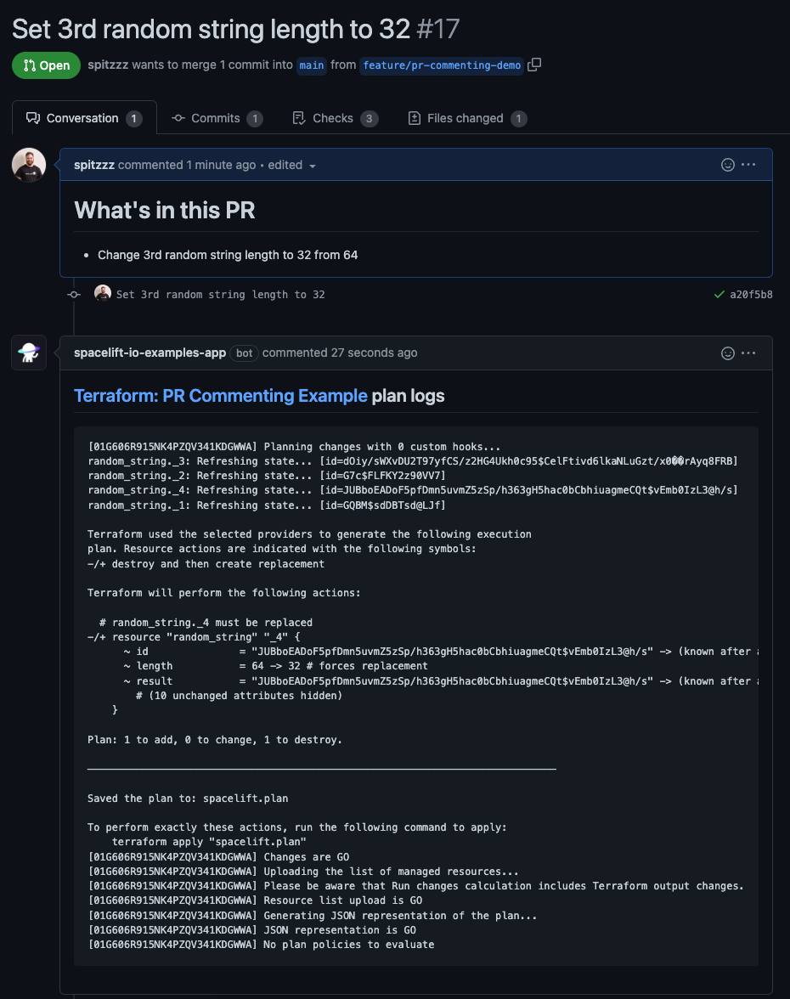

# Pull Request Comments

## Pull Request Plan Commenting

To enable this feature, simply add the label `feature:add_plan_pr_comment` to the stacks you wish to have plan commenting enabled for on pull requests.



Once enabled, on any future pull request activity, the result of the plan will be commented onto the pull request.



## Pull Request Comment-Driven Actions

To enable support for pull request comment events in Spacelift, you will need to ensure the following permissions are enabled within your VCS app integration. Note that if your VCS integration was created using the Spacelift VCS setup wizard, then these permissions have already been set up automatically, and no action is needed.

- Read access to `issues` repository permissions
- Subscribe to `issues:comments` event

Assuming the above permissions are configured on your VCS application, you can then access pull request comment event data from within your Push policy, and build customizable workflows using this data.

!!! warning
    Please note that Spacelift will only evaluate comments that begin with`/spacelift` to prevent users from unintended actions against their resources managed by Spacelift. Furthermore, Spacelift only processes event data for **new** comments, and will not receive event data for edited or deleted comments.

Example policy to **trigger a tracked run from a pull request comment** event:

```opa
package spacelift

track {
    input.pull_request.action == "commented"
    input.pull_request.comment == concat(" ", ["/spacelift", "deploy", input.stack.id])
}
```

Using a policy such as the example above, a user could trigger a tracked run on their Spacelift stack by commenting something such as:

```text
/spacelift deploy my-stack-id
```
