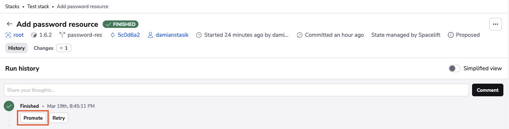
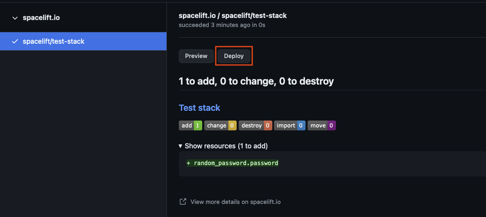

# Run Promotion

## What is Run Promotion?

As a quick summary of the differences between the two types of runs: [proposed](proposed.md) runs only display changes to be made, while [tracked](tracked.md) runs apply (deploy) the proposed changes.

Promoting a proposed run is triggering a tracked run for the same Git commit.

### Using Run Promotion

#### Pre-Requisites

1. For a run to be promote-able, the proposed run **must point to a commit that is newer than the stack's current commit**.

2. To promote a run, you first need to ensure that you have `Allow run promotion` enabled in the stack settings of your stack(s) in which you'd like to promote runs.

<!-- markdownlint-disable-next-line MD036 -->
**Stack Settings > Behavior > Advanced Options > Allow Run Promotion**

#### Promote from Proposed Run View

Assuming you've enabled Run Promotion within the stack settings, and the commit to be promoted is newer than the stack's current commit. On a given proposed run, you will then see the "Promote" button as seen in the screenshot below. You simply need to click this button to promote the proposed run into a tracked run.

#### Promote from a Pull Request

For Spacelift users utilizing GitHub, a similar feature is available directly from the GitHub Pull Request. Assuming the same criteria is met as mentioned previously: 1) The commit to be promoted is newer than the stack's current commit 2) Run Promotion is enabled on the stack - Then, you will see a `Deploy` button available within the Checks tab of the pull request. This button will promote your proposed run into a tracked run.

