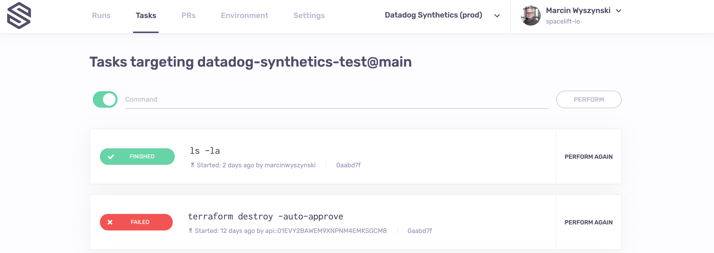
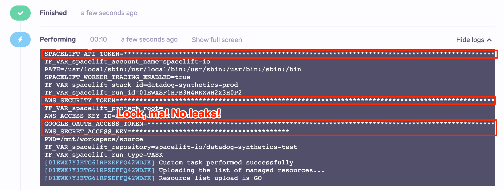
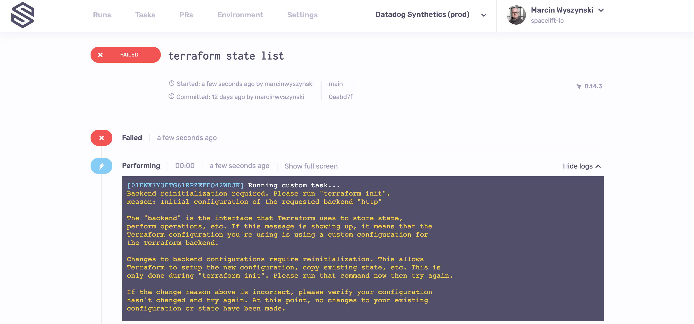

# Task

While tasks enjoy the privilege of having their own GUI screen, they're just another type of [run](./). The core difference is that after the common [initialization](./#initializing) phase, a **task will run your custom command** instead of a string of preordained vendor-specific commands.

## The purpose of tasks

The main purpose of task is to perform arbitrary changes to your infrastructure in a coordinated, safe and audited way. Tasks allow ultimate flexibility and can be used to check the environment (see the humble `ls -la` on the above screenshot), perform benign read-only operations like [showing parts of the Terraform state](https://www.terraform.io/docs/commands/state/show.html), or even make changes to the state itself, like [tainting a resource](https://www.terraform.io/docs/commands/taint.html).\
\
Given that thanks to the [Docker integration](../../integrations/docker.md) you have full control over the execution environment of your workloads, there's hardly a limit to what you can do.

!!! danger
    Obvious abuse of shared workers will get you kicked out of the platform. But you can abuse private workers all you like.

With the above caveat, let's go through the main benefits of using Spacelift tasks.

### Coordinated

Tasks are always treated as operations that may change the underlying state, and are thus serialized. No two tasks will ever run simultaneously, nor will a task execute while a [tracked run](tracked.md) is in progress. This prevents possible concurrent updates to the state that would be possible without a centrally managed mutex.

What's more, some tasks will be more sensitive than others. While a simple `ls` is probably nothing to be afraid of, the two-way state migration described above could have gone wrong in great many different ways. The [stack locking mechanism](../stack/#stack-locking) thus allows taking exclusive control over one or more stacks by a single individual, taking the possibility of coordination to a whole new level.

### Safe

Any non-trivial infrastructure project will inevitably be full of credentials and secrets which are possibly too sensitive to be stored even on a work laptop. Tasks allow any operation to be executed remotely, preventing the leak of sensitive data.

Spacelift's integration with infra providers like [AWS](../../integrations/cloud-providers/aws.md) also allows authentication without any credentials whatsoever, which further protects you from the shame and humiliation of having the keys to the kingdom leaked by running the occasional `env` command, as you do. Actually, let's run it in Spacelift to see what gives:

Yes, the secrets are masked in the output and won't leak due to an honest mistake.

!!! danger
    There are limits to the extent we can protect you from a determined attacker with write access to your stack. We don't want to give you a false sense of security where none is warranted. You may want to look into [task policies](../policy/task-run-policy.md) to prevent certain (or even all) tasks from being executed.

### Audited

Unlike arbitrary operations performed on your local machine, tasks are recorded for eternity, so in cases where some archaeology is necessary, it's easy to see what happened and when. Tasks are attributed to individuals (or [API keys](../../integrations/api.md#api-key-management)) that triggered them and the access model ensures that only [stack writers](../stack/#access-readers-and-writers-teams) can trigger tasks, giving you even more control over your infrastructure.

## Performing a task

Apart from the common run phases described in the general run documentation, tasks have just one extra state - performing. That's when the arbitrary user-supplied command is executed, wrapped in `sh -c` to support all the shell goodies we all love to abuse. In particular, you can use as many `&&` and `||` as you wish.

Performing a task will succeed and the task will transition to the [finished](./#finished) state iff the exit code of your command is 0 (the Unix standard). Otherwise the task is marked as [failed](./#failed). Performing cannot be stopped since we must assume that it involves state changes.

## Skipping initialization

In rare cases it may be useful to perform tasks without initialization - like when the initialization would fail without some changes being introduced. An obvious example here are Terraform **version migrations**. This corner case is served by explicitly skipping the initialization. In the GUI (on by default), you will find the toggle to control this behavior:

.png>)

Let's execute a task without initialization on a Terraform stack:

Notice how the operation failed because it is expected to be executed on an initialized Terraform workspace. But the same operation would easily succeed if we were to run it in the default mode, with initialization:

.png>)
