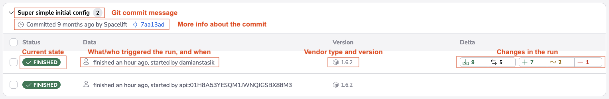
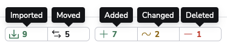
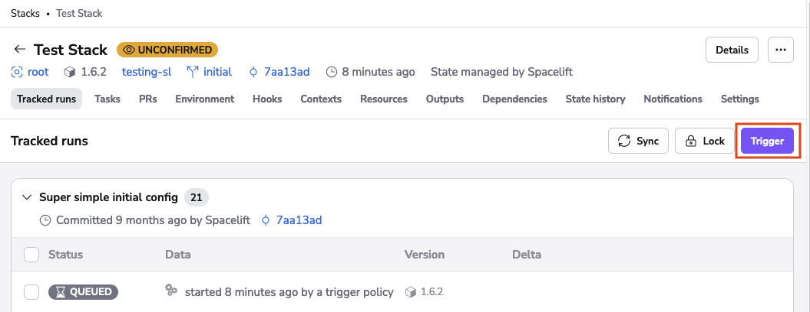
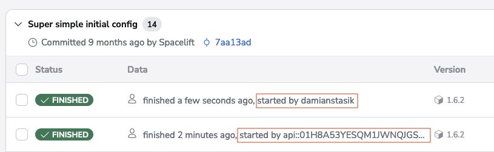
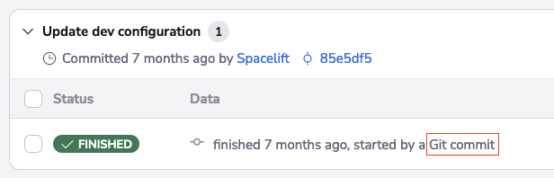
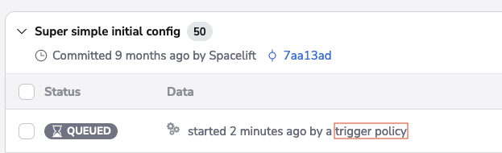
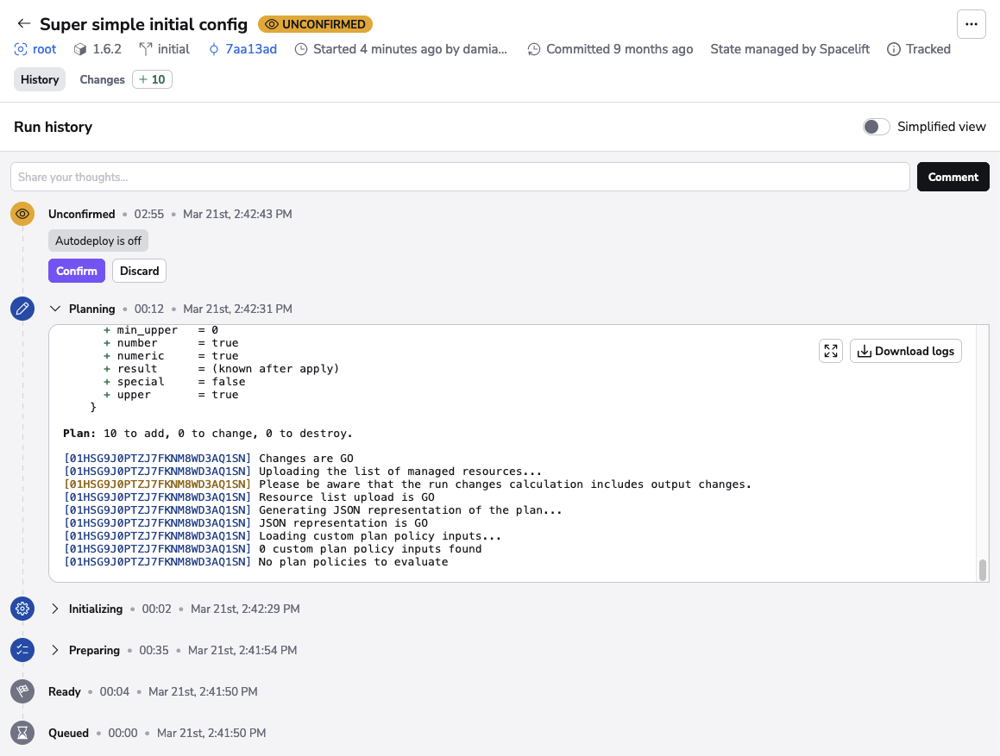
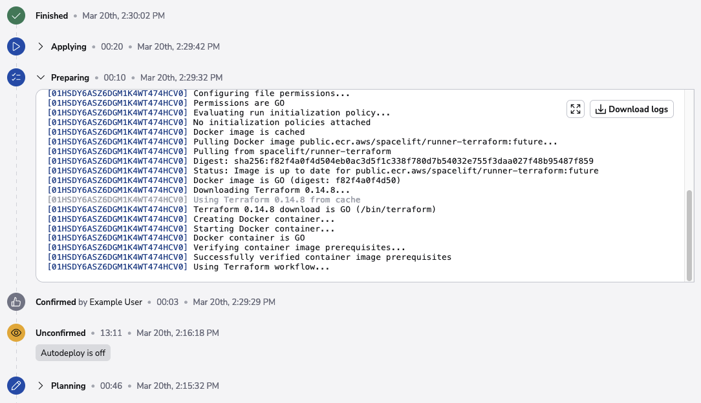
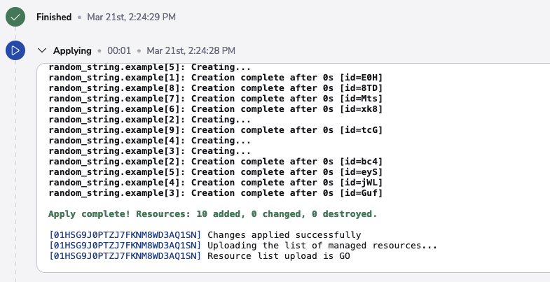
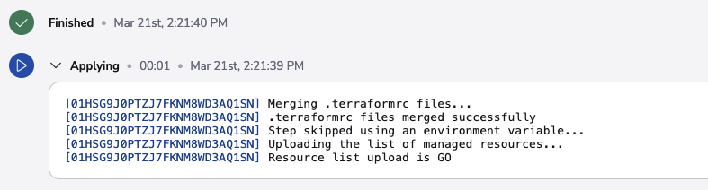

# Tracked run (deployment)

Tracked runs represent the actual changes to your infrastructure caused by changes to your infrastructure definitions and/or configuration. In that sense, they can be also called deployments. Tracked runs are effectively an extension of proposed runs - instead of stopping at the [planning](proposed.md#planning) phase, they also allow you to apply the previewed changes.

They are presented on the _Runs_ screen, which is the main screen of the Stack view:

Each of the tracked runs is represented by a separate element containing some information about the attempted deployment:

Also worth noting is the colorful delta counter present on some runs - as long as the [planning](proposed.md#planning) phase was successful this visually represents the resources and outputs diff introduced by the change:

## Triggering tracked runs

Tracked runs can be triggered in of the three ways - manually by the user, by a Git push or by a [trigger policy](../policy/trigger-policy.md).

### Triggering manually

Any account admin or stack [writer](../policy/stack-access-policy.md) can trigger a tracked run on a stack:

Runs triggered by individuals and [machine users](../../integrations/api.md#spacelift-api-key-token) are marked accordingly:

### Triggering from Git events

Tracked runs can also be triggered by Git push and tag events. By default, whenever a push occurs to the [tracked branch](../stack/stack-settings.md#vcs-integration-and-repository), a tracked run is started - one for each of the affected stacks. This default behavior can be extensively customized using our [push policies](../policy/push-policy/README.md).

Runs triggered by Git push and/or tag events can are marked accordingly:

### Triggering from policies

Trigger policies can be used to create sophisticated workflows representing arbitrarily complex processes like staged rollouts or cascading updates. This is an advanced topic, which is described in more detail in its [dedicated section](../policy/trigger-policy.md). But if you see something like this, be aware of the fact that a trigger policy must have been involved:

## Handling no-op changes

If the planning phase detects no changes to the resources and outputs managed by the stack, the tracked run is considered a no-op. In that case it transitions directly from [planning](proposed.md#planning) to [finished](./README.md#finished) state, just like a [proposed run](proposed.md). Otherwise, it will go through the [approval flow](tracked.md#approval-flow).

## Approval flow

If the tracked run detects a change to its managed resources or outputs, it goes through the approval flow. This can be automated or manual.

The automated flow involves a direct transition between the [planning](proposed.md#planning) and [applying](tracked.md#applying) phase, without an extra human intervention. This is a convenient but not always the safest option.

Changes can be automatically applied if both these conditions are met:

- [autodeploy](../stack/stack-settings.md#autodeploy) is turned "on" for the Stack;
- if [plan policies](../policy/terraform-plan-policy.md) are attached, none of them returns any warnings;

Otherwise, the change will go through the manual flow described below.

### Unconfirmed

If a change is detected and human approval is required, a tracked run will transition from the [planning](proposed.md#planning) state to _unconfirmed_. At that point the worker node encrypts uploads the entire workspace to a dedicated Amazon S3 location and finishes its involvement with the run.

The resulting changes are shown to the user for the final approval:

Unconfirmed is a _passive state_ meaning no operations are performed while a run is in this state.

If the user approves (confirms) the plan, the run transitions to the temporary [Confirmed](tracked.md#confirmed) state and waits for a worker node to pick it up. If the user doesn't like the plan and discards it, the run transitions to the terminal [Discarded](tracked.md#discarded) state.

### Targeted replan

When a run is in the [Unconfirmed](tracked.md#unconfirmed) state it's also possible to replan it. When replanning, a user is able to generate a new plan to apply by only picking specific changes from the current plan. This is working similarly to how passing the `-target` option to a terraform plan command does, without giving you the headache of writing the name of each resource you want to add to your targeted run.

To get to the replan screen after the run reaches the unconfirmed state, click on the Changes button in the left corner, select the resources you would like to have a targeted plan for, and then, the replan option will pop out, similar to the screenshot below.

!!! warning
    Targeted replan feature is currently in open public beta and is free to use regardless of your pricing plan. Once GA, it will be available as part of our [Enterprise plan](https://spacelift.io/pricing){: rel="nofollow"}.

### Discarded

Discarded state follows [Unconfirmed](tracked.md#unconfirmed) and indicates that the user did not like the changes detected by the [Planning](proposed.md#planning) phase.

Discarded is a _passive state_ meaning no operations are performed while a run is in this state. It's also a _terminal state_ meaning that no further state can supersede it.

### Confirmed

Confirmed state follows [Unconfirmed](tracked.md#unconfirmed) indicates that a user has accepted the plan generated in the Planning phase and wants to [apply](tracked.md#applying) it but no worker has picked up the job yet. This state is similar to [Queued](./README.md#queued) in a sense that shows only temporarily until one of the workers picks up the associated job and changes the state to [Applying](tracked.md#applying). On the other hand, there is no way to stop a run once it's confirmed.

Confirmed is a _passive state_ meaning no operations are performed while a run is in this state.

## Applying

If the run required a manual approval step, this phase is preceded by another handover ([preparing](./README.md#preparing) phase) since the run again needs to be yielded to a worker node. This preparing phase is subtly different internally but ultimately serves the same purpose from the user perspective. Here's an example:

This preparation phase is very unlikely to fail, but if it does (eg. the worker node becomes unavailable during the transition), the run will transition to the terminal [failed](./README.md#failed) state. If the handover succeeds, or the run does not go through the manual approval process, the applying phase begins and attempts to deploy the changes. Here's an example:

This phase can be skipped without execution by setting the `SPACELIFT_SKIP_APPLYING` environment variable to _true_ in the stack's [environment variables](../configuration/environment.md).

## Success criteria

If the run is a [no-op](tracked.md#handling-no-op-changes) or the applying phase succeeds, the run transitions to the [finished](./README.md#finished) state. On the other hand, if anything goes wrong, the run is marked as [failed](./README.md#failed).

## Reporting

The results of tracked runs are reported in multiple ways:

- as deployments in VCS unless the change is a [no-op](tracked.md#handling-no-op-changes) - please refer to [GitHub](../../integrations/source-control/github.md) and [GitLab](../../integrations/source-control/gitlab.md) documentation for the exact details;
- through [Slack notifications](../../integrations/chatops/slack.md) - if set up;
- through [webhooks](../../integrations/webhooks.md) - if set up;
