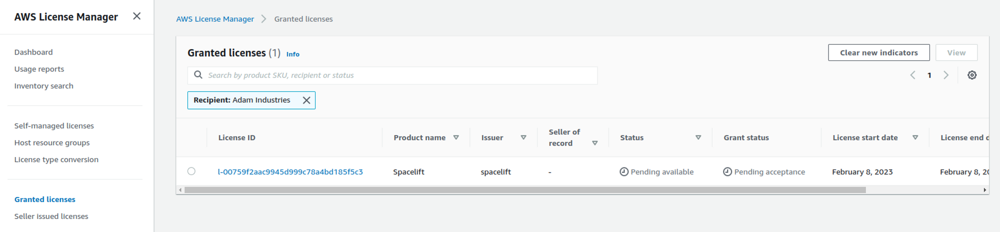

# Installation

The self-hosted Spacelift is a great option for organizations that want to keep their infrastructure in-house, or have specific security requirements.

The self-hosted Spacelift follows a Bring-Your-Own-AWS approach - you can install either to a commercial AWS account, or to an AWS GovCloud account. The installation process is the same for both.

## Prerequisites

Before proceeding with the installation, you need to satisfy the following pre-requisites:

- You need access to an AWS account you wish to install Spacelift into.
- You need to choose a hostname that you wish to use for your Spacelift installation, for example `spacelift.saturnhead.io`. This needs to be on a domain that you control and can add DNS records to.
- You need to create an ACM certificate for your chosen domain in the same account that you want to install Spacelift in. This is required for the HTTPS endpoint that Spacelift will be available on.

The installation process requires the following tools:

- A Mac or Linux machine to run the installation script from.
- [AWS CLI](https://docs.aws.amazon.com/cli/latest/userguide/getting-started-install.html) (v2), configured to access the account you wish to install Spacelift into.
- [jq](https://stedolan.github.io/jq/).
- Standard unix utilities including bash, base64, cat, read, openssl.
- [Docker](https://www.docker.com/).

## Accepting your license

Spacelift issues licenses through [AWS License Manager](https://docs.aws.amazon.com/license-manager/latest/userguide/license-manager.html). Before you can use your license, you need to accept it in the AWS console.



!!! note
    If this is your first time accessing License Manager, you may need to grant permissions to AWS before you can use it. If this is the case you will automatically be prompted to grant permission.

Click on your license ID, and then choose the **Accept & activate license** option on the license page.

## Release archive

Spacelift self-hosted is distributed as an archive containing everything needed to install Spacelift into your AWS account. The archive has the following structure:

- `account_config.yml` - a configuration file containing information about your account and SSO settings.
- `bin` - contains binaries including a copy of the launcher built for self-hosting.
- `cloudformation` - contains CloudFormation templates used to deploy Spacelift.
- `container-images` - contains container images for running the Spacelift backend as well as a launcher image.
- `install.sh` - the installation script.
- `scripts` - contains other scripts called by the installation script.
- `version` - contains the version number.

## Signature Validation

Along with the release archive, we also provide a SHA-256 checksum of the archive as well as a GPG signature. The fingerprint of our GPG key is `380BD7699053035B71D027B173EBA0CF3B3F4A46`, and you can import it using the following command:

`gpg --recv-keys 380BD7699053035B71D027B173EBA0CF3B3F4A46`

You can verify the integrity of the release archive using the following command:

`sha256sum -c self-hosted-<version>.tar.gz_SHA256SUMS`

And you can verify the authenticity using the following command:

`gpg --verify self-hosted-<version>.tar.gz_SHA256SUMS.sig`

## SSO configuration

After extracting the release archive, you'll find a configuration file called `account_config.yml` in the root. You need to configure your SSO settings there. It's either OIDC or SAML.

For example, a SAML configuration might look like the following:

```yaml
account_name: "saturnhead"
admin_login: "spacelift-admin@saturnhead.io"
saml_args:
  metadata: "https://saturnhead.myidpprovider.com/app/abc123/sso/saml/metadata"
    dynamic: true
  name_id_format: "TRANSIENT"
```

And an OIDC configuration might look like the following:

```yaml
account_name: "saturnhead"
admin_login: "spacelift-admin@saturnhead.io"
oidc_args:
  client_id: "abc123"
    client_credentials: "def321"
    identity_provider_host: "https://saturnhead.myidpprovider.com"
```

!!! note
    The `admin_login` you specify must be able to login via your SSO provider. This user will always have full admin permissions in Spacelift, even if you configure a login policy later.

### Identity Provider URLs

You will need certain URLs when configuring an application in your identity provider.

#### SAML

For **SAML**, use the following URLs:

- Single Sign-On URL: `https://<spacelift-hostname>/saml/acs`
- Entity ID (audience): `https://<spacelift-hostname>/saml/metadata`

#### OIDC

For **OIDC**, use the following URL:

- Authorized redirect URL: `https://<spacelift-hostname>/oidc/exchange`

## Installation

This section covers simple installations using a Spacelift-created VPC and a public facing HTTP load balancer. For information about using an existing VPC please see [advanced installations](https://www.notion.so/Install-Guide-d9a56a01d31f441e9cd14268f089ee9f).

To run the installer, you will need your hostname and ACM certificate ARN. Once you have both, run the following command (populating your hostname and ACM certificate ARN):

```bash
./install.sh -n "<hostname>" -c "<ACM ARN>" -r "<region>"
```

When the installer starts, it will check it can connect to your AWS account, and will ask for confirmation to continue. Please check the AWS account ID is correct, and if so enter `yes`:

```bash
./install.sh -n "spacelift.saturnhead.io" -c "arn:aws:acm:eu-west-1:123456789012:certificate/3e48a148-0281-429d-8d81-6b6cb9ffa935" -r "eu-west-1"
[2023-01-24T12:17:52+0000] INFO: installing version v0.0.1 of Spacelift into AWS account 123456789012

Are you sure you want to continue? Only 'yes' will be accepted: yes
```

Please note, the installation process can take between 15 and 30 minutes to create all of the required infrastructure for Spacelift.

## Optional configuration options

You can also pass the following configuration options to the installer:

- `-i <instance-class>` - specifies the instance class to use for the Spacelift Postgres database (defaults to `db.t4g.large`).
- `-l <lb-class>` - specifies the load balancer class to create (`internal` or `internet-facing`, defaults to `internet-facing`).

## Setting up DNS entries

Once the installer has completed, you should see output similar to the following, providing you with the DNS address of the load balancer along with the Launcher container image URL:

```plaintext
Installation info:

  * Load balancer DNS: spacelift-server-1234567890.eu-west-1.elb.amazonaws.com
  * Launcher container image: 123456789012.dkr.ecr.eu-west-1.amazonaws.com/spacelift-launcher:v0.0.1

[2023-01-24T11:30:59+0000] INFO: Spacelift version v0.0.1 has been successfully installed!
```

Please use the _Load balancer DNS_ to setup a CNAME entry or an A record using an alias if using a hosted zone in the same AWS account as your Spacelift installation. This entry should point from the hostname you want to use for Spacelift (e.g. `spacelift.saturnhead.io`) to the Spacelift Load Balancer.

Once your DNS changes propagate, you should be able to login to your instance by navigating to its hostname (for example `https://spacelift.saturnhead.io`).
