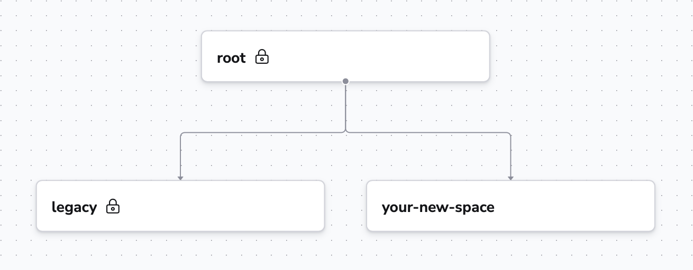

# Migrating out of the Legacy Space

After the introduction of Spaces most of your resources will end up in the `legacy` space. This space is there to provide backward-compatibility with your existing setup, and it's the only place [Access policies](../policy/stack-access-policy.md) still work.

To get the most out of Spacelift, you'll want to move out of the `legacy` space into other spaces. For each entity, you can do that by going into the entity's settings and choosing a new space for it. However, you'll have to keep a few things in mind.

First, moving entities can't break any relationships between them. For example, if you have a policy attached to a stack, you can't move the policy to a space where it won't be accessible to the stack.

Second, you have to move entities one by one, which means that moving stacks with their attachments (policies, contexts, worker pools, etc.) needs to be done in multiple steps.

1. Create your new space as a child of the `root` space with inheritance enabled.
2. Move all the attachable entities (policies, contexts, worker pools, etc.) from the `legacy` space to the `root` space. This way they're accessible from both the `legacy` space and your new space.
3. Move the stacks to your new space.
4. Move the attachable entities to your new space.

Additionally, when you're ready to stop using access policies in the `legacy space`, you can start providing users a level of access to the `legacy` space using the **space_admin**, **space_write**, and **space_read** directives of the Login policy. The moment the Login policy specifies any of these for a user for the `legacy` space, Access policies will stop being evaluated for this user.
