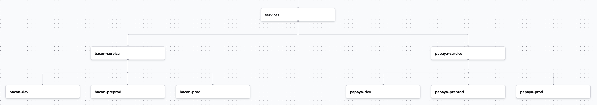
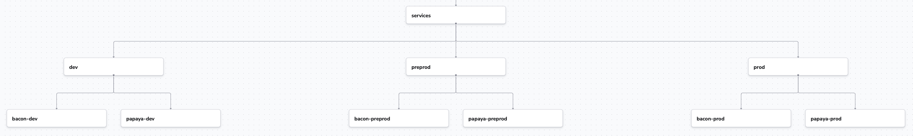

# Structuring your Spaces Tree

Based on experience with other tooling a first intuition might be to structure your spaces team-first or service-first. Something akin to the following picture:

However, thinking about Spacelift resources, you will probably want to reuse i.e. a Worker Pool across all development environment services, not across all environments of a single service. That is because resources like Worker Pools are usually shared across security domains, not logical domains.

Due to this an architecture akin to the following is more advisable:

This way you can create your Worker Pools, Contexts and Policies in the dev, preprod, and prod spaces, and then reuse them in all spaces below.
