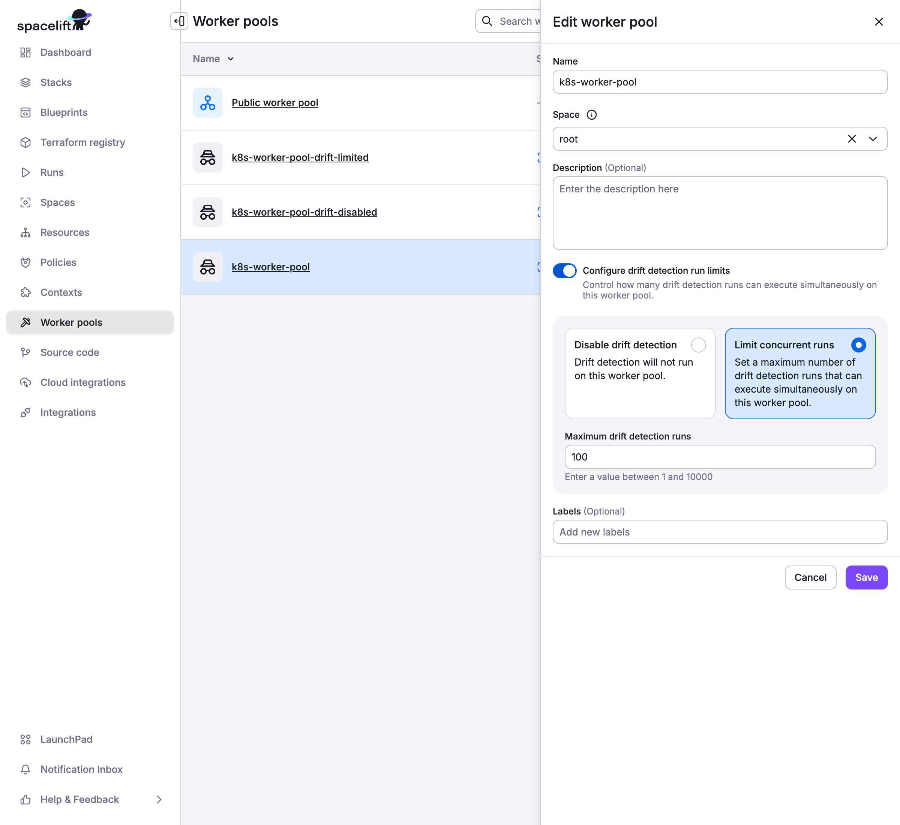

# Drift detection


!!! Info
    This feature is only available on the Starter+ plan and above. Please check out our [pricing page](https://spacelift.io/pricing){: rel="nofollow"} for more information.


## Drift happens

In _infrastructure-as-code_, the concept of _drift_ represents the difference between the desired state and the actual state of the infrastructure managed by your tool of choice: [Terraform](https://developer.hashicorp.com/terraform){: rel="nofollow"}, [Pulumi](https://www.pulumi.com/){: rel="nofollow"}, [AWS CloudFormation](https://aws.amazon.com/cloudformation/){: rel="nofollow"}, etc. In practice, there are two sources of _drift_: changes introduced by external actors, and dependencies on external data sources.

1\. Changes directly introduced by external actors, either humans or machines (scripts), can cause drift. If an on-call SRE changes your database parameters otherwise controlled by Terraform, you've introduced _drift_. If an external script updates your Kubernetes cluster in a way that conflicts with its Pulumi definition, it's _drift_ as well.

2\. The dependency of your resources on external data sources can cause drift. For example, if your load balancer only expects to receive traffic from [Cloudflare](https://www.cloudflare.com/en-gb/){: rel="nofollow"}, you may want to restrict ingress to a predefined range of IPs. However, that range may be dynamic, and your IaC tool queries it every time it runs. If there's any change to the external data source, it's showing up as drift, too.

In the first scenario, drift is an unwanted by-product of emergencies or broken processes. In the latter, it's both desired and inevitable proof that your otherwise declarative system responds to external changes. In other words, drift happens.

## Video Walkthrough

<div style="padding:56.25% 0 0 0;position:relative;"><iframe src="https://player.vimeo.com/video/761467641?h=017928bdbc&amp;badge=0&amp;autopause=0&amp;player_id=0&amp;app_id=58479" frameborder="0" allow="autoplay; fullscreen; picture-in-picture" allowfullscreen style="position:absolute;top:0;left:0;width:100%;height:100%;" title="Drift Detection"></iframe></div><script src="https://player.vimeo.com/api/player.js"></script>

## How Spacelift detects drift

!!! info
    Drift detection only works on [private workers](../worker-pools/README.md#private-worker-pool).

Spacelift comes with a built-in mechanism to detect and (optionally) reconcile drift. We do it by periodically executing [proposed runs](../run/proposed.md) on your stable infrastructure (generally represented by the [_finished_ stack state](./README.md#stack-state) in Spacelift) and checking for any changes.

To get started, create a [drift detection schedule](./scheduling.md#schedule-drift-detection) for your stack. You will be able to add multiple cron rules to define when your detection jobs should be scheduled, as well as decide whether you want your jobs to trigger [tracked runs](../run/tracked.md) ([reconciliation](drift-detection.md#to-reconcile-or-not-to-reconcile) jobs) in response to detected drift**:**


### To reconcile, or not to reconcile

We generally suggest enabling reconciliation on your drift detection schedules, as it ensures you get the most out of the feature. Reconciliation jobs are equivalent to manually triggering [tracked runs](../run/tracked.md) and obey the same rules and constraints. In particular, they respect their stacks' auto-deploy setting and [trigger plan policies](#policy-input).

However, if you choose not to reconcile changes, you can still see drifted resources in the Resources view, both on the stack and account levels. Also, drift detection jobs trigger [webhooks](../../integrations/webhooks.md) like regular runs, where they're clearly marked as such (`driftDetection` field).

.png>)

### Drift Detection Run Limits

Private worker pools support configurable drift detection run limits to prevent resource exhaustion. This allows you to control how many drift detection runs can execute concurrently on a specific worker pool.

#### Configuration

Drift detection run limits are configured at the [worker pool](../worker-pools/README.md#drift-detection-run-limits) level through the Spacelift UI:

- **Enable Drift Detection Run Limits**: Use the toggle switch in worker pool settings
- **Set Limit Options**:
    - **Disable drift detection entirely**: Prevents all drift detection runs on this worker pool
    - **Set a numeric limit**: Specify the maximum number of concurrent drift detection runs



#### Behavior

When drift detection run limits are configured:

- **Default Behavior**: Without limits, drift detection runs have no concurrency restrictions
- **With Numeric Limit**: The job scheduler ensures concurrent drift detection runs don't exceed the configured limit
- **When Disabled**: Drift detection runs are prevented, and failed runs are created with explanatory notes for record keeping purposes
- **Limit Exceeded**: Additional drift detection runs are skipped until existing ones complete, preventing queue buildup

#### Use Cases

Drift detection run limits are particularly useful for:

- **Resource Management**: Private worker pools with limited compute capacity
- **Priority Management**: Ensuring regular infrastructure changes take precedence over drift detection
- **Maintenance Windows**: Temporarily disabling drift detection during scheduled maintenance
- **Cost Control**: Reducing resource consumption when drift detection frequency is high

!!! warning
    This feature only applies to private worker pools. Public worker pools managed by Spacelift do not support drift detection run limits.

!!! warning
    If drift detection is disabled on a worker pool, you will not be able to create drift detection schedules for stacks using that worker pool.

## Drift detection in practice

With drift detection enabled on the stack, [proposed runs](../run/proposed.md) are quietly executing in the background. If they do not detect any changes, the only way you'd know about them is by viewing all runs in the _Account > Runs_ section and filtering by drift detection parameter.

.png>)

If your proposed runs detect drift (and you've enabled reconciliation), Spacelift triggers a regular tracked run. This run is subject to the same rules as a regular tracked run. For example, if you set your stack not to [deploy changes automatically](stack-settings.md#autodeploy), the run will end up in an [_unconfirmed_](../run/tracked.md#unconfirmed) state, waiting for your decision. The same thing will happen if a [plan policy](../policy/terraform-plan-policy.md) produces a warning using a matched `warn` rule.

## Policy input

The only real difference between a drift detection job and one triggered manually is that the run section of your policy input will have the `drift_detection` field set to `true`. This applies to both [plan](../policy/terraform-plan-policy.md) and [trigger](../policy/trigger-policy.md) policies. You can use this mechanism to add extra controls to your drift detection strategy.

For example, if you're automatically deploying your changes but want a human to look at drift before reconciling it, you can add the following section to your [plan policy](../policy/terraform-plan-policy.md) body:

```opa
package spacelift

warn["Drift reconciliation requires manual approval"] {
  input.spacelift.run.drift_detection
}
```
