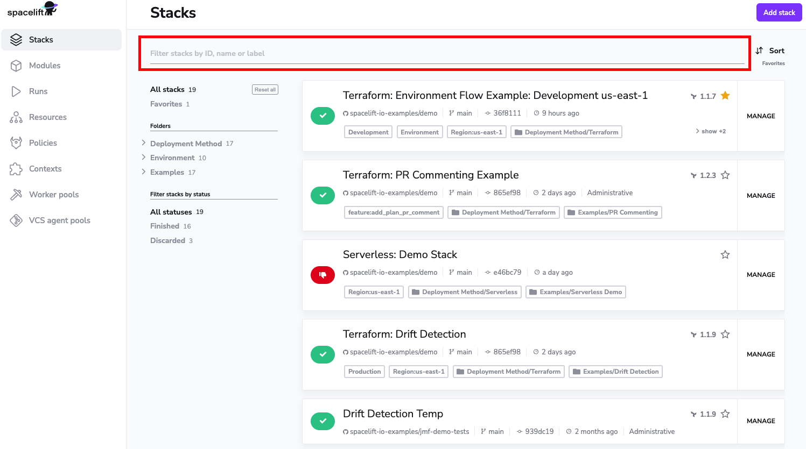
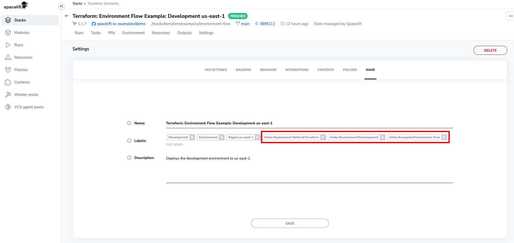

# Organizing stacks

Depending on the complexity of your infrastructure, the size of your team, your particular needs and your preferred way of working you may end up managing a lot of stacks. This obviously makes it harder to quickly find what you're looking for. As practitioners ourselves, we're providing you a few tools to make this process more manageable - from the basic [query-based searching](organizing-stacks.md#query-based-searching-and-filtering) to [filtering by status](organizing-stacks.md#label-based-folders) and the coolest of all, [label-based folders](organizing-stacks.md#label-based-folders).

## Video Walkthrough

<iframe src="https://player.vimeo.com/video/754795106?h=c4e1f101d8" width="640" height="564" frameborder="0" allow="autoplay; fullscreen" allowfullscreen></iframe>

## Query-based searching and filtering

Historically the first tool we offered was the search bar:

The search bar allows you to search and filter by the following stack properties:

- name;
- ID (slug);
- any of its [labels](stack-settings.md#labels);

Note how the search phrase is highlighted, and irrelevant stacks are filtered out:

## Filtering by status

Filtering stacks by status is a very useful mechanism for identifying action items like plans pending confirmation ([unconfirmed](../run/tracked.md#unconfirmed) state) or [failed](../run/README.md#failed) jobs that require fixing. For that, use the _Filter stacks by status_ section on the sidebar to the left. If you click on any of the statuses, the list of stacks will be filtered to only include stacks with a given status:

Note that if no stacks in the account have a particular status at the moment, that status is missing from the list.

## Label-based folders

Probably the most useful way of grouping stacks is by attaching folder labels to them. You can read more about [labels](stack-settings.md#labels) here, including how to set them, and folder labels are just regular labels, prefixed with `folder:`. In order to make it more obvious in the GUI and save some screen real estate, we replace the `folder:` prefix by the folder icon...

...but once you start editing labels, the magic is gone:

For every folder label, a sidebar section is included in the _Folders_ menu, allowing you to search by that label. The number to the right hand side indicates that number of stacks with that label:

### Nesting and multiple folder labels

Perhaps worth mentioning is the fact that folder labels can be nested, allowing you to create either hierarchies, or arbitrary classifications of your stacks.

Also, a single stack can have any number of folder labels set, in which case it belongs to all the collections. In that, folder labels are like labels in Gmail rather than directories in your filesystem.
