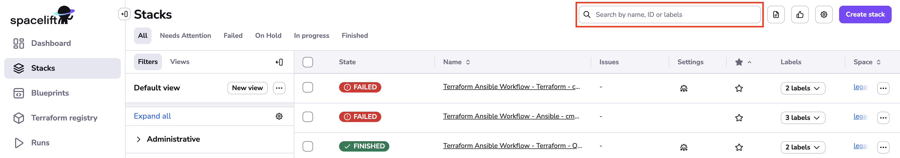
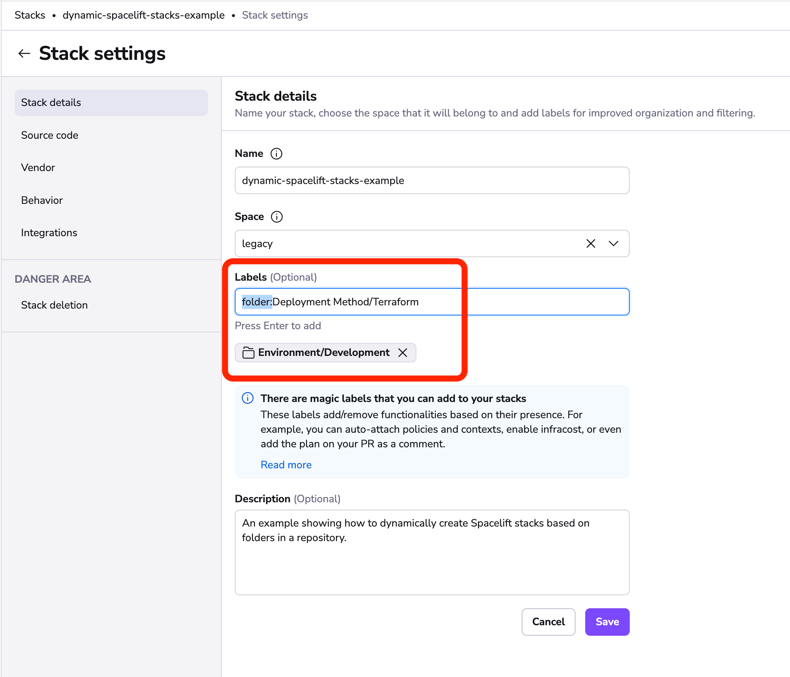
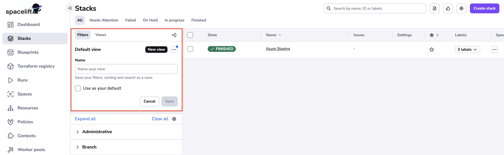
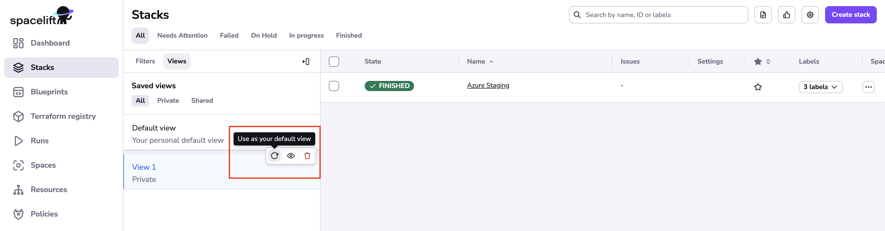
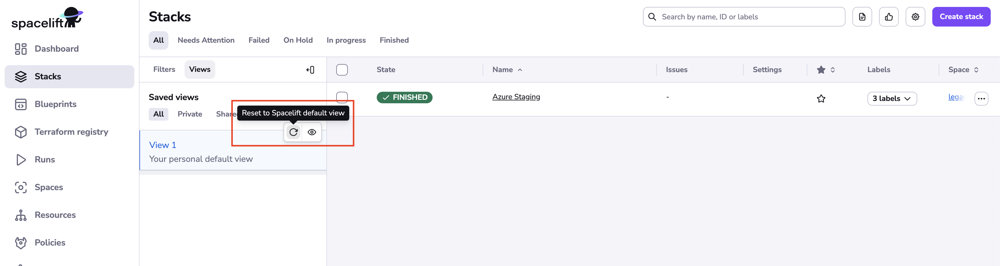
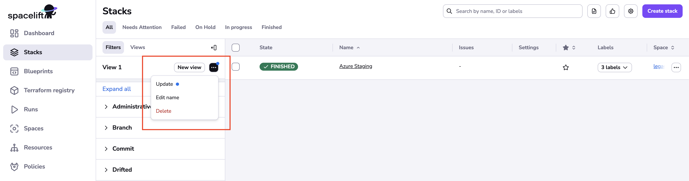

# Organizing stacks

Depending on the complexity of your infrastructure, the size of your team, your particular needs and your preferred way of working you may end up managing a lot of stacks. This obviously makes it harder to quickly find what you're looking for. As practitioners ourselves, we're providing you a few tools to make this process more manageable - from the basic [query-based searching](organizing-stacks.md#query-based-searching-and-filtering) to [filtering by status](organizing-stacks.md#label-based-folders) and the coolest of all, [label-based folders](organizing-stacks.md#label-based-folders).

## Video Walkthrough

<iframe src="https://player.vimeo.com/video/754795106?h=c4e1f101d8&amp;badge=0&amp;autopause=0&amp;player_id=0&amp;app_id=58479" frameborder="0" allow="autoplay; fullscreen; picture-in-picture" allowfullscreen style="position:absolute;top:0;left:0;width:100%;height:100%;" title="Organizing a Stack"></iframe>

## Customizing table view

Based on the table configuration, you'll be able to customize the view to suit your needs. A settings drawer for customizing the list is available under the icon in the top right corner.

Clicking the icon opens a drag-and-drop menu where you can hide columns (except for _name_) or rearrange their order:

To reset your settings, use the _Reset to default_ button located at the bottom of the customization drawer.

Each column can be resized by dragging the column separator:

Additionally, you can hover over one of the column headers and leverage the dropdown menu to hide them:

## Query-based searching and filtering

Historically the first tool we offered was the search bar:

The search bar allows you to search and filter by the following stack properties:

- name;
- ID (slug);
- any of its [labels](stack-settings.md#labels);

## Filtering by state

Filtering stacks by state is a very useful mechanism for identifying action items like plans pending confirmation ([unconfirmed](../run/tracked.md#unconfirmed) state) or [failed](../run/README.md#failed) jobs that require fixing. For that, use the _State_ section on the sidebar to the left. Clicking on any status filters the list of stacks to show only those with the selected status,

Note that if no stacks in the account have a particular status at the moment, that status is missing from the list.

You can also use our predefined tabs to filter some specific group of states:

- Needs Attention: _unconfirmed_ state
- Failed: _failed_ state
- On Hold: _none_, _confirmed_ or _replan-requested_ states
- In progress: _applying_, _destroying_, _initializing_, _planning_, _preparing-apply_ or _preparing-replan_ states
- Finished: _finished_ state

## Label-based folders

Probably the most useful way of grouping stacks is by attaching folder labels to them. You can read more about [labels](stack-settings.md#labels) here, including how to set them, and folder labels are just regular labels, prefixed with `folder:`. In order to make it more obvious in the GUI and save some screen real estate, we replace the `folder:` prefix by the folder icon...

...but once you start editing labels, the magic is gone:

For every folder label, a sidebar section is included in the _Folders_ menu, allowing you to search by that label. The number to the right hand side indicates that number of stacks with that label:

### Nesting and multiple folder labels

Perhaps worth mentioning is the fact that folder labels can be nested, allowing you to create either hierarchies, or arbitrary classifications of your stacks.

Also, a single stack can have any number of folder labels set, in which case it belongs to all the collections. In that, folder labels are like labels in Gmail rather than directories in your filesystem.

## Saving filters in views

It is possible to save your filters with a Filters Tab. You can select all the filters that you would like to apply, add a search query or sorting in the top right corner, click New View, enter the view name, and click Save. This view is now saved for this account. You can also mark your new view as your default view during creation. Next time you log in or navigate to stacks, your personal default view will be applied.

If you forgot to mark your view as default then you can easily do the same thing in the Views Tab.

### Shared views

Views can be shared or private. While first creating the view, it is available only to your user. If you have admin access, you can make it public for all the users of the account by hovering over the saved view and clicking the small eye icon "Share within account". This way, all the users within this application can see the saved view and who created it.

### Resetting

To quickly reset your default view to Spacelift default state, click the "Reset to Spacelift default view" button. It will result in clearing all sorting, search, and filter parameters, as well as managed filter settings.

### Manage view

- If you change your filter, search and/or sorting settings, you can update the currently selected view by clicking on Update item under "Manage view" button. The blue icon on the manage view button indicates an update possibility.
- Edit name allows editing name of the current view
- Delete allows removing your private view (Shared and Spacelift default views can not be removed). You can delete the view from the Views tab as well.

