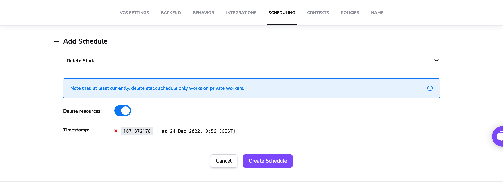
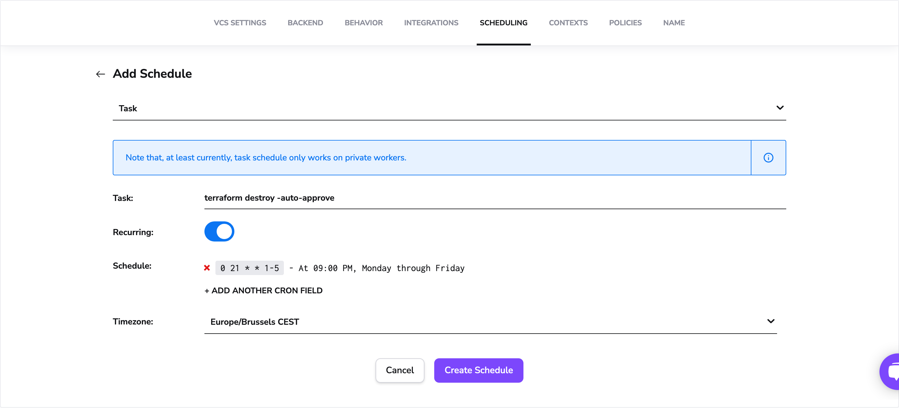

# Scheduling

## What is scheduling?

!!! info
    Note that scheduling only works on private workers, which is an enterprise feature.

Scheduling allows you to trigger a stack deletion or task at a specific time or periodically based on the cron rules defined.

## Scheduled Delete Stack (TTL)

A Delete Stack schedule allows you to delete the stack and (optionally) its resources at the specific timestamp (UNIX timestamp).

Add a schedule with the Delete Stack type from the Scheduling section of your stack settings.

Actions when the schedule defines that the resources should be deleted:

- a destruction run will be triggered at the specified time.
- after this run is successful, the stack will be deleted.

When the resources should not be deleted, we will delete the stack at the specified time.

## Scheduled Task

A scheduled task enables you to run a command at a specific timestamp or periodically based on the cron rules defined.

Add a schedule with the Task type from the Scheduling section of your stack settings.
After creating this schedule, a task will be triggered with the defined command (at a specific timestamp or periodically based on the cron rules defined).

