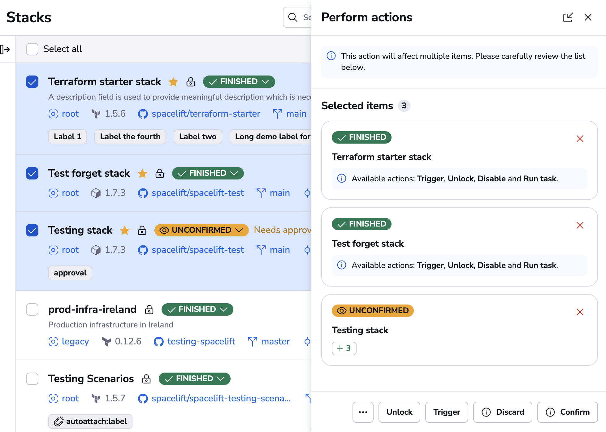
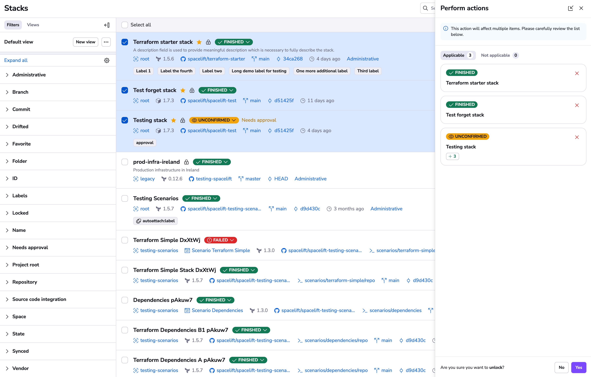
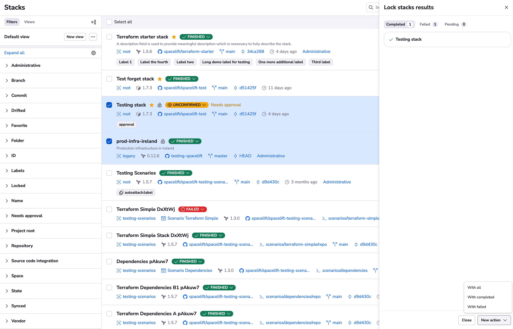

# Stack bulk actions

Spacelift allows you to perform bulk actions on stacks. This is useful when you need to perform the same action on multiple stacks at once. To initiate bulk actions, navigate to the "Stacks" page and select the stacks you want to perform the action on. When you make the selection you can choose the intended action from the following options:

## Available actions

- Approve - Adds an approval for the selected stacks that require [approval policy](../policy/approval-policy.md) reviews.
- Confirm - Confirms the blocking run for stacks in the `Unconfirmed` state.
- Disable - Disables the selected stacks, so they will not trigger any runs.
- Discard - Discards the blocking run for stacks in the `Unconfirmed` state.
- Enable - Enables the selected stacks.
- Lock - Locks the selected stacks for exclusive use.
- Reject - Adds a rejection for the selected stacks that require [approval policy](../policy/approval-policy.md) reviews.
- Run task - [Manually triggers a run](../run/task.md) with a custom command.
- Sync commit - Updates the selected stacks to point at the latest HEAD commit for their tracked branches.
- Trigger - [Triggers a tracked run](../run/tracked.md#triggering-manually) for the selected stacks.
- Unlock - Unlocks the selected stacks that are currently locked.

!!! info
    The UI will only show the actions that can be performed on the selected stacks, filtering out the unavailable ones for your convenience.

## How to use bulk actions

After you select one or more stacks, a floating action bar will appear at the bottom of the screen. This bar will show the number of selected stacks and the available actions.

Actions that are not available for all the selected stacks will be marked with an icon. You can hover over the icon to see how many stacks are going to be affected.

### Performing actions

If you need a more detailed view of the selected stacks, click the "See details" button, that will open the bulk actions drawer. From the drawer you can also dismiss any stacks you deem unnecessary. Use the floating bar for quick actions and use the drawer when you need to be more careful with your selection.

On the drawer you will see fine-grained details on which actions are available for each of the selected stacks.

Once you select an action, you will be presented with a confirmation step that allows you to add additional details (like a note for the Lock action) and to confirm the action itself.

The same view is also available on the drawer, where you can review the applicable and not applicable items again.

Once you confirm the action you'll be presented with the action results drawer, where you can review the status of each item. Please stay on this view until all of your actions are performed, otherwise any in-progress actions will be stopped.

When the bulk execution is complete, you can use the "New action" button to perform another action on the same selection or a subset of it (from the completed or the failed results).

### Stopping actions

Note: It is possible to stop the queued actions if you make a mistake by clicking on either "Stop all" or the "Stop" button available for all queued items.

