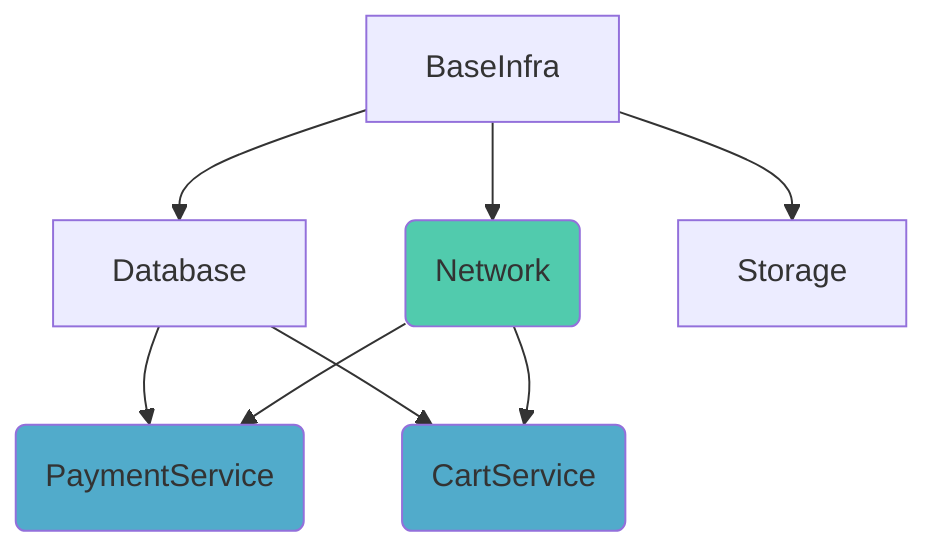
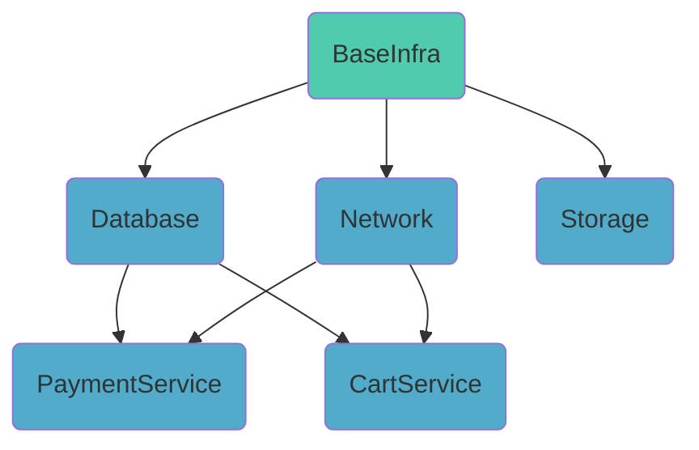
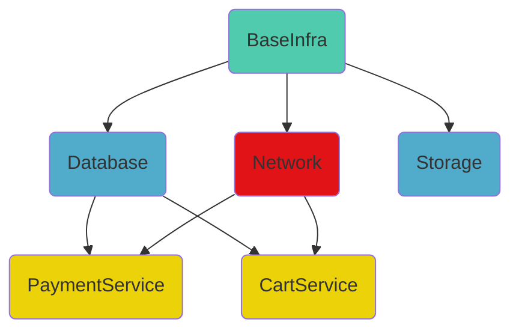
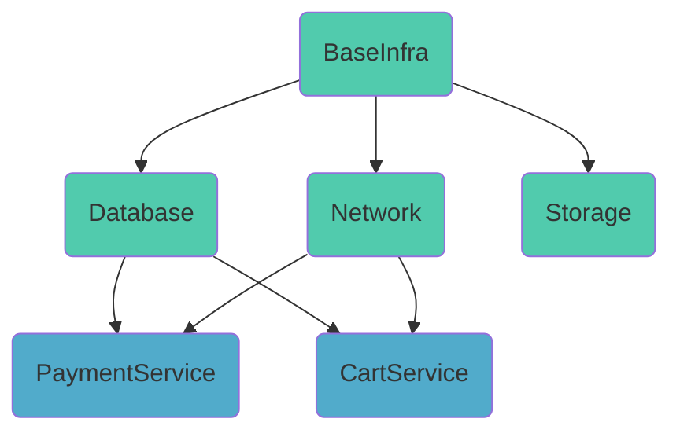
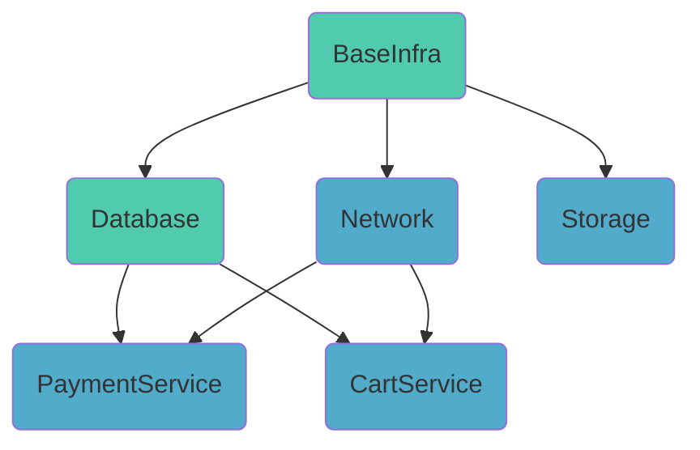

# Stack dependencies

Stacks can depend on other stacks. This is useful when you want to run a stack
only after another stacks have finished running. For example, you might want to
deploy a database stack before a stack that uses the database.

!!! info
    Stack dependencies only respect [tracked runs](../run/tracked.md). [Proposed runs](../run/proposed.md) and [tasks](../run/task.md) are not considered.

## Defining stack dependencies

Stack dependencies can be defined in the `Dependencies` tab of the stack.

!!! info
    You can only create dependencies between stacks that you're both an admin of. See [Spaces Access Control](../spaces/access-control.md) for more information.
## How it works

Stack dependencies are directed acyclic graphs ([DAGs](https://wikipedia.org/wiki/Directed_acyclic_graph)). This means that a stack
can depend on multiple stacks, and a stack can be depended on by multiple stacks but there cannot be loops:
you will receive an error if you try to add a stack to a dependency graph that will create a cycle.

When a tracked run is created in the stack (either triggered manually or by a VCS event), and the stack is a dependency of other stack(s), those stacks will queue up tracked runs and wait until the current stack's tracked run has finished running.

If a run fails in the dependency chain, all subsequent runs will be cancelled.

It will be easier to understand in a second.

## Examples

### Scenario 1

In the above example, if `Network` stack receives a push event to the tracked branch, it will start a run
immediately and queue up `PaymentService` and `CartService`. When `Network` finishes running,
those two will start running. Since `PaymentService` and `CartService` does not depend on each other,
they can run in parallel.

`BaseInfra` remains untouched, we never go _up_ in the dependency graph.

### Scenario 2

If `BaseInfra` receives a push event, it will start running immediately and queue up
_all_ of the stacks below. The order of the runs: `BaseInfra`, then `Database` & `Network` & `Storage` in parallel,
finally `PaymentService` & `CartService` in parallel.

Note: since `PaymentService` and `CartService` does not depend on `Storage`, they will not
wait until it finishes running.

### Scenario 3

In this scenario, similarly to the previous one `BaseInfra` received a push,
started running and queued up all of the stacks below. However, `Network` stack
has failed which means that the rest of the runs (`PaymentService` and `CartService`) will
be skipped.

_Same level_ stacks (`Database` & `Storage`) are not affected by the failure.

### Scenario 4

Let's assume that the infrastructure (`BaseInfra`, `Database`, `Network` and `Storage`) is a monorepo, and a push event affects all 4 stacks.
The situation isn't any different than [Scenario 2](#scenario-2). The dependencies are still respected and the stacks will run in the proper order: `BaseInfra` first, then `Database` & `Network` & `Storage` in parallel, finally `PaymentService` & `CartService` in parallel.

### Scenario 5

If `BaseInfra` and `Database` are a monorepo and a push event affects both of them, this scenario isn't any different than [Scenario 2](#scenario-2) and [Scenario 4](#scenario-4). The order from top to bottom is still the same: `BaseInfra` first, then `Database` & `Network` & `Storage` in parallel, finally `PaymentService` & `CartService` in parallel.

## Trigger policies

Stack dependencies are meant to be a replacement of [trigger policies](../policy/trigger-policy.md). There is no connection between the two features, and **the two shouldn't be combined ideally** to avoid confusion. However, if you have a trigger policy that is not covered by the stack dependencies, you can still use it.

## Stack deletion

A stack cannot be deleted if it has upstream or downstream dependencies. If you want to delete a stack, you need to delete all of its dependencies first.