# Stack dependencies

Stacks can depend on other stacks. This is useful when you want to run a stack
only after another stack have finished running. For example, you might want to
deploy a database stack before a stack that uses the database.

!!! info
    Stack dependencies only respect [tracked runs](../run/tracked.md). [Proposed runs](../run/proposed.md) and [tasks](../run/task.md) are not considered.

## Goals

Stack dependencies aim to solve the problem of ordering the execution of related runs triggered by the same VCS event.

Stack dependencies do **not** manage stack lifecycle events such as creating or deleting stacks.

## Defining stack dependencies

Stack dependencies can be defined in the `Dependencies` tab of the stack.

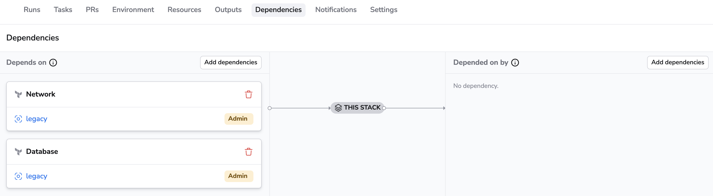

!!! info
    In order to create a dependency between two stacks you need to have at least **reader** permission to one stack (dependency) and **admin** permission to the other (dependee). See [Spaces Access Control](../spaces/access-control.md#roles) for more information.

### Defining references between stacks

You have the option to refer to outputs of other stacks: by default, your stack will be only triggered if the referenced output has been created or changed. If you enable the `Trigger always` option however, the stack will be triggered regardless of the referenced output.

!!! note
    Adding a new reference will always trigger a run. Removing one, however will not. If you want such behavior, consider enabling the `Trigger always` flag.

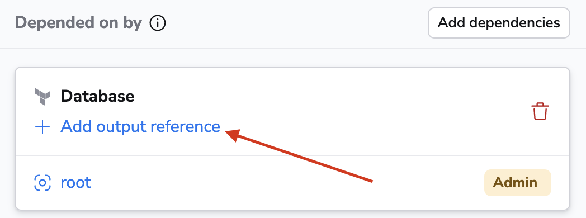

You can either choose an existing output value or add one that doesn't exist yet but will be created by the stack. On the receiving end, you need to choose an environment variable (`Input name`) to store the output value in.

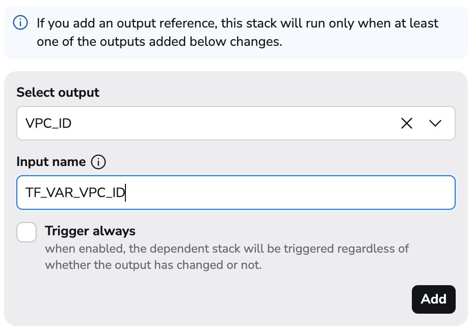

!!! tip
    If you use Terraform, make sure to use [`TF_VAR_`](https://developer.hashicorp.com/terraform/language/values/variables#environment-variables){: rel="nofollow"} prefix for environment variable names.

#### Enabling sensitive outputs for references

A stack output can be sensitive or non-sensitive. For example, in Terraform [you can mark an output](https://developer.hashicorp.com/terraform/language/values/outputs#sensitive-suppressing-values-in-cli-output){: rel="nofollow"} `sensitive = true`. Sensitive outputs are being masked in the Spacelift UI and in the logs.

Spacelift will upload sensitive outputs to the server - this is enabled by default on our public worker pool.

On [private worker pools](../../concepts/worker-pools) however, it needs to be enabled **explicitly** by adding `SPACELIFT_SENSITIVE_OUTPUT_UPLOAD_ENABLED=true` [environment variable](../../concepts/worker-pools#configuration-options) to the worker. This is a requirement if you wish to utilize sensitive outputs for stack dependencies.


In self-hosted, make sure to add `export SPACELIFT_SENSITIVE_OUTPUT_UPLOAD_ENABLED=true` to your `CustomUserDataSecretName` secret. You'll find more information about that variable at the [Worker Pool](../../concepts/worker-pools/docker-based-workers.md#injecting-custom-commands-during-instance-startup) page.


#### Stack dependency reference limitations

When a stack has an upstream dependency with a reference, it relies on the existence of the outputs.

!!! note
    We upload the outputs during the apply phase.  We override the outputs in the Outputs tab if the run failed.

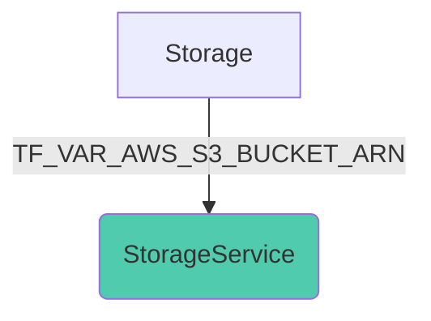

If you trigger `StorageService` in the above scenario, you need to make sure `Storage` has produced `TF_VAR_AWS_S3_BUCKET_ARN` already. Otherwise you'll get the following error:

```plain
job assignment failed: the following inputs are missing: Storage.TF_VAR_AWS_S3_BUCKET_ARN => TF_VAR_AWS_S3_BUCKET_ARN
```

!!! note
    We have enabled the output uploading to our backend on 2023 August 21. This means that if you have a stack that produced an output before that date, you'll need to rerun it to make the output available for references.

We upload outputs during the [Apply phase](../run/tracked.md#applying). If you stumble upon the error above, you'll need to make sure that the stack producing the output had a tracked run **with an Apply phase**.

You can simply do it by adding a dummy output to the stack and removing it afterwards:

```terraform
output "dummy" {
  value = "dummy"
}
```

!!! note
    If you are using CloudFormation - adding an output is considered a [no-op](https://docs.aws.amazon.com/AWSCloudFormation/latest/UserGuide/troubleshooting.html#troubleshooting-errors-no-updates-to-perform){: rel="nofollow"}, so if you are making an output-only change, you will need to make a modification to the Resources section of the CloudFormation template that is recognized as a change by CF - e.g adding a dummy resource like `AWS::CloudFormation::WaitConditionHandle`.

#### Reconciling failed runs

When detecting changes in outputs, we also consider the previous run of the dependent stack. If the previous run wasn't successful, we'll trigger it regardless of the output changes. This is to ensure that the dependent stack has a chance to recover from a potential failure.

#### Vendor limitations

[Ansible](../../vendors/ansible/README.md) and [Kubernetes](../../vendors/kubernetes/README.md) does not have the concept of outputs, so you cannot reference the outputs of them. They _can_ be on the receiving end though:

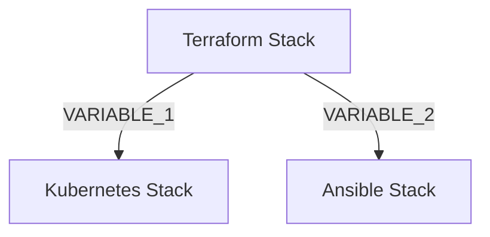

#### Scenario 1

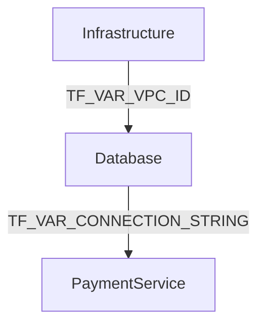

In case your `Infrastructure` stack has a `VPC_ID`, you can set that as an input to your `Database` stack (e.g. `TF_VAR_VPC_ID`). When the `Infrastructure` stack finishes running, the `Database` stack will be triggered and the `TF_VAR_VPC_ID` environment variable will be set to the value of the `VPC_ID` output of the `Infrastructure` stack.

If there is one or more references defined, the stack will only be triggered if the referenced output has been created or changed. If they remain the same, the downstream stack will be skipped. You can control this behavior by enabling or disabling the `Trigger always` option.

#### Scenario 2

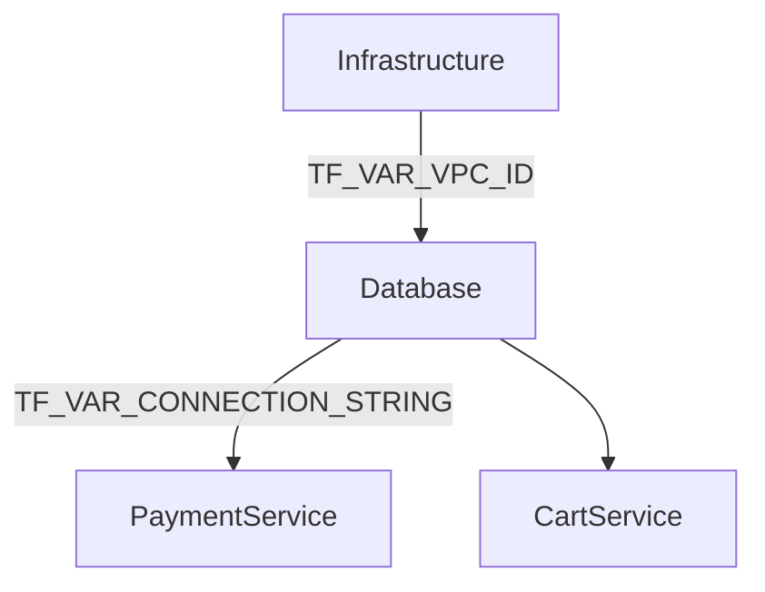

You can also mix references and referenceless dependencies. In the above case, `CartService` will be triggered whenever `Database` finishes running, regardless of the `TF_VAR_CONNECTION_STRING` output.

## Dependencies overview

In the `Dependencies` tab of the stack, there is a button called `Dependencies graph` to view the full dependency graph of the stack.

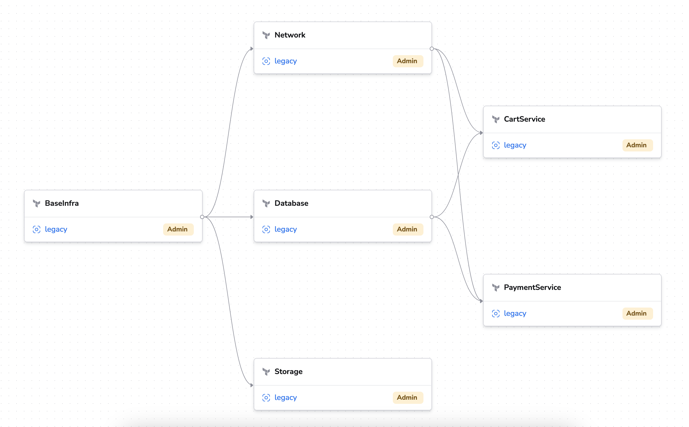

## How it works

Stack dependencies are directed acyclic graphs ([DAGs](https://wikipedia.org/wiki/Directed_acyclic_graph){: rel="nofollow"}). This means that a stack
can depend on multiple stacks, and a stack can be depended on by multiple stacks but there cannot be loops:
you will receive an error if you try to add a stack to a dependency graph that will create a cycle.

When a tracked run is created in the stack (either triggered manually or by a VCS event), and the stack is a dependency of other stack(s), those stacks will queue up tracked runs and wait until the current stack's tracked run has finished running.

If a run fails in the dependency chain, all subsequent runs will be cancelled.

It will be easier to understand in a second.

## Examples

### Scenario 1

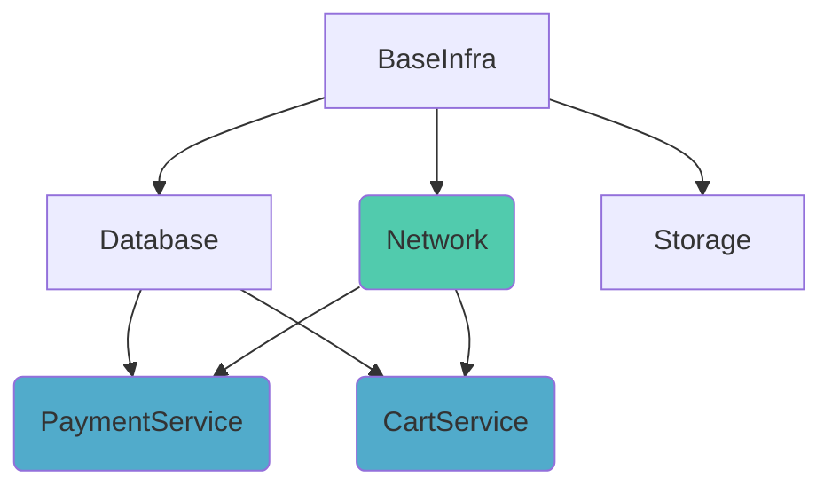

In the above example, if `Network` stack receives a push event to the tracked branch, it will start a run
immediately and queue up `PaymentService` and `CartService`. When `Network` finishes running,
those two will start running. Since `PaymentService` and `CartService` does not depend on each other,
they can run in parallel.

`BaseInfra` remains untouched, we never go _up_ in the dependency graph.

### Scenario 2

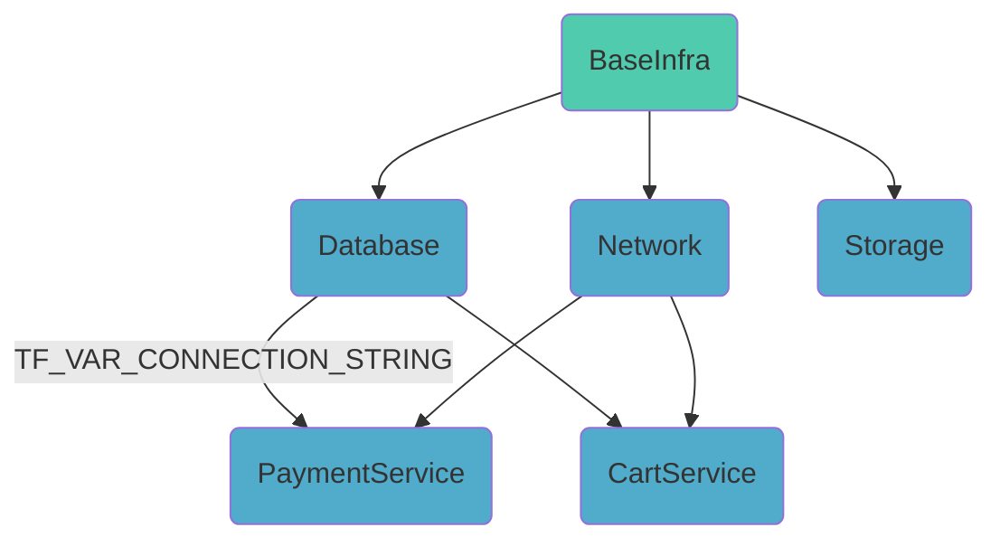

If `BaseInfra` receives a push event, it will start running immediately and queue up
_all_ of the stacks below. The order of the runs: `BaseInfra`, then `Database` & `Network` & `Storage` in parallel,
finally `PaymentService` & `CartService` in parallel.

Since `PaymentService` and `CartService` does not depend on `Storage`, they will not
wait until it finishes running.

Note: `PaymentService` references `Database` with `TF_VAR_CONNECTION_STRING`. But since it also depends on `Network` with no references, it'll run regardless of the `TF_VAR_CONNECTION_STRING` output. If the `Database` stack does not have the corresponding output, the `TF_VAR_CONNECTION_STRING` environment variable will not be injected into the run.

### Scenario 3

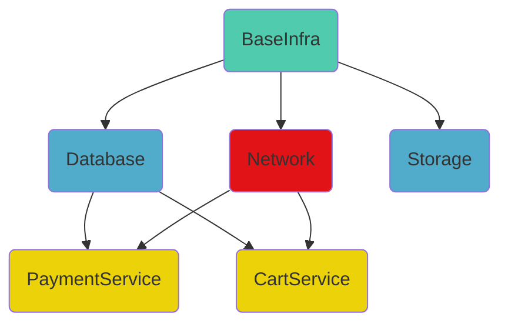

In this scenario, similarly to the previous one `BaseInfra` received a push,
started running and queued up all of the stacks below. However, `Network` stack
has failed which means that the rest of the runs (`PaymentService` and `CartService`) will
be skipped.

_Same level_ stacks (`Database` & `Storage`) are not affected by the failure.

### Scenario 4

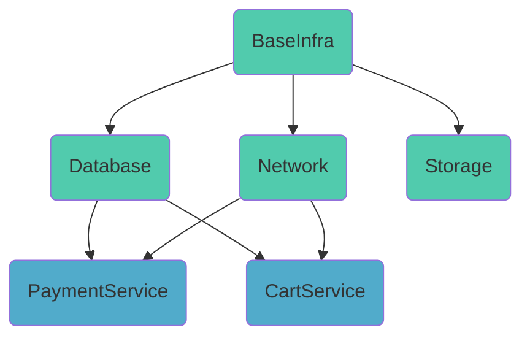

Let's assume that the infrastructure (`BaseInfra`, `Database`, `Network` and `Storage`) is a monorepo, and a push event affects all 4 stacks.
The situation isn't any different than [Scenario 2](#scenario-2). The dependencies are still respected and the stacks will run in the proper order: `BaseInfra` first, then `Database` & `Network` & `Storage` in parallel, finally `PaymentService` & `CartService` in parallel.

### Scenario 5

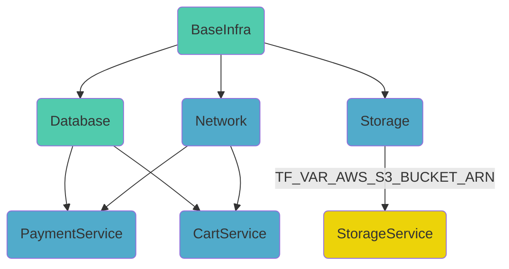

If `BaseInfra` and `Database` are a monorepo and a push event affects both of them, this scenario isn't any different than [Scenario 2](#scenario-2) and [Scenario 4](#scenario-4). The order from top to bottom is still the same: `BaseInfra` first, then `Database` & `Network` & `Storage` in parallel, finally `PaymentService` & `CartService` in parallel.

`Storage` and `StorageService`: let's say that the S3 bucket resource of `Storage` already exists. This means that the bucket ARN didn't change, so `StorageService` will be skipped.

## Trigger policies

Stack dependencies are a simpler alternative to [Trigger policies](../policy/trigger-policy.md) that cover most use cases. If your use case does not fit Stack dependencies, consider using a Trigger policy.

There is no connection between the two features, and **the two shouldn't be combined** to avoid confusion or even infinite loops in the dependency graph.

## Stack deletion

A stack cannot be deleted if it has downstream dependencies (child stacks depending on it). If you want to delete such a stack, you need to delete all of its downstream dependencies first. However, if a stack only has upstream dependencies (parent stacks that it depends on), it can be deleted without any issues.

## Ordered Stack creation and deletion

As [mentioned earlier](#goals), Stack Dependencies do not aim to handle the lifecycle of the stacks.

Ordering the creation and deletion of stacks in a specific order is not impossible though. If you manage your Spacelift stacks with the [Spacelift Terraform Provider](../../vendors/terraform/terraform-provider.md), you can easily do it by setting [`spacelift_stack_destructor`](https://registry.terraform.io/providers/spacelift-io/spacelift/latest/docs/resources/stack_destructor){: rel="nofollow"} resources and setting the [`depends_on`](https://developer.hashicorp.com/terraform/language/meta-arguments/depends_on){: rel="nofollow"} Terraform attribute on them.

Here is a simple example of creating a dependency between 3 stacks and setting up a destructor for them. By setting up a destructor resource with the proper `depends_on` attribute, it ensures that the deletion of the stacks will happen in the proper order. First child, then parent. This is also an easy way to create short-lived environments.

```terraform
# VPC -> Infra -> App

resource "spacelift_stack" "vpc" {
  name       = "VPC"
  repository = "vpc"
  branch     = "main"
}

resource "spacelift_stack" "infra" {
  name       = "Infra"
  repository = "infra"
  branch     = "main"
}

resource "spacelift_stack" "app" {
  name       = "Application"
  repository = "app"
  branch     = "main"
}

resource "spacelift_stack_dependency" "infra_vpc" {
  stack_id            = spacelift_stack.infra.id
  depends_on_stack_id = spacelift_stack.vpc.id
}

resource "spacelift_stack_dependency" "app_infra" {
  stack_id            = spacelift_stack.app.id
  depends_on_stack_id = spacelift_stack.infra.id
}

resource "spacelift_stack_dependency_reference" "infra_vpc" {
  stack_dependency_id = spacelift_stack_dependency.infra_vpc.id
  input_name          = "TF_VAR_vpc_id"
  output_name         = "vpc_id"
}

resource "spacelift_stack_dependency_reference" "app_infra" {
  stack_dependency_id = spacelift_stack_dependency.app_infra.id
  input_name          = "TF_VAR_kms_arn"
  output_name         = "kms_arn"
}

resource "spacelift_stack_destructor" "vpc" {
  stack_id = spacelift_stack.vpc.id
}

resource "spacelift_stack_destructor" "infra" {
  stack_id = spacelift_stack.infra.id

  depends_on = [spacelift_stack_destructor.vpc]
}

resource "spacelift_stack_destructor" "app" {
  stack_id = spacelift_stack.app.id

  depends_on = [spacelift_stack_destructor.infra]
}
```

What happens during `terraform apply`:

- Terraform creates the 3 stacks
- Sets up the dependency between them

You might notice the three destructors at the end. They don't do anything yet, but they will be used during `terraform destroy`. Destroy order:

- Terraform destroys the dependencies and dependency references
- Destroys the grandchild stack (`app`) **and** its resources
- Destroys the parent stack (`infra`) **and** its resources
- Finally, destroys the grandparent stack (`vpc`) **and** its resources
