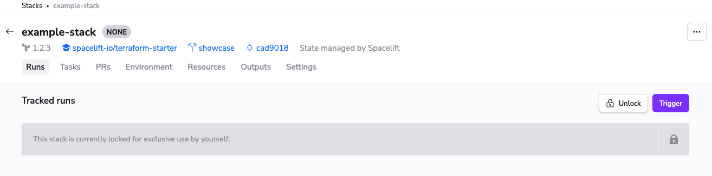

# Stack locking

Spacelift supports locking the stack for one person's exclusive use. This can be very handy if a delicate operation is taking place that could easily be affected by someone else making changes in the meantime. Every stack [writer](../policy/stack-access-policy.md#readers-and-writers) can lock the stack unless it's already locked.

The owner of the lock is the only one who can trigger [runs](../run/) and [tasks](../run/task.md) for the entire duration of the lock. Locks never expire, and only its creator and Spacelift admins can release it.

!!! info
    Note that while a stack is locked, [auto deploy](stack-settings.md#autodeploy) is disabled to prevent accidental deployments.
