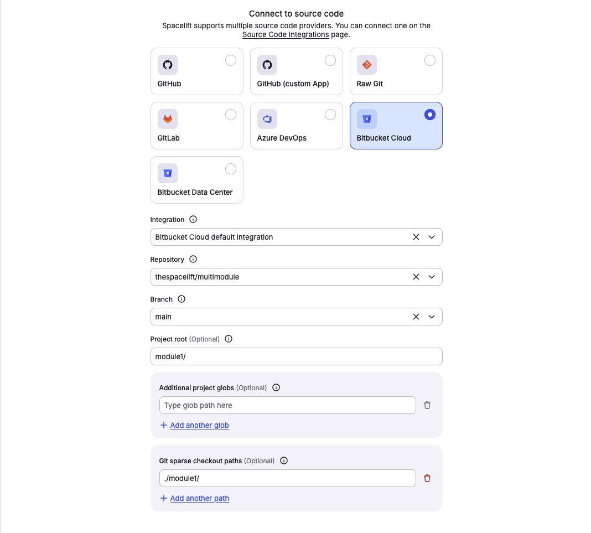
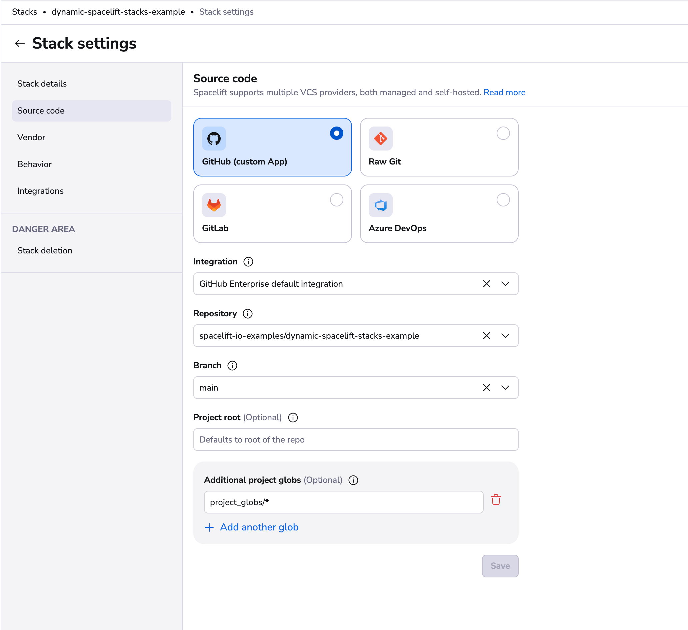

# Stack settings

Many settings can be configured directly on the stack to influence how [runs](../run/README.md) and [tasks](../run/task.md) within a stack are processed. Other factors that influence runs and tasks include:

- [Environment variables](../configuration/environment.md)
- Attached [contexts](../configuration/context.md)
- [Runtime configuration](../configuration/runtime-configuration/README.md)
- Integrations

## Video Walkthrough

<div style="padding:56.25% 0 0 0;position:relative;"><iframe src="https://player.vimeo.com/video/1046826238?badge=0&amp;autopause=0&amp;player_id=0&amp;app_id=58479" frameborder="0" allow="autoplay; fullscreen; picture-in-picture; clipboard-write; encrypted-media" style="position:absolute;top:0;left:0;width:100%;height:100%;" title="stack_options"></iframe></div><script src="https://player.vimeo.com/api/player.js"></script>

## Common settings

You can configure these settings when you first [create a stack](../../getting-started/create-stack/README.md) or when it's already created. If you're editing an existing stack's settings:

1. Navigate to the _Stacks_ page in Spacelift.
2. Click the three dots beside a stack name you want to configure.
3. Click **Settings**, then click **Behavior**.
4. Make your adjustments and click **Save**.

### Administrative

!!! warning "Deprecated - Use stack role attachments instead"
    The administrative flag is deprecated and will be automatically disabled on June 1st, 2026. On that date, Spacelift will automatically attach the Space Admin role to each stack's own space, which is 100% backward compatible but does not provide advanced features.

    We recommend migrating as soon as possible to [stack role attachments](../authorization/assigning-roles-stacks.md) to take advantage of:

    - **Cross-space access**: Access sibling spaces, not just your own space and subspaces
    - **Fine-grained permissions**: Use custom roles with specific actions instead of full Space Admin permissions
    - **Enhanced audit trail**: Role information included in webhook payloads

    **To replicate the current behavior**, attach the Space Admin role to the stack using its own space as the binding space. See the [migration guide](../authorization/assigning-roles-stacks.md#migration-from-administrative-flag) for detailed instructions.

This legacy setting determines whether a stack has administrative privileges within its [space](../spaces/README.md). Administrative stacks receive an API token that grants them elevated access to a subset of the Spacelift API, which is used by the [Terraform provider](../../vendors/terraform/terraform-provider.md). This allows them to create, update, and destroy Spacelift resources.

!!! info
    Administrative stacks get the Admin role in the [space they belong to](../spaces/access-control.md#access-control) and all of its subspaces.

Administrative stacks can declaratively manage other stacks, their [environments](../configuration/environment.md), [contexts](../configuration/context.md), [policies](../policy/README.md), [modules](../../vendors/terraform/module-registry.md), and [worker pools](../worker-pools). This approach helps avoid manual configuration, often referred to as "ClickOps."

You can also export stack outputs as a [context](../configuration/context.md) to avoid exposing the entire state through Terraform's remote state or external storage mechanisms like [AWS Parameter Store](https://docs.aws.amazon.com/systems-manager/latest/userguide/systems-manager-parameter-store.html){: rel="nofollow"} or [Secrets Manager](https://aws.amazon.com/secrets-manager/){: rel="nofollow"}.

### Autodeploy

When Autodeploy is enabled (_true_), any change to the tracked branch will be automatically [applied](../run/tracked.md#applying) if the [planning](../run/proposed.md#planning) phase is successful and there are no plan policy warnings.

You might consider enabling Autodeploy if you always perform an [automated code review](../policy/terraform-plan-policy.md#automated-code-review) before merging to the tracked branch or if you rely on [plan policies](../policy/terraform-plan-policy.md) to flag potential issues. If every change undergoes a meaningful human review by stack [writers](../policy/stack-access-policy.md#readers-and-writers), requiring an additional step to confirm deployment may be unnecessary.

When Autodeploy is enabled, [approval policies](../policy/approval-policy.md) are only evaluated during the **queued** stage, not in the unconfirmed state.

### Autoretry

This setting determines whether obsolete proposed changes are retried automatically. When Autoretry is enabled (_true_), any Pull Requests to the [tracked branch](#vcs-integration-and-repository) that conflict with an applied change will be reevaluated based on the updated state.

This feature saves you from manually retrying runs on Pull Requests when the state changes. It also provides greater confidence that the proposed changes will match the actual changes after merging the Pull Request.

Autoretry is only supported for [stacks](./README.md) with a private [worker pool](../worker-pools/README.md) attached.

### Customizing workflow

Spacelift workflows can be customized by adding extra commands to be executed before and after specific phases:

- [Initialization](../run/README.md#initializing) (`before_init` and `after_init`)
- [Planning](../run/proposed.md#planning) (`before_plan` and `after_plan`)
- [Applying](../run/tracked.md#applying) (`before_apply` and `after_apply`)
- Destroying (`before_destroy` and `after_destroy`)
    - Used during [module test cases](../run/test-case.md)
    - Used by stacks during destruction with corresponding [stack_destructor_resource](../stack/stack-dependencies.md#ordered-stack-creation-and-deletion)
- [Performing](../run/task.md#performing-a-task) (`before_perform` and `after_perform`)
- Finally (`after_run`): Executed after each actively processed run, regardless of its outcome. These hooks have access to an environment variable called `TF_VAR_spacelift_final_run_state`, which indicates the final state of the run.

All hooks, including `after_run`, execute on the worker. If the run is terminated outside the worker (e.g., canceled or discarded), or if there is an issue setting up the workspace or starting the worker container, the hooks will not fire.

!!! info
    If a "before" hook fails (non-zero exit code), the corresponding phase will not execute. Similarly, if a phase fails, none of the "after" hooks will execute unless the hook uses a semicolon (`;`).

These commands can serve two main purposes: modifying the workspace (such as setting up symlinks or moving files) or running validations using tools like [`tfsec`](https://github.com/tfsec/tfsec){: rel="nofollow"}, [`tflint`](https://github.com/terraform-linters/tflint){: rel="nofollow"}, or `terraform fmt`.

#### How to run multiple commands

Avoid using newlines (`\n`) in hooks. Spacelift chains commands with double ampersands (`&&`), and using newlines can hide non-zero exit codes if the last command in the block succeeds. To run multiple commands, either add multiple hooks or use a script as a [mounted file](../configuration/environment.md#mounted-files) and call it in the hook.

Additionally, using a semicolon (`;`) in hooks will cause subsequent commands to run even if the phase fails. Use `&&` or wrap your hook in parentheses to ensure "after" commands only execute if the phase succeeds.

!!! warning
    When a run resumes after being paused (e.g., for confirmation or approval), the remaining phases run in a new container. Any tools installed in earlier phases will not be available. To avoid this, bake the tools into a [custom runner image](../../integrations/docker.md#customizing-the-runner-image).


The workflow can be customized using either the [Terraform provider](https://registry.terraform.io/providers/spacelift-io/spacelift/latest/docs/resources/stack){: rel="nofollow"} or the GUI. The GUI provides an intuitive editor that allows you to add, remove, and reorder commands using drag-and-drop functionality. Commands preceding a phase are "before" hooks, while those following it are "after" hooks:



The workflow can be customized using either the [Terraform provider](https://registry.terraform.io/providers/spacelift-io/spacelift/latest/docs/resources/stack){: rel="nofollow"} or the GUI. The GUI allows you to select a phase, add commands before and after it, and reorder them using drag-and-drop functionality. Commands preceding a phase are "before" hooks, while those following it are "after" hooks:

.png>)


Commands run in the same shell session as the phase itself, so the phase will have access to any shell variables exported by preceding scripts. Environment variables are preserved across phases.

!!! info
    These scripts can be overridden by the [runtime configuration](../configuration/runtime-configuration/README.md) specified in the `.spacelift/config.yml` file.



#### Note on hook order

Hooks added to stacks and contexts attached to them follow distinct ordering principles.

- **Stack hooks** are organized through a drag-and-drop mechanism.
- **Context hooks** adhere to prioritization based on context priority
- **Auto-attached contexts** are arranged alphabetically or reversed alphabetically depending on the operation type (before/after).

Hooks from manually and auto-attached contexts can only be edited from their respective views.

In the _before_ phase, hook priorities work as follows:

- context hooks (based on set priorities)
- context auto-attached hooks (reversed alphabetically)
- stack hooks

In the _after_ phase, hook priorities work as follows:

- stack hooks
- context auto-attached hooks (alphabetically)
- context hooks (reversed priorities)

Let's suppose you have 4 contexts attached to a stack:

- context_a (auto-attached)
- context_b (auto-attached)
- context_c (priority 0)
- context_d (priority 5)

In all of these contexts, we have added hooks that echo the context name before and after phases. To add to this, we will also add two static hooks on the stack level that will do a simple "echo stack".

_Before_ phase order:

- context_c
- context_d
- context_b
- context_a
- stack

_After_ phase order:

- stack
- context_a
- context_b
- context_d
- context_c



### Runtime commands

Spacelift can handle special commands to change the workflow behavior. Runtime commands use the echo command in a specific format. You can use those commands in any lifecycle step of the workflow.







```bash
echo "::command arg1 arg2"
```

Below is a list of supported commands. See the more detailed doc after this table.

| Command                   | Description                                              |
| ------------------------- | -------------------------------------------------------- |
| [`::add-mask`](#add-mask) | Adds a set of values that should be masked in log output |

#### ::add-mask

When you mask a value, it is treated as a secret and will be redacted in the logs output. Each masked word separated by whitespace is replaced with five `*` characters.

##### Example

```bash
# Multiple masks can be set with a single command
echo "::add-mask secret-string another-secret-string"

# You can pull a secret dynamically, for example here we can mask the account ID
echo "::add-mask $(aws sts get-caller-identity | jq -r .Account)"
```

### Enable local preview

Indicates whether creating [proposed Runs](../run/proposed.md) based on user-uploaded local workspaces is allowed.

If this is enabled, you can use [spacectl](https://github.com/spacelift-io/spacectl){: rel="nofollow"} to create a proposed run based on the directory you're in:

```bash
spacectl stack local-preview --id <stack-id>
```

!!! warning
    Use this setting with caution, as it allows anybody with write access to the Stack to execute arbitrary code with access to all the environment variables configured in the Stack.

### Enable well known secret masking

This setting determines if secret patterns will be automatically redacted from logs. If enabled, the following secrets will be masked from logs:

- AWS Access Key Id
- Azure AD Client Secret
- Azure Connection Strings (`AccountKey=...`, `SharedAccessSignature=...`)
- GitHub PAT
- GitHub Fine-Grained PAT
- GitHub App Token
- GitHub Refresh Token
- GitHub OAuth Access Token
- JWT tokens
- Slack Token
- PGP Private Key
- RSA Private Key
- PEM block with BEGIN PRIVATE KEY header

### Name and description

Stack name and description are pretty self-explanatory. The required _name_ is what you'll see in the stack list on the home screen and menu selection dropdown. Make sure that it's informative enough to be able to immediately communicate the purpose of the stack, but short enough so that it fits nicely in the dropdown, and no important information is cut off.

The optional _description_ is completely free-form and it supports [Markdown](https://daringfireball.net/projects/markdown/){: rel="nofollow"}. This is a good place for a thorough explanation of the purpose of the stack and a link or two.

!!! tip
    Based on the original _name_, Spacelift generates an immutable slug that serves as a unique identifier of this stack. If the name and the slug diverge significantly, things may become confusing.

    Even though you can change the stack name at any point, we strongly discourage all non-trivial changes.

### Labels

Labels are arbitrary, user-defined tags that can be attached to Stacks. A single Stack can have an arbitrary number of these, but they **must** be unique. Labels can be used for any purpose, including UI filtering, but one area where they shine most is user-defined [policies](../policy/README.md#policy-library) which can modify their behavior based on the presence (or lack thereof) of a particular label.

There are some **magic** labels that you can add to your stacks. These labels add/remove functionalities based on their presence.

List of the most useful labels:

- **infracost** -- Enables Infracost on your stack
- **feature:enable_log_timestamps** -- Enables timestamps on run logs.
- **feature:add_plan_pr_comment** -- Enables Pull Request Plan Commenting. It is deprecated. Please use [Notification policies](../policy/notification-policy.md#complex-example-adding-a-comment-to-a-pull-request-about-changed-resources) instead.
- **feature:disable_pr_comments** - Disables Pull Request Comments
- **feature:disable_pr_delta_comments** - Disables Pull Request Delta Comments
- **feature:disable_resource_sanitization** -- Disables resource sanitization
- **feature:enable_git_checkout** -- Enables support for downloading source code using standard Git checkout rather than downloading a tarball via API
- **feature:ignore_runtime_config** -- Ignores .spacelift/config
- **terragrunt** -- Old way of using Terragrunt from the Terraform backend
- **ghenv: Name** -- GitHub Deployment environment (defaults to the stack name)
- **ghenv: -** -- Disables the creation of GitHub deployment environments
- **autoattach:autoattached_label** -- Used for policies/contexts to autoattach the policy/contexts to all stacks containing `autoattached_label`
- **feature:k8s_keep_using_prune_white_list_flag** -- sets `--prune-whitelist` flag instead of `--prune-allowlist` for the template parameter `.PruneWhiteList` in the Kubernetes custom workflow.
- **feature:pr_enforce_unique_module_version** -- Enforces module version to be unique even for PR checks

### Project root

Project root points to the directory within the repo where the project should start executing. This is especially useful for monorepos or repositories hosting multiple somewhat independent projects. This setting plays very well with [Git push policies](../policy/push-policy/README.md), allowing you to easily express generic rules on what it means for the stack to be affected by a code change. In the absence of push policies, any changes made to the project root and any paths specified by project globs will trigger Spacelift runs.

!!! info
    The project root can be overridden by the [runtime configuration](../configuration/runtime-configuration/README.md#project_root-setting) specified in the `.spacelift/config.yml` file.

### Git sparse checkout paths

Git sparse checkout paths allow you to specify a list of directories and files that will be used in sparse checkout, meaning that only the specified directories and files from the list will be cloned. This can help reduce the size of the workspace by only downloading the parts of the repository that are needed for the stack.

Only path values are allowed; glob patterns are not supported.

Example valid paths:

- `./infrastructure/`
- `infrastructure/`
- `infrastructure`
- `./infrastructure/main.tf`

Example invalid path (glob pattern):

- `./infrastructure/*`



### Project globs

The project globs option allows you to specify files and directories outside of the project root that the stack cares about. In the absence of push policies, any changes made to the project root and any paths specified by project globs will trigger Spacelift runs.

!!! warning
    Project globs do not mount the files or directories in your project root.  They are used primarily for triggering your stack when, for example, there are changes to a module outside of the project root.



You aren't required to add any project globs if you don't want to, but you have the option to add as many project globs as you want for a stack.

Under the hood, the project globs option takes advantage of the [doublestar.Match](https://github.com/bmatcuk/doublestar?tab=readme-ov-file#match){: rel="nofollow"} function to do pattern matching.

Example matches:

- Any directory or file: `**`
- A directory and all of its content: `dir/*`
- A directory path and all of its subdirectories and files: `dir/**`
- Match all files with a specific extension: `dir/*.tf`
- Match all files that start with a string, end with another and have a predefined number of chars in the middle -- `data-???-report` will match three chars between data and report
- Match all files that start with a string, and finish with any character from a sequence: `dir/instance[0-9].tf`

As you can see in the example matches, these are the regex rules that you are already accustomed to.

### VCS integration and repository


We have two types of integrations types: default and Space-level. Default integrations will be always available for all stacks, and Space-level integrations will be available only for stacks that are in the same Space as the integration or have access to it [via inheritance](../spaces/access-control.md#inheritance). Read more about VCS integrations in the [source control](../../getting-started/integrate-source-code/README.md) page.

_Repository_ and _branch_ point to the location of the source code for a stack. The repository must either belong to the GitHub account linked to Spacelift (its choice may further be limited by the way the Spacelift GitHub app has been installed) or to the GitLab server integrated with your Spacelift account. For more information about these integrations, please refer to our [GitHub](../../getting-started/integrate-source-code/GitHub.md) and [GitLab](../../getting-started/integrate-source-code/GitLab.md) documentation.

Thanks to the strong integration between GitHub and Spacelift, the link between a stack and a repository can survive the repository being renamed in GitHub. If you're storing your repositories in GitLab, then you need to make sure to manually (or programmatically using [Terraform](../../vendors/terraform/terraform-provider.md)) point the stack to the new location of the source code.

!!! info
    Spacelift does not support moving repositories between GitHub accounts, since Spacelift accounts are strongly linked to GitHub ones. In that case the best course of action is to take your Terraform state, download it and import it while recreating the stack (or multiple stacks) in a different account. After that, all the stacks pointing to the old repository can be safely deleted.

    Moving a repository between GitHub and GitLab or the other way around is simple, however. Just change the provider setting on the Spacelift project, and point the stack to the new source code location.

_Branch_ signifies the repository branch **tracked** by the stack. By default, unless a [Git push policy](../policy/push-policy/README.md) explicitly determines otherwise, a commit pushed to the tracked branch triggers a deployment represented by a **tracked** run. A push to any other branch by default triggers a test represented by a **proposed** run. Learn more about [git push policies](../policy/push-policy/README.md#git-push-policy-and-tracked-branch), tracked branches, and head commits.

Results of both tracked and proposed runs are displayed in the source control provider using their specific APIs. Refer to our [GitHub](../../integrations/source-control/github.md) and [GitLab](../../integrations/source-control/gitlab.md) documentation to understand how Spacelift feedback is provided for your infrastructure changes.

!!! info
    A branch must exist **before** it's pointed to in Spacelift.

### Runner image

Since every Spacelift job (which we call a [run](../run/README.md)) is executed in a [separate Docker container](../../integrations/docker.md), setting a custom runner image provides a convenient way to prepare the exact runtime environment your infra-as-code flow is designed to use.

Additionally, for our Pulumi integration, overriding the default runner image is the canonical way of selecting the exact Pulumi version and its corresponding language SDK.

!!! info
    Runner image can be overridden by the [runtime configuration](../configuration/runtime-configuration/README.md#runner_image-setting) specified in the `.spacelift/config.yml` file.

On the public worker pool, Docker images can only be pulled from [allowed registries](../../integrations/docker.md#allowed-registries-on-public-worker-pools). On private workers, images can be stored in any registry, including self-hosted ones.

### Worker pool

Use this setting to choose which [worker pool](../worker-pools/README.md) to use. The default is public workers.

## OpenTofu/Terraform-specific settings

### Version {: #terraform-version or #opentofu-version}

The OpenTofu/Terraform version is set when a stack is created to indicate the version of OpenTofu/Terraform that will be used with this project. However, Spacelift covers the entire [Terraform version management](../../vendors/terraform/version-management.md) story, and applying a change with a newer version will automatically update the version on the stack.

### Workspace {: #terraform-workspace or #opentofu-workspace}

[OpenTofu workspaces](https://opentofu.org/docs/language/state/workspaces/) and [Terraform workspaces](https://www.terraform.io/docs/language/state/workspaces.html){: rel="nofollow"} are supported by Spacelift, too, as long as your state backend supports them. If the workspace is set, Spacelift will try to first _select_, and then (should that fail) automatically _create_ the required [OpenTofu](https://opentofu.org/docs/language/state/workspaces/#using-workspaces){: rel="nofollow"}/[Terraform](https://www.terraform.io/docs/language/state/workspaces.html#using-workspaces){: rel="nofollow"} workspace on the state backend.

If you're [managing your OpenTofu/Terraform state through Spacelift](../../vendors/terraform/state-management.md), the workspace argument is ignored since Spacelift gives each stack a separate workspace by default.

## Pulumi-specific settings

### Login URL {: #pulumi-login-url}

Login URL is the address Pulumi should log into during Run initialization. Since we do not yet provide a full-featured Pulumi state backend, you need to bring your own (e.g. [Amazon S3](https://www.pulumi.com/docs/intro/concepts/state/#logging-into-the-aws-s3-backend){: rel="nofollow"}).

You can read more about the [login process](https://www.pulumi.com/docs/reference/cli/pulumi_login/){: rel="nofollow"} and a general explanation of [Pulumi state management and backends](https://www.pulumi.com/docs/intro/concepts/state/){: rel="nofollow"}.

### Stack name {: #pulumi-stackname}

The name of the Pulumi stack, which should be selected for backend operations. Please do not confuse it with the [Spacelift stack name](#name-and-description). They _may_ be different, but it's useful to keep them identical.
