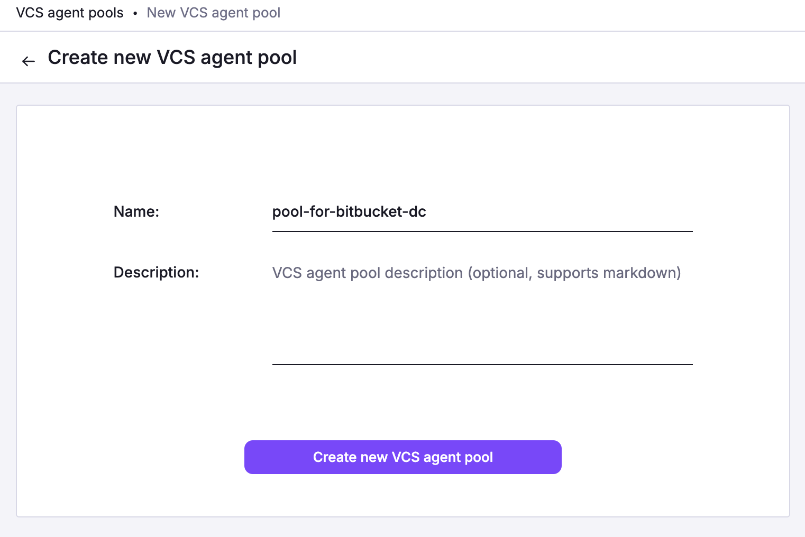

# VCS Agent Pools

!!! info
    Note that private self-hosted VCS integration is an Enterprise plan feature.

By default, Spacelift communicates with your VCS provider directly. This is usually sufficient, but some users may have special requirements regarding infrastructure, security or compliance, and need to host their VCS system in a way that's only accessible internally, where Spacelift can't reach it. This is where VCS Agent Pools come into play.

A single VCS Agent Pool is a way for Spacelift to communicate with a single VCS system on your side. You run VCS Agents inside of your infrastructure and configure them with your internal VCS system endpoint. They will then connect to a gateway on our backend, and we will be able to access your VCS system through them.

On the Agent there are very conservative checks on what requests are let through and which ones are denied, with an explicit allowlist of paths that are necessary for Spacelift to work. All requests will be logged to standard output with a description about what they were used for.

## Create the VCS Agent Pool

Navigate to VCS Agent Pools using the Spacelift navigation sidebar. Click **Add VCS Agent Pool.**


Give your VCS Agent Pool a name and description, and you're done! A configuration token will be downloaded.



## Running the VCS Agent

### Download the VCS Agent binaries

The latest version of the VCS Agent binaries are available at Spacelift's CDN: [x86_64](https://downloads.spacelift.io/spacelift-vcs-agent-x86_64) (amd64 CPU) and [aarch64](https://downloads.spacelift.io/spacelift-vcs-agent-aarch64) (arm64 CPU).

### Run via Docker

The VCS Agent is also available as a multi-arch (amd64 and arm64) Docker image:

- `public.ecr.aws/spacelift/vcs-agent:latest`
- `public.ecr.aws/spacelift/vcs-agent:<version>`

The available versions are listed in the [GitHub Releases](https://github.com/spacelift-io/vcs-agent/releases) page.

```shell
docker run -it --rm -e "SPACELIFT_VCS_AGENT_POOL_TOKEN=<VCS TOKEN>" \
  -e "SPACELIFT_VCS_AGENT_TARGET_BASE_ENDPOINT=http://169.254.0.10:7990" \
  -e "SPACELIFT_VCS_AGENT_VENDOR=bitbucket_datacenter" \
  public.ecr.aws/spacelift/vcs-agent
```

### Run the VCS Agent inside a Kubernetes Cluster

We have a [VCS Agent Helm Chart](https://github.com/spacelift-io/spacelift-helm-charts){: rel="nofollow"} that you can use to install the VCS Agent on top of your Kubernetes Cluster. After creating a VCS Agent Pool in Spacelift and generating a token, you can add our Helm chart repo and update your local cache using:

```shell
helm repo add spacelift https://downloads.spacelift.io/helm
helm repo update
```

Assuming your token, VCS endpoint and vendor are stored in the `SPACELIFT_VCS_AGENT_POOL_TOKEN`, `SPACELIFT_VCS_AGENT_TARGET_BASE_ENDPOINT` and `SPACELIFT_VCS_AGENT_VENDOR` environment
variables, you can install the chart using the following command:

```shell
helm upgrade vcs-agent spacelift/vcs-agent --install --set "credentials.token=$SPACELIFT_VCS_AGENT_POOL_TOKEN,credentials.endpoint=$SPACELIFT_VCS_AGENT_TARGET_BASE_ENDPOINT,credentials.vendor=$SPACELIFT_VCS_AGENT_VENDOR"
```

## Configure and run the VCS Agent

A number of configuration variables is available to customize how your VCS Agent behaves. The ones marked as required are … well … required.

| CLI Flag                 | Environment Variable                       | Status   | Default Value | Description                                                                                                                          |
| ------------------------ | ------------------------------------------ | -------- | ------------- | ------------------------------------------------------------------------------------------------------------------------------------ |
| `--target-base-endpoint` | `SPACELIFT_VCS_AGENT_TARGET_BASE_ENDPOINT` | Required |               | The internal endpoint of your VCS system, including the protocol, as well as port, if applicable. (e.g., `http://169.254.0.10:7990`) |
| `--token`                | `SPACELIFT_VCS_AGENT_POOL_TOKEN`           | Required |               | The token you’ve received from Spacelift during VCS Agent Pool creation                                                              |
| `--vendor`               | `SPACELIFT_VCS_AGENT_VENDOR`               | Required |               | The vendor of your VCS system. Currently available options are `gitlab`, `bitbucket_datacenter` and `github_enterprise`              |
| `--allowed-projects`     | `SPACELIFT_VCS_AGENT_ALLOWED_PROJECTS`     | Optional | `.*`          | Regexp matching allowed projects for API calls. Projects are in the form: 'group/repository'.                                        |
| `--bugsnag-api-key`      | `SPACELIFT_VCS_AGENT_BUGSNAG_API_KEY`      | Optional |               | Override the Bugsnag API key used for error reporting.                                                                               |
| `--parallelism`          | `SPACELIFT_VCS_AGENT_PARALLELISM`          | Optional | `4`           | Number of streams to create. Each stream can handle one request simultaneously.                                                      |
| `--debug-print-all`      | `SPACELIFT_VCS_AGENT_DEBUG_PRINT_ALL`      | Optional | `false`       | Makes vcs-agent print out all the requests and responses.                                                                            |
|                          | `HTTPS_PROXY`                              | Optional |               | Hostname or IP address of the proxy server, including the protocol, as well as port, if applicable. (e.g., `http://10.10.1.1:8888`)  |
|                          | `NO_PROXY`                                 | Optional |               | Comma-separated list of host names that shouldn't go through any proxy is set in.                                                    |

Congrats! Your VCS Agent should now connect to the Spacelift backend and start handling connections.

.png>)

Within the VCS Agent Pools page, you will be able to see the number of active connections used by your pool.

.png>)

!!! warning
    Now whenever you need to specify an endpoint inside of Spacelift which should use your VCS Agent Pool, you should write it this way: `private://my-vcs-agent-pool-name/possible/path`


When trying to use this integration, i.e. by opening the Stack creation form, you'll get a detailed log of the requests:

.png>)

### Passing Metadata Tags

When the VCS Agent from a VCS Agent Pool is connecting to the gateway, you can send along some tags that will allow you to uniquely identify the process / machine for the purpose of debugging. Any environment variables using `SPACELIFT_METADATA_` prefix will be passed on. As an example, if you're running Spacelift VCS Agents in EC2, you can do the following just before you execute the VCS Agent binary:

```bash
export SPACELIFT_METADATA_instance_id=$(ec2-metadata --instance-id | cut -d ' ' -f2)
```

Doing so will set your EC2 instance ID as _instance_id_ tag in your VCS Agent connections.

## Private Workers

VCS agents are only supported when using private worker pools. Because your source code is downloaded directly by Spacelift workers, you need to configure your workers to know how to reach your VCS instance. Information on how to do this is provided on the [worker pools](worker-pools.md#vcs-agents) page.

## Debug Information

Sometimes, it is helpful to display additional information to troubleshoot an issue. When that is needed, set the following environment variables:

```shell
export GODEBUG=http2debug=2
export GRPC_GO_LOG_SEVERITY_LEVEL=info
export GRPC_GO_LOG_VERBOSITY_LEVEL=99
```

You may want to tweak the values to increase or decrease verbosity.
