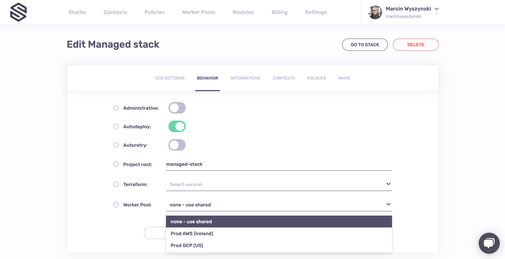

# Worker pools

By default, Spacelift uses a managed worker pool hosted and operated by us. This is very convenient, but often you may have special requirements regarding infrastructure, security or compliance, which aren't served by the public worker pool. This is why Spacelift also supports private worker pools, which you can use to host the workers which execute Spacelift workflows on your end.

In order to enjoy the maximum level of flexibility and security with a private worker pool, temporary run state is encrypted end-to-end, so only the workers in your worker pool can look inside it. We use asymmetric encryption to achieve this and only you ever have access to the private key.

## Setting up

To make sure that we have no access to your private key, you will need to generate it on your end, and use it to create a certificate signing request to give to Spacelift. We'll generate a certificate for you, so that workers can use it to authenticate with the Spacelift backend. The following command will generate the key and CSR:

```bash
openssl req -new -newkey rsa:4096 -nodes -keyout spacelift.key -out spacelift.csr
```

You should now store the `spacelift.key` file in a secure place. You’ll need it later, when launching workers in your worker pool.

Now you can submit the `spacelift.csr` file in the worker pool creation form. In response, you’ll receive a **Spacelift token**. It contains configuration for your worker pool launchers, as well as the certificate we generated for you based on the certificate signing request.

You can set up your worker pool from the Spacelift UI by navigating to Worker Pools section of your account, or you can also create it programmatically using the `spacelift_worker_pool` resource type within the [Spacelift Terraform provider](../vendors/terraform/terraform-provider.md).


The launcher binary is available [here](https://downloads.spacelift.io/spacelift-launcher). In order to work, it expects to be able to write to the local Docker socket. Unless you're using a Docker-based container scheduler like Kubernetes or ECS, please make sure that Docker is installed.

Finally, you can run the launcher binary by setting two environment variables:

- `SPACELIFT_TOKEN` - the token you’ve received from Spacelift on worker pool creation
- `SPACELIFT_POOL_PRIVATE_KEY` - the contents of the private key file you generated, in base64.

!!! info
    You need to encode the _entire_ private key using base-64, making it a single line of text. The simplest approach is to just run something like <mark style="color:purple;">`cat spacelift.key | base64 -w 0`</mark>in your command line. For Mac users, the command will be something like <mark style="color:purple;">cat spacelift.key | base64 -b 0</mark>

Congrats! Your launcher should now connect to the Spacelift backend and start handling runs.

### Terraform Modules and Helm Chart

For AWS, Azure and GCP users we've prepared an easy way to run Spacelift worker pools. [This repository](https://github.com/spacelift-io/spacelift-worker-image) contains the code for Spacelift's base images, and the following repositories contain Terraform modules to customize and deploy worker pools to AWS, Azure or GCP:

- AWS: [terraform-aws-spacelift-workerpool-on-ec2](https://github.com/spacelift-io/terraform-aws-spacelift-workerpool-on-ec2).
- Azure: [terraform-azure-spacelift-workerpool](https://github.com/spacelift-io/terraform-azure-spacelift-workerpool).
- GCP: [terraform-google-spacelift-workerpool](https://github.com/spacelift-io/terraform-google-spacelift-workerpool).

In addition, the [spacelift-workerpool-k8s](https://github.com/spacelift-io/spacelift-workerpool-k8s) repository contains a Helm chart for deploying workers to Kubernetes.

### Configuration options

A number of configuration variables is available to customize how your launcher behaves:

- `SPACELIFT_DOCKER_CONFIG_DIR` - if set, the value of this variable will point to the directory containing Docker configuration, which includes credentials for private Docker registries. Private workers can populate this directory for example by executing `docker login` before the launcher process is started;
- `SPACELIFT_MASK_ENVS`- comma-delimited list of whitelisted environment variables that are passed to the workers but should never appear in the logs;
- `SPACELIFT_WORKER_NETWORK` - network ID/name to connect the launched worker containers, defaults to `bridge`;
- `SPACELIFT_WORKER_EXTRA_MOUNTS` - additional files or directories to be mounted to the launched worker docker containers, as a comma-separated list of mounts in the form of `/host/path:/container/path`;
- `SPACELIFT_WORKER_RUNTIME` - runtime to use for worker container;
- `SPACELIFT_WHITELIST_ENVS` - comma-delimited list of environment variables to pass from the launcher's own environment to the workers' environment;
- `SPACELIFT_LAUNCHER_LOGS_TIMEOUT` - custom timeout (the default is _7 minutes_) for killing jobs not producing any logs. This is a duration flag, expecting a duration-formatted value, eg `1000s` ;
- `SPACELIFT_LAUNCHER_RUN_INITIALIZATION_POLICY` - file that contains the run initialization policy that will be parsed/used; If the run initialized policy can not be validated at the startup the worker pool will exit with an appropriate error;
- `SPACELIFT_LAUNCHER_RUN_TIMEOUT` - custom maximum run time - the default is _70 minutes_. This is a duration flag, expecting a duration-formatted value, eg. `120m` ;

### Passing metadata tags

When the launcher from a private worker pool is registering with the mothership, you can send along some tags that will allow you to uniquely identify the process/machine for the purpose of draining or debugging. Any environment variables using `SPACELIFT_METADATA_` prefix will be passed on. As an example, if you're running Spacelift workers in EC2, you can do the following just before you execute the launcher binary:

```bash
export SPACELIFT_METADATA_instance_id=$(ec2-metadata --instance-id | cut -d ' ' -f2)
```

Doing so will set your EC2 instance ID as _instance\_id_ tag in your worker.

### VCS Agents

If you're using VCS Agents with a privately accessible VCS instance then your private workers will also need to have direct network access to that VCS instance. You'll also need to inform the private workers of the target network address for each of your VCS Agent Pools:

```bash
export SPACELIFT_PRIVATEVCS_MAPPING_NAME_0=bitbucket_pool
export SPACELIFT_PRIVATEVCS_MAPPING_BASE_ENDPOINT_0=http://192.168.2.2
export SPACELIFT_PRIVATEVCS_MAPPING_NAME_1=github_pool
export SPACELIFT_PRIVATEVCS_MAPPING_BASE_ENDPOINT_1=https://internal-github.net
// ...
```

## Using worker pools

Worker pools must be explicitly attached to [stacks](stack/) and/or [modules](../vendors/terraform/module-registry.md) in order to start processing their workloads. This can be done in the Behavior section of stack and module settings:



.png>)
