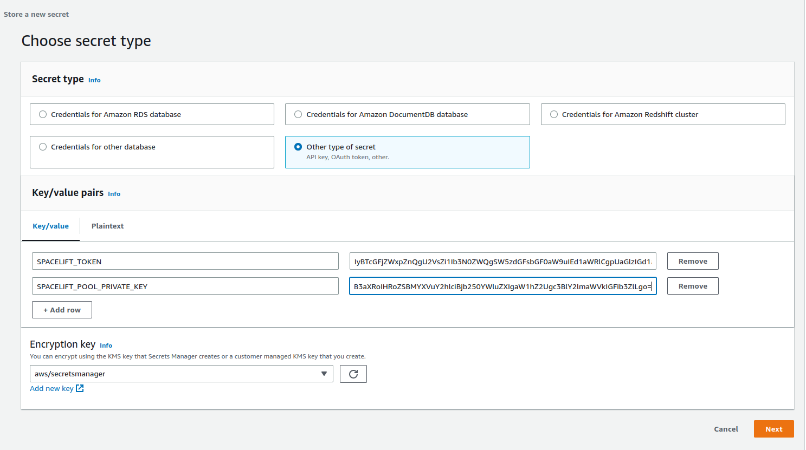
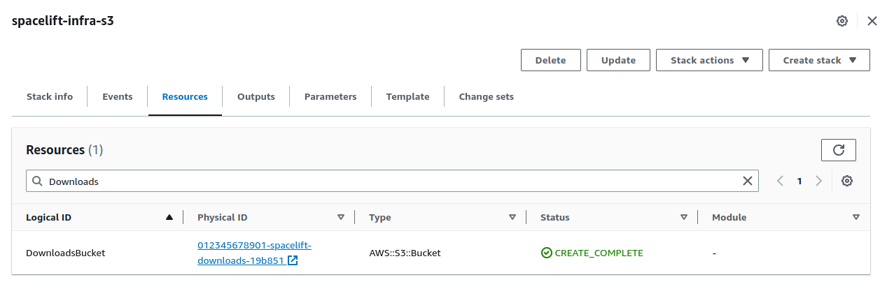
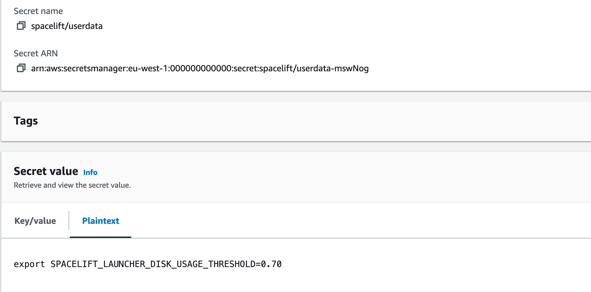
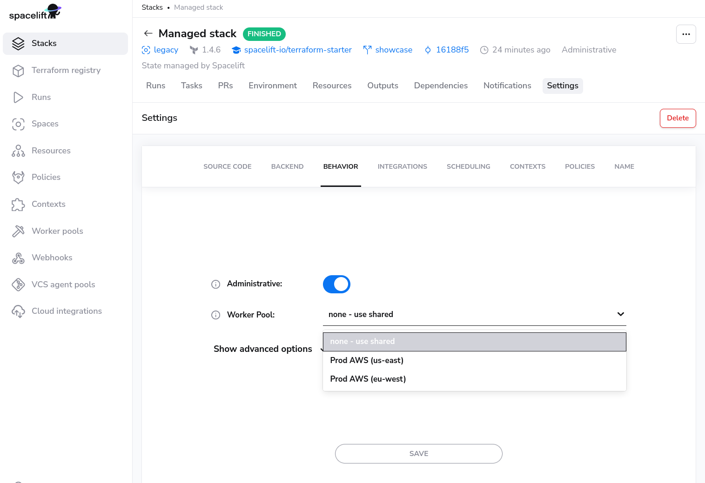

# Worker pools

!!! info
    Note that private workers are an Enterprise plan feature.


By default, Spacelift uses a managed worker pool hosted and operated by us. This is very convenient, but often you may have special requirements regarding infrastructure, security or compliance, which aren't served by the public worker pool. This is why Spacelift also supports private worker pools, which you can use to host the workers which execute Spacelift workflows on your end.

In order to enjoy the maximum level of flexibility and security with a private worker pool, temporary run state is encrypted end-to-end, so only the workers in your worker pool can look inside it. We use asymmetric encryption to achieve this and only you ever have access to the private key.


!!! tip
    A worker is a logical entity that processes a single [run](./run/README.md) at a time. As a result, your number of workers is equal to your maximum concurrency.

    Typically, a virtual server (AWS EC2 or Azure/GCP VM) hosts a single worker to keep things simple and avoid coordination and resource management overhead.

    Containerized workers can share the same virtual server because the management is handled by the orchestrator.

## Setting up

### Generate Worker Private Key

We use asymmetric encryption to ensure that any temporary run state can only be accessed by workers in a given worker pool. To support this, you need to generate a private key that can be used for this purpose, and use it to create a certificate signing request to give to Spacelift. We'll generate a certificate for you, so that workers can use it to authenticate with the Spacelift backend. The following command will generate the key and CSR:

```bash
openssl req -new -newkey rsa:4096 -nodes -keyout spacelift.key -out spacelift.csr
```

!!! warning
    Don't forget to store the `spacelift.key` file (private key) in a secure location. You’ll need it later, when launching workers in your worker pool.

You can set up your worker pool from the Spacelift UI by navigating to Worker Pools section of your account, or you can also create it programmatically using the `spacelift_worker_pool` resource type within the [Spacelift Terraform provider](../vendors/terraform/terraform-provider.md).

### Navigate to Worker Pools

.png>)

### Add Worker Pool Entity

Give your worker pool a name, and submit the `spacelift.csr` file in the worker pool creation form. After creation of the worker pool, you’ll receive a **Spacelift token**. This token contains configuration for your worker pool launchers, as well as the certificate we generated for you based on the certificate signing request.

!!! warning
    After clicking create, you will receive a token for the worker pool. Don't forget to save your **Spacelift token** in a secure location as you'll need this later when launching the worker pool.


### Launch Worker Pool


The launcher binaries are available here: [x86_64](https://downloads.spacelift.io/spacelift-launcher-x86_64){: rel="nofollow"} (amd64 CPU), [aarch64](https://downloads.spacelift.io/spacelift-launcher-aarch64){: rel="nofollow"} (arm64 CPU).

The Self-Hosted release archive contains a copy of the Spacelift launcher binary built specifically for your version of Self-Hosted. You can find this at `bin/spacelift-launcher`. This binary is also uploaded to the downloads S3 bucket during the Spacelift installation process. For more information on how to find your bucket name see [here](#get-the-downloads-bucket-name).


In order to work, the launcher expects to be able to write to the local Docker socket. Unless you're using a Docker-based container scheduler like Kubernetes or ECS, please make sure that Docker is installed and running.

Finally, you can run the launcher binary by setting two environment variables:

- `SPACELIFT_TOKEN` - the token you’ve received from Spacelift on worker pool creation
- `SPACELIFT_POOL_PRIVATE_KEY` - the contents of the private key file you generated, in base64.

!!! info
    You need to encode the _entire_ private key using base-64, making it a single line of text. The simplest approach is to just run `cat spacelift.key | base64 -w 0` in your command line. For Mac users, the command is `cat spacelift.key | base64 -b 0`.

Congrats! Your launcher should now connect to the Spacelift backend and start handling runs.


!!! tip
    In general, arm64-based virtual machines are cheaper than amd64-based ones, so if your cloud provider supports them, we recommend using them. If you choose to do so, and you're using [custom runner images](../concepts/stack/stack-settings.md#runner-image), make sure they're compatible with ARM64. All Spacelift provided runner images are compatible with both CPU architectures.




#### Periodic updates

Our worker infrastructure consists of two binaries: launcher and worker. The latest version of the launcher binary is getting downloaded during the instance startup. The launcher then establishes a connection with the Spacelift backend and waits for messages. When it gets a message, it downloads the latest version of the worker binary and executes it. The worker binary is responsible for running the actual Spacelift runs.

This setup ensures that the worker binary is always up to date, but the launcher may not be. Typically, the worker binaries receive more updates but it's still recommended to recycle the worker pool every once in a while to ensure that the launcher is up to date. You can do this by draining all the workers in the UI, then terminating the instances in your cloud provider. That should automatically start new instances with the latest launcher version.

Additionally, if you use [Spacelift AMIs](https://github.com/spacelift-io/spacelift-worker-image){: rel="nofollow"}, they [receive](https://github.com/spacelift-io/spacelift-worker-image/releases){: rel="nofollow"} routine system updates every few weeks so it's worth bumping the AMI to the latest version from time to time. That automatically takes care of downloading fresh launcher binaries as well.




### Terraform Modules and Helm Chart

For AWS, Azure and GCP users we've prepared an easy way to run Spacelift worker pools. [This repository](https://github.com/spacelift-io/spacelift-worker-image){: rel="nofollow"} contains the code for Spacelift's base images, and the following repositories contain Terraform modules to customize and deploy worker pools to AWS, Azure or GCP:

- AWS: [terraform-aws-spacelift-workerpool-on-ec2](https://github.com/spacelift-io/terraform-aws-spacelift-workerpool-on-ec2){: rel="nofollow"}.
- Azure: [terraform-azure-spacelift-workerpool](https://github.com/spacelift-io/terraform-azure-spacelift-workerpool){: rel="nofollow"}.
- GCP: [terraform-google-spacelift-workerpool](https://github.com/spacelift-io/terraform-google-spacelift-workerpool){: rel="nofollow"}.

!!! tip
    Since the Launcher is getting downloaded during the instance startup, it is recommended to recycle the worker pool every once in a while to ensure that it is up to date. You don't want to miss out on the latest features and bug fixes! You can do this by draining all the workers one-by-one in the UI, then terminating the instances in your cloud provider.

    It is also recommended to check the above repositories for updates from time to time.

!!! info
    AWS ECS is supported when using the EC2 launch type but Spacelift does not currently provide a Terraform module for this setup.





### CloudFormation Template

The easiest way to deploy workers for self-hosting is to deploy the CloudFormation template found in `cloudformation/workerpool.yaml`.

#### PseudoRandomSuffix

The CloudFormation stack uses a parameter called `PseudoRandomSuffix` in order to ensure that certain resources are unique within an AWS account. The value of this parameter does not matter, other than that it is unique per worker pool stack you deploy. You should choose a value that is 6 characters long and made up of letters and numbers, for example `ab12cd`.

#### Create a secret

First, create a new secret in SecretsManager, and add your token and the base64-encoded value of your private key. Use the key `SPACELIFT_TOKEN` for your token and `SPACELIFT_POOL_PRIVATE_KEY` for the private key. It should look something like this:



Give your secret a name and create it. It doesn't matter what this name is, but you'll need it when deploying the CloudFormation stack.

#### Get the downloads bucket name

The downloads bucket name is output at the end of the installation process. If you don't have a note of it, you can also get it from the resources of the _spacelift-infra-s3_ stack in CloudFormation:



#### AMI

You can use your own custom-built AMI for your workers, or you can use one of the pre-built images we provide. For a list of the correct AMI to use for the region you want to deploy your worker to, see the [spacelift-worker-image releases page](https://github.com/spacelift-io/spacelift-worker-image/releases){: rel="nofollow"}.

**Note:** please make sure to choose the `x86_64` version of the AMI.

#### Subnets and Security Group

You will need to have an existing VPC to deploy your pool into, and will need to provide a list of subnet IDs and security groups to match your requirements.

#### Using a custom IAM role

By default we will create the instance role for the EC2 ASG as part of the worker pool stack, but you can also provide your own custom role via the `InstanceRoleName` parameter. This allows you to grant permissions to additional AWS resources that your workers need access to. A great example of this is allowing access to a private ECR in order to use a custom runner image.

At a minimum, your role must fulfil the following requirements:

- It must have a trust relationship that allows role assumption by EC2.
- It needs to have the following managed policies attached:
    - `AutoScalingReadOnlyAccess`.
    - `CloudWatchAgentServerPolicy`.
    - `AmazonSSMManagedInstanceCore`.

#### Injecting custom commands during instance startup

You have the option to inject custom commands into the EC2 user data. This can be useful if you want to install additional software on your workers, or if you want to run a custom script during instance startup, or just add some additional environment variables.

The script must be a valid shell script and should be put into Secrets Manager. Then you can provide the name of the secret as `CustomUserDataSecretName` when deploying the stack.

Example:



In the example above, we used `spacelift/userdata` as a secret name so the parameter will look like this:

```shell
  [...]
  --parameter-overrides \
    CustomUserDataSecretName="spacelift/userdata" \
  [...]
```

#### Granting access to a private ECR

To allow your worker role to access a private ECR, you can attach a policy similar to the following to your instance role (replacing `<repository-arn>` with the ARN of your ECR repository):

```json
{
    "Version": "2012-10-17",
    "Statement": [
        {
            "Effect": "Allow",
            "Action": [
                "ecr:GetDownloadUrlForLayer",
                "ecr:BatchGetImage",
                "ecr:BatchCheckLayerAvailability"
            ],
            "Resource": "<repository-arn>"
        },
        {
            "Effect": "Allow",
            "Action": [
                "ecr:GetAuthorizationToken"
            ],
            "Resource": "*"
        }
    ]
}
```

NOTE: repository ARNs are in the format `arn:<partition>:ecr:<region>:<account-id>:repository/<repository-name>`.

#### Proxy Configuration

If you need to use an HTTP proxy for internet access, you can provide the proxy configuration using the following CloudFormation parameters:

- `HttpProxyConfig`.
- `HttpsProxyConfig`.
- `NoProxyConfig`.

For example, you could use the following command to deploy a worker with a proxy configuration:

```shell
aws cloudformation deploy --no-cli-pager \
  --stack-name spacelift-default-worker-pool \
  --template-file "cloudformation/workerpool.yaml" \
  --region "eu-west-1" \
  --parameter-overrides \
    PseudoRandomSuffix="ab12cd" \
    BinariesBucket="012345678901-spacelift-infra-spacelift-downloads" \
    SecretName="spacelift/default-worker-pool-credentials" \
    SecurityGroups="sg-0d1e157a19ba2106f" \
    Subnets="subnet-44ca1b771ca7bcc1a,subnet-6b61ec08772f47ba2" \
    ImageId="ami-0ead0234bef4f51b0" \
    HttpProxyConfig="http://proxy.example.com:1234" \
    HttpsProxyConfig="https://proxy.example.com:4321" \
    NoProxyConfig="some.domain,another.domain" \
  --capabilities "CAPABILITY_NAMED_IAM"
```

#### Using custom CA certificates

If you use a custom certificate authority to issue TLS certs for components that Spacelift will communicate with, for example your VCS system, you need to provide your custom CA certificates to the worker. You do this by creating a secret in SecretsManager containing a base64 encoded JSON string.

The format of the JSON object is as follows:

```json
{"caCertificates": ["<base64-encoded-cert-1>", "<base64-encoded-cert-2>", "<base64-encoded-cert-N>"]}
```

For example, if you had a file called ca-certs.json containing the following content:

```json
{
  "caCertificates": [
    "LS0tLS1CRUdJTiBDRVJUSUZJQ0FURS0tLS0tCk1JSUZzVENDQTVtZ0F3SUJBZ0lVREQvNFZCZkx4NUsvdEFZK1Nja0gwNVRKOGk4d0RRWUpLb1pJaHZjTkFRRUwKQlFBd2FERUxNQWtHQTFVRUJoTUNSMEl4RVRBUEJnTlZCQWdNQ0ZOamIzUnNZVzVrTVJBd0RnWURWUVFIREFkSApiR0Z6WjI5M01Sa3dGd1lEVlFRS0RCQkJaR0Z0SUVNZ1VtOXZkQ0JEUVNBeE1Sa3dGd1lEVlFRRERCQkJaR0Z0CklFTWdVbTl2ZENCRFFTQXhNQjRYRFRJek1ETXhNekV4TXpZeE1Wb1hEVEkxTVRJek1URXhNell4TVZvd2FERUwKTUFrR0ExVUVCaE1DUjBJeEVUQVBCZ05WQkFnTUNGTmpiM1JzWVc1a01SQXdEZ1lEVlFRSERBZEhiR0Z6WjI5MwpNUmt3RndZRFZRUUtEQkJCWkdGdElFTWdVbTl2ZENCRFFTQXhNUmt3RndZRFZRUUREQkJCWkdGdElFTWdVbTl2CmRDQkRRU0F4TUlJQ0lqQU5CZ2txaGtpRzl3MEJBUUVGQUFPQ0FnOEFNSUlDQ2dLQ0FnRUF4anYvK3NJblhpUSsKMkZiK2l0RjhuZGxwbW1ZVW9ad1lONGR4KzJ3cmNiT1ZuZ1R2eTRzRSszM25HQnpINHZ0NHBPaEtUV3dhWVhGSQowQ3pxb0lvYXppOFpsMG1lZHlyd3RJVURaMXBOY1Z1Z2I0S0FGYjlKYnE0MElrM3hHNnQxNm1heFFKR1RpQUcyCi94VnRzdVlkaG5CR3gvLzYxU0ViRXdTcFIxNDUvUWYxY2JhOFJsUlFNejRRVVdOZThYWG8zU1lhWDJreGl3MlYKMU9wK2ZReGcyamYxQXl6UVhYMWNoMWp5RzVSTEVTUFVNRmtCaVF3aTdMT1NDYWF2ZkpFVXp3cWVvT1JnZDdUaQp1eU1WKzRHc2IxWEFuSzdLWFl3aXNHZVA1L1FORlBBQnlmQWRQalIyMHJNWVlIZnhxRUR0aDROYWpqbXUvaXlGClBHazRDb2JSaGl0VHRKWFQvUXhXY3Z0clJ1MUJDVm5lZHlFU015aXlhNFE5ZG4yN3JGampnM1pBUnFXT1poeXEKT1RXSG8ybU8yRnpFSnV4aHZZTmUyaVlWcDJzOHdNVEIwMm5QM3dwV29Zd2plMnlEd2Nqa0lsOHVYS3pFWjlHZgpGQVRKYUNMb084bzVKMkhYc2dPSXFYbHB6VTl0VXRFZXcveFR6WnFYNUEzNG84LytOZ1V0bTBGN2pvV2E1bURDClFCN0w4Y0tmQUN5ZGZwZWtKeC9nRlVHU3kvNXZkZkJ6T2N6YzZCbWg2NnlIUEJSRGNneURGbm54MzRtL1hWUWEKckJ3d0lERGJxdTNzc2NkT2dtOXY4Y3NDSmQwWWxYR2IveDRvQUE2MUlJVG5zTmQ5TkN3MEdKSXF1U0VjWWlDRQpBMFlyUVRLVmZSQVh1aFNaMVZQSXV4WGlGMkszWFRNQ0F3RUFBYU5UTUZFd0hRWURWUjBPQkJZRUZENTVSNG10CjBoTk9KVWdQTDBKQktaQjFqeWJTTUI4R0ExVWRJd1FZTUJhQUZENTVSNG10MGhOT0pVZ1BMMEpCS1pCMWp5YlMKTUE4R0ExVWRFd0VCL3dRRk1BTUJBZjh3RFFZSktvWklodmNOQVFFTEJRQURnZ0lCQUhlY1ZqTWtsVGtTMlB5NQpYTnBKOWNkekc2Nkd1UER3OGFRWkl1bnJ4cVl1ZDc0Q0ExWTBLMjZreURKa0xuV3pWYTduVCtGMGQ4UW4zdG92CnZGd0kzeHk1bCs0dXBtdVozdTFqRkVNaVNrOEMyRlBvaExEbkRvM3J3RVVDR3ZKNmE0R2FzN1l5SFBHTDNEckoKMGRjdTl3c1g5Y1lCMllKMjdRb3NaNXM2em1tVXZCR1RJMzBKTnZQblNvQzdrenFEM0FyeHZURVc5V2FVcW9KdAo4OGxzTW5uNitwczlBNmV4Yi9mSzkwOVpXYUVKV1JkOWNkTUVUMGZuYTdFaGhrTytDcXo0MTVSZ014bEs3Z2dUCjk3Q3ZranZ2TE5lRlQ1bmFIYnpVQU5xZk1WUlJjVWFQM1BqVEM5ejVjRG85Q2FQYUZqVi8rVXhheDJtQWxBUmsKZnFZeVdvcXZaSDkwY3pwdkZHMWpVbzZQNE5weXhaUzhsYXlKd0QyNHFYK0VPTjQzV1lBcExzbC9qRTJBL0ptUQpNZGdXTmhPeTRIUDhVOCthQU5yMEV2N2dXV05pNlZjUjhUNlBUL3JiQUdqblBtVm1vWjRyYzdDZG9TOFpRWkpoCks4RUxBMTcrcG5NVGdvN3d4ZkFScUwrcCttcWd0VXhSYmlXaXRldjhGMmhVVkIvU3dQOGhwY0dyZGhURU43dGQKcFNXMXlrUGVHSkZLU0JvNVFIYW5xcVBGQ3pxdEZlb0w5RGhZeDUveEU2RnBLTUxnM3ZWY0ZzSHU2Z2xTOGlNVgo0SHZiMmZYdWhYeExUQkNiRDErNWxMUC9iSFhvZ1FLbXAySDZPajBlNldCbVEweHFHb3U0SWw2YmF2c1pDeDJ2CkFEV3ZsdWU1alhkTnU1eFBaZHNOVk5BbHVBbmUKLS0tLS1FTkQgQ0VSVElGSUNBVEUtLS0tLQo="
  ]
}
```

You could then encode it to base64 using `base64 -w0 < ca-certs.json` (or `base64 -b 0 < ca-certs.json` on a Mac), resulting in the following string:

```text
ewogICJjYUNlcnRpZmljYXRlcyI6IFsKICAgICJMUzB0TFMxQ1JVZEpUaUJEUlZKVVNVWkpRMEZVUlMwdExTMHRDazFKU1VaelZFTkRRVFZ0WjBGM1NVSkJaMGxWUkVRdk5GWkNaa3g0TlVzdmRFRlpLMU5qYTBnd05WUktPR2s0ZDBSUldVcExiMXBKYUhaalRrRlJSVXdLUWxGQmQyRkVSVXhOUVd0SFFURlZSVUpvVFVOU01FbDRSVlJCVUVKblRsWkNRV2ROUTBaT2FtSXpVbk5aVnpWclRWSkJkMFJuV1VSV1VWRklSRUZrU0FwaVIwWjZXakk1TTAxU2EzZEdkMWxFVmxGUlMwUkNRa0phUjBaMFNVVk5aMVZ0T1haa1EwSkVVVk5CZUUxU2EzZEdkMWxFVmxGUlJFUkNRa0phUjBaMENrbEZUV2RWYlRsMlpFTkNSRkZUUVhoTlFqUllSRlJKZWsxRVRYaE5la1Y0VFhwWmVFMVdiMWhFVkVreFRWUkplazFVUlhoTmVsbDRUVlp2ZDJGRVJVd0tUVUZyUjBFeFZVVkNhRTFEVWpCSmVFVlVRVkJDWjA1V1FrRm5UVU5HVG1waU0xSnpXVmMxYTAxU1FYZEVaMWxFVmxGUlNFUkJaRWhpUjBaNldqSTVNd3BOVW10M1JuZFpSRlpSVVV0RVFrSkNXa2RHZEVsRlRXZFZiVGwyWkVOQ1JGRlRRWGhOVW10M1JuZFpSRlpSVVVSRVFrSkNXa2RHZEVsRlRXZFZiVGwyQ21SRFFrUlJVMEY0VFVsSlEwbHFRVTVDWjJ0eGFHdHBSemwzTUVKQlVVVkdRVUZQUTBGbk9FRk5TVWxEUTJkTFEwRm5SVUY0YW5ZdkszTkpibGhwVVNzS01rWmlLMmwwUmpodVpHeHdiVzFaVlc5YWQxbE9OR1I0S3pKM2NtTmlUMVp1WjFSMmVUUnpSU3N6TTI1SFFucElOSFowTkhCUGFFdFVWM2RoV1ZoR1NRb3dRM3B4YjBsdllYcHBPRnBzTUcxbFpIbHlkM1JKVlVSYU1YQk9ZMVoxWjJJMFMwRkdZamxLWW5FME1FbHJNM2hITm5ReE5tMWhlRkZLUjFScFFVY3lDaTk0Vm5SemRWbGthRzVDUjNndkx6WXhVMFZpUlhkVGNGSXhORFV2VVdZeFkySmhPRkpzVWxGTmVqUlJWVmRPWlRoWVdHOHpVMWxoV0RKcmVHbDNNbFlLTVU5d0syWlJlR2N5YW1ZeFFYbDZVVmhZTVdOb01XcDVSelZTVEVWVFVGVk5SbXRDYVZGM2FUZE1UMU5EWVdGMlprcEZWWHAzY1dWdlQxSm5aRGRVYVFwMWVVMVdLelJIYzJJeFdFRnVTemRMV0ZsM2FYTkhaVkExTDFGT1JsQkJRbmxtUVdSUWFsSXlNSEpOV1ZsSVpuaHhSVVIwYURST1lXcHFiWFV2YVhsR0NsQkhhelJEYjJKU2FHbDBWSFJLV0ZRdlVYaFhZM1owY2xKMU1VSkRWbTVsWkhsRlUwMTVhWGxoTkZFNVpHNHlOM0pHYW1wbk0xcEJVbkZYVDFwb2VYRUtUMVJYU0c4eWJVOHlSbnBGU25WNGFIWlpUbVV5YVZsV2NESnpPSGROVkVJd01tNVFNM2R3VjI5WmQycGxNbmxFZDJOcWEwbHNPSFZZUzNwRldqbEhaZ3BHUVZSS1lVTk1iMDg0YnpWS01raFljMmRQU1hGWWJIQjZWVGwwVlhSRlpYY3ZlRlI2V25GWU5VRXpORzg0THl0T1oxVjBiVEJHTjJwdlYyRTFiVVJEQ2xGQ04wdzRZMHRtUVVONVpHWndaV3RLZUM5blJsVkhVM2t2Tlhaa1prSjZUMk42WXpaQ2JXZzJObmxJVUVKU1JHTm5lVVJHYm01NE16UnRMMWhXVVdFS2NrSjNkMGxFUkdKeGRUTnpjMk5rVDJkdE9YWTRZM05EU21Rd1dXeFlSMkl2ZURSdlFVRTJNVWxKVkc1elRtUTVUa04zTUVkS1NYRjFVMFZqV1dsRFJRcEJNRmx5VVZSTFZtWlNRVmgxYUZOYU1WWlFTWFY0V0dsR01rc3pXRlJOUTBGM1JVRkJZVTVVVFVaRmQwaFJXVVJXVWpCUFFrSlpSVVpFTlRWU05HMTBDakJvVGs5S1ZXZFFUREJLUWt0YVFqRnFlV0pUVFVJNFIwRXhWV1JKZDFGWlRVSmhRVVpFTlRWU05HMTBNR2hPVDBwVloxQk1NRXBDUzFwQ01XcDVZbE1LVFVFNFIwRXhWV1JGZDBWQ0wzZFJSazFCVFVKQlpqaDNSRkZaU2t0dldrbG9kbU5PUVZGRlRFSlJRVVJuWjBsQ1FVaGxZMVpxVFd0c1ZHdFRNbEI1TlFwWVRuQktPV05rZWtjMk5rZDFVRVIzT0dGUldrbDFibko0Y1ZsMVpEYzBRMEV4V1RCTE1qWnJlVVJLYTB4dVYzcFdZVGR1VkN0R01HUTRVVzR6ZEc5MkNuWkdkMGt6ZUhrMWJDczBkWEJ0ZFZvemRURnFSa1ZOYVZOck9FTXlSbEJ2YUV4RWJrUnZNM0ozUlZWRFIzWktObUUwUjJGek4xbDVTRkJIVERORWNrb0tNR1JqZFRsM2MxZzVZMWxDTWxsS01qZFJiM05hTlhNMmVtMXRWWFpDUjFSSk16QktUblpRYmxOdlF6ZHJlbkZFTTBGeWVIWlVSVmM1VjJGVmNXOUtkQW80T0d4elRXNXVOaXR3Y3psQk5tVjRZaTltU3prd09WcFhZVVZLVjFKa09XTmtUVVZVTUdadVlUZEZhR2hyVHl0RGNYbzBNVFZTWjAxNGJFczNaMmRVQ2prM1EzWnJhbloyVEU1bFJsUTFibUZJWW5wVlFVNXhaazFXVWxKalZXRlFNMUJxVkVNNWVqVmpSRzg1UTJGUVlVWnFWaThyVlhoaGVESnRRV3hCVW1zS1puRlplVmR2Y1haYVNEa3dZM3B3ZGtaSE1XcFZielpRTkU1d2VYaGFVemhzWVhsS2QwUXlOSEZZSzBWUFRqUXpWMWxCY0V4emJDOXFSVEpCTDBwdFVRcE5aR2RYVG1oUGVUUklVRGhWT0N0aFFVNXlNRVYyTjJkWFYwNXBObFpqVWpoVU5sQlVMM0ppUVVkcWJsQnRWbTF2V2pSeVl6ZERaRzlUT0ZwUldrcG9Da3M0UlV4Qk1UY3JjRzVOVkdkdk4zZDRaa0ZTY1V3cmNDdHRjV2QwVlhoU1ltbFhhWFJsZGpoR01taFZWa0l2VTNkUU9HaHdZMGR5WkdoVVJVNDNkR1FLY0ZOWE1YbHJVR1ZIU2taTFUwSnZOVkZJWVc1eGNWQkdRM3B4ZEVabGIwdzVSR2haZURVdmVFVTJSbkJMVFV4bk0zWldZMFp6U0hVMloyeFRPR2xOVmdvMFNIWmlNbVpZZFdoWWVFeFVRa05pUkRFck5XeE1VQzlpU0ZodloxRkxiWEF5U0RaUGFqQmxObGRDYlZFd2VIRkhiM1UwU1d3MlltRjJjMXBEZURKMkNrRkVWM1pzZFdVMWFsaGtUblUxZUZCYVpITk9WazVCYkhWQmJtVUtMUzB0TFMxRlRrUWdRMFZTVkVsR1NVTkJWRVV0TFMwdExRbz0iCiAgXQp9Cg==
```

You would then create a secret in SecretsManager, and deploy the worker pool using the following command (replacing `<ca-cert-secret-name>` with the name of your secret):

```shell
aws cloudformation deploy --no-cli-pager \
  --stack-name spacelift-default-worker-pool \
  --template-file "cloudformation/workerpool.yaml" \
  --region "eu-west-1" \
  --parameter-overrides \
    PseudoRandomSuffix="ab12cd" \
    BinariesBucket="012345678901-spacelift-infra-spacelift-downloads" \
    SecretName="spacelift/default-worker-pool-credentials" \
    SecurityGroups="sg-0d1e157a19ba2106f" \
    Subnets="subnet-44ca1b771ca7bcc1a,subnet-6b61ec08772f47ba2" \
    ImageId="ami-0ead0234bef4f51b0" \
    AdditionalRootCAsSecretName="<ca-cert-secret-name>" \
  --capabilities "CAPABILITY_NAMED_IAM"
```

#### Running the launcher as root

By default, when the EC2 instance starts up, it creates a user called `spacelift` with a UID of 1983. This user is then used to run the launcher process.

If for some reason this causes problems, you can run the launcher as `root` by setting the `RunLauncherAsSpaceliftUser` CloudFormation parameter to `false`.

!!! tip
    Versions v0.0.7 or older of Self-Hosted always ran the launcher as root. In newer versions this behavior has changed to default to the `spacelift` user.

#### PowerOffOnError

By default, the startup script for the EC2 instances automatically terminates the instance if the launcher exits. This is to allow the instance to be automatically removed from the autoscale group and a new one added in the case of errors.

Sometimes it can be useful to disable this behavior, for example if instances are repeatedly crashing on startup, preventing you from being able to connect to investigate any issues before they terminate.

To do this, set the `PowerOffOnError` setting to false when deploying your CloudFormation stack.

!!! info
    Please note, if you update this setting on an existing CloudFormation stack, you will need to restart all the workers in the pool before the updated setting takes effect.

#### Deploying the Template

To deploy your worker pool stack, you can use the following command:

```shell
aws cloudformation deploy --no-cli-pager \
  --stack-name spacelift-default-worker-pool \
  --template-file "cloudformation/workerpool.yaml" \
  --region "<region>" \
  --parameter-overrides \
    PseudoRandomSuffix="ab12cd" \
    BinariesBucket="<binaries-bucket>" \
    SecretName="<secret-name>" \
    SecurityGroups="<security-groups>" \
    Subnets="<subnets>" \
    ImageId="<ami-id>" \
  --capabilities "CAPABILITY_NAMED_IAM"
```

For example, to deploy to `eu-west-1` you might use something like this:

```shell
aws cloudformation deploy --no-cli-pager \
  --stack-name spacelift-default-worker-pool \
  --template-file "cloudformation/workerpool.yaml" \
  --region "eu-west-1" \
  --parameter-overrides \
    PseudoRandomSuffix="ab12cd" \
    BinariesBucket="012345678901-spacelift-infra-spacelift-downloads" \
    SecretName="spacelift/default-worker-pool-credentials" \
    SecurityGroups="sg-0d1e157a19ba2106f" \
    Subnets="subnet-44ca1b771ca7bcc1a,subnet-6b61ec08772f47ba2" \
    ImageId="ami-0ead0234bef4f51b0" \
  --capabilities "CAPABILITY_NAMED_IAM"
```

To use a custom instance role, you might use something like this:

```shell
aws cloudformation deploy --no-cli-pager \
  --stack-name spacelift-default-worker-pool \
  --template-file "cloudformation/workerpool.yaml" \
  --region "eu-west-1" \
  --parameter-overrides \
    PseudoRandomSuffix="ab12cd" \
    BinariesBucket="012345678901-spacelift-infra-spacelift-downloads" \
    SecretName="spacelift/default-worker-pool-credentials" \
    SecurityGroups="sg-0d1e157a19ba2106f" \
    Subnets="subnet-44ca1b771ca7bcc1a,subnet-6b61ec08772f47ba2" \
    ImageId="ami-0ead0234bef4f51b0" \
    InstanceRoleName="default-worker-role" \
  --capabilities "CAPABILITY_NAMED_IAM"
```

### Terraform Modules

Our public [AWS](https://github.com/spacelift-io/terraform-aws-spacelift-workerpool-on-ec2){: rel="nofollow"}, [Azure](https://github.com/spacelift-io/terraform-azure-spacelift-workerpool){: rel="nofollow"} and [GCP](https://github.com/spacelift-io/terraform-google-spacelift-workerpool){: rel="nofollow"} Terraform modules are not currently compatible with self-hosting.



### Kubernetes

We provide a Kubernetes operator for managing Spacelift worker pools. This operator allows you to define `WorkerPool` resources in your cluster, and allows you to scale these pools up and down using standard Kubernetes functionality.

!!! info
    Previously we provided a [Helm chart](https://github.com/spacelift-io/spacelift-helm-charts/tree/main/spacelift-worker-pool){: rel="nofollow"} for deploying worker pools to Kubernetes using Docker-in-Docker. This approach is no-longer recommended, and you should use the Kubernetes operator instead. Please see the section on [migrating from Docker-in-Docker](#migrating-from-docker-in-docker) for more information.

A `WorkerPool` defines the number of `Workers` registered with Spacelift via the `poolSize` parameter. The Spacelift operator will automatically create and register a number of `Worker` resources in Kubernetes depending on your `poolSize`.

!!! info
    `Worker` resources do not use up any cluster resources other than an entry in the Kubernetes API when they are idle. `Pods` are created on demand for `Workers` when scheduling messages are received from Spacelift. This means that in an idle state no additional resources are being used in your cluster other than what is required to run the controller component of the Spacelift operator.

#### Kubernetes version compatibility

The spacelift controller is compatible with Kubernetes version **v1.26+**.
The controller may also work with older versions, but we do not guarantee and provide support for unmaintained Kubernetes versions.

#### Installation

##### Controller setup

=== "Kubectl"
    To install the worker pool controller along with its CRDs, run the following command:

    ```shell
    kubectl apply -f https://downloads.spacelift.io/kube-workerpool-controller/latest/manifests.yaml
    ```

    !!! tip
        You can download the manifests yourself from <https://downloads.spacelift.io/kube-workerpool-controller/latest/manifests.yaml> if you would like to inspect them or alter the Deployment configuration for the controller.

=== "Helm"
    You can install the controller using the official [spacelift-workerpool-controller](https://github.com/spacelift-io/spacelift-helm-charts/tree/main/spacelift-workerpool-controller) Helm chart.

    ```shell
    helm repo add spacelift https://downloads.spacelift.io/helm
    helm repo update
    helm upgrade spacelift-workerpool-controller spacelift/spacelift-workerpool-controller --install --namespace spacelift-worker-controller-system --create-namespace
    ```

    You can open `values.yaml` from the helm chart repo for more customization options.

##### Create a Secret

Next, create a Secret containing the private key and token for your worker pool, generated [earlier in this guide](#setting-up):

```shell
SPACELIFT_WP_TOKEN=<enter-token>
SPACELIFT_WP_PRIVATE_KEY=<enter-base64-encoded-key>

kubectl apply -f - <<EOF
apiVersion: v1
kind: Secret
metadata:
  name: test-workerpool
type: Opaque
stringData:
  token: ${SPACELIFT_WP_TOKEN}
  privateKey: ${SPACELIFT_WP_PRIVATE_KEY}
EOF
```

##### Create a WorkerPool

Finally, create a WorkerPool resource using the following command:

```shell
kubectl apply -f - <<EOF
apiVersion: workers.spacelift.io/v1beta1
kind: WorkerPool
metadata:
  name: test-workerpool
spec:
  poolSize: 2
  token:
    secretKeyRef:
      name: test-workerpool
      key: token
  privateKey:
    secretKeyRef:
      name: test-workerpool
      key: privateKey
EOF
```



##### Grant access to the Launcher image

During your Self-Hosted installation process, the Spacelift launcher image is uploaded to a private ECR in the AWS account your Self-Hosted instance is installed into. This repository is called `spacelift-launcher`:


The launcher image is used during runs on Kubernetes workers to prepare the workspace for the run, and the Kubernetes cluster that you want to run your workers on needs to be able to pull that image for runs to succeed.

Some options for this include:

1. If your Kubernetes cluster is running inside AWS, you can [add a policy](https://docs.aws.amazon.com/AmazonECR/latest/userguide/repository-policies.html) to your ECR to allow pulls from your cluster nodes.
2. You can use one of the methods listed in the [ECR private registry authentication guide](https://docs.aws.amazon.com/AmazonECR/latest/userguide/registry_auth.html).
3. You can copy the image to a registry accessible by your cluster, and then set the `spec.pod.launcherImage` configuration option on your `WorkerPool` resource to point at it.



That's it - the workers in your pool should connect to Spacelift, and you should be able to trigger runs!

#### Run Containers

When a run assigned to a Kubernetes worker is scheduled by Spacelift, the worker pool controller creates a new Pod to process the run. This Pod consists of the following containers:

- An init container called `init`, responsible for populating the workspace for the run.
- A `launcher-grpc` container that runs a gRPC server used by the worker for certain tasks like uploading the workspace between run stages, and notifying the worker when a user has requested that the run be stopped.
- A `worker` container that executes your run.

The `init` and `launcher-grpc` containers use the `public.ecr.aws/spacelift/launcher:<version>` container image published by Spacelift. By default, the Spacelift backend sends the correct value for `<version>` through to the controller for each run, guaranteeing that the run is pinned to a specific image version that is compatible with the Spacelift backend.

The `worker` container uses the [runner image](../concepts/stack/stack-settings.md#runner-image) specified by your Spacelift stack.

!!! warning
    You can use the `spec.pod.launcherImage` configuration option to pin the `init` and `launcher-grpc` containers to a specific version, but we do not typically recommend doing this because it means that your run Pods could become incompatible with the Spacelift backend as new versions are released.

#### Resource Usage

##### Kubernetes Controller

During normal operations the worker pool controller CPU and memory usage should be fairly stable. The main operation that can be resource intensive is scaling out a worker pool. Scaling up involves generating an RSA keypair for each worker, and is CPU-bound. If you notice performance issues when scaling out, it's worth giving the controller more CPU.

##### Run Pods

Resource requests and limits for the `init`, `launcher-grpc` and `worker` containers can be set via your `WorkerPool` definitions, like in the following example:

```yaml
apiVersion: workers.spacelift.io/v1beta1
kind: WorkerPool
metadata:
  name: test-pool
spec:
  poolSize: 2
  token:
    secretKeyRef:
      name: pool-credentials
      key: token
  privateKey:
    secretKeyRef:
      name: pool-credentials
      key: privateKey
  pod:
    initContainer:
      resources:
        requests:
          cpu: 500m
          memory: 200Mi
        limits:
          cpu: 500m
          memory: 200Mi
    grpcServerContainer:
      resources:
        requests:
          cpu: 100m
          memory: 50Mi
        limits:
          cpu: 100m
          memory: 50Mi
    workerContainer:
      resources:
        requests:
          cpu: 500m
          memory: 200Mi
        limits:
          cpu: 500m
          memory: 200Mi
```

You can use the values above as a baseline to get started, but the exact values you need for your pool will depend on your individual circumstances. You should use monitoring tools to adjust these to values that make sense.

In general, we don't suggest setting very low CPU or memory limits for the `init` or `worker` containers since doing so could affect the performance of runs, or even cause runs to fail if they are set too low. And in particular, the worker container resource usage will very much depend on your workloads. For example stacks with large numbers of Terraform resources may use more memory than smaller stacks.

#### Volumes

There are two volumes that are always attached to your run Pods:

- The binaries cache volume - used to cache binaries (e.g. `terraform` and `kubectl`) across multiple runs.
- The workspace volume - used to store the temporary workspace data needed for processing a run.

Both of these volumes default to using `emptyDir` storage with no size limit, but you should not use this default behaviour for production workloads, and should instead specify volume templates that make sense depending on your use-case.

See the section on [configuration](#configuration) for more details on how to configure these two volumes along with any additional volumes you require.

#### Configuration

The following example shows all the configurable options for a WorkerPool:

```yaml
apiVersion: workers.spacelift.io/v1beta1
kind: WorkerPool
metadata:
  # name defines the name of the pool in Kubernetes - does not need to match the name in Spacelift.
  name: test-workerpool
spec:
  # poolSize specifies the current number of Workers that belong to the pool.
  poolSize: 2

  # token points at a Kubernetes Secret key containing the worker pool token.
  token:
    secretKeyRef:
      name: test-workerpool
      key: token

  # privateKey points at a Kubernetes Secret key containing the worker pool private key.
  privateKey:
    secretKeyRef:
      name: test-workerpool
      key: privateKey

  # allowedRunnerImageHosts defines the hostnames of registries that are valid to use stack
  # runner images from. If no specified images from any registries are allowed.
  allowedRunnerImageHosts:
    - docker.io
    - some.private.registry

  # keepSuccessfulPods indicates whether run Pods should automatically be removed as soon
  # as they complete successfully, or be kept so that they can be inspected later. By default
  # run Pods are removed as soon as they complete successfully. Failed Pods are not automatically
  # removed to allow debugging.
  keepSuccessfulPods: false

  # pod contains the spec of Pods that will be created to process Spacelift runs. This allows
  # you to set things like custom resource requests and limits, volumes, and service accounts.
  # Most of these settings are just standard Kubernetes Pod settings and are not explicitly
  # explained below unless they are particularly important or link directly to a Spacelift
  # concept.
  pod:
    # activeDeadlineSeconds defines the length of time in seconds before which the Pod will
    # be marked as failed. This can be used to set a deadline for your runs. The default is
    # 70 minutes.
    activeDeadlineSeconds: 4200

    terminationGracePeriodSeconds: 30

    # volumes allows additional volumes to be attached to the run Pod. This is an array of
    # standard Kubernetes volume definitions.
    volumes: []

    # binariesCacheVolume is a special volume used to cache binaries like tool downloads (e.g.
    # terraform, kubectl, etc). These binaries can be reused by multiple runs, and potentially
    # by multiple workers in your pool. To support this you need to use a volume type that
    # can be read and written to by multiple Pods at the same time.
    # It's always mounted in the same path: /opt/spacelift/binaries_cache
    binariesCacheVolume: null

    # workspaceVolume Special volume shared between init containers and the worker container.
    # Used to populate the workspace with the repository content.
    # It's always mounted in the same path: /opt/spacelift/workspace
    # IMPORTANT: when using a custom value for this volume bear in mind that data stored in it is sensitive.
    # We recommend that you make sure this volume is ephemeral and is not shared with other pods.
    workspaceVolume: null

    serviceAccountName: "custom-service-account"
    automountServiceAccountToken: true
    securityContext: {}
    imagePullSecrets: []
    nodeSelector: {}
    nodeName: ""
    affinity: {}
    schedulerName: ""
    tolerations: []
    hostAliases: []
    dnsConfig: {}
    runtimeClassName: ""
    topologySpreadConstraints: []
    labels: {}
    annotations: {}

    # customInitContainers allow you to define a list of custom init containers to be run before the builtin init one.
    customInitContainers: []

    # launcherImage allows you to customize the container image used by the init and gRPC server
    # containers. NOTE that by default the correct image is sent through to the controller
    # from the Spacelift backend, ensuring that the image used is compatible with the current
    # version of Spacelift.
    #
    # You can use this setting if you want to use an image stored in a container registry that
    # you control, but please note that doing so may cause incompatibilities between run containers
    # and the Spacelift backend, and we do not recommend this.
    launcherImage: ""

    # initContainer defines the configuration for the container responsible for preparing the
    # workspace for the worker. This includes downloading source code, performing role assumption,
    # and ensuring that the correct tools are available for your stack amongst other things.
    # The container name is "init".
    initContainer:
      envFrom: []
      env: []
      volumeMounts: []
      resources:
        requests:
          # Standard resource requests
        limits:
          # Standard request limits
        claims: []
      # SecurityContext defines the security options the container should be run with.
      # ⚠️ Overriding this field may cause unexpected behaviors and should be avoided as much as possible.
      # The operator is configured to run in a least-privileged context using UID/GID 1983. Running it as root may
      # lead to unexpected behavior. Use at your own risk.
      securityContext: {}

    # grpcServerContainer defines the configuration for the side-car container used by the
    # worker container for certain actions like uploading the current workspace, and being
    # notified of stop requests.
    # The container name is "launcher-grpc".
    grpcServerContainer:
      envFrom: []
      env: []
      volumeMounts: []
      resources:
        requests:
          # Standard resource requests
        limits:
          # Standard request limits
        claims: []
      # SecurityContext defines the security options the container should be run with.
      # ⚠️ Overriding this field may cause unexpected behaviors and should be avoided as much as possible.
      # The operator is configured to run in a least-privileged context using UID/GID 1983. Running it as root may
      # lead to unexpected behavior. Use at your own risk.
      securityContext: {}

    # workerContainer defines the configuration for the container that processes the workflow
    # for your run. This container uses the runner image defined by your stack.
    workerContainer:
      envFrom: []
      env: []
      volumeMounts: []
      resources:
        requests:
          # Standard resource requests
        limits:
          # Standard request limits
        claims: []
      # SecurityContext defines the security options the container should be run with.
      # ⚠️ Overriding this field may cause unexpected behaviors and should be avoided as much as possible.
      # The operator is configured to run in a least-privileged context using UID/GID 1983. Running it as root may
      # lead to unexpected behavior. Use at your own risk.
      securityContext: {}
```

##### Timeouts

There are two types of timeouts that you can set

- The run timeout: this causes the run to fail if its duration exceeds a defined duration.
- The log output timeout: this causes the run to fail if no logs has been generated for a defined duration.

To configure the run timeout you need to configure two items - the `activeDeadlineSeconds` for the Pod, as well as the `SPACELIFT_LAUNCHER_RUN_TIMEOUT` for the worker container:

```yaml
apiVersion: workers.spacelift.io/v1beta1
kind: WorkerPool
metadata:
  name: test-workerpool
spec:
  pod:
    activeDeadlineSeconds: 3600
    workerContainer:
      env:
        - name: SPACELIFT_LAUNCHER_RUN_TIMEOUT
          value: 3600s # This is using the golang duration format, more info here https://pkg.go.dev/time#ParseDuration
```

To configure the logs timeout you just need to add a single environment variable to the worker container:

```yaml
apiVersion: workers.spacelift.io/v1beta1
kind: WorkerPool
metadata:
  name: test-workerpool
spec:
  pod:
    workerContainer:
      env:
        - name: SPACELIFT_LAUNCHER_LOGS_TIMEOUT
          value: 3600s # This is using the golang duration format, more info here https://pkg.go.dev/time#ParseDuration
```

##### Network Configuration

Your cluster configuration needs to be set up to allow the controller and the scheduled pods to reach the internet.
This is required to listen for new jobs from the Spacelift backend and report back status and run logs.

You can find the necessary endpoints to allow in the [Network Security](#network-security) section.

##### Initialization Policies

Using an initialization policy is simple and requires three steps:

- Create a `ConfigMap` containing your policy.
- Attach the `ConfigMap` as a volume in the `pod` specification for your pool.
- Add an environment variable to the init container, telling it where to read the policy from.

First, create your policy:

```yaml
apiVersion: v1
kind: ConfigMap
metadata:
  name: test-workerpool-initialization-policy
data:
  initialization-policy.rego: |
    package spacelift

    deny["you shall not pass"] {
        false
    }
```

Next, create a `WorkerPool` definition, configuring the `ConfigMap` as a volume, and setting the custom env var:

```yaml
apiVersion: workers.spacelift.io/v1beta1
kind: WorkerPool
metadata:
  labels:
    app.kubernetes.io/name: test-workerpool
  name: test-workerpool
spec:
  poolSize: 2
  token:
    secretKeyRef:
      name: test-workerpool
      key: token
  privateKey:
    secretKeyRef:
      name: test-workerpool
      key: privateKey
  pod:
    volumes:
      # Here's where you attach the policy to the Pod as a volume
      - name: initialization-policy
        configMap:
          name: test-workerpool-initialization-policy
    initContainer:
      volumeMounts:
        # Here's where you mount it into the init container
        - name: initialization-policy
          mountPath: "/opt/spacelift/policies/initialization"
          readOnly: true
      env:
        # And here's where you specify the path to the policy
        - name: "SPACELIFT_LAUNCHER_RUN_INITIALIZATION_POLICY"
          value: "/opt/spacelift/policies/initialization/initialization-policy.rego"
```

##### Using VCS Agents with Kubernetes Workers

Using VCS Agents with Kubernetes workers is simple, and uses exactly the same approach outlined in the [VCS Agents](#vcs-agents) section. To configure your VCS Agent environment variables in a Kubernetes WorkerPool, add them to the `spec.pod.initContainer.env` section, like in the following example:

```yaml
apiVersion: workers.spacelift.io/v1beta1
kind: WorkerPool
metadata:
  name: test-pool
spec:
  poolSize: 2
  token:
    secretKeyRef:
      name: test-pool
      key: token
  privateKey:
    secretKeyRef:
      name: test-pool
      key: privateKey
  pod:
    initContainer:
      env:
        - name: "SPACELIFT_PRIVATEVCS_MAPPING_NAME_0"
          value: "gitlab-pool"
        - name: "SPACELIFT_PRIVATEVCS_MAPPING_BASE_ENDPOINT_0"
          value: "https://gitlab.myorg.com
```

#### Scaling a pool

To scale your WorkerPool, you can either edit the resource in Kubernetes, or use the `kubectl scale` command:

```shell
kubectl scale workerpools my-worker-pool --replicas=5
```

#### Billing for Kubernetes Workers

Kubernetes workers are billed based on the number of provisioned workers that you have, exactly the same as for any of our other ways of running workers. What this means in practice is that you will be billed based on the number of workers defined by the `poolSize` of your WorkerPool, _even when those workers are idle and not processing any runs_.

#### Migrating from Docker-in-Docker

If you currently use our [Docker-in-Docker Helm chart](https://github.com/spacelift-io/spacelift-helm-charts/tree/main/spacelift-worker-pool) to run your worker pools, we recommend that you switch to our worker pool operator. For full details of how to install the operator and setup a worker pool, please see the [installation](#installation) section.

The rest of this section provides useful information to be aware of when switching over from the Docker-in-Docker approach to the operator.

##### Why migrate

There are a number of improvements with the Kubernetes operator over the previous Docker-in-Docker approach, including:

- The operator does not require privileged pods unlike the Docker-in-Docker approach.
- The operator creates standard Kubernetes pods to handle runs. This provides advantages including Kubernetes being aware of the run workloads that are executing as well as the ability to use built-in Kubernetes functionality like service accounts and affinity.
- The operator only creates pods when runs are scheduled. This means that while your workers are idle, they are not running pods that are using up resources in your cluster.
- The operator can safely handle scaling down the number of workers in a pool while making sure that in-progress runs are not killed.

##### Deploying workers

One major difference between the Docker-in-Docker Helm chart and the new operator is that the new chart only deploys the operator, and not any workers. To deploy workers you need to create _WorkerPool_ resources after the operator has been deployed. See the section on [creating a worker pool](#create-a-workerpool) for more details.

##### Testing both alongside each other

You can run both the new operator as well as your existing Docker-in-Docker workers. In fact you can even connect both to the same Spacelift worker pool. This allows you to test the operator to make sure everything is working before switching over.

##### Customizing timeouts

If you are currently using `SPACELIFT_LAUNCHER_RUN_TIMEOUT` or `SPACELIFT_LAUNCHER_LOGS_TIMEOUT`, please see the section on [timeouts](#timeouts) to find out how to achieve this with the operator.

##### Storage configuration

If you are using custom storage volumes, you can configure these via the `spec.pod` section of the WorkerPool resource. Please see the section on [volumes](#volumes) for more information.

##### Pool size

In the Docker-in-Docker approach, the number of workers is controlled by the `replicaCount` value of the Chart which controls the number of replicas in the Deployment. In the operator approach, the pool size is configured by the `spec.poolSize` property. Please see the section on [scaling](#scaling-a-pool) for information about how to scale your pool up or down.

#### Troubleshooting

##### Listing WorkerPools and Workers

To list all of your WorkerPools, you can use the following command:

```shell
kubectl get workerpools
```

To list all of your Workers, use the following command:

```shell
kubectl get workers
```

To list the Workers for a specific pool, use the following command (replace `<worker-pool-id>` with the ID of the pool from Spacelift):

```shell
kubectl get workers -l "workers.spacelift.io/workerpool=<worker-pool-id>"
```

##### Listing run pods

When a run is scheduled, a new pod is created to process that run. It's important to note that a single worker can only process a single run at a time, making it easy to find pods by run or worker IDs.

To list the pod for a specific run, use the following command (replacing `<run-id>` with the ID of the run):

```shell
kubectl get pods -l "workers.spacelift.io/run-id=<run-id>"
```

To find the pod for a particular worker, use the following command (replacing `<worker-id>` with the ID of the worker):

```shell
kubectl get pods -l "workers.spacelift.io/worker=<worker-id>"
```

##### Workers not connecting to Spacelift

If you have created a WorkerPool in Kubernetes but no workers have shown up in Spacelift, use `kubectl get workerpools` to view your pool:

```shell
kubectl get workerpools
NAME         DESIRED POOL SIZE   ACTUAL POOL SIZE
local-pool   2
```

If the _actual pool size_ for your pool is not populated, it typically indicates an issue with your pool credentials. The first thing to do is to use `kubectl describe` to inspect your pool and check for any events indicating errors:

```shell
kubectl describe workerpool local-pool
Name:         local-pool
Namespace:    default
Labels:       app.kubernetes.io/name=local-pool
              workers.spacelift.io/ulid=01HPS9HDSWCQ73RPDTVAK0KK0A
Annotations:  <none>
API Version:  workers.spacelift.io/v1beta1
Kind:         WorkerPool

...

Events:
  Type     Reason                    Age              From                   Message
  ----     ------                    ----             ----                   -------
  Warning  WorkerPoolCannotRegister  7s (x2 over 7s)  workerpool-controller  Unable to register worker pool: cannot retrieve workerpool token: unable to base64 decode privateKey: illegal base64 data at input byte 4364
```

In the example above, we can see that the private key for the pool is invalid.

If the WorkerPool events don't provide any useful information, another option is to take a look at the logs for the controller pod using `kubectl logs`, for example:

```shell
kubectl logs -n spacelift-worker-controller-system spacelift-workerpool-controller-controller-manager-bd9bcb46fjdt
```

For example, if your token is invalid, you may find a log entry similar to the following:

```text
cannot retrieve workerpool token: unable to base64 decode token: illegal base64 data at input byte 2580
```

Another common reason that can cause workers to fail to connect with Spacelift is network or firewall rules blocking connections to AWS IoT Core. Please see our [network security](#network-security) section for more details on the networking requirements for workers.

##### Run not starting

If a run is scheduled to a worker but it gets stuck in the preparing phase for a long time, it may be caused by various issues like CPU or memory limits that are too low, or not being able to pull the stack's runner image. The best option in this scenario is to find the run pod and describe it to find out what's happening.

For example, in the following scenario, we can use `kubectl get pods` to discover that the run pod is stuck in `ImagePullBackOff`, meaning that it is unable to pull one of its container images:

```shell
$ kubectl get pods -l "workers.spacelift.io/run-id=01HPS6XB76J1JB3EHSK4AWE5AB"
NAME                                     READY   STATUS             RESTARTS   AGE
01hps6xb76j1jb3ehsk4awe5ab-preparing-2   1/2     ImagePullBackOff   0          3m2s
```

If we describe that pod, we can get more details about the failure:

```shell
$ kubectl describe pods -l "workers.spacelift.io/run-id=01HPS6XB76J1JB3EHSK4AWE5AB"
Name:             01hps6xb76j1jb3ehsk4awe5ab-preparing-2
Namespace:        default
Priority:         0
Service Account:  default
Node:             kind-control-plane/172.18.0.2
Start Time:       Fri, 16 Feb 2024 15:00:18 +0000
Labels:           workers.spacelift.io/run-id=01HPS6XB76J1JB3EHSK4AWE5AB
                  workers.spacelift.io/worker=01HPS6K4BNB7BPHCDHDWFAMJNV

...

Events:
  Type     Reason     Age                    From               Message
  ----     ------     ----                   ----               -------
  Normal   Scheduled  4m23s                  default-scheduler  Successfully assigned default/01hps6xb76j1jb3ehsk4awe5ab-preparing-2 to kind-control-plane
  Normal   Pulled     4m23s                  kubelet            Container image "public.ecr.aws/spacelift/launcher:d0a81de1085a7cc4f4561a776ab74a43d4497f6c" already present on machine
  Normal   Created    4m23s                  kubelet            Created container init
  Normal   Started    4m23s                  kubelet            Started container init
  Normal   Pulled     4m15s                  kubelet            Container image "public.ecr.aws/spacelift/launcher:d0a81de1085a7cc4f4561a776ab74a43d4497f6c" already present on machine
  Normal   Created    4m15s                  kubelet            Created container launcher-grpc
  Normal   Started    4m15s                  kubelet            Started container launcher-grpc
  Normal   Pulling    3m36s (x3 over 4m15s)  kubelet            Pulling image "someone/non-existent-image:1234"
  Warning  Failed     3m35s (x3 over 4m14s)  kubelet            Failed to pull image "someone/non-existent-image:1234": rpc error: code = Unknown desc = failed to pull and unpack image "docker.io/someone/non-existent-image:1234": failed to resolve reference "docker.io/someone/non-existent-image:1234": pull access denied, repository does not exist or may require authorization: server message: insufficient_scope: authorization failed
  Warning  Failed     3m35s (x3 over 4m14s)  kubelet            Error: ErrImagePull
  Normal   BackOff    2m57s (x5 over 4m13s)  kubelet            Back-off pulling image "someone/non-existent-image:1234"
  Warning  Failed     2m57s (x5 over 4m13s)  kubelet            Error: ImagePullBackOff
```

In this case, we can see that the problem is that the `someone/non-existent-image:1234` container image cannot be pulled, meaning that the run can't start. In this situation the fix would be to add the correct authentication to allow your Kubernetes cluster to pull the image, or to adjust your stack settings to refer to the correct image if it is wrong.

Similarly, if you specify too low memory limits for one of the containers in the run pod Kubernetes may end up killing it. You can find this out in exactly the same way:

```shell
$ kubectl get pods -l "workers.spacelift.io/run-id=01HPS85J6SRG37DG6FGNRZGHMM"
NAME                                     READY   STATUS           RESTARTS   AGE
01hps85j6srg37dg6fgnrzghmm-preparing-2   0/2     Init:OOMKilled   0          24s

$ kubectl describe pods -l "workers.spacelift.io/run-id=01HPS85J6SRG37DG6FGNRZGHMM"
Name:             01hps85j6srg37dg6fgnrzghmm-preparing-2
Namespace:        default
Priority:         0
Service Account:  default
Node:             kind-control-plane/172.18.0.2
Start Time:       Fri, 16 Feb 2024 15:22:17 +0000
Labels:           workers.spacelift.io/run-id=01HPS85J6SRG37DG6FGNRZGHMM
                  workers.spacelift.io/worker=01HPS7FRV3JJWWVJ1P9RQ7JN2N
Annotations:      <none>
Status:           Failed
IP:               10.244.0.14
IPs:
  IP:           10.244.0.14
Controlled By:  Worker/local-pool-01hps7frv3jjwwvj1p9rq7jn2n
Init Containers:
  init:
    Container ID:  containerd://567f505a638e0b42e23d275a5a1b75f40ac6b706490ada9ea7901219b54e43c8
    Image:         public.ecr.aws/spacelift-dev/launcher:2ff3b7ad1d532ca51b5b2c54ded40ad19669d379
    Image ID:      public.ecr.aws/spacelift-dev/launcher@sha256:baa99ca405f5c42cc16b5e93b5faa9467c8431c048f814e9623bdfee0bef8c4d
    Port:          <none>
    Host Port:     <none>
    Command:
      /usr/bin/spacelift-launcher
    Args:
      init
    State:          Terminated
      Reason:       OOMKilled
      Exit Code:    137
      Started:      Fri, 16 Feb 2024 15:22:17 +0000
      Finished:     Fri, 16 Feb 2024 15:22:17 +0000

...
```

!!! info
    If you're having trouble understanding why a run isn't starting / is failing, and want to reach out for support, please include the output of the following commands (replacing the relevant IDs/names):

    - `kubectl get pods -l "workers.spacelift.io/run-id=<run-id>"`
    - `kubectl describe pods -l "workers.spacelift.io/run-id=<run-id>"`
    - `kubectl logs -l "workers.spacelift.io/run-id=<run-id>" --all-containers --prefix --timestamps`
    - `kubectl events workers/<worker-name> -o json`

    Please also include your controller logs from 10 minutes before the run started. You can do this using the `--since-time` flag, like in the following example:

    - `kubectl logs -n spacelift-worker-controller-system spacelift-worker-controllercontroller-manager-6f974d9b6d-kx566 --since-time="2024-04-02T09:00:00Z" --all-containers --prefix --timestamps`

##### Custom runner images

Please note that if you are using a custom runner image for your stack, it **must** include a Spacelift user with a UID of 1983. If your image does not include this user, it can cause permission issues during runs, for example while trying to write out configuration files while preparing the run.

Please see our [instructions on customizing the runner image](../integrations/docker.md#customizing-the-runner-image) for more information.

##### Inspecting successful run pods

By default, the operator deletes the pods for successful runs as soon as they complete. If you need to inspect a pod after the run has completed successfully for debugging purposes, you can enable `spec.keepSuccessfulPods`:

```yaml
apiVersion: workers.spacelift.io/v1beta1
kind: WorkerPool
metadata:
  name: test-workerpool
spec:
  ...

  keepSuccessfulPods: true
```

### Configuration options

A number of configuration variables is available to customize how your launcher behaves:

- `SPACELIFT_DOCKER_CONFIG_DIR` - if set, the value of this variable will point to the directory containing Docker configuration, which includes credentials for private Docker registries. Private workers can populate this directory for example by executing `docker login` before the launcher process is started;
- `SPACELIFT_MASK_ENVS`- comma-delimited list of whitelisted environment variables that are passed to the workers but should never appear in the logs;
- `SPACELIFT_SENSITIVE_OUTPUT_UPLOAD_ENABLED` - If set to `true`, the launcher will upload sensitive run outputs to the Spacelift backend. This is a requirement if want to use sensitive outputs for [stack dependencies](./stack/stack-dependencies.md);
- `SPACELIFT_WORKER_NETWORK` - network ID/name to connect the launched worker containers, defaults to `bridge`;
- `SPACELIFT_WORKER_EXTRA_MOUNTS` - additional files or directories to be mounted to the launched worker docker containers during **either read or write runs**, as a comma-separated list of mounts in the form of `/host/path:/container/path`;
- `SPACELIFT_WORKER_WO_EXTRA_MOUNTS` - Additional directories to be mounted to the worker docker container during **write only runs**, as a comma separated list of mounts in the form of `/host/path:/container/path`;
- `SPACELIFT_WORKER_RO_EXTRA_MOUNTS` - Additional directories to be mounted to the worker docker container during **read only runs**, as a comma separated list of mounts in the form of `/host/path:/container/path`;
- `SPACELIFT_WORKER_RUNTIME` - runtime to use for worker container;
- `SPACELIFT_WHITELIST_ENVS` - comma-delimited list of environment variables to pass from the launcher's own environment to the workers' environment. They can be prefixed with `ro_` to only be included in read only runs or `wo_` to only be included in write only runs;
- `SPACELIFT_LAUNCHER_LOGS_TIMEOUT` - custom timeout (the default is _7 minutes_) for killing jobs not producing any logs. This is a duration flag, expecting a duration-formatted value, eg `1000s` ;
- `SPACELIFT_LAUNCHER_RUN_INITIALIZATION_POLICY` - file that contains the run initialization policy that will be parsed/used; If the run initialized policy can not be validated at the startup the worker pool will exit with an appropriate error;
- `SPACELIFT_LAUNCHER_RUN_TIMEOUT` - custom maximum run time - the default is _70 minutes_. This is a duration flag, expecting a duration-formatted value, eg. `120m` ;
- `SPACELIFT_DEBUG`- if set to true, this will output the exact commands spacelift runs to the worker logs;

!!! warning
    [Server-side initialization policies](../concepts/policy/run-initialization-policy.md) are being deprecated. `SPACELIFT_LAUNCHER_RUN_INITIALIZATION_POLICY` shouldn't be confused with that. This policy is a Worker-side initialization policy and it can be set by using the launcher run initialization policy flag.

    For a limited time period we will be running both types of initialization policy checks but ultimately we're planning to move the pre-flight checks to the worker node, thus allowing customers to block suspicious looking jobs on their end.

### Passing metadata tags

When the launcher from a worker pool is registering with the mothership, you can send along some tags that will allow you to uniquely identify the process/machine for the purpose of draining or debugging. Any environment variables using `SPACELIFT_METADATA_` prefix will be passed on. As an example, if you're running Spacelift workers in EC2, you can do the following just before you execute the launcher binary:

```bash
export SPACELIFT_METADATA_instance_id=$(ec2-metadata --instance-id | cut -d ' ' -f2)
```

Doing so will set your EC2 instance ID as `instance_id` tag in your worker.


Please see [injecting custom commands during instance startup](#injecting-custom-commands-during-instance-startup) for information about how to do this when using our CloudFormation template.




### VCS Agents

!!! tip
    VCS Agents are intended for version control systems (VCS) that cannot be accessed over the internet from the Spacelift backend.

    **If your VCS can be accessed over the internet, possibly after allowing the Spacelift backend IP addresses, then you do not need to use VCS Agents.**

 When using private workers with a privately accessible version control system, you will need to ensure that your private workers have direct network access to your Version Control System.

 Additionally, you will need to inform the private workers of the target network address for each of your VCS Agent Pools by setting up the following variables:

- `SPACELIFT_PRIVATEVCS_MAPPING_NAME_<NUMBER>`: Name of the [VCS Agent Pool](vcs-agent-pools.md).
- `SPACELIFT_PRIVATEVCS_MAPPING_BASE_ENDPOINT_<NUMBER>`: IP address or hostname, with protocol, for the VCS system.

There can be multiple VCS systems so replace `<NUMBER>` with an integer. Start from `0` and increment it by one for each new VCS system.

Here is an example that configures access to two VCS systems:

```bash
export SPACELIFT_PRIVATEVCS_MAPPING_NAME_0=bitbucket_pool
export SPACELIFT_PRIVATEVCS_MAPPING_BASE_ENDPOINT_0=http://192.168.2.2
export SPACELIFT_PRIVATEVCS_MAPPING_NAME_1=github_pool
export SPACELIFT_PRIVATEVCS_MAPPING_BASE_ENDPOINT_1=https://internal-github.net
```



### Network Security

Private workers need to be able to make outbound connections in order to communicate with Spacelift, as well as to access any resources required by your runs. If you have policies in place that require you to limit the outbound traffic allowed from your workers, you can use the following lists as a guide.

#### AWS Services

Your worker needs access to the following AWS services in order to function correctly. You can refer to the [AWS documentation](https://docs.aws.amazon.com/general/latest/gr/aws-ip-ranges.html){: rel="nofollow"} for their IP address ranges.



- Access to the public Elastic Container Registry if using our default runner image.
- Access to `app.spacelift.io`, `<your account name>.app.spacelift.io`, and `downloads.spacelift.io` which point at CloudFront.
- Access to the [AWS IoT Core endpoints](https://docs.aws.amazon.com/general/latest/gr/iot-core.html){: rel="nofollow"} in eu-west-1 for worker communication via MQTT.
- Access to [Amazon S3](https://docs.aws.amazon.com/general/latest/gr/s3.html){: rel="nofollow"} in eu-west-1 for uploading run logs.



- Access to the public Elastic Container Registry if using our default runner image.
- Access to your Self-Hosted server, for example `https://spacelift.myorg.com`.
- Access to the [AWS IoT Core endpoints](https://docs.aws.amazon.com/general/latest/gr/iot-core.html){: rel="nofollow"} in your installation region for worker communication via MQTT.
- Access to [Amazon S3](https://docs.aws.amazon.com/general/latest/gr/s3.html){: rel="nofollow"} in your installation region for uploading run logs.



#### Other

In addition, you will also need to allow access to the following:

- Your VCS provider.
- Access to any custom container registries you use if using custom runner images.
- Access to any other infrastructure required as part of your runs.
- Access to `keys.openpgp.org` - required to download the PGP key used to sign Spacelift binaries.

### Hardware recommendations

The hardware requirments for the workers will vary depending on the stack size(How many resources managed, resource type, etc.), but we recommend at least **2GB of memory and 2 vCPUs of compute power**.

These are the recommended server types for the three main cloud providers:

- AWS: **t3.small** instance type
- Azure: **Standard_A2_V2** virtual machine
- GCP: **e2-medium** instance type

## Using worker pools

Worker pools must be explicitly attached to [stacks](stack/README.md) and/or [modules](../vendors/terraform/module-registry.md) in order to start processing their workloads. This can be done in the Behavior section of stack and module settings:




## Worker Pool Management Views

You can view the activity and status of every aspect of your worker pool in the worker pool detail view.
You can navigate to the worker pool of your choosing by clicking on the appropriate entry in the worker pools list view.


### Private Worker Pool

A private worker pool is a worker pool for which you are responsible for managing the workers.


#### Workers

The workers tab lists all workers for this worker pool and their status.

##### Status

A worker can have three possible statuses:

- `DRAINED` which indicates that the workers is not accepting new work.
- `BUSY` which indicates that the worker is currently processing or about to process a run.
- `IDLE` which indicates that the worker is available to start processing new runs.

#### Queued

Queued lists all the run that can be scheduled and are currently in progress.
In progress runs will be the first entries in the list when using the view without any filtering.

!!! info
    Reasons a run might not be shown in this list: a [tracked run](run/tracked.md) is waiting on a [tracked run](run/tracked.md), the run has is [dependent](stack/stack-dependencies.md) on other runs.

#### Used by

[Stacks](stack/README.md) and/or [Modules](../vendors/terraform/module-registry.md) that are using the private worker pool.



### Public Worker Pool

The Public worker pool is a worker pool managed by Spacelift. Due to security and compliance requirements, we are not listing the workers of the public worker pool.


#### Queued

Queued lists all the run that can be scheduled and are currently in progress.
In progress runs will be the first entries in the list when using the view without any filtering.

!!! info
    Reasons a run might not be shown in this list: a [tracked run](run/tracked.md) is waiting on a [tracked run](run/tracked.md), the run has is [dependent](stack/stack-dependencies.md) on other runs.

#### Used by

[Stacks](stack/README.md) and/or [Modules](../vendors/terraform/module-registry.md) that are using the public worker pool.


