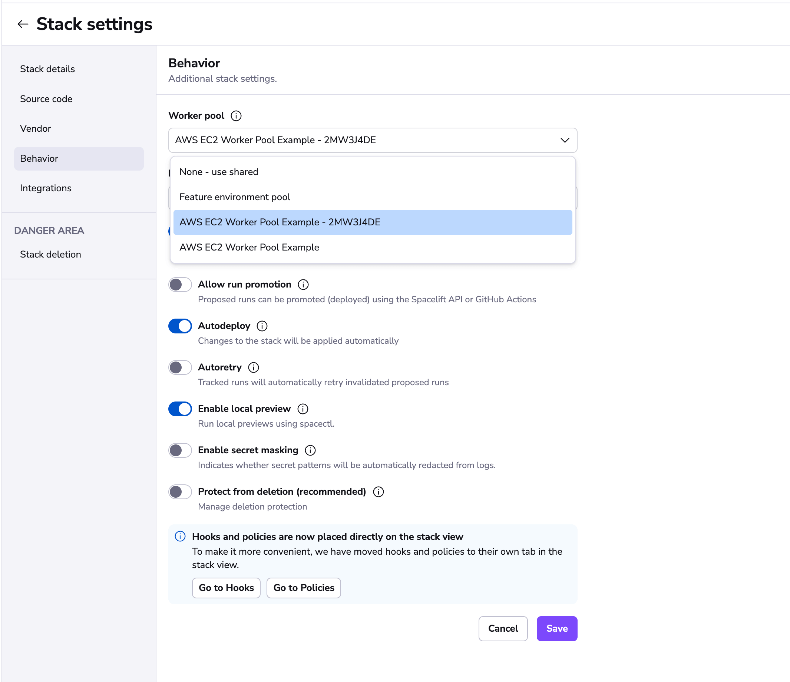
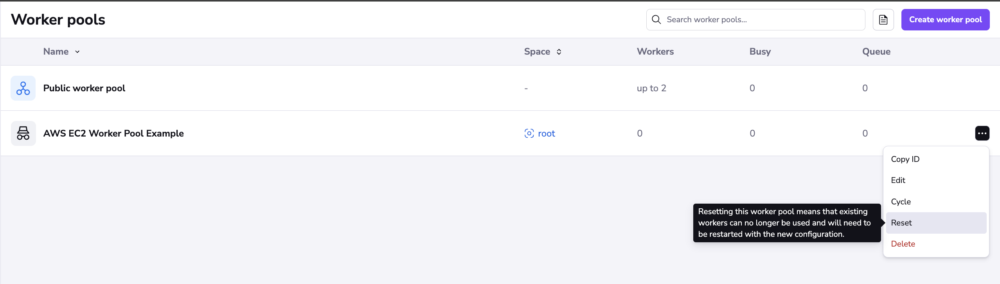

# Worker Pools


!!! Info
    This feature is only available on the Starter+ plan and above. Please check out our [pricing page](https://spacelift.io/pricing){: rel="nofollow"} for more information.

By default, Spacelift uses a managed worker pool hosted and operated by us. This is very convenient, but often you may have special requirements regarding infrastructure, security or compliance, which aren't served by the public worker pool. This is why Spacelift also supports private worker pools, which you can use to host the workers which execute Spacelift workflows on your end.

In order to enjoy the maximum level of flexibility and security with a private worker pool, temporary run state is encrypted end-to-end, so only the workers in your worker pool can look inside it. We use asymmetric encryption to achieve this and only you ever have access to the private key.


!!! tip
    A worker is a logical entity that processes a single [run](../run/README.md) at a time. As a result, your number of workers is equal to your maximum concurrency.

    Typically, a virtual server (AWS EC2 or Azure/GCP VM) hosts a single worker to keep things simple and avoid coordination and resource management overhead.

    Containerized workers can share the same virtual server because the management is handled by the orchestrator.

## Setting up

### Generate Worker Private Key

We use asymmetric encryption to ensure that any temporary run state can only be accessed by workers in a given worker pool. To support this, you need to generate a private key that can be used for this purpose, and use it to create a certificate signing request to give to Spacelift. We'll generate a certificate for you, so that workers can use it to authenticate with the Spacelift backend. The following command will generate the key and CSR:

```bash
openssl req -new -newkey rsa:4096 -nodes -keyout spacelift.key -out spacelift.csr
```

!!! warning
    Don't forget to store the `spacelift.key` file (private key) in a secure location. You’ll need it later, when launching workers in your worker pool.

You can set up your worker pool from the Spacelift UI by navigating to Worker Pools section of your account, or you can also create it programmatically using the `spacelift_worker_pool` resource type within the [Spacelift OpenTofu/Terraform provider](../../vendors/terraform/terraform-provider.md).

### Navigate to Worker Pools

.png>)

### Add Worker Pool Entity

Give your worker pool a name, and submit the `spacelift.csr` file in the worker pool creation form. After creation of the worker pool, you’ll receive a **Spacelift token**. This token contains configuration for your worker pool launchers, as well as the certificate we generated for you based on the certificate signing request.

!!! warning
    After clicking create, you will receive a token for the worker pool. Don't forget to save your **Spacelift token** in a secure location as you'll need this later when launching the worker pool.


### Launch Worker Pool

We have two main ways of running workers: using Docker, or running inside a Kubernetes cluster. Please use one of the following guides to setup your worker pool depending on how you would like to run it:

- [Docker-based workers](docker-based-workers.md).
- [Kubernetes workers](kubernetes-workers.md).

### Configuration options

A number of configuration variables are available to customize how your launcher behaves. Some of the options only make sense when using Docker-based workers, so the configuration options have been split into multiple sections.

#### Shared Options

- `SPACELIFT_MASK_ENVS`- comma-delimited list of whitelisted environment variables that are passed to the workers but should never appear in the logs.
- `SPACELIFT_SENSITIVE_OUTPUT_UPLOAD_ENABLED` - If set to `true`, the launcher will upload sensitive run outputs to the Spacelift backend. This is a requirement if you want to use sensitive outputs for [stack dependencies](../stack/stack-dependencies.md).
- `SPACELIFT_LAUNCHER_RUN_INITIALIZATION_POLICY` - file that contains the run initialization policy that will be parsed/used; If the run initialized policy can not be validated at the startup the worker pool will exit with an appropriate error. Please see the [Kubernetes-specific configuration](#kubernetes-specific-configuration) section for more information.
- `SPACELIFT_LAUNCHER_LOGS_TIMEOUT` - custom timeout (the default is _7 minutes_) for killing jobs not producing any logs. This is a duration flag, expecting a duration-formatted value, eg `1000s`. Please see the [Kubernetes-specific configuration](#kubernetes-specific-configuration) section for more information.
- `SPACELIFT_LAUNCHER_RUN_TIMEOUT` - custom maximum run time - the default is _70 minutes_. This is a duration flag, expecting a duration-formatted value, eg. `120m`. Please see the [Kubernetes-specific configuration](#kubernetes-specific-configuration) section for more information.
- `SPACELIFT_DEBUG`- if set to true, this will output the exact commands spacelift runs to the worker logs.

!!! warning
    [Server-side initialization policies](../../concepts/policy/run-initialization-policy.md) are being deprecated. `SPACELIFT_LAUNCHER_RUN_INITIALIZATION_POLICY` shouldn't be confused with that. This policy is a Worker-side initialization policy and it can be set by using the launcher run initialization policy flag.

    For a limited time period we will be running both types of initialization policy checks but ultimately we're planning to move the pre-flight checks to the worker node, thus allowing customers to block suspicious looking jobs on their end.

#### Docker-only options

- `SPACELIFT_DOCKER_CONFIG_DIR` - if set, the value of this variable will point to the directory containing Docker configuration, which includes credentials for private Docker registries. Private workers can populate this directory for example by executing `docker login` before the launcher process is started.
- `SPACELIFT_WHITELIST_ENVS` - comma-delimited list of environment variables to pass from the launcher's own environment to the workers' environment. They can be prefixed with `ro_` to only be included in read only runs or `wo_` to only be included in write only runs.
- `SPACELIFT_WORKER_EXTRA_MOUNTS` - additional files or directories to be mounted to the launched worker docker containers during **either read or write runs**, as a comma-separated list of mounts in the form of `/host/path:/container/path`.
- `SPACELIFT_WORKER_NETWORK` - network ID/name to connect the launched worker containers, defaults to `bridge`.
- `SPACELIFT_WORKER_RUNTIME` - runtime to use for worker container.
- `SPACELIFT_WORKER_RO_EXTRA_MOUNTS` - Additional directories to be mounted to the worker docker container during **read only runs**, as a comma separated list of mounts in the form of `/host/path:/container/path`.
- `SPACELIFT_WORKER_WO_EXTRA_MOUNTS` - Additional directories to be mounted to the worker docker container during **write only runs**, as a comma separated list of mounts in the form of `/host/path:/container/path`.

#### Kubernetes-specific configuration

There is more detailed information available in the Kubernetes workers documentation for certain configuration options:

- [Initialization policies](./kubernetes-workers.md#initialization-policies).
- [Timeouts](./kubernetes-workers.md#timeouts).

#### Passing metadata tags

!!! info
    Passing custom metadata tags is currently only supported for [Docker-based workers](./docker-based-workers.md). Kubernetes workers send through some metadata including the name of the Worker resource in Kubernetes along with the version of the controller used to create the worker, but do not support user-provided custom metadata.

When the launcher from a worker pool is registering with the mothership, you can send along some tags that will allow you to uniquely identify the process/machine for the purpose of draining or debugging. Any environment variables using `SPACELIFT_METADATA_` prefix will be passed on. As an example, if you're running Spacelift workers in EC2, you can do the following just before you execute the launcher binary:

```bash
export SPACELIFT_METADATA_instance_id=$(ec2-metadata --instance-id | cut -d ' ' -f2)
```

Doing so will set your EC2 instance ID as `instance_id` tag in your worker.


Please see [injecting custom commands during instance startup](./docker-based-workers.md#injecting-custom-commands-during-instance-startup) for information about how to do this when using our CloudFormation template.




#### Provider Caching

Provider caching is a feature that allows you to cache providers on your private workers.
It can speed up your runs by avoiding the need to download providers from the internet every time a run is executed.
Provider caching is supported in Spacelift with a little configuration on the worker side.

To enable provider caching:

1. On the worker itself export the `SPACELIFT_WORKER_EXTRA_MOUNTS` variable (see above) with the path to the directory where the providers will be stored.
2. In the stack that you want to enable provider caching, set the `TF_PLUGIN_CACHE_DIR` environment variable to the path you specified in the `SPACELIFT_WORKER_EXTRA_MOUNTS` variable.
3. Enjoy provider caching.

!!! note
    The extra mounts directory on the host _should_ use some shared storage that is accessible by all workers in the pool. This can be a shared filesystem, a network drive, or a cloud storage service.
    If you choose not to use a shared storage solution you may run into an instance where the `plan` phase succeeds but the `apply` phase fails due to the provider cache not being available.
    To avoid this, you can run `tofu init` (if using OpenTofu) as a before apply hook. Which will populate the cache on that node. Generally this should be fine, since once the cache is populated the re-initialization should quick.

### VCS Agents

!!! tip
    VCS Agents are intended for version control systems (VCS) that cannot be accessed over the internet from the Spacelift backend.

    **If your VCS can be accessed over the internet, possibly after allowing the Spacelift backend IP addresses, then you do not need to use VCS Agents.**

 When using private workers with a privately accessible version control system, you will need to ensure that your private workers have direct network access to your Version Control System.

 Additionally, you will need to inform the private workers of the target network address for each of your VCS Agent Pools by setting up the following variables:

- `SPACELIFT_PRIVATEVCS_MAPPING_NAME_<NUMBER>`: Name of the [VCS Agent Pool](../vcs-agent-pools.md).
- `SPACELIFT_PRIVATEVCS_MAPPING_BASE_ENDPOINT_<NUMBER>`: IP address or hostname, with protocol, for the VCS system.

There can be multiple VCS systems so replace `<NUMBER>` with an integer. Start from `0` and increment it by one for each new VCS system.

Here is an example that configures access to two VCS systems:

```bash
export SPACELIFT_PRIVATEVCS_MAPPING_NAME_0=bitbucket_pool
export SPACELIFT_PRIVATEVCS_MAPPING_BASE_ENDPOINT_0=http://192.168.2.2
export SPACELIFT_PRIVATEVCS_MAPPING_NAME_1=github_pool
export SPACELIFT_PRIVATEVCS_MAPPING_BASE_ENDPOINT_1=https://internal-github.net
```

When using Kubernetes workers, please see the [VCS Agents](./kubernetes-workers.md#using-vcs-agents-with-kubernetes-workers) section in the Kubernetes workers docs for specific information on how to configure this.



### Network Security

Private workers need to be able to make outbound connections in order to communicate with Spacelift, as well as to access any resources required by your runs. If you have policies in place that require you to limit the outbound traffic allowed from your workers, you can use the following lists as a guide.

#### AWS Services

Your worker needs access to the following AWS services in order to function correctly. You can refer to the [AWS documentation](https://docs.aws.amazon.com/general/latest/gr/aws-ip-ranges.html){: rel="nofollow"} for their IP address ranges.



- Access to the public Elastic Container Registry if using our default runner image.
- Access to `app.spacelift.io`, `<your account name>.app.spacelift.io`, and `downloads.spacelift.io` which point at CloudFront.
- Access to `worker-iot.spacelift.io`. This points at the [AWS IoT Core endpoints](https://docs.aws.amazon.com/general/latest/gr/iot-core.html){: rel="nofollow"} for worker communication via MQTT.
- Access to [Amazon S3](https://docs.aws.amazon.com/general/latest/gr/s3.html){: rel="nofollow"} for uploading run logs.

!!! info
    You should allow access to the IoT Core and S3 endpoints in both the `eu-west-1` and `eu-central-1` regions. Typically we use services in `eu-west-1`, however in the case of a full regional outage of `eu-west-1` we would failover to the `eu-central-1` region.



- Access to the public Elastic Container Registry if using our default runner image.
- Access to your Self-Hosted server, for example `https://spacelift.myorg.com`.
- Access to the [AWS IoT Core endpoints](https://docs.aws.amazon.com/general/latest/gr/iot-core.html){: rel="nofollow"} in your installation region for worker communication via MQTT.
- Access to [Amazon S3](https://docs.aws.amazon.com/general/latest/gr/s3.html){: rel="nofollow"} in your installation region for uploading run logs.



#### Other

In addition, you will also need to allow access to the following:

- Your VCS provider.
- Access to any custom container registries you use if using custom runner images.
- Access to any other infrastructure required as part of your runs.
- Access to `keys.openpgp.org` - required to download the PGP key used to sign Spacelift binaries.

### Hardware recommendations

The hardware requirements for the workers will vary depending on the stack size(How many resources managed, resource type, etc.), but we recommend at least **2GB of memory and 2 vCPUs of compute power**.

These are the recommended server types for the three main cloud providers:

- AWS: **t3.small** instance type
- Azure: **Standard_A2_V2** virtual machine
- GCP: **e2-medium** instance type

## Using worker pools

Worker pools must be explicitly attached to [stacks](../stack/README.md) and/or [modules](../../vendors/terraform/module-registry.md) in order to start processing their workloads. This can be done in the Behavior section of stack and module settings:




## Worker Pool Management Views

You can view the activity and status of every aspect of your worker pool in the worker pool detail view.
You can navigate to the worker pool of your choosing by clicking on the appropriate entry in the worker pools list view.


### Private Worker Pool

A private worker pool is a worker pool for which you are responsible for managing the workers.


#### Workers

The workers tab lists all workers for this worker pool and their status.

##### Status

A worker can have three possible statuses:

- `DRAINED` which indicates that the workers is not accepting new work.
- `BUSY` which indicates that the worker is currently processing or about to process a run.
- `IDLE` which indicates that the worker is available to start processing new runs.

#### Queued

Queued lists all the run that can be scheduled and are currently in progress.
In progress runs will be the first entries in the list when using the view without any filtering.

!!! info
    Reasons a run might not be shown in this list: a [tracked run](../run/tracked.md) is waiting on another tracked run, the run has a [dependency](../stack/stack-dependencies.md) on other runs.

### Available Actions

#### Cycle

Cycling the worker pool sends a self-destruct signal to all the workers in this pool. The process can take up to 20 seconds to complete. When you click on `cycle`, you will be prompted to confirm this action as it cannot be undone.


#### Reset

When you reset your worker pool, a new token is generated for your pool. This means that any workers that are using the old token will no-longer be able to connect and you need to update the credentials for the workers connected to that pool. This can be used used for security purposes if your certificate has been leaked.

Please follow the [steps](#generate-worker-private-key) to generate a new certificate.



#### Used by

[Stacks](../stack/README.md) and/or [Modules](../../vendors/terraform/module-registry.md) that are using the private worker pool.



### Public Worker Pool

The Public worker pool is a worker pool managed by Spacelift. Due to security and compliance requirements, we are not listing the workers of the public worker pool.


#### Queued

Queued lists all the run that can be scheduled and are currently in progress.
In progress runs will be the first entries in the list when using the view without any filtering.

!!! info
    Reasons a run might not be shown in this list: a [tracked run](../run/tracked.md) is waiting on a [tracked run](../run/tracked.md), the run has is [dependent](../stack/stack-dependencies.md) on other runs.

#### Used by

[Stacks](../stack/README.md) and/or [Modules](../../vendors/terraform/module-registry.md) that are using the public worker pool.



## Troubleshooting

### Locally, the run completes in 10 minutes, but on Spacelift, it takes over 30 minutes with no new activity appearing in the logs for the entire 30-minute duration (if debug logging is set to on then only showing Still running... in the logs for that duration).

The issue might be related to the instance size and its CPU limitations. It's advisable to monitor CPU and memory usage and make adjustments as needed.
