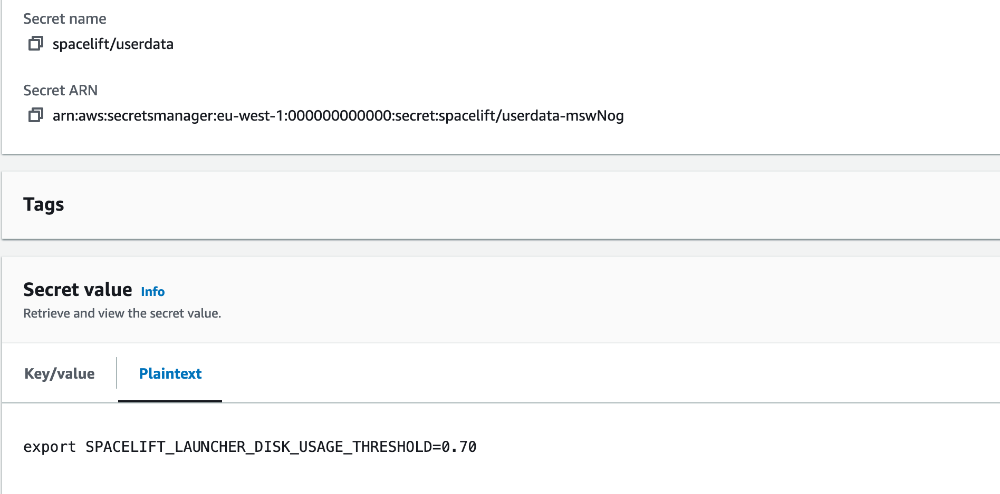

# Docker-based Workers

Spacelift Docker-based workers consist of two main components: the launcher binary, and the worker binary. The launcher is responsible for downloading the correct version of the worker binary to be able to execute Spacelift runs, and for starting new Docker containers in response to those runs being scheduled.


In a Self-Hosted install, the version of the launcher binary that is provided comes with the correct worker binary for your version of Self-Hosted embedded. This means that it doesn't need to download the worker binary separately when executing runs.




We suggest using our [Terraform modules](#terraform-modules) to deploy your workers, but you can also follow our instructions on [manual setup](#manual-setup) if you need to deploy workers to an environment not supported by our Terraform modules.



We suggest using our [Terraform module](#terraform-module) or [Cloudformation template](#cloudformation-template) to deploy your workers, but you can also follow our instructions on [manual setup](#manual-setup) if you need to deploy workers to an environment not supported by either approach.





## Terraform Modules

For AWS, Azure and GCP users we provide an easy way to run Spacelift worker pools. The [spacelift-io/spacelift-worker-image](https://github.com/spacelift-io/spacelift-worker-image){: rel="nofollow"} repository contains the code for Spacelift's base virtual machine images, and the following repositories contain Terraform modules to customize and deploy worker pools to AWS, Azure or GCP:

- AWS: [terraform-aws-spacelift-workerpool-on-ec2](https://github.com/spacelift-io/terraform-aws-spacelift-workerpool-on-ec2){: rel="nofollow"}.
- Azure: [terraform-azure-spacelift-workerpool](https://github.com/spacelift-io/terraform-azure-spacelift-workerpool){: rel="nofollow"}.
- GCP: [terraform-google-spacelift-workerpool](https://github.com/spacelift-io/terraform-google-spacelift-workerpool){: rel="nofollow"}.

!!! info
    AWS ECS is supported when using the EC2 launch type but Spacelift does not currently provide a Terraform module for this setup.



## Terraform module

The [terraform-aws-spacelift-workerpool-on-ec2](https://github.com/spacelift-io/terraform-aws-spacelift-workerpool-on-ec2){: rel="nofollow"} module can be used to deploy an EC2-based worker pool on AWS. The module is originally for our SaaS offering, but it's compatible with self-hosted when providing the `selfhosted_configuration` variable. For example:

```hcl
module "my_workerpool" {
  source = "github.com/spacelift-io/terraform-aws-spacelift-workerpool-on-ec2?ref=v5.4.2"

  secure_env_vars = {
    SPACELIFT_TOKEN            = var.worker_pool_config
    SPACELIFT_POOL_PRIVATE_KEY = var.worker_pool_private_key
  }

  configuration = <<EOF
    export SPACELIFT_SENSITIVE_OUTPUT_UPLOAD_ENABLED=true
  EOF

  min_size                 = 1
  max_size                 = 10
  worker_pool_id           = var.worker_pool_id
  security_groups          = var.worker_pool_security_groups
  vpc_subnets              = var.worker_pool_subnets
  selfhosted_configuration = {
    s3_uri = "s3://spacelift-binaries-123ab/spacelift-launcher"
  }
}
```

## CloudFormation Template

Another way to deploy workers for self-hosting is to deploy the CloudFormation template found in `cloudformation/workerpool.yaml`.

### PseudoRandomSuffix

The CloudFormation stack uses a parameter called `PseudoRandomSuffix` in order to ensure that certain resources are unique within an AWS account. The value of this parameter does not matter, other than that it is unique per worker pool stack you deploy. You should choose a value that is 6 characters long and made up of letters and numbers, for example `ab12cd`.

### Create a secret

First, create a new secret in SecretsManager, and add your token and the base64-encoded value of your private key. Use the key `SPACELIFT_TOKEN` for your token and `SPACELIFT_POOL_PRIVATE_KEY` for the private key. It should look something like this:


Give your secret a name and create it. It doesn't matter what this name is, but you'll need it when deploying the CloudFormation stack.

### Get the downloads bucket name

The downloads bucket name is output at the end of the installation process. If you don't have a note of it, you can also get it from the resources of the _spacelift-infra-s3_ stack in CloudFormation:


### AMI

You can use your own custom-built AMI for your workers, or you can use one of the pre-built images we provide. For a list of the correct AMI to use for the region you want to deploy your worker to, see the [spacelift-worker-image releases page](https://github.com/spacelift-io/spacelift-worker-image/releases){: rel="nofollow"}.

**Note:** please make sure to choose the `x86_64` version of the AMI.

### Subnets and Security Group

You will need to have an existing VPC to deploy your pool into, and will need to provide a list of subnet IDs and security groups to match your requirements.

### Using a custom IAM role

By default we will create the instance role for the EC2 ASG as part of the worker pool stack, but you can also provide your own custom role via the `InstanceRoleName` parameter. This allows you to grant permissions to additional AWS resources that your workers need access to. A great example of this is allowing access to a private ECR in order to use a custom runner image.

At a minimum, your role must fulfil the following requirements:

- It must have a trust relationship that allows role assumption by EC2.
- It needs to have the following managed policies attached:
    - `AutoScalingReadOnlyAccess`.
    - `CloudWatchAgentServerPolicy`.
    - `AmazonSSMManagedInstanceCore`.

### Injecting custom commands during instance startup

You have the option to inject custom commands into the EC2 user data. This can be useful if you want to install additional software on your workers, or if you want to run a custom script during instance startup, or just add some additional environment variables.

The script must be a valid shell script and should be put into Secrets Manager. Then you can provide the name of the secret as `CustomUserDataSecretName` when deploying the stack.

Example:



In the example above, we used `spacelift/userdata` as a secret name so the parameter will look like this:

```shell
  [...]
  --parameter-overrides \
    CustomUserDataSecretName="spacelift/userdata" \
  [...]
```

### Granting access to a private ECR

To allow your worker role to access a private ECR, you can attach a policy similar to the following to your instance role (replacing `<repository-arn>` with the ARN of your ECR repository):

```json
{
    "Version": "2012-10-17",
    "Statement": [
        {
            "Effect": "Allow",
            "Action": [
                "ecr:GetDownloadUrlForLayer",
                "ecr:BatchGetImage",
                "ecr:BatchCheckLayerAvailability"
            ],
            "Resource": "<repository-arn>"
        },
        {
            "Effect": "Allow",
            "Action": [
                "ecr:GetAuthorizationToken"
            ],
            "Resource": "*"
        }
    ]
}
```

NOTE: repository ARNs are in the format `arn:<partition>:ecr:<region>:<account-id>:repository/<repository-name>`.

### Proxy Configuration

If you need to use an HTTP proxy for internet access, you can provide the proxy configuration using the following CloudFormation parameters:

- `HttpProxyConfig`.
- `HttpsProxyConfig`.
- `NoProxyConfig`.

For example, you could use the following command to deploy a worker with a proxy configuration:

```shell
aws cloudformation deploy --no-cli-pager \
  --stack-name spacelift-default-worker-pool \
  --template-file "cloudformation/workerpool.yaml" \
  --region "eu-west-1" \
  --parameter-overrides \
    PseudoRandomSuffix="ab12cd" \
    BinariesBucket="012345678901-spacelift-infra-spacelift-downloads" \
    SecretName="spacelift/default-worker-pool-credentials" \
    SecurityGroups="sg-0d1e157a19ba2106f" \
    Subnets="subnet-44ca1b771ca7bcc1a,subnet-6b61ec08772f47ba2" \
    ImageId="ami-0ead0234bef4f51b0" \
    HttpProxyConfig="http://proxy.example.com:1234" \
    HttpsProxyConfig="https://proxy.example.com:4321" \
    NoProxyConfig="some.domain,another.domain" \
  --capabilities "CAPABILITY_NAMED_IAM"
```

### Using custom CA certificates

If you use a custom certificate authority to issue TLS certs for components that Spacelift will communicate with, for example your VCS system, you need to provide your custom CA certificates to the worker. You do this by creating a secret in SecretsManager containing a base64 encoded JSON string.

The format of the JSON object is as follows:

```json
{"caCertificates": ["<base64-encoded-cert-1>", "<base64-encoded-cert-2>", "<base64-encoded-cert-N>"]}
```

For example, if you had a file called ca-certs.json containing the following content:

```json
{
  "caCertificates": [
    "LS0tLS1CRUdJTiBDRVJUSUZJQ0FURS0tLS0tCk1JSUZzVENDQTVtZ0F3SUJBZ0lVREQvNFZCZkx4NUsvdEFZK1Nja0gwNVRKOGk4d0RRWUpLb1pJaHZjTkFRRUwKQlFBd2FERUxNQWtHQTFVRUJoTUNSMEl4RVRBUEJnTlZCQWdNQ0ZOamIzUnNZVzVrTVJBd0RnWURWUVFIREFkSApiR0Z6WjI5M01Sa3dGd1lEVlFRS0RCQkJaR0Z0SUVNZ1VtOXZkQ0JEUVNBeE1Sa3dGd1lEVlFRRERCQkJaR0Z0CklFTWdVbTl2ZENCRFFTQXhNQjRYRFRJek1ETXhNekV4TXpZeE1Wb1hEVEkxTVRJek1URXhNell4TVZvd2FERUwKTUFrR0ExVUVCaE1DUjBJeEVUQVBCZ05WQkFnTUNGTmpiM1JzWVc1a01SQXdEZ1lEVlFRSERBZEhiR0Z6WjI5MwpNUmt3RndZRFZRUUtEQkJCWkdGdElFTWdVbTl2ZENCRFFTQXhNUmt3RndZRFZRUUREQkJCWkdGdElFTWdVbTl2CmRDQkRRU0F4TUlJQ0lqQU5CZ2txaGtpRzl3MEJBUUVGQUFPQ0FnOEFNSUlDQ2dLQ0FnRUF4anYvK3NJblhpUSsKMkZiK2l0RjhuZGxwbW1ZVW9ad1lONGR4KzJ3cmNiT1ZuZ1R2eTRzRSszM25HQnpINHZ0NHBPaEtUV3dhWVhGSQowQ3pxb0lvYXppOFpsMG1lZHlyd3RJVURaMXBOY1Z1Z2I0S0FGYjlKYnE0MElrM3hHNnQxNm1heFFKR1RpQUcyCi94VnRzdVlkaG5CR3gvLzYxU0ViRXdTcFIxNDUvUWYxY2JhOFJsUlFNejRRVVdOZThYWG8zU1lhWDJreGl3MlYKMU9wK2ZReGcyamYxQXl6UVhYMWNoMWp5RzVSTEVTUFVNRmtCaVF3aTdMT1NDYWF2ZkpFVXp3cWVvT1JnZDdUaQp1eU1WKzRHc2IxWEFuSzdLWFl3aXNHZVA1L1FORlBBQnlmQWRQalIyMHJNWVlIZnhxRUR0aDROYWpqbXUvaXlGClBHazRDb2JSaGl0VHRKWFQvUXhXY3Z0clJ1MUJDVm5lZHlFU015aXlhNFE5ZG4yN3JGampnM1pBUnFXT1poeXEKT1RXSG8ybU8yRnpFSnV4aHZZTmUyaVlWcDJzOHdNVEIwMm5QM3dwV29Zd2plMnlEd2Nqa0lsOHVYS3pFWjlHZgpGQVRKYUNMb084bzVKMkhYc2dPSXFYbHB6VTl0VXRFZXcveFR6WnFYNUEzNG84LytOZ1V0bTBGN2pvV2E1bURDClFCN0w4Y0tmQUN5ZGZwZWtKeC9nRlVHU3kvNXZkZkJ6T2N6YzZCbWg2NnlIUEJSRGNneURGbm54MzRtL1hWUWEKckJ3d0lERGJxdTNzc2NkT2dtOXY4Y3NDSmQwWWxYR2IveDRvQUE2MUlJVG5zTmQ5TkN3MEdKSXF1U0VjWWlDRQpBMFlyUVRLVmZSQVh1aFNaMVZQSXV4WGlGMkszWFRNQ0F3RUFBYU5UTUZFd0hRWURWUjBPQkJZRUZENTVSNG10CjBoTk9KVWdQTDBKQktaQjFqeWJTTUI4R0ExVWRJd1FZTUJhQUZENTVSNG10MGhOT0pVZ1BMMEpCS1pCMWp5YlMKTUE4R0ExVWRFd0VCL3dRRk1BTUJBZjh3RFFZSktvWklodmNOQVFFTEJRQURnZ0lCQUhlY1ZqTWtsVGtTMlB5NQpYTnBKOWNkekc2Nkd1UER3OGFRWkl1bnJ4cVl1ZDc0Q0ExWTBLMjZreURKa0xuV3pWYTduVCtGMGQ4UW4zdG92CnZGd0kzeHk1bCs0dXBtdVozdTFqRkVNaVNrOEMyRlBvaExEbkRvM3J3RVVDR3ZKNmE0R2FzN1l5SFBHTDNEckoKMGRjdTl3c1g5Y1lCMllKMjdRb3NaNXM2em1tVXZCR1RJMzBKTnZQblNvQzdrenFEM0FyeHZURVc5V2FVcW9KdAo4OGxzTW5uNitwczlBNmV4Yi9mSzkwOVpXYUVKV1JkOWNkTUVUMGZuYTdFaGhrTytDcXo0MTVSZ014bEs3Z2dUCjk3Q3ZranZ2TE5lRlQ1bmFIYnpVQU5xZk1WUlJjVWFQM1BqVEM5ejVjRG85Q2FQYUZqVi8rVXhheDJtQWxBUmsKZnFZeVdvcXZaSDkwY3pwdkZHMWpVbzZQNE5weXhaUzhsYXlKd0QyNHFYK0VPTjQzV1lBcExzbC9qRTJBL0ptUQpNZGdXTmhPeTRIUDhVOCthQU5yMEV2N2dXV05pNlZjUjhUNlBUL3JiQUdqblBtVm1vWjRyYzdDZG9TOFpRWkpoCks4RUxBMTcrcG5NVGdvN3d4ZkFScUwrcCttcWd0VXhSYmlXaXRldjhGMmhVVkIvU3dQOGhwY0dyZGhURU43dGQKcFNXMXlrUGVHSkZLU0JvNVFIYW5xcVBGQ3pxdEZlb0w5RGhZeDUveEU2RnBLTUxnM3ZWY0ZzSHU2Z2xTOGlNVgo0SHZiMmZYdWhYeExUQkNiRDErNWxMUC9iSFhvZ1FLbXAySDZPajBlNldCbVEweHFHb3U0SWw2YmF2c1pDeDJ2CkFEV3ZsdWU1alhkTnU1eFBaZHNOVk5BbHVBbmUKLS0tLS1FTkQgQ0VSVElGSUNBVEUtLS0tLQo="
  ]
}
```

You could then encode it to base64 using `base64 -w0 < ca-certs.json` (or `base64 -b 0 < ca-certs.json` on a Mac), resulting in the following string:

```text
ewogICJjYUNlcnRpZmljYXRlcyI6IFsKICAgICJMUzB0TFMxQ1JVZEpUaUJEUlZKVVNVWkpRMEZVUlMwdExTMHRDazFKU1VaelZFTkRRVFZ0WjBGM1NVSkJaMGxWUkVRdk5GWkNaa3g0TlVzdmRFRlpLMU5qYTBnd05WUktPR2s0ZDBSUldVcExiMXBKYUhaalRrRlJSVXdLUWxGQmQyRkVSVXhOUVd0SFFURlZSVUpvVFVOU01FbDRSVlJCVUVKblRsWkNRV2ROUTBaT2FtSXpVbk5aVnpWclRWSkJkMFJuV1VSV1VWRklSRUZrU0FwaVIwWjZXakk1TTAxU2EzZEdkMWxFVmxGUlMwUkNRa0phUjBaMFNVVk5aMVZ0T1haa1EwSkVVVk5CZUUxU2EzZEdkMWxFVmxGUlJFUkNRa0phUjBaMENrbEZUV2RWYlRsMlpFTkNSRkZUUVhoTlFqUllSRlJKZWsxRVRYaE5la1Y0VFhwWmVFMVdiMWhFVkVreFRWUkplazFVUlhoTmVsbDRUVlp2ZDJGRVJVd0tUVUZyUjBFeFZVVkNhRTFEVWpCSmVFVlVRVkJDWjA1V1FrRm5UVU5HVG1waU0xSnpXVmMxYTAxU1FYZEVaMWxFVmxGUlNFUkJaRWhpUjBaNldqSTVNd3BOVW10M1JuZFpSRlpSVVV0RVFrSkNXa2RHZEVsRlRXZFZiVGwyWkVOQ1JGRlRRWGhOVW10M1JuZFpSRlpSVVVSRVFrSkNXa2RHZEVsRlRXZFZiVGwyQ21SRFFrUlJVMEY0VFVsSlEwbHFRVTVDWjJ0eGFHdHBSemwzTUVKQlVVVkdRVUZQUTBGbk9FRk5TVWxEUTJkTFEwRm5SVUY0YW5ZdkszTkpibGhwVVNzS01rWmlLMmwwUmpodVpHeHdiVzFaVlc5YWQxbE9OR1I0S3pKM2NtTmlUMVp1WjFSMmVUUnpSU3N6TTI1SFFucElOSFowTkhCUGFFdFVWM2RoV1ZoR1NRb3dRM3B4YjBsdllYcHBPRnBzTUcxbFpIbHlkM1JKVlVSYU1YQk9ZMVoxWjJJMFMwRkdZamxLWW5FME1FbHJNM2hITm5ReE5tMWhlRkZLUjFScFFVY3lDaTk0Vm5SemRWbGthRzVDUjNndkx6WXhVMFZpUlhkVGNGSXhORFV2VVdZeFkySmhPRkpzVWxGTmVqUlJWVmRPWlRoWVdHOHpVMWxoV0RKcmVHbDNNbFlLTVU5d0syWlJlR2N5YW1ZeFFYbDZVVmhZTVdOb01XcDVSelZTVEVWVFVGVk5SbXRDYVZGM2FUZE1UMU5EWVdGMlprcEZWWHAzY1dWdlQxSm5aRGRVYVFwMWVVMVdLelJIYzJJeFdFRnVTemRMV0ZsM2FYTkhaVkExTDFGT1JsQkJRbmxtUVdSUWFsSXlNSEpOV1ZsSVpuaHhSVVIwYURST1lXcHFiWFV2YVhsR0NsQkhhelJEYjJKU2FHbDBWSFJLV0ZRdlVYaFhZM1owY2xKMU1VSkRWbTVsWkhsRlUwMTVhWGxoTkZFNVpHNHlOM0pHYW1wbk0xcEJVbkZYVDFwb2VYRUtUMVJYU0c4eWJVOHlSbnBGU25WNGFIWlpUbVV5YVZsV2NESnpPSGROVkVJd01tNVFNM2R3VjI5WmQycGxNbmxFZDJOcWEwbHNPSFZZUzNwRldqbEhaZ3BHUVZSS1lVTk1iMDg0YnpWS01raFljMmRQU1hGWWJIQjZWVGwwVlhSRlpYY3ZlRlI2V25GWU5VRXpORzg0THl0T1oxVjBiVEJHTjJwdlYyRTFiVVJEQ2xGQ04wdzRZMHRtUVVONVpHWndaV3RLZUM5blJsVkhVM2t2Tlhaa1prSjZUMk42WXpaQ2JXZzJObmxJVUVKU1JHTm5lVVJHYm01NE16UnRMMWhXVVdFS2NrSjNkMGxFUkdKeGRUTnpjMk5rVDJkdE9YWTRZM05EU21Rd1dXeFlSMkl2ZURSdlFVRTJNVWxKVkc1elRtUTVUa04zTUVkS1NYRjFVMFZqV1dsRFJRcEJNRmx5VVZSTFZtWlNRVmgxYUZOYU1WWlFTWFY0V0dsR01rc3pXRlJOUTBGM1JVRkJZVTVVVFVaRmQwaFJXVVJXVWpCUFFrSlpSVVpFTlRWU05HMTBDakJvVGs5S1ZXZFFUREJLUWt0YVFqRnFlV0pUVFVJNFIwRXhWV1JKZDFGWlRVSmhRVVpFTlRWU05HMTBNR2hPVDBwVloxQk1NRXBDUzFwQ01XcDVZbE1LVFVFNFIwRXhWV1JGZDBWQ0wzZFJSazFCVFVKQlpqaDNSRkZaU2t0dldrbG9kbU5PUVZGRlRFSlJRVVJuWjBsQ1FVaGxZMVpxVFd0c1ZHdFRNbEI1TlFwWVRuQktPV05rZWtjMk5rZDFVRVIzT0dGUldrbDFibko0Y1ZsMVpEYzBRMEV4V1RCTE1qWnJlVVJLYTB4dVYzcFdZVGR1VkN0R01HUTRVVzR6ZEc5MkNuWkdkMGt6ZUhrMWJDczBkWEJ0ZFZvemRURnFSa1ZOYVZOck9FTXlSbEJ2YUV4RWJrUnZNM0ozUlZWRFIzWktObUUwUjJGek4xbDVTRkJIVERORWNrb0tNR1JqZFRsM2MxZzVZMWxDTWxsS01qZFJiM05hTlhNMmVtMXRWWFpDUjFSSk16QktUblpRYmxOdlF6ZHJlbkZFTTBGeWVIWlVSVmM1VjJGVmNXOUtkQW80T0d4elRXNXVOaXR3Y3psQk5tVjRZaTltU3prd09WcFhZVVZLVjFKa09XTmtUVVZVTUdadVlUZEZhR2hyVHl0RGNYbzBNVFZTWjAxNGJFczNaMmRVQ2prM1EzWnJhbloyVEU1bFJsUTFibUZJWW5wVlFVNXhaazFXVWxKalZXRlFNMUJxVkVNNWVqVmpSRzg1UTJGUVlVWnFWaThyVlhoaGVESnRRV3hCVW1zS1puRlplVmR2Y1haYVNEa3dZM3B3ZGtaSE1XcFZielpRTkU1d2VYaGFVemhzWVhsS2QwUXlOSEZZSzBWUFRqUXpWMWxCY0V4emJDOXFSVEpCTDBwdFVRcE5aR2RYVG1oUGVUUklVRGhWT0N0aFFVNXlNRVYyTjJkWFYwNXBObFpqVWpoVU5sQlVMM0ppUVVkcWJsQnRWbTF2V2pSeVl6ZERaRzlUT0ZwUldrcG9Da3M0UlV4Qk1UY3JjRzVOVkdkdk4zZDRaa0ZTY1V3cmNDdHRjV2QwVlhoU1ltbFhhWFJsZGpoR01taFZWa0l2VTNkUU9HaHdZMGR5WkdoVVJVNDNkR1FLY0ZOWE1YbHJVR1ZIU2taTFUwSnZOVkZJWVc1eGNWQkdRM3B4ZEVabGIwdzVSR2haZURVdmVFVTJSbkJMVFV4bk0zWldZMFp6U0hVMloyeFRPR2xOVmdvMFNIWmlNbVpZZFdoWWVFeFVRa05pUkRFck5XeE1VQzlpU0ZodloxRkxiWEF5U0RaUGFqQmxObGRDYlZFd2VIRkhiM1UwU1d3MlltRjJjMXBEZURKMkNrRkVWM1pzZFdVMWFsaGtUblUxZUZCYVpITk9WazVCYkhWQmJtVUtMUzB0TFMxRlRrUWdRMFZTVkVsR1NVTkJWRVV0TFMwdExRbz0iCiAgXQp9Cg==
```

You would then create a secret in SecretsManager, and deploy the worker pool using the following command (replacing `<ca-cert-secret-name>` with the name of your secret):

```shell
aws cloudformation deploy --no-cli-pager \
  --stack-name spacelift-default-worker-pool \
  --template-file "cloudformation/workerpool.yaml" \
  --region "eu-west-1" \
  --parameter-overrides \
    PseudoRandomSuffix="ab12cd" \
    BinariesBucket="012345678901-spacelift-infra-spacelift-downloads" \
    SecretName="spacelift/default-worker-pool-credentials" \
    SecurityGroups="sg-0d1e157a19ba2106f" \
    Subnets="subnet-44ca1b771ca7bcc1a,subnet-6b61ec08772f47ba2" \
    ImageId="ami-0ead0234bef4f51b0" \
    AdditionalRootCAsSecretName="<ca-cert-secret-name>" \
  --capabilities "CAPABILITY_NAMED_IAM"
```

### Running the launcher as root

By default, when the EC2 instance starts up, it creates a user called `spacelift` with a UID of 1983. This user is then used to run the launcher process.

If for some reason this causes problems, you can run the launcher as `root` by setting the `RunLauncherAsSpaceliftUser` CloudFormation parameter to `false`.

!!! tip
    Versions v0.0.7 or older of Self-Hosted always ran the launcher as root. In newer versions this behavior has changed to default to the `spacelift` user.

### PowerOffOnError

By default, the startup script for the EC2 instances automatically terminates the instance if the launcher exits. This is to allow the instance to be automatically removed from the autoscale group and a new one added in the case of errors.

Sometimes it can be useful to disable this behavior, for example if instances are repeatedly crashing on startup, preventing you from being able to connect to investigate any issues before they terminate.

To do this, set the `PowerOffOnError` setting to false when deploying your CloudFormation stack.

!!! info
    Please note, if you update this setting on an existing CloudFormation stack, you will need to restart all the workers in the pool before the updated setting takes effect.

### Deploying the Template

To deploy your worker pool stack, you can use the following command:

```shell
aws cloudformation deploy --no-cli-pager \
  --stack-name spacelift-default-worker-pool \
  --template-file "cloudformation/workerpool.yaml" \
  --region "<region>" \
  --parameter-overrides \
    PseudoRandomSuffix="ab12cd" \
    BinariesBucket="<binaries-bucket>" \
    SecretName="<secret-name>" \
    SecurityGroups="<security-groups>" \
    Subnets="<subnets>" \
    ImageId="<ami-id>" \
  --capabilities "CAPABILITY_NAMED_IAM"
```

For example, to deploy to `eu-west-1` you might use something like this:

```shell
aws cloudformation deploy --no-cli-pager \
  --stack-name spacelift-default-worker-pool \
  --template-file "cloudformation/workerpool.yaml" \
  --region "eu-west-1" \
  --parameter-overrides \
    PseudoRandomSuffix="ab12cd" \
    BinariesBucket="012345678901-spacelift-infra-spacelift-downloads" \
    SecretName="spacelift/default-worker-pool-credentials" \
    SecurityGroups="sg-0d1e157a19ba2106f" \
    Subnets="subnet-44ca1b771ca7bcc1a,subnet-6b61ec08772f47ba2" \
    ImageId="ami-0ead0234bef4f51b0" \
  --capabilities "CAPABILITY_NAMED_IAM"
```

To use a custom instance role, you might use something like this:

```shell
aws cloudformation deploy --no-cli-pager \
  --stack-name spacelift-default-worker-pool \
  --template-file "cloudformation/workerpool.yaml" \
  --region "eu-west-1" \
  --parameter-overrides \
    PseudoRandomSuffix="ab12cd" \
    BinariesBucket="012345678901-spacelift-infra-spacelift-downloads" \
    SecretName="spacelift/default-worker-pool-credentials" \
    SecurityGroups="sg-0d1e157a19ba2106f" \
    Subnets="subnet-44ca1b771ca7bcc1a,subnet-6b61ec08772f47ba2" \
    ImageId="ami-0ead0234bef4f51b0" \
    InstanceRoleName="default-worker-role" \
  --capabilities "CAPABILITY_NAMED_IAM"
```



## Manual setup

### Pre-requisites

In order to work, the launcher expects to be able to write to the local Docker socket. Please make sure that Docker is installed and running.

### Downloading the launcher


The launcher is distributed as a statically-linked Go binary, and we provide slightly different versions depending on whether you are using one of our standard environments (for example app.spacelift.io or us.app.spacelift.io) or our FedRAMP environment. The key difference is that the FedRAMP version disables some of the telemetry we use to investigate customer issues.

For each environment, we provide amd64 and arm64 versions, so that you can use the correct version depending on the architecture you use. Please download the appropriate version for your Spacelift environment and host architecture.

=== "Standard"

    - [x86_64](https://downloads.spacelift.io/spacelift-launcher-x86_64){: rel="nofollow"} (amd64 CPU).
    - [aarch64](https://downloads.spacelift.io/spacelift-launcher-aarch64){: rel="nofollow"} (arm64 CPU).

=== "FedRAMP"

    - [x86_64](https://downloads.spacelift.io/spacelift-launcher-fedramp-x86_64){: rel="nofollow"} (amd64 CPU).
    - [aarch64](https://downloads.spacelift.io/spacelift-launcher-fedramp-aarch64){: rel="nofollow"} (arm64 CPU).

!!! tip
    In general, arm64-based virtual machines are cheaper than amd64-based ones, so if your cloud provider supports them, we recommend using them. If you choose to do so, and you're using [custom runner images](../../concepts/stack/stack-settings.md#runner-image), make sure they're compatible with ARM64. All Spacelift provided runner images are compatible with both CPU architectures.


The Self-Hosted release archive contains a copy of the Spacelift launcher binary built specifically for your version of Self-Hosted. You can find this at `bin/spacelift-launcher`. This binary is also uploaded to the downloads S3 bucket during the Spacelift installation process. For more information on how to find your bucket name see [here](#get-the-downloads-bucket-name).


### Running the launcher

You can run the launcher binary using the following commands (replacing `<worker-pool-id>` with the ID of your pool):

```shell
export SPACELIFT_TOKEN=$(cat worker-pool-<worker-pool-id>.config)
export SPACELIFT_POOL_PRIVATE_KEY=$(cat spacelift.key | base64 -w0)
./spacelift-launcher
```

These commands set the following environment variables and then execute the launcher binary:

- `SPACELIFT_TOKEN` - the token you’ve received from Spacelift on worker pool creation.
- `SPACELIFT_POOL_PRIVATE_KEY` - the contents of the private key file you generated, in base64.

!!! info
    You need to encode the _entire_ private key using base-64, making it a single line of text. The simplest approach is to just run `cat spacelift.key | base64 -w 0` in your command line. For Mac users, the command is `cat spacelift.key | base64 -b 0`.

Congrats! Your launcher should now connect to the Spacelift backend and start handling runs.



## Periodic updates

Our worker infrastructure consists of two binaries: launcher and worker. The latest version of the launcher binary is downloaded during the instance startup. The launcher then establishes a connection with the Spacelift backend and waits for messages. When it gets a message, it downloads the latest version of the worker binary and executes it. The worker binary is responsible for running the actual Spacelift runs.

This setup ensures that the worker binary is always up to date, but the launcher may not be. Typically, the worker binaries receive more updates but it's still recommended to recycle the worker pool every once in a while to ensure that the launcher is up to date. The simplest way to do this is via the _Cycle_ option on the worker pool page:




## AMI updates & deprecation policy

If you run your workers in AWS and use the [Spacelift AMIs](https://github.com/spacelift-io/spacelift-worker-image){: rel="nofollow"}, make sure to update your worker pool routinely as they receive [weekly updates](https://github.com/spacelift-io/spacelift-worker-image/releases){: rel="nofollow"} to ensure all system components are up-to-date.

Currently, the AWS AMIs are [set to be deprecated in 364 days](https://github.com/spacelift-io/spacelift-worker-image/blob/409fff993556d53225c70a9736771a9808d89e1d/aws.pkr.hcl#L131){: rel="nofollow"} after its release and removed after 420 days. You won't be able to start new instances using a deprecated AMI, but existing instances will continue to run.



## EC2 Spot Instances

The [AWS Terraform module](https://github.com/spacelift-io/terraform-aws-spacelift-workerpool-on-ec2){: rel="nofollow"} supports [EC2 Spot Instances](https://aws.amazon.com/ec2/spot/){: rel="nofollow"} for up to 90% cost savings.

!!! warning "Not Recommended for Production/Critical Workloads"
    Spot instances are **NOT recommended for critical or production workloads** as they can be interrupted with only 2 minutes notice, potentially causing:

    - Incomplete or corrupted Terraform state
    - Failed deployments leaving infrastructure in inconsistent state
    - Loss of work-in-progress for long-running operations

    Use Spot instances only for development, testing, or fault-tolerant workloads where interruption is acceptable: for example, ephemeral environments, Terraform modules, or operations with guaranteed runtimes under one minute.

```hcl
module "my_workerpool" {
  source = "github.com/spacelift-io/terraform-aws-spacelift-workerpool-on-ec2"

  # Other settings are omitted for brevity

  instance_market_options = {
    market_type = "spot"
  }
  ec2_instance_type = "t3.medium"
}
```

The Spacelift worker includes graceful interruption handling: it monitors for spot interruption notices and allows running jobs to complete when possible. However, if a run doesn't complete within the 2-minute interruption grace period, it will be abruptly terminated and crash.

Use the [AWS EC2 Spot Instance Advisor](https://aws.amazon.com/ec2/spot/instance-advisor/){: rel="nofollow"} to select cost-effective instance types with lower interruption rates. See the [spot instances example](https://github.com/spacelift-io/terraform-aws-spacelift-workerpool-on-ec2/tree/main/examples/spot-instances){: rel="nofollow"} for more configuration options.



## EC2 Spot Instances

The [AWS Terraform module](https://github.com/spacelift-io/terraform-aws-spacelift-workerpool-on-ec2){: rel="nofollow"} supports [EC2 Spot Instances](https://aws.amazon.com/ec2/spot/){: rel="nofollow"} for up to 90% cost savings.

!!! warning "Not Recommended for Production/Critical Workloads"
    Spot instances are **NOT recommended for critical or production workloads** as they can be interrupted with only 2 minutes notice, potentially causing:

    - Incomplete or corrupted Terraform state
    - Failed deployments leaving infrastructure in inconsistent state
    - Loss of work-in-progress for long-running operations
    
     Use Spot instances only for development, testing, or fault-tolerant workloads where interruption is acceptable: for example, ephemeral environments, Terraform modules, or operations with guaranteed runtimes under one minute.

```hcl
module "my_workerpool" {
  source = "github.com/spacelift-io/terraform-aws-spacelift-workerpool-on-ec2"

  # Other settings are omitted for brevity

  instance_market_options = {
    market_type = "spot"
  }
  ec2_instance_type = "t3.medium"
}
```

The Spacelift worker includes graceful interruption handling: it monitors for [spot interruption notices](https://docs.aws.amazon.com/AWSEC2/latest/UserGuide/spot-instance-termination-notices.html){: rel="nofollow"} and allows running jobs to complete when possible. However, if a run doesn't complete within the 2-minute interruption grace period, it will be abruptly terminated and crash.

Use the [AWS EC2 Spot Instance Advisor](https://aws.amazon.com/ec2/spot/instance-advisor/){: rel="nofollow"} to select cost-effective instance types with lower interruption rates. See the [spot instances example](https://github.com/spacelift-io/terraform-aws-spacelift-workerpool-on-ec2/tree/main/examples/spot-instances){: rel="nofollow"} for more configuration options.

### Download EC2 module from registry

Our EC2 worker pool module can be downloaded from our registry, instead of directly from GitHub:

```hcl
module "spacelift-workerpool-on-ec2" {
  source  = "spacelift.io/spacelift-io/spacelift-workerpool-on-ec2/aws"
  version = ">= 5.4.0"

  # Other settings are omitted for brevity

  instance_market_options = {
    market_type = "spot"
  }
  ec2_instance_type = "t3.medium"
}
```


