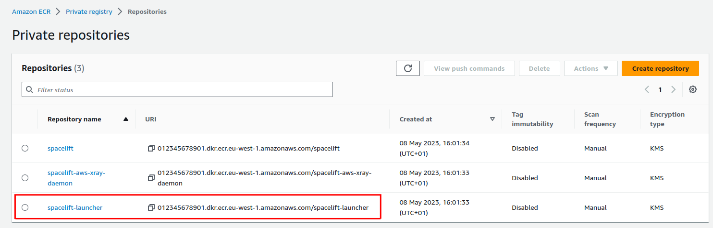

# Kubernetes Workers

We provide a Kubernetes operator for managing Spacelift worker pools. This operator allows you to define `WorkerPool` resources in your cluster, and allows you to scale these pools up and down using standard Kubernetes functionality.

!!! info
    Previously we provided a [Helm chart](https://github.com/spacelift-io/spacelift-helm-charts/tree/main/spacelift-worker-pool){: rel="nofollow"} for deploying worker pools to Kubernetes using Docker-in-Docker. This approach is no-longer recommended, and you should use the Kubernetes operator instead. Please see the section on [migrating from Docker-in-Docker](#migrating-from-docker-in-docker) for more information.

A `WorkerPool` defines the number of `Workers` registered with Spacelift via the `poolSize` parameter. The Spacelift operator will automatically create and register a number of `Worker` resources in Kubernetes depending on your `poolSize`.

!!! info
    `Worker` resources do not use up any cluster resources other than an entry in the Kubernetes API when they are idle. `Pods` are created on demand for `Workers` when scheduling messages are received from Spacelift. This means that in an idle state no additional resources are being used in your cluster other than what is required to run the controller component of the Spacelift operator.

## Kubernetes version compatibility

The spacelift controller is compatible with Kubernetes version **v1.26+**.
The controller may also work with older versions, but we do not guarantee and provide support for unmaintained Kubernetes versions.

## Installation

### Controller setup

=== "Kubectl"
    To install the worker pool controller along with its CRDs, run the following command:

    ```shell
    kubectl apply -f https://downloads.spacelift.io/kube-workerpool-controller/latest/manifests.yaml
    ```

    !!! tip
        You can download the manifests yourself from <https://downloads.spacelift.io/kube-workerpool-controller/latest/manifests.yaml> if you would like to inspect them or alter the Deployment configuration for the controller.

=== "Helm"
    You can install the controller using the official [spacelift-workerpool-controller](https://github.com/spacelift-io/spacelift-helm-charts/tree/main/spacelift-workerpool-controller) Helm chart.

    ```shell
    helm repo add spacelift https://downloads.spacelift.io/helm
    helm repo update
    helm upgrade spacelift-workerpool-controller spacelift/spacelift-workerpool-controller --install --namespace spacelift-worker-controller-system --create-namespace
    ```

    You can open `values.yaml` from the helm chart repo for more customization options.

    #### Prometheus Metrics

    The controller also has a subchart for our prometheus-exporter project that exposes metrics in OpenMetrics spec.
    This is useful for scaling workers based on queue length in spacelift (`spacelift_worker_pool_runs_pending` metric).

    To install the controller with the prometheus-exporter subchart, use the following command:

    ```shell
    helm upgrade spacelift-workerpool-controller spacelift/spacelift-workerpool-controller --install --namespace spacelift-worker-controller-system --create-namespace \
      --set spacelift-promex.enabled=true \
      --set spacelift-promex.apiEndpoint="https://{yourAccount}.app.spacelift.io" \
      --set spacelift-promex.apiKeyId="{yourApiToken}" \
      --set spacelift-promex.apiKeySecretName="spacelift-api-key"
    ```

    Read more on the exporter on its repository [here](https://github.com/spacelift-io/prometheus-exporter) and see more config options in the `values.yaml` file for the subchart.

### Create a Secret

Next, create a Secret containing the private key and token for your worker pool, generated [earlier in this guide](./README.md#setting-up).

First, export the token and private key as base64 encoded strings:

#### Mac

```shell
export SPACELIFT_WP_TOKEN=$(cat ./your-workerpool-config-file.config)
export SPACELIFT_WP_PRIVATE_KEY=$(cat ./your-private-key.pem | base64 -b 0)
```

#### Linux

```shell
export SPACELIFT_WP_TOKEN=$(cat ./your-workerpool-config-file.config)
export SPACELIFT_WP_PRIVATE_KEY=$(cat ./your-private-key.pem | base64 -w 0)
```

Then, create the secret.

```shell
kubectl apply -f - <<EOF
apiVersion: v1
kind: Secret
metadata:
  name: test-workerpool
type: Opaque
stringData:
  token: ${SPACELIFT_WP_TOKEN}
  privateKey: ${SPACELIFT_WP_PRIVATE_KEY}
EOF
```

### Create a WorkerPool

Finally, create a WorkerPool resource using the following command:

```shell
kubectl apply -f - <<EOF
apiVersion: workers.spacelift.io/v1beta1
kind: WorkerPool
metadata:
  name: test-workerpool
spec:
  poolSize: 2
  token:
    secretKeyRef:
      name: test-workerpool
      key: token
  privateKey:
    secretKeyRef:
      name: test-workerpool
      key: privateKey
EOF
```



### Grant access to the Launcher image

During your Self-Hosted installation process, the Spacelift launcher image is uploaded to a private ECR in the AWS account your Self-Hosted instance is installed into. This repository is called `spacelift-launcher`:



The launcher image is used during runs on Kubernetes workers to prepare the workspace for the run, and the Kubernetes cluster that you want to run your workers on needs to be able to pull that image for runs to succeed.

Some options for this include:

1. If your Kubernetes cluster is running inside AWS, you can [add a policy](https://docs.aws.amazon.com/AmazonECR/latest/userguide/repository-policies.html) to your ECR to allow pulls from your cluster nodes.
2. You can use one of the methods listed in the [ECR private registry authentication guide](https://docs.aws.amazon.com/AmazonECR/latest/userguide/registry_auth.html).
3. You can copy the image to a registry accessible by your cluster, and then set the `spec.pod.launcherImage` configuration option on your `WorkerPool` resource to point at it.



That's it - the workers in your pool should connect to Spacelift, and you should be able to trigger runs!

## Run Containers

When a run assigned to a Kubernetes worker is scheduled by Spacelift, the worker pool controller creates a new Pod to process the run. This Pod consists of the following containers:

- An init container called `init`, responsible for populating the workspace for the run.
- A `launcher-grpc` container that runs a gRPC server used by the worker for certain tasks like uploading the workspace between run stages, and notifying the worker when a user has requested that the run be stopped.
- A `worker` container that executes your run.

The `init` and `launcher-grpc` containers use the `public.ecr.aws/spacelift/launcher:<version>` container image published by Spacelift. By default, the Spacelift backend sends the correct value for `<version>` through to the controller for each run, guaranteeing that the run is pinned to a specific image version that is compatible with the Spacelift backend.

The `worker` container uses the [runner image](../../concepts/stack/stack-settings.md#runner-image) specified by your Spacelift stack.

!!! warning
    You can use the `spec.pod.launcherImage` configuration option to pin the `init` and `launcher-grpc` containers to a specific version, but we do not typically recommend doing this because it means that your run Pods could become incompatible with the Spacelift backend as new versions are released.

## Resource Usage

### Kubernetes Controller

During normal operations the worker pool controller CPU and memory usage should be fairly stable. The main operation that can be resource intensive is scaling out a worker pool. Scaling up involves generating an RSA keypair for each worker, and is CPU-bound. If you notice performance issues when scaling out, it's worth giving the controller more CPU.

### Run Pods

Resource requests and limits for the `init`, `launcher-grpc` and `worker` containers can be set via your `WorkerPool` definitions, like in the following example:

```yaml
apiVersion: workers.spacelift.io/v1beta1
kind: WorkerPool
metadata:
  name: test-pool
spec:
  poolSize: 2
  token:
    secretKeyRef:
      name: pool-credentials
      key: token
  privateKey:
    secretKeyRef:
      name: pool-credentials
      key: privateKey
  pod:
    initContainer:
      resources:
        requests:
          cpu: 500m
          memory: 200Mi
        limits:
          cpu: 500m
          memory: 200Mi
    grpcServerContainer:
      resources:
        requests:
          cpu: 100m
          memory: 50Mi
        limits:
          cpu: 100m
          memory: 50Mi
    workerContainer:
      resources:
        requests:
          cpu: 500m
          memory: 200Mi
        limits:
          cpu: 500m
          memory: 200Mi
```

You can use the values above as a baseline to get started, but the exact values you need for your pool will depend on your individual circumstances. You should use monitoring tools to adjust these to values that make sense.

In general, we don't suggest setting very low CPU or memory limits for the `init` or `worker` containers since doing so could affect the performance of runs, or even cause runs to fail if they are set too low. And in particular, the worker container resource usage will very much depend on your workloads. For example stacks with large numbers of Terraform resources may use more memory than smaller stacks.

## Volumes

There are two volumes that are always attached to your run Pods:

- The workspace volume.
- The binaries cache volume.

Both of these volumes default to using `emptyDir` storage with no size limit. Spacelift workers will function correctly without using a custom configuration for these volumes, but there may be situations where you wish to change this default, for example:

- To prevent Kubernetes evicting your run Pods due to disk pressure (and therefore causing runs to fail).
- To support caching tool binaries (for example Terraform or OpenTofu) between runs.

### Workspace Volume

The workspace volume is used to store the temporary workspace data needed for processing a run. This includes metadata about the run, along with your source code. The workspace volume does not need to be shared or persisted between runs, and for that reason we recommend using an [Ephemeral Volume](https://kubernetes.io/docs/concepts/storage/ephemeral-volumes/) so that the volume is bound to the lifetime of the run, and will be destroyed when the run Pod is deleted.

The workspace volume can be configured via the `spec.pod.workspaceVolume` property, which accepts a standard Kubernetes volume definition. Here's an example of using an ephemeral AWS GP2 volume for storage:

```yaml
apiVersion: workers.spacelift.io/v1beta1
kind: WorkerPool
metadata:
  name: worker-pool
spec:
  poolSize: 1
  privateKey:
    secretKeyRef:
      key: privateKey
      name: pool-credentials
  token:
    secretKeyRef:
      key: token
      name: pool-credentials
  pod:
    securityContext:
      # The fsGroup may or may not be required depending on your volume type. The reason for
      # specifying it is because the containers in the run pods run as the Spacelift (UID 1983)
      # user. Depending on the volume type in use, you may experience permission errors during
      # runs if the fsGroup is not specified.
      fsGroup: 1983

    # The workspaceVolume property is used to specify the volume to use for the run's workspace.
    workspaceVolume:
      name: workspace
      ephemeral:
        volumeClaimTemplate:
          spec:
            accessModes:
            - ReadWriteOnce
            resources:
              requests:
                storage: 1Gi
            storageClassName: gp2
```

### Binaries Cache Volume

The binaries cache volume is used to cache binaries (e.g. `terraform` and `kubectl`) across multiple runs. You can use an ephemeral volume for the binaries cache like with the workspace volume, but doing so will not result in any caching benefits. To be able to share the binaries cache with multiple run pods, you need to use a volume type that supports `ReadWriteMany`, for example AWS EFS.

To configure the binaries cache volume, you can use exactly the same approach as with the [workspace volume](#workspace-volume), the only difference is that you should use the `spec.pod.binariesCacheVolume` property instead of `spec.pod.workspaceVolume`.

### Custom Volumes

See the section on [configuration](#configuration) for more details on how to configure these two volumes along with any additional volumes you require.

## Configuration

The following example shows all the configurable options for a WorkerPool:

```yaml
apiVersion: workers.spacelift.io/v1beta1
kind: WorkerPool
metadata:
  # name defines the name of the pool in Kubernetes - does not need to match the name in Spacelift.
  name: test-workerpool
spec:
  # poolSize specifies the current number of Workers that belong to the pool.
  # Optional, defaults to 1 if not provided.
  poolSize: 2

  # token points at a Kubernetes Secret key containing the worker pool token.
  # Required
  token:
    secretKeyRef:
      name: test-workerpool
      key: token

  # privateKey points at a Kubernetes Secret key containing the worker pool private key.
  # Required
  privateKey:
    secretKeyRef:
      name: test-workerpool
      key: privateKey

  # allowedRunnerImageHosts defines the hostnames of registries that are valid to use stack
  # runner images from. If no specified images from any registries are allowed.
  # Optional
  allowedRunnerImageHosts:
    - docker.io
    - some.private.registry

  # keepSuccessfulPods indicates whether run Pods should automatically be removed as soon
  # as they complete successfully, or be kept so that they can be inspected later. By default
  # run Pods are removed as soon as they complete successfully. Failed Pods are not automatically
  # removed to allow debugging.
  # Optional
  keepSuccessfulPods: false

  # pod contains the spec of Pods that will be created to process Spacelift runs. This allows
  # you to set things like custom resource requests and limits, volumes, and service accounts.
  # Most of these settings are just standard Kubernetes Pod settings and are not explicitly
  # explained below unless they are particularly important or link directly to a Spacelift
  # concept.
  # Optional
  pod:
    # activeDeadlineSeconds defines the length of time in seconds before which the Pod will
    # be marked as failed. This can be used to set a deadline for your runs. The default is
    # 70 minutes.
    activeDeadlineSeconds: 4200

    terminationGracePeriodSeconds: 30

    # volumes allows additional volumes to be attached to the run Pod. This is an array of
    # standard Kubernetes volume definitions.
    volumes: []

    # binariesCacheVolume is a special volume used to cache binaries like tool downloads (e.g.
    # terraform, kubectl, etc). These binaries can be reused by multiple runs, and potentially
    # by multiple workers in your pool. To support this you need to use a volume type that
    # can be read and written to by multiple Pods at the same time.
    # It's always mounted in the same path: /opt/spacelift/binaries_cache
    binariesCacheVolume: null

    # workspaceVolume Special volume shared between init containers and the worker container.
    # Used to populate the workspace with the repository content.
    # It's always mounted in the same path: /opt/spacelift/workspace
    # IMPORTANT: when using a custom value for this volume bear in mind that data stored in it is sensitive.
    # We recommend that you make sure this volume is ephemeral and is not shared with other pods.
    workspaceVolume: null

    serviceAccountName: "custom-service-account"
    automountServiceAccountToken: true
    securityContext: {}
    imagePullSecrets: []
    nodeSelector: {}
    nodeName: ""
    affinity: {}
    schedulerName: ""
    tolerations: []
    hostAliases: []
    dnsConfig: {}
    runtimeClassName: ""
    topologySpreadConstraints: []
    labels: {}
    annotations: {}

    # customInitContainers allow you to define a list of custom init containers to be run before the builtin init one.
    customInitContainers: []

    # launcherImage allows you to customize the container image used by the init and gRPC server
    # containers. NOTE that by default the correct image is sent through to the controller
    # from the Spacelift backend, ensuring that the image used is compatible with the current
    # version of Spacelift.
    #
    # You can use this setting if you want to use an image stored in a container registry that
    # you control, but please note that doing so may cause incompatibilities between run containers
    # and the Spacelift backend, and we do not recommend this.
    launcherImage: ""

    # initContainer defines the configuration for the container responsible for preparing the
    # workspace for the worker. This includes downloading source code, performing role assumption,
    # and ensuring that the correct tools are available for your stack amongst other things.
    # The container name is "init".
    initContainer:
      envFrom: []
      env: []
      volumeMounts: []
      resources:
        requests:
          # Standard resource requests
        limits:
          # Standard request limits
        claims: []
      # SecurityContext defines the security options the container should be run with.
      # ⚠️ Overriding this field may cause unexpected behaviors and should be avoided as much as possible.
      # The operator is configured to run in a least-privileged context using UID/GID 1983. Running it as root may
      # lead to unexpected behavior. Use at your own risk.
      securityContext: {}

    # grpcServerContainer defines the configuration for the side-car container used by the
    # worker container for certain actions like uploading the current workspace, and being
    # notified of stop requests.
    # The container name is "launcher-grpc".
    grpcServerContainer:
      envFrom: []
      env: []
      volumeMounts: []
      resources:
        requests:
          # Standard resource requests
        limits:
          # Standard request limits
        claims: []
      # SecurityContext defines the security options the container should be run with.
      # ⚠️ Overriding this field may cause unexpected behaviors and should be avoided as much as possible.
      # The operator is configured to run in a least-privileged context using UID/GID 1983. Running it as root may
      # lead to unexpected behavior. Use at your own risk.
      securityContext: {}

    # workerContainer defines the configuration for the container that processes the workflow
    # for your run. This container uses the runner image defined by your stack.
    workerContainer:
      envFrom: []
      env: []
      volumeMounts: []
      resources:
        requests:
          # Standard resource requests
        limits:
          # Standard request limits
        claims: []
      # SecurityContext defines the security options the container should be run with.
      # ⚠️ Overriding this field may cause unexpected behaviors and should be avoided as much as possible.
      # The operator is configured to run in a least-privileged context using UID/GID 1983. Running it as root may
      # lead to unexpected behavior. Use at your own risk.
      securityContext: {}

    # additionalSidecarContainers allows you to add any custom container to the pod.
    # If an additional container is running a long-running process like a database or a daemon,
    # it will be terminated when the spacelift run succeed.
    additionalSidecarContainers:
      # Every entry of this array needs to follow the kubernetes container spec.
      - name: redis
        image: redis
```

### Configure a docker daemon as a sidecar container

If for some reason you need to have a docker daemon running as a sidecar, you can follow the example below.

```yaml
apiVersion: workers.spacelift.io/v1beta1
kind: WorkerPool
metadata:
  name: test-workerpool
spec:
  poolSize: 2
  pod:
    workerContainer:
      env:
        - name: DOCKER_HOST
          value: tcp://localhost:2375
    additionalSidecarContainers:
      - image: docker:dind
        name: docker
        securityContext:
          privileged: true
        command:
          - docker-init
          - "--"
          - dockerd
          - "--host"
          - tcp://127.0.0.1:2375
```

### Timeouts

There are two types of timeouts that you can set

- The run timeout: this causes the run to fail if its duration exceeds a defined duration.
- The log output timeout: this causes the run to fail if no logs has been generated for a defined duration.

To configure the run timeout you need to configure two items - the `activeDeadlineSeconds` for the Pod, as well as the `SPACELIFT_LAUNCHER_RUN_TIMEOUT` for the worker container:

```yaml
apiVersion: workers.spacelift.io/v1beta1
kind: WorkerPool
metadata:
  name: test-workerpool
spec:
  pod:
    activeDeadlineSeconds: 3600
    workerContainer:
      env:
        - name: SPACELIFT_LAUNCHER_RUN_TIMEOUT
          value: 3600s # This is using the golang duration format, more info here https://pkg.go.dev/time#ParseDuration
```

To configure the logs timeout you just need to add a single environment variable to the worker container:

```yaml
apiVersion: workers.spacelift.io/v1beta1
kind: WorkerPool
metadata:
  name: test-workerpool
spec:
  pod:
    workerContainer:
      env:
        - name: SPACELIFT_LAUNCHER_LOGS_TIMEOUT
          value: 3600s # This is using the golang duration format, more info here https://pkg.go.dev/time#ParseDuration
```

### Network Configuration

Your cluster configuration needs to be set up to allow the controller and the scheduled pods to reach the internet.
This is required to listen for new jobs from the Spacelift backend and report back status and run logs.

You can find the necessary endpoints to allow in the [Network Security](./README.md#network-security) section.

### Initialization Policies

Using an initialization policy is simple and requires three steps:

- Create a `ConfigMap` containing your policy.
- Attach the `ConfigMap` as a volume in the `pod` specification for your pool.
- Add an environment variable to the init container, telling it where to read the policy from.

First, create your policy:

```yaml
apiVersion: v1
kind: ConfigMap
metadata:
  name: test-workerpool-initialization-policy
data:
  initialization-policy.rego: |
    package spacelift

    deny["you shall not pass"] {
        false
    }
```

Next, create a `WorkerPool` definition, configuring the `ConfigMap` as a volume, and setting the custom env var:

```yaml
apiVersion: workers.spacelift.io/v1beta1
kind: WorkerPool
metadata:
  labels:
    app.kubernetes.io/name: test-workerpool
  name: test-workerpool
spec:
  poolSize: 2
  token:
    secretKeyRef:
      name: test-workerpool
      key: token
  privateKey:
    secretKeyRef:
      name: test-workerpool
      key: privateKey
  pod:
    volumes:
      # Here's where you attach the policy to the Pod as a volume
      - name: initialization-policy
        configMap:
          name: test-workerpool-initialization-policy
    initContainer:
      volumeMounts:
        # Here's where you mount it into the init container
        - name: initialization-policy
          mountPath: "/opt/spacelift/policies/initialization"
          readOnly: true
      env:
        # And here's where you specify the path to the policy
        - name: "SPACELIFT_LAUNCHER_RUN_INITIALIZATION_POLICY"
          value: "/opt/spacelift/policies/initialization/initialization-policy.rego"
```

### Using VCS Agents with Kubernetes Workers

Using VCS Agents with Kubernetes workers is simple, and uses exactly the same approach outlined in the [VCS Agents](./README.md#vcs-agents) section. To configure your VCS Agent environment variables in a Kubernetes WorkerPool, add them to the `spec.pod.initContainer.env` section, like in the following example:

```yaml
apiVersion: workers.spacelift.io/v1beta1
kind: WorkerPool
metadata:
  name: test-pool
spec:
  poolSize: 2
  token:
    secretKeyRef:
      name: test-pool
      key: token
  privateKey:
    secretKeyRef:
      name: test-pool
      key: privateKey
  pod:
    initContainer:
      env:
        - name: "SPACELIFT_PRIVATEVCS_MAPPING_NAME_0"
          value: "gitlab-pool"
        - name: "SPACELIFT_PRIVATEVCS_MAPPING_BASE_ENDPOINT_0"
          value: "https://gitlab.myorg.com
```

## Scaling a pool

To scale your WorkerPool, you can either edit the resource in Kubernetes, or use the `kubectl scale` command:

```shell
kubectl scale workerpools my-worker-pool --replicas=5
```

## Billing for Kubernetes Workers

Kubernetes workers are billed based on the number of provisioned workers that you have, exactly the same as for any of our other ways of running workers. What this means in practice is that you will be billed based on the number of workers defined by the `poolSize` of your WorkerPool, _even when those workers are idle and not processing any runs_.

## Migrating from Docker-in-Docker

If you currently use our [Docker-in-Docker Helm chart](https://github.com/spacelift-io/spacelift-helm-charts/tree/main/spacelift-worker-pool) to run your worker pools, we recommend that you switch to our worker pool operator. For full details of how to install the operator and setup a worker pool, please see the [installation](#installation) section.

The rest of this section provides useful information to be aware of when switching over from the Docker-in-Docker approach to the operator.

### Why migrate

There are a number of improvements with the Kubernetes operator over the previous Docker-in-Docker approach, including:

- The operator does not require privileged pods unlike the Docker-in-Docker approach.
- The operator creates standard Kubernetes pods to handle runs. This provides advantages including Kubernetes being aware of the run workloads that are executing as well as the ability to use built-in Kubernetes functionality like service accounts and affinity.
- The operator only creates pods when runs are scheduled. This means that while your workers are idle, they are not running pods that are using up resources in your cluster.
- The operator can safely handle scaling down the number of workers in a pool while making sure that in-progress runs are not killed.

### Deploying workers

One major difference between the Docker-in-Docker Helm chart and the new operator is that the new chart only deploys the operator, and not any workers. To deploy workers you need to create _WorkerPool_ resources after the operator has been deployed. See the section on [creating a worker pool](#create-a-workerpool) for more details.

### Testing both alongside each other

You can run both the new operator as well as your existing Docker-in-Docker workers. In fact you can even connect both to the same Spacelift worker pool. This allows you to test the operator to make sure everything is working before switching over.

### Customizing timeouts

If you are currently using `SPACELIFT_LAUNCHER_RUN_TIMEOUT` or `SPACELIFT_LAUNCHER_LOGS_TIMEOUT`, please see the section on [timeouts](#timeouts) to find out how to achieve this with the operator.

### Storage configuration

If you are using custom storage volumes, you can configure these via the `spec.pod` section of the WorkerPool resource. Please see the section on [volumes](#volumes) for more information.

### Pool size

In the Docker-in-Docker approach, the number of workers is controlled by the `replicaCount` value of the Chart which controls the number of replicas in the Deployment. In the operator approach, the pool size is configured by the `spec.poolSize` property. Please see the section on [scaling](#scaling-a-pool) for information about how to scale your pool up or down.

## Troubleshooting

### Listing WorkerPools and Workers

To list all of your WorkerPools, you can use the following command:

```shell
kubectl get workerpools
```

To list all of your Workers, use the following command:

```shell
kubectl get workers
```

To list the Workers for a specific pool, use the following command (replace `<worker-pool-id>` with the ID of the pool from Spacelift):

```shell
kubectl get workers -l "workers.spacelift.io/workerpool=<worker-pool-id>"
```

### Listing run pods

When a run is scheduled, a new pod is created to process that run. It's important to note that a single worker can only process a single run at a time, making it easy to find pods by run or worker IDs.

To list the pod for a specific run, use the following command (replacing `<run-id>` with the ID of the run):

```shell
kubectl get pods -l "workers.spacelift.io/run-id=<run-id>"
```

To find the pod for a particular worker, use the following command (replacing `<worker-id>` with the ID of the worker):

```shell
kubectl get pods -l "workers.spacelift.io/worker=<worker-id>"
```

### Workers not connecting to Spacelift

If you have created a WorkerPool in Kubernetes but no workers have shown up in Spacelift, use `kubectl get workerpools` to view your pool:

```shell
kubectl get workerpools
NAME         DESIRED POOL SIZE   ACTUAL POOL SIZE
local-pool   2
```

If the _actual pool size_ for your pool is not populated, it typically indicates an issue with your pool credentials. The first thing to do is to use `kubectl describe` to inspect your pool and check for any events indicating errors:

```shell
kubectl describe workerpool local-pool
Name:         local-pool
Namespace:    default
Labels:       app.kubernetes.io/name=local-pool
              workers.spacelift.io/ulid=01HPS9HDSWCQ73RPDTVAK0KK0A
Annotations:  <none>
API Version:  workers.spacelift.io/v1beta1
Kind:         WorkerPool

...

Events:
  Type     Reason                    Age              From                   Message
  ----     ------                    ----             ----                   -------
  Warning  WorkerPoolCannotRegister  7s (x2 over 7s)  workerpool-controller  Unable to register worker pool: cannot retrieve workerpool token: unable to base64 decode privateKey: illegal base64 data at input byte 4364
```

In the example above, we can see that the private key for the pool is invalid.

If the WorkerPool events don't provide any useful information, another option is to take a look at the logs for the controller pod using `kubectl logs`, for example:

```shell
kubectl logs -n spacelift-worker-controller-system spacelift-workerpool-controller-controller-manager-bd9bcb46fjdt
```

For example, if your token is invalid, you may find a log entry similar to the following:

```text
cannot retrieve workerpool token: unable to base64 decode token: illegal base64 data at input byte 2580
```

Another common reason that can cause workers to fail to connect with Spacelift is network or firewall rules blocking connections to AWS IoT Core. Please see our [network security](./README.md#network-security) section for more details on the networking requirements for workers.

### Run not starting

If a run is scheduled to a worker but it gets stuck in the preparing phase for a long time, it may be caused by various issues like CPU or memory limits that are too low, or not being able to pull the stack's runner image. The best option in this scenario is to find the run pod and describe it to find out what's happening.

For example, in the following scenario, we can use `kubectl get pods` to discover that the run pod is stuck in `ImagePullBackOff`, meaning that it is unable to pull one of its container images:

```shell
$ kubectl get pods -l "workers.spacelift.io/run-id=01HPS6XB76J1JB3EHSK4AWE5AB"
NAME                                     READY   STATUS             RESTARTS   AGE
01hps6xb76j1jb3ehsk4awe5ab-preparing-2   1/2     ImagePullBackOff   0          3m2s
```

If we describe that pod, we can get more details about the failure:

```shell
$ kubectl describe pods -l "workers.spacelift.io/run-id=01HPS6XB76J1JB3EHSK4AWE5AB"
Name:             01hps6xb76j1jb3ehsk4awe5ab-preparing-2
Namespace:        default
Priority:         0
Service Account:  default
Node:             kind-control-plane/172.18.0.2
Start Time:       Fri, 16 Feb 2024 15:00:18 +0000
Labels:           workers.spacelift.io/run-id=01HPS6XB76J1JB3EHSK4AWE5AB
                  workers.spacelift.io/worker=01HPS6K4BNB7BPHCDHDWFAMJNV

...

Events:
  Type     Reason     Age                    From               Message
  ----     ------     ----                   ----               -------
  Normal   Scheduled  4m23s                  default-scheduler  Successfully assigned default/01hps6xb76j1jb3ehsk4awe5ab-preparing-2 to kind-control-plane
  Normal   Pulled     4m23s                  kubelet            Container image "public.ecr.aws/spacelift/launcher:d0a81de1085a7cc4f4561a776ab74a43d4497f6c" already present on machine
  Normal   Created    4m23s                  kubelet            Created container init
  Normal   Started    4m23s                  kubelet            Started container init
  Normal   Pulled     4m15s                  kubelet            Container image "public.ecr.aws/spacelift/launcher:d0a81de1085a7cc4f4561a776ab74a43d4497f6c" already present on machine
  Normal   Created    4m15s                  kubelet            Created container launcher-grpc
  Normal   Started    4m15s                  kubelet            Started container launcher-grpc
  Normal   Pulling    3m36s (x3 over 4m15s)  kubelet            Pulling image "someone/non-existent-image:1234"
  Warning  Failed     3m35s (x3 over 4m14s)  kubelet            Failed to pull image "someone/non-existent-image:1234": rpc error: code = Unknown desc = failed to pull and unpack image "docker.io/someone/non-existent-image:1234": failed to resolve reference "docker.io/someone/non-existent-image:1234": pull access denied, repository does not exist or may require authorization: server message: insufficient_scope: authorization failed
  Warning  Failed     3m35s (x3 over 4m14s)  kubelet            Error: ErrImagePull
  Normal   BackOff    2m57s (x5 over 4m13s)  kubelet            Back-off pulling image "someone/non-existent-image:1234"
  Warning  Failed     2m57s (x5 over 4m13s)  kubelet            Error: ImagePullBackOff
```

In this case, we can see that the problem is that the `someone/non-existent-image:1234` container image cannot be pulled, meaning that the run can't start. In this situation the fix would be to add the correct authentication to allow your Kubernetes cluster to pull the image, or to adjust your stack settings to refer to the correct image if it is wrong.

Similarly, if you specify too low memory limits for one of the containers in the run pod Kubernetes may end up killing it. You can find this out in exactly the same way:

```shell
$ kubectl get pods -l "workers.spacelift.io/run-id=01HPS85J6SRG37DG6FGNRZGHMM"
NAME                                     READY   STATUS           RESTARTS   AGE
01hps85j6srg37dg6fgnrzghmm-preparing-2   0/2     Init:OOMKilled   0          24s

$ kubectl describe pods -l "workers.spacelift.io/run-id=01HPS85J6SRG37DG6FGNRZGHMM"
Name:             01hps85j6srg37dg6fgnrzghmm-preparing-2
Namespace:        default
Priority:         0
Service Account:  default
Node:             kind-control-plane/172.18.0.2
Start Time:       Fri, 16 Feb 2024 15:22:17 +0000
Labels:           workers.spacelift.io/run-id=01HPS85J6SRG37DG6FGNRZGHMM
                  workers.spacelift.io/worker=01HPS7FRV3JJWWVJ1P9RQ7JN2N
Annotations:      <none>
Status:           Failed
IP:               10.244.0.14
IPs:
  IP:           10.244.0.14
Controlled By:  Worker/local-pool-01hps7frv3jjwwvj1p9rq7jn2n
Init Containers:
  init:
    Container ID:  containerd://567f505a638e0b42e23d275a5a1b75f40ac6b706490ada9ea7901219b54e43c8
    Image:         public.ecr.aws/spacelift-dev/launcher:2ff3b7ad1d532ca51b5b2c54ded40ad19669d379
    Image ID:      public.ecr.aws/spacelift-dev/launcher@sha256:baa99ca405f5c42cc16b5e93b5faa9467c8431c048f814e9623bdfee0bef8c4d
    Port:          <none>
    Host Port:     <none>
    Command:
      /usr/bin/spacelift-launcher
    Args:
      init
    State:          Terminated
      Reason:       OOMKilled
      Exit Code:    137
      Started:      Fri, 16 Feb 2024 15:22:17 +0000
      Finished:     Fri, 16 Feb 2024 15:22:17 +0000

...
```

### Getting help with run issues

If you're having trouble understanding why a run isn't starting, is failing, or is hanging, and want to reach out for support, please include the output of the following commands (replacing the relevant IDs/names as well as specifying the namespace of your worker pool):

- `kubectl get pods  --namespace <worker-pool-namespace> -l "workers.spacelift.io/run-id=<run-id>"`
- `kubectl describe pods --namespace <worker-pool-namespace> -l "workers.spacelift.io/run-id=<run-id>"`
- `kubectl logs --namespace <worker-pool-namespace> -l "workers.spacelift.io/run-id=<run-id>" --all-containers --prefix --timestamps`
- `kubectl events --namespace <worker-pool-namespace> workers/<worker-name> -o json`

Please also include your controller logs from 10 minutes before the run started. You can do this using the `--since-time` flag, like in the following example:

- `kubectl logs -n spacelift-worker-controller-system spacelift-worker-controllercontroller-manager-6f974d9b6d-kx566 --since-time="2024-04-02T09:00:00Z" --all-containers --prefix --timestamps`

### Custom runner images

Please note that if you are using a custom runner image for your stack, it **must** include a Spacelift user with a UID of 1983. If your image does not include this user, it can cause permission issues during runs, for example while trying to write out configuration files while preparing the run.

Please see our [instructions on customizing the runner image](../../integrations/docker.md#customizing-the-runner-image) for more information.

### Inspecting successful run pods

By default, the operator deletes the pods for successful runs as soon as they complete. If you need to inspect a pod after the run has completed successfully for debugging purposes, you can enable `spec.keepSuccessfulPods`:

```yaml
apiVersion: workers.spacelift.io/v1beta1
kind: WorkerPool
metadata:
  name: test-workerpool
spec:
  ...

  keepSuccessfulPods: true
```

### Networking issues caused by Pod identity

When a run is assigned to a worker, the controller creates a new Pod to process that run. The Pod has labels indicating the worker and run ID, and looks something like this:

```yaml
apiVersion: v1
kind: Pod
metadata:
  labels:
    workers.spacelift.io/run-id: 01HN37WC3MCNE3CY9HAHWRF06K
    workers.spacelift.io/worker: 01HN356WGGNGTXA8PHYRRKEEZ5
  name: 01hn37wc3mcne3cy9hahwrf06k-preparing-2
  namespace: default
spec:
  ... rest of the pod spec
```

Because the set of labels are unique for each run being processed, this can cause problems with systems like [Cilium](https://cilium.io/) that use Pod labels to determine the identity of each Pod, leading to your runs having networking issues. If you are using a system like this, you may want to exclude the `workers.spacelift.io/*` labels from being used to determine network identity.
