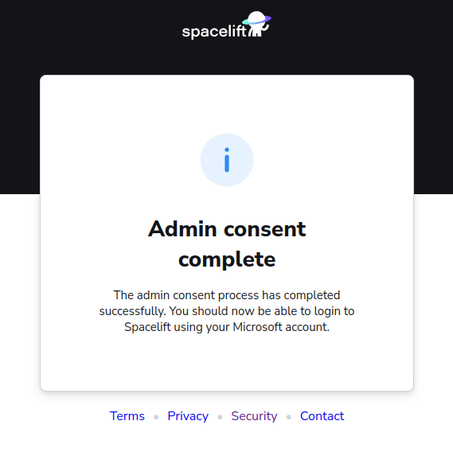

# FAQ

Spacelift has many features and hidden nuggets so it is easy to overlook some of them but we have you covered with this list of frequently asked questions.

If you still cannot find the answer to your question below, please reach out to our [support team](../product/support/README.md).



## Product

### How to submit a feature request?


- Go to the "Resource center" section, in the bottom-left corner menu.
- Fill in your problem or request, what you are trying to achieve, and optionally, your current work around. Then, scroll down to submit your request.

If you wish to view feature requests you have previously submitted, you can access the portal through this pop-out. There, you'll be able to see the status of your requests.

Additionally, the portal allows you to vote on and join discussions about other requests, review new releases, and see upcoming features.

!!! Tip
    If you're experiencing issues, please disable any ad blockers temporarily and refresh the page.



### Providing Admin consent for Microsoft login

In order to sign up for Spacelift using an Azure AD account via our Microsoft login option, the Spacelift application needs to be installed into your Azure AD directory. To do this you either need to be an Azure AD administrator, or your Azure AD configuration needs to allow users to install applications.

If you don't have permission, you will receive the following message when attempting to sign up:


If this happens, it means that you need ask an Azure AD admin to provide Admin consent, as described in the [Microsoft documentation](https://learn.microsoft.com/en-us/azure/active-directory/manage-apps/grant-admin-consent?pivots=portal){: rel="nofollow"}.

To do this, your Azure AD admin can use a URL like the following to grant permission to Spacelift:

```text
https://login.microsoftonline.com/<tenant-id>/adminconsent?client_id=fba648b0-4b78-4224-b510-d96ff51eeef9
```

!!! info
    NOTE: make sure to replace `<tenant-id>` with your Azure AD Tenant ID!

After granting admin consent, your administrator will be redirected to Spacelift and receive the following message:



After admin consent has been provided, you should be able to sign-up for Spacelift using your Microsoft account.

## Platforms

### Terraform/OpenTofu

#### How do I import the state for my stack?

The state file can be imported during the [creation of a stack](../concepts/stack/creating-a-stack.md#terraform).

#### How do I export the state for my stack?

The state file can be pulled and then exported using a [Task](../concepts/run/task.md).

For example, to export the state to an Amazon S3 bucket, you would run the following command or equivalent as a Task:

```shell
terraform state pull > state.json && aws s3 cp state.json s3://<PATH>
```

!!! warning
    For that example to work, the stack needs to have write access to the AWS S3 bucket, possibly via an [AWS Integration](../integrations/cloud-providers/aws.md).

#### How do I switch from Spacelift managing the state to me managing it?

You would first need to [export the state file](#how-do-i-export-the-state-for-my-stack) to a suitable location.

The state management setting can not be changed once a stack has been created so you will need to recreate the stack and make sure that [the "Manage state" setting](../concepts/stack/creating-a-stack.md#terraform) is disabled.

#### How do I manipulate the state file?

You can manipulate the state by running a command such as `terraform state <SUBCOMMAND>` commands in a [Task](../concepts/run/task.md).

This applies whether you or Spacelift manages the state file.

#### How do I import existing resources into a stack?

Just [run the `terraform import …`](../vendors/terraform/state-management.md#importing-resources-into-your-terraform-state) or equivalent in a [Task](../concepts/run/task.md).

This applies whether you or Spacelift manages the state file.

#### Can Spacelift modules be used outside of Spacelift?

Yes, modules in the private registry can be used outside of Spacelift with proper credential management. More information can be found [here](../vendors/terraform/module-registry.md#using-modules-outside-of-spacelift).

#### Can I trigger a run when theres a modules update?

Modules track the consumers of each of their versions. When a new module version is released, the consumers of the previously newest version are assumed to be potential consumers of the newly released one. Hence, the trigger policy for a module can be used to trigger a run on all of these stacks. More information can be found [here](../concepts/policy/trigger-policy.md#module-updates).

## Policies

### My policy works fine in the workbench but not on my stack/module

Except for the Login policies, all policies must be attached to stacks or modules to be evaluated so let's first confirm this by verifying that the stack or module is listed in the "Used by" section on the policy page. If it does not show up there, you will need to [attach the policy](../concepts/policy/README.md#attaching-policies).

If your policy is attached to your stack/module and you still do not see the expected behavior from that policy, you should make sure that [sampling is enabled](../concepts/policy/README.md#sampling-policy-inputs) for that policy, and then review the recorded samples in the [Policy Workbench](../concepts/policy/README.md#policy-workbench-in-practice). That should give you valuable insight.

If you do not see any sampled events despite sampling being enabled and having performed events that should have triggered events, make sure that the appropriate type was selected when the policy was created.

### I do not see some samples for my Login policy

Login policies are not evaluated for account creators and SSO admins who always get admin access to their respective Spacelift accounts. This is to avoid a situation where a bad Login policy locks out everyone from the account.

The side-effect is that you will not see samples for these users.

### Are Approval policies and run confirmation the same thing?

[Approval policies](../concepts/policy/approval-policy.md) and [run confirmation](../concepts/run/tracked.md#confirmed) are related but different concepts.

Just think about how GitHub's Pull Requests work - you can approve a PR before merging it in a separate step. Just like a PR approval means "I'm OK with this being merged", a run approval means "I'm OK with that action being executed" but nothing will happen until someone clicks on the "Merge" or "Confirm" button, respectively.

### Can I use multiple policies of the same type?

When there are multiple policies of the same type, they are evaluated independently and then the decisions are merged. With Login policy, denies will take precedence over allows. That is why we recommend having a single Login policy. It is easier to reason about it.

Otherwise, policies could look perfectly fine but block each other with deny rules. This is also true for the Push policy type but Plan policies, for example, are fine because they usually don’t conflict.

### Can I attach my policy to multiple stacks / modules?

This can be done with the `autoattach` label, you can read more about that [here](../concepts/policy#wildcard-policy-attachments).

## Billing

### What counts as a user?

Everyone who logged in to the Services in a given month is counts as a user.

API keys are virtual users and are billed like regular users, too. Thus, each API key used during any billing cycle counts against the total number of users.

When setting up SSO, future logins will appear as new users since Spacelift cannot map those without your assistance. New users will count against your quota, and you may run out of seats. If you run into this problem, you can [contact us](https://spacelift.io/contact){: rel="nofollow"}.

## Stack

### My Stack is not being trigged.

The main culprits are usually a push policy or the wrong branch being tracked.

If you do not have a push policy in place, you can attach a push policy with the [default push policy](../concepts/policy/push-policy/#default-git-push-policy) and enable [sampling](../concepts/policy#sampling-policy-inputs) to then review the inputs in the [policy workbench](../concepts/policy#policy-workbench-in-practice) to confirm that Spacelift has recieved the push event. (If you are using GitLab, you need to set up webhooks for every project)

You can review the branch you are tracking in your stack settings.

We also recommend checking your VCS provider is not currently experiencing any issues.

### Does Spacelift support monorepos?

Spacelift does support monorepos. You can set a [project root](../concepts/stack/stack-settings.md) in your stack settings. Our [default push policy](../concepts/policy/push-policy/#default-git-push-policy) will trigger runs on changes within the project root or the project globs. You can review our [policy example repo](https://github.com/spacelift-io/spacelift-policies-example-library){: rel="nofollow"} and see how you can customize this further.

## Run

### How do I trigger a run locally?

You can use [spacectl](https://github.com/spacelift-io/spacectl){: rel="nofollow"} and the command `spacectl stack local-previews` then packs the content of the local folder, uploads it to a worker, which will then execute a run.

That run will include the init and plan commands but they will not run locally. They will run on the worker.

### How can the workflow be customized?

You can use [hooks](../concepts/stack/stack-settings.md#customizing-workflow) to customize your workflow. Hooks refer to extra commands that can be added to customize the workflow at various stages of a process. These hooks are essentially scripts or commands that are executed before and after certain phases in the Spacelift workflow
