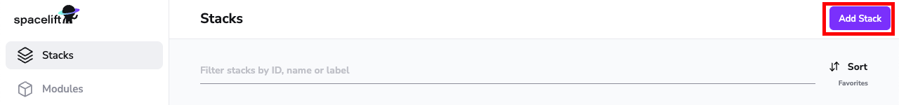
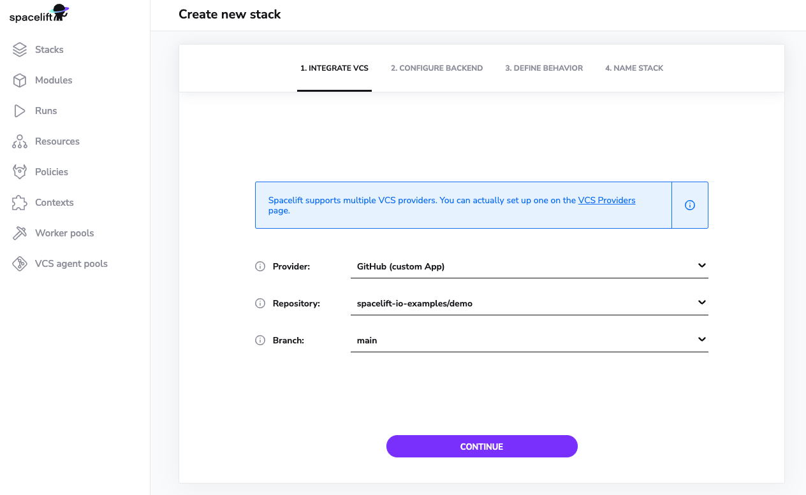
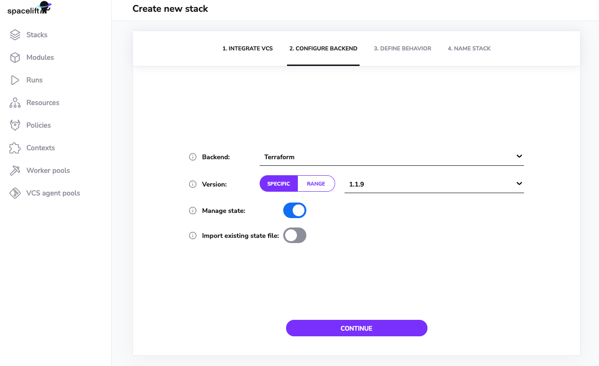
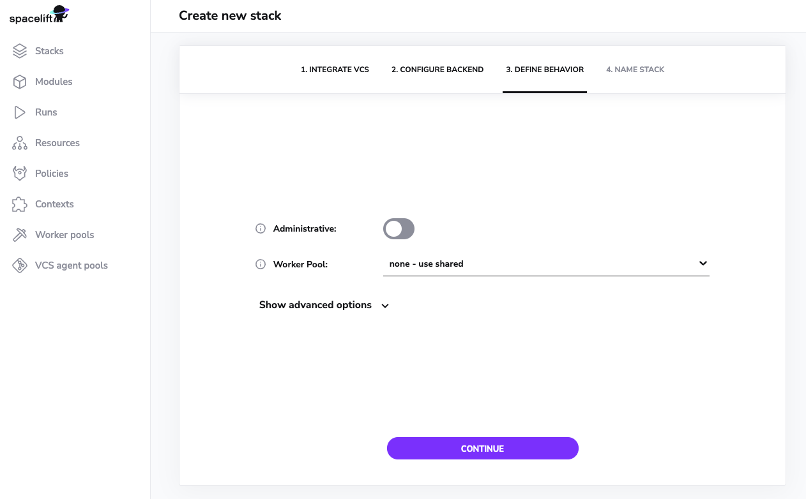
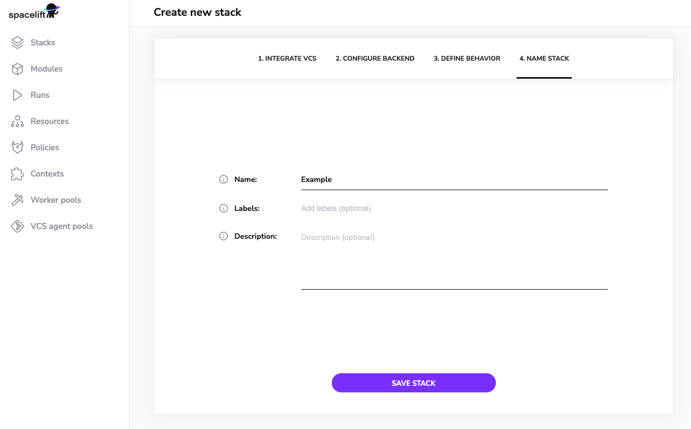
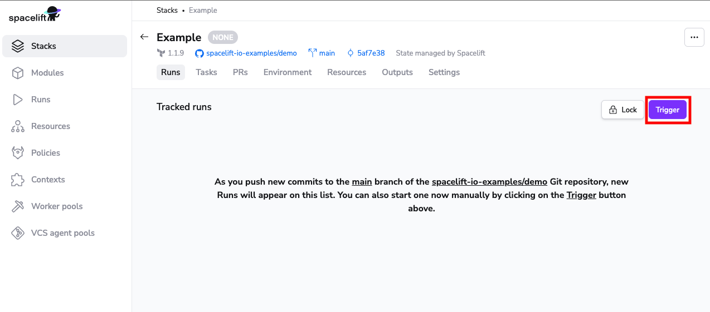
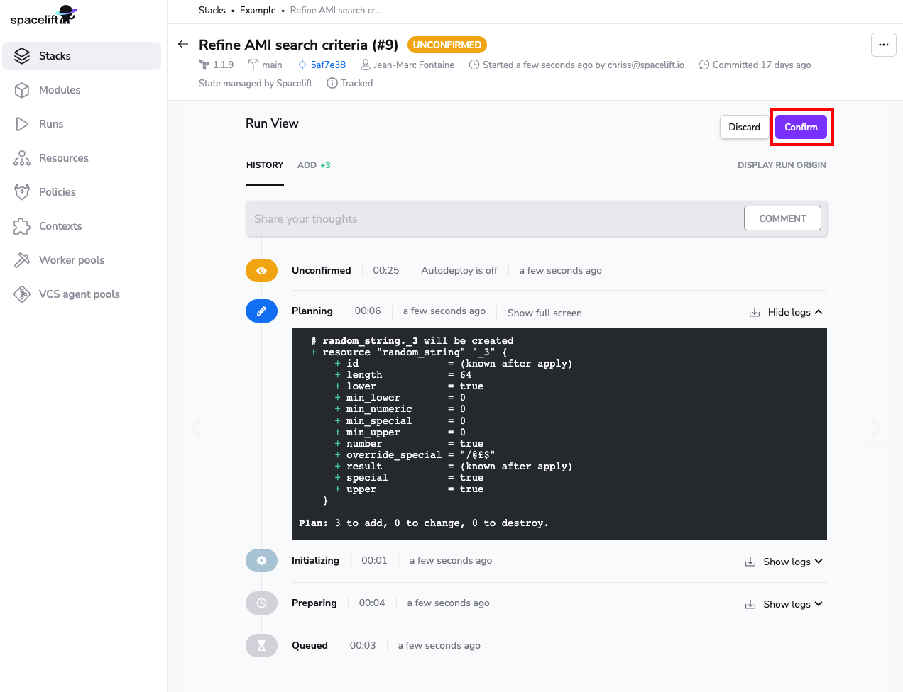
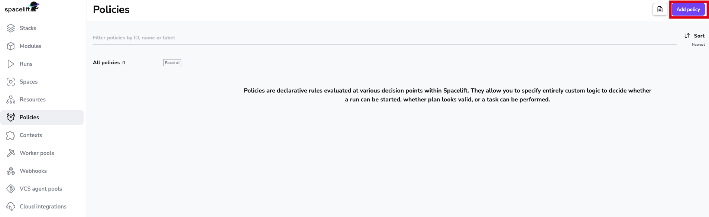

# 🚀 Getting Started

Hello and welcome to Spacelift! In this guide we will briefly introduce some key concepts that you need to know to work with Spacelift. These concepts will be followed by [detailed instructions](getting-started.md#step-by-step) to help you create and configure your first run with Spacelift.

## Introduction to Main Concepts

### Stacks

A stack is a central entity in Spacelift. It connects with your source control repository and manages the state of infrastructure. It facilitates integration with cloud providers (AWS, Azure, Google Cloud) and other important Spacelift components. You can learn more about Stacks in Spacelift [detailed documentation](concepts/stack/README.md).

### State Management

State can be managed by your backend, or for Terraform projects - can be imported into Spacelift. It is not required to let Spacelift manage your infrastructure state.

### Worker Pools

Spacelift provides two options for managing the underlying compute used by Spacelift: public or private worker pools. Public worker pools are managed by Spacelift whereas private pools are hosted by you. Due to security and compliance requirements, several of our customers choose private pools to manage their infrastructure. You can learn more about worker pools [here](concepts/worker-pools.md).

### Policies

Spacelift policies provide a way to express rules as code, rules that manage your Infrastructure as Code (IaC) environment, and help make common decisions such as login, access, and execution. Policies are based on the [Open Policy Agent](https://www.openpolicyagent.org/){: rel="nofollow"} project and can be defined using its rule language _Rego_. You can learn more about policies [here](concepts/policy/README.md).

### Cloud Integration

Spacelift provides native integration with AWS, Azure and Google Cloud (GCP). Integration with other cloud providers is also possible via programmatic connection with their identity services. You can learn more about [cloud provider integration](integrations/cloud-providers/README.md) in Spacelift detailed documentation.

### Change Workflow

Spacelift deeply integrates with your Version Control System (VCS). Pull requests are evaluated by Spacelift to provide a preview of the changes being made to infrastructure; these changes are deployed automatically when PRs are merged. You can learn more about [VCS integration](integrations/source-control/github.md) here.

## Step by Step

This section provides step-by-step instructions to help you set up and get the most out of Spacelift. If you want to learn about core concepts, please have a look at the [main concepts](getting-started.md#introduction-to-main-concepts) section.

## First Stack Run

You can get started with either forking our [Terraform Starter repository](https://github.com/spacelift-io/terraform-starter) and testing all Spacelift capabilities in under 15 minutes or you can explore Spacelift on your own by adding your own repository and going from zero to fully managing your cloud resources.

### Step 1: Create your Spacelift account

- On the [Spacelift home page](https://spacelift.io/), click on the "Get started" button:


Select from the options available to create your Spacelift account:


!!! info
    For users who select GitHub: The GitHub Organization/account name selected will be used as your Spacelift account name.

### Step 2: Connect your Version Control System (VCS)

In this section we will be connecting GitHub as our VCS. You can find more information about other supported VCS providers [here](./integrations/source-control/github.md).

 If you created your Spacelift account using GitHub, see please follow the "[GitHub was used as a sign-in option](getting-started.md#github-was-used-as-a-sign-in-option)" sub-section. If you created your account using another option than GitHub, please see the "[GitHub was not used to sign in](getting-started.md#github-was-not-used-to-sign-in)" sub-section.

!!! info
    The flow for connecting GitHub as a VCS provider is slightly different when using GitHub to sign in compared to the other sign-in options (GitLab, Google). Follow the section that is applicable to you.

#### GitHub was used as a sign-in option

1. [Install the Spacelift GitHub App](https://github.com/apps/spacelift-io/installations/new){: rel="nofollow"} if you have not already installed it.
2. Please select any of your GitHub repositories that create local resources (we will not be integrating with any cloud providers to keep this guide simple and quick_). If_ you do not have a GitHub repository of this kind, you can fork our [terraform-starter repository](https://github.com/spacelift-io/terraform-starter) (Make sure to allow the installed GitHub app access to the forked repository).


Now login to the Spacelift console, you are ready to create your first stack!

#### GitHub was not used to sign in

This sub-section is intended for users who created their Spacelift account using Google, Microsoft or GitLab.

 1. To connect GitHub as your VCS, follow the guide for [setting up the GitHub integration](./integrations/source-control/github.md#setting-up-the-integration).
 2. Please select any of your GitHub repositories that create local resources (we will not be integrating with any cloud providers to keep this guide simple and quick_). If_ you do not have a GitHub repository of this kind, you can fork our [terraform-starter repository](https://github.com/spacelift-io/terraform-starter) (Make sure to allow the installed GitHub app access to the forked repository).

 Please refer to the [Source Control](./integrations/source-control/github.md) section of the documentation to connect a different VCS.

### Step 3: Create Your First Spacelift Stack

Click on the Add **Stack** button.



In the **Integrate VCS** tab, choose your VCS provider, select the repository that you gave access to Spacelift in the first step and select a branch that you want to be attached with your Stack. **Click Continue.**



Click on _Continue_ to configure the backend.

Choose **Terraform** as your backend with a supported version. Leave the default option to let Spacelift manage state for this stack.



Leave the default options checked for Define Behavior and click **Continue**.



Give your stack a name and click **Save Stack**.



### Step 4: Trigger your First Run

Click on _Trigger_ to kick start a Spacelift run that will check out the source code, run terraform commands on it and then present you with an option to apply (confirm) these changes.



After clicking Trigger, you will be taken directly into the run. Click on **Confirm** and your changes will be applied. Your output will look different based on your code repository and the resources it creates.



Congratulation! 🚀 You've just created your first Spacelift stack and completed your first deployment!

Now it is time to add other users to your Spacelift account.

## Adding Users

Now comes the moment when you want to show Spacelift to your colleagues. There are a few different ways to grant users access to your Spacelift account but in the beginning, we are going to add them as single users.

Go to the "Policies" page that can be found on the left sidebar and click the "Add policy" button in the top-right corner.



Name the policy and select "Login policy" as the type.

Then copy/paste and edit the example below that matches the identity provider you used to sign up for the Spacelift account.

=== "GitHub"
    This example uses GitHub usernames to grant access to Spacelift.

    ```opa
    package spacelift

    admins  := { "alice" }
    allowed := { "bob", "charlie", "danny" }
    login   := input.session.login

    admin { admins[login] }
    allow { allowed[login] }
    deny  { not admin; not allow }
    ```
    !!! tip
        GitHub organization admins are automatically Spacelift admins. There is no need to grant them permissions in the Login policy.

=== "GitLab, Google, Microsoft"
    This example uses email addresses to grant access to Spacelift.

    ```rego
    package spacelift

    admins  := { "alice@example.com" }
    allowed := { "bob@example.com" }
    login   := input.session.login

    admin { admins[login] }
    allow { allowed[login] }
    # allow { endswith(input.session.login, "@example.com") } Alternatively, grant access to every user with an @example.com email address
    deny  { not admin; not allow }
    ```

Now your colleagues should be able to access your Spacelift account as well!

!!! note
    While the approach above is fine to get started and try Spacelift, granting access to individuals is less safe than granting access to teams and restricting access to account members. In the latter case, when they lose access to your organization, they automatically lose access to Spacelift while when whitelisting individuals and not restricting access to members only, you'll need to remember to explicitly remove them from your Spacelift Login policy, too.

    Before you go live in production with Spacelift, we recommend that you switch to using teams in [Login policies](./concepts/policy/login-policy.md) and consider configuring the [Single Sign-On (SSO) integration](./integrations/single-sign-on/README.md), if applicable.

## Additional Reading

1. Learn how to [integrate with AWS](integrations/cloud-providers/aws.md) as a cloud provider for your infrastructure
2. Try [creating and attaching policies](concepts/policy/README.md#creating-policies) with stacks for common use cases
3. [Spacelift workflow with GitHub change requests (PR)](integrations/source-control/github.md#pull-requests)
4. [Setting up private workers for Spacelift](concepts/worker-pools.md)
5. Using [environment variables](concepts/configuration/environment.md#environment-variables) and [contexts](concepts/configuration/context.md) with stacks
6. [Configuring stack behavior with common settings](concepts/stack/stack-settings.md)
