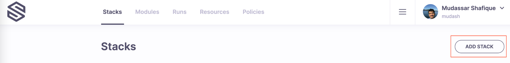
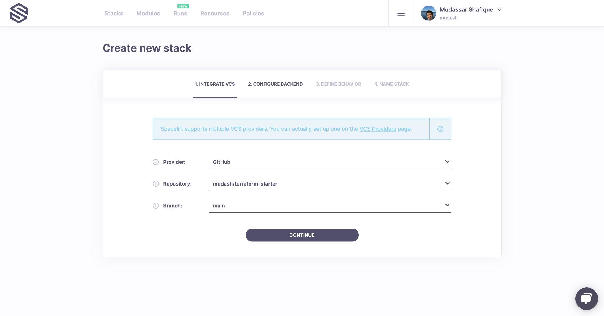
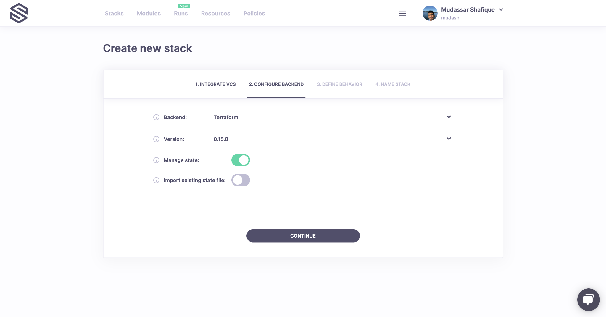
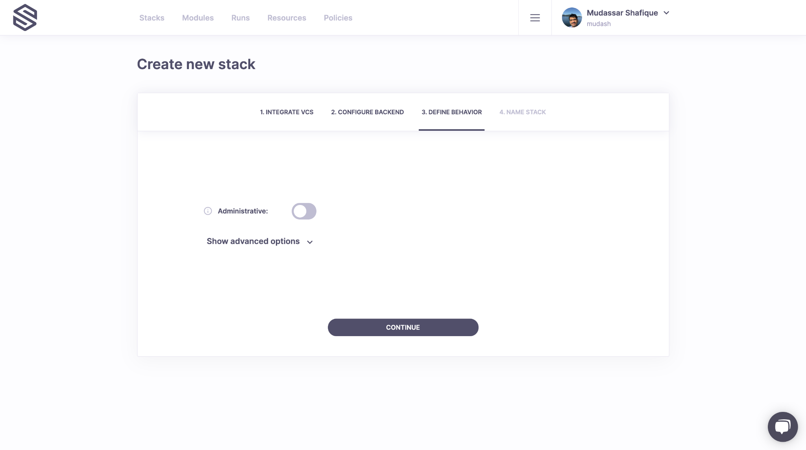
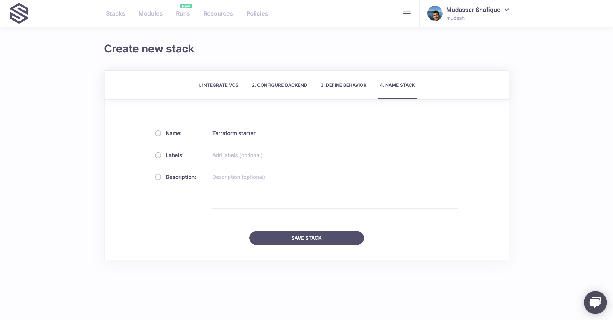
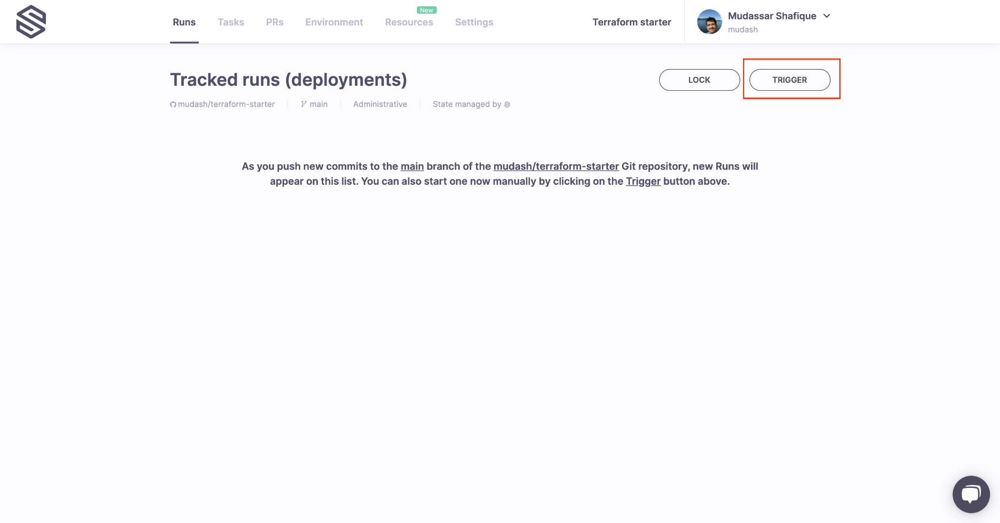
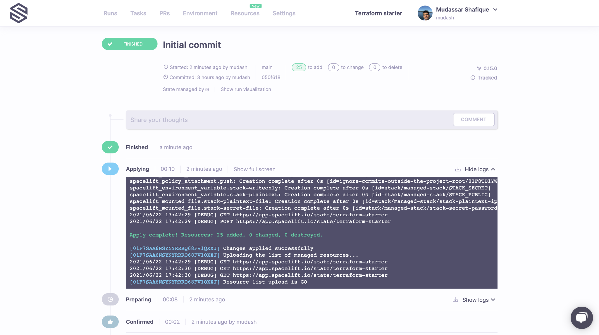

# 🚀 Getting Started

Hello and Welcome to Spacelift! In this guide we will briefly introduce some key concepts that you need to know to work with Spacelift. These concepts will be followed by [detailed instructions](getting-started.md#step-by-step) to help you create and configure your first run with Spacelift.

## Introduction to Main Concepts

### Stacks

A stack is a central entity in Spacelift. It connects with your source control repository and manages the state of infrastructure. It facilitates integration with cloud providers (AWS, Azure, Google Cloud) and other important Spacelift components. You can learn more about Stacks in Spacelift [detailed documentation](concepts/stack/).

### State Management

State can be managed by your backend or can be imported into Spacelift for Terraform projects. It is not required to let Spacelift manage your infrastructure state.

### Worker Pools

Spacelift provides public and private worker pools that execute Spacelift workflows. Public worker pools are managed by Spacelift whereas private pools are hosted by you. Due to security and compliance requirements, several of our customers choose private pools to manage their infrastructure. You can learn more about worker pools [here](concepts/worker-pools.md).

### Policies

Spacelift policies provide a way to express rules as code, rules that manage your Infrastructure as Code (IaC) environment, and help make common decisions such as login, access, and execution. Policies are based on the [Open Policy Agent](https://www.openpolicyagent.org/){: rel="nofollow"} project and can be defined using its rule language _Rego_. You can learn more about policies [here](concepts/policy/).

### Cloud Integration

Spacelift provides native integration with AWS, Azure and Google Cloud (GCP). Integration with other cloud providers is also possible via programmatic connection with their identity services. You can learn more about [cloud provider integration](integrations/cloud-providers/) in Spacelift detailed documentation.

### Change Workflow

Spacelift deeply integrates with your Version Control System (VCS). Pull requests are evaluated by Spacelift to provide a preview of the changes being made to infrastructure; these changes are deployed automatically when PRs are merged. You can learn more about [VCS integration](integrations/source-control/github.md) here.

## Step-by-step

This section provides step-by-step instructions to help you set up and get the most out of Spacelift. If you want to learn about core concepts, please have a look at the [main concepts](getting-started.md#introduction-to-main-concepts) section.

You can get started with either forking our Terraform Starter repository and testing all Spacelift capabilities in under 15 minutes or you can explore Spacelift on your own by adding your own repository and going from zero to fully managing your cloud resources.

- [Use our starter repository to play with Spacelift (guide)](https://github.com/spacelift-io/terraform-starter)
- [Use your own repository (guide)](getting-started.md#first-stack-run)

## First Stack Run

This tutorial will help you complete your first stack and run. It assumes you use your own repository.

### Step 1: Setup your Spacelift account

- On the [Spacelift home page](https://docs.spacelift.io/), click on the "Get Started" button.

- Sign Up with Google, GitLab or GitHub

**Note:**

When using GitHub as an authentication provider, your Spacelift accounts are associated with your selected GitHub account or GitHub Organization. After clicking "Sign Up", you'll need to choose an organization you are a member of, your personal account, or create a new GitHub Organization.

!!! info
    The GitHub Organization/account name selected will be used as your Spacelift account name.

### Step 2: Connecting with GitHub

!!! info
    In this guide, we will be using GitHub to host our repositories. You can find more information about other supported VCS providers [here](integrations/source-control/).

!!! info
    The flow for connecting GitHub as a VCS provider is slightly different when using GitHub to sign in compared to the other sign-in options (GitLab, Google). Follow the section that is applicable to you.

#### GitHub was used as a sign-in option:

1. [Install the Spacelift GitHub App](https://github.com/apps/spacelift-io/installations/new){: rel="nofollow"} if you have not already installed it.
2. Please select any of your GitHub repositories that create local resources (we will not be integrating with any cloud providers to keep this guide simple and quick_). If_ you do not have a GitHub repository of this kind, you can fork our [terraform-starter repository](https://github.com/spacelift-io/terraform-starter) (Make sure to allow the installed GitHub app access to the forked repository).

Now login to the Spacelift console, you are ready to create your first stack!

#### Google or GitLab was used as a sign-in option:

1. You should have arrived on the Spacelift console.
2. Follow the guide for [setting up the GitHub integration](integrations/source-control/github.md#setting-up-the-integration).
3. Please select any of your GitHub repositories that create local resources (we will not be integrating with any cloud providers to keep this guide simple and quick_). If_ you do not have a GitHub repository of this kind, you can fork our [terraform-starter repository](https://github.com/spacelift-io/terraform-starter) (Make sure to allow the installed GitHub app access to the forked repository).

### Step 3: Create your first Stack

1. Click on the Add **Stack** button.

1. In the **Integrate VCS** form, choose your VCS provider, select the repository that you gave access to Spacelift in the first step and select a branch that you want to be attached with your Stack.

Click on _Continue_ to configure the backend.

1. Choose Terraform as your backend with a supported version. Leave the default option to let Spacelift manage state for this stack.

1. Leave the default options checked for **Define Behavior** and click continue.

1. Give a name to your stack and save.

### Step 4: Trigger your first Run

Saving the stack will lead you to the **Runs** screen. Click on _Trigger_ to kick start a Spacelift job that will check out the source code, run terraform commands on it and then present you with an option to apply (confirm) these changes.

Click on _Confirm_ and your changes will be applied. Your output will look different based on your code repository and the resources it creates.

## Further Reading

1. Learn how to [integrate with AWS](integrations/cloud-providers/aws.md) as a cloud provider for your infrastructure
2. Try [creating and attaching policies](concepts/policy/#creating-policies) with stacks for common use cases
3. [Spacelift workflow with GitHub change requests (PR)](integrations/source-control/github.md#pull-requests)
4. [Setting up private workers for Spacelift](concepts/worker-pools.md)
5. Using [environment variables](concepts/configuration/environment.md#environment-variables) and [contexts](concepts/configuration/context.md) with stacks
6. [Configuring stack behavior with common settings](concepts/stack/stack-settings.md)
