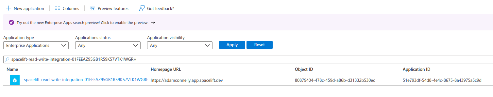

# Integrate Spacelift with Microsoft Azure

Spacelift provides support for managing Azure resources via the Terraform [Azure Provider](https://registry.terraform.io/providers/hashicorp/azurerm/latest/docs){: rel="nofollow"}. The documentation for the Azure Provider outlines the different authentication methods it supports, and it should always be considered the ultimate source of truth.

This page explains how to configure the [Spacelift-managed integration](../../integrations/cloud-providers/azure.md#spacelift-managed-integration), the simplest way to get Azure up and running as your cloud provider in Spacelift. The Spacelift-managed integration handles automatic secret creation and rotation.

!!! info "Other authentication methods"
    See our Azure cloud provider documentation to set up the integration through [static credentials](../../integrations/cloud-providers/azure.md#static-credentials) or [managed service identities](../../integrations/cloud-providers/azure.md#managed-identities).

## Set up the Microsoft Azure cloud integration

!!! tip
    This guide explains how to configure the Azure provider using environment variables. Although you can add these environment variables directly to individual stacks, it may be worth creating a [Spacelift context](../../concepts/configuration/context.md) to store your Azure credentials. This allows you to easily add the same credentials to any stack that requires them.

The Spacelift-managed integration is great when you want to get up and running quickly, and when you want to ensure the credentials for accessing your Azure account will be automatically rotated and stored securely. If you are not comfortable with Spacelift managing your Azure credentials, we would suggest that you use a private worker configured with a [managed identity](../../integrations/cloud-providers/azure.md#managed-identities) for the most control and security.

### Credential storage and rotation

When an Azure integration is created, an associated Microsoft Entra Application is created within Azure. We automatically create a client secret for that application, and rotate it roughly once every 24 hours. The secret is stored securely, encrypted using AWS [Key Management Service](https://aws.amazon.com/kms/){: rel="nofollow"}.

### Step 1: Find your Active Directory Tenant ID

Before creating the Spacelift Azure integration, you need your Tenant ID.

1. Within your Azure portal, navigate to either:
      - The [Azure Active Directory](https://portal.azure.com/#blade/Microsoft_AAD_IAM/ActiveDirectoryMenuBlade/Overview){: rel="nofollow"} section of the Azure portal.
      - The [Subscriptions](https://portal.azure.com/#blade/Microsoft_Azure_Billing/SubscriptionsBlade){: rel="nofollow"} section of the Azure portal.
2. Locate and copy your **Tenant ID**.

### Step 2: Create the cloud integration in Spacelift

1. On the _Integrations_ screen, find the _Azure_ card and click **View**, then **Set up integration**.

2. Fill in the integration details:
    
      1. **Name**: Enter a name for the cloud integration.
      2. **Space**: Select the space that can access the integration.
      3. **Tenant ID**: Paste the Tenant ID copied from the Azure portal.
      4. **Default subscription ID** (optional): If you want to attach your Azure cloud integration to multiple stacks all using the same Azure subscription, specify a default subscription ID here.
      5. **Labels** (optional): Enter a label or labels to help sort your integrations if needed.
3. Click **Set up**.

### Step 3: Provide admin consent

Once your integration has been created successfully, you will be taken to the integration details page to provide the required admin consent. The consent process requires Spacelift to request at least one permission. Although Spacelift requests the “Sign in and read user profile” permission, it **never** signs in as any users in your account or accesses their information.

1. Click **Consent** to install the Microsoft Entra application for your Spacelift integration into your Azure account.
2. Log in to your Azure account, if needed.
3. Click **Accept** on the permissions screen to complete the admin consent process.
    
4. You will be redirected back to Spacelift's Azure integration settings.

!!! warning "Possible error message"
    Microsoft Entra uses eventual consistency to replicate new Azure applications globally. Because of this, you might see the following error message if you try to grant admin consent too quickly after the integration is created:

    

    This isn’t a problem. Just wait a few minutes and try again.

### Step 4: Configure Azure permissions

Now that you have granted admin consent, a new Enterprise Application will be created for your integration in the [Enterprise Applications](https://portal.azure.com/#blade/Microsoft_AAD_IAM/StartboardApplicationsMenuBlade/AllApps/menuId/){: rel="nofollow"} section of Azure Active Directory.

You will need to add a new role assignment for the Spacelift integration.

1. Navigate to the _Access Control (IAM)_ section of the Azure subscription or resource group you're integrating with Spacelift.
2. Click **Add** > **Add role assignment**.
3. **Role**: Select **Contributor**.
4. **Assign access to**: Select **User, group, or service principal**.
5. **Select**: Select the Spacelift Enterprise Application name from the list.
6. Click **Review + assign**.

!!! info
    The Spacelift integration has no access to **any** of your Azure infrastructure unless you explicitly grant it the appropriate permissions.

✅ Step 2 of the LaunchPad is complete! Now you can [create your first stack](../create-stack/README.md).

