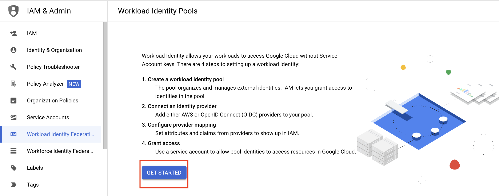
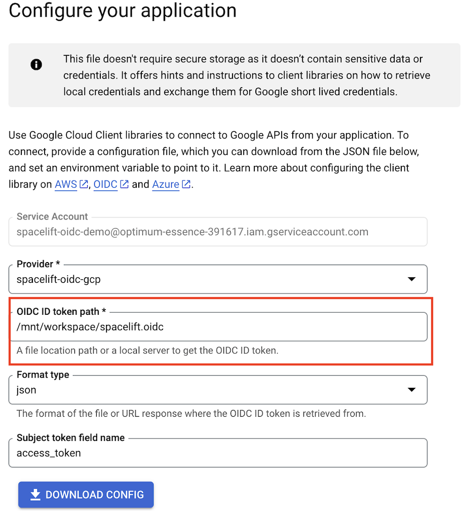

# Integrate Spacelift with Google Cloud Platform

Spacelift's GCP integration via OIDC allows Spacelift to manage your Google Cloud resources without the need for long-lived static credentials by creating a [service account](https://cloud.google.com/iam/docs/service-accounts){: rel="nofollow"} inside the project dedicated to your Stack.

With the service account already created, Spacelift generates temporary OAuth token for the service account as a `GOOGLE_OAUTH_ACCESS_TOKEN` variable in the environment of your [runs](../../concepts/run/README.md) and [tasks](../../concepts/run/task.md). This is [one of the configuration options](https://www.terraform.io/docs/providers/google/guides/provider_reference.html#access_token-1){: rel="nofollow"} for the Google Terraform provider, so you can define it like this:

```terraform
provider "google" {}
```

Many GCP resources require the [`project`](https://www.terraform.io/docs/providers/google/guides/provider_reference.html#project-1){: rel="nofollow"} identifier too, so if you don't specify a default in your provider, you will need to pass it to each individual resource that requires it.

## Set up the Google Cloud Platform integration

In order to enable Spacelift runs to access GCP resources, you need to set up Spacelift as a valid identity provider for your account within GCP.

### Step 1: Set Spacelift as a valid identity provider

1. Navigate to the [GCP console](https://console.cloud.google.com/){: rel="nofollow"} and select the _IAM & Admin_ service.
2. Click **Workload Identity Federation** in the left-hand menu.
3. If this is your first time creating a Workload Identity Pool, click **Get Started**, then **Create Pool**.
    
       - If you have already created a Workload Identity Pool before, click **Create Pool**.
       
4. Enter a name for your new identity pool and optionally set a description.
5. Fill in the identity provider details:
    
      1. **Select a provider**: Select **OpenID Connect (OIDC)**.
      2. **Provider name**: Enter the email address linked to your Spacelift account.
      3. **Issuer (URL)**: The URL of your Spacelift account, including the scheme. Ensure you add [`iss`](../../integrations/cloud-providers/oidc/README.md#standard-claims) to the URL.
      4. **Audiences**: Select **Allowed audiences**, then enter the hostname of your Spacelift account (e.g. `demo.app.spacelift.io`). Ensure you add [`aud`](../../integrations/cloud-providers/oidc/README.md#standard-claims) to the hostname.
6. Fill in the provider attributes to configure mappings between Spacelift token claims (assertions) and Google attributes:
    
       1. **Google 1**: This is filled in automatically with `google.subject`.
       2. **OIDC 1**: Enter `assertion.sub`.
       3. **Google 2**: Enter `attribute.space`.
       4. **OIDC 2**: Enter `assertion.spaceId`. [Custom claims](../../integrations/cloud-providers/oidc/README.md#custom-claims) like this can be mapped to custom attributes, which need to start with the `attribute.` prefix.
7. **Attribute conditions**: Specify extra [conditions](https://cloud.google.com/iam/docs/workload-identity-federation#conditions){: rel="nofollow"} using Google's [Common Expression Language](https://github.com/google/cel-spec){: rel="nofollow"} to restrict which identities can authenticate using your workload identity pool.
8. Finish creating the workload identity pool.

!!! warning
    If your Stack ID is too long, it may exceed the threshold set by Google for the `google.subject` mapping. In that case, you can use a different [custom claim](../../integrations/cloud-providers/oidc/README.md#custom-claims) to create the mapping.

### Step 2: Grant access to service account

Once the workload identity pool has been created, you need to grant it access impersonate the [service account](https://cloud.google.com/iam/docs/service-accounts){: rel="nofollow"} we will be using.

1. Ensure you have a Spacelift service account ready to use.
2. In the workload identity pool details, click **Grant access**.
3. **Service account**: Select the Spacelift service account from the list.
4. **Select principals**: Select space in the attribute name dropdown, then enter the full SpaceId (from Spacelift) in the text box.
5. Click **Save**.

In this example, any token claiming to originate from our Spacelift account's `prod` space can impersonate the service account:


### Step 3: Download the configuration file

After you give the workload identity pool access to impersonate the service account, you will be able to _Configure your application_.

1. **Provider**: Select your Spacelift service account name in the dropdown.
2. **OIDC ID token path**: Enter `/mnt/workspace/spacelift.oidc`.
3. **Format type**: Select **json**.
4. **Subject token field name**: Leave as `access_token`.
5. Click **Download config**.



The downloaded file will include the format type in `credential_source`. You can remove this so your `credential_source` section only contains:

```json
 "credential_source": {
    "file": "/mnt/workspace/spacelift.oidc"
  }
```



#### Internal-only load balancer configuration

GCP needs information about the Spacelift OIDC provider to enable trust between Spacelift and GCP. Generally, GCP will gather this information itself via a JWKS endpoint hosted by Spacelift.

However, if you're using an internal only load balancer, GCP will not have access to that endpoint and you will need to provide the JWKS details manually.

1. Download your JWKS from `https://{your-spacelift-url}/.well-known/jwks`
2. Follow [this guide](https://cloud.google.com/iam/docs/workload-identity-federation-with-other-providers#manage-oidc-keys) on GCP to upload the JWKS to GCP manually.

Once the JWKS is uploaded, OIDC between Spacelift and GCP should work as expected.



### Step 4: Connect with specific IaC providers

#### OpenTofu, Terraform, and Pulumi

Once the Spacelift-GCP OIDC integration is set up, the [Google Cloud Terraform provider](https://registry.terraform.io/providers/hashicorp/google/latest/docs){: rel="nofollow"} and Pulumi [GCP provider](https://www.pulumi.com/registry/packages/gcp/api-docs/provider/){: rel="nofollow"} can be configured without the need for any static credentials.

You will need to provide a configuration file telling the provider how to authenticate. The configuration file can be created manually or generated by the [`gcloud` utility](https://cloud.google.com/sdk/gcloud/reference/iam/workload-identity-pools/create-cred-config){: rel="nofollow"} and looks like this:

```json
{
  "type": "external_account",
  "audience": "//iam.googleapis.com/projects/${PROJECT_NUMBER}/locations/global/workloadIdentityPools/${WORKER_POOL_ID}/providers/${IDENTITY_PROVIDER_ID}",
  "subject_token_type": "urn:ietf:params:oauth:token-type:jwt",
  "token_url": "https://sts.googleapis.com/v1/token",
  "credential_source": {
    "file": "/mnt/workspace/spacelift.oidc"
  },
  "service_account_impersonation_url": "https://iamcredentials.googleapis.com/v1/projects/-/serviceAccounts/${SERVICE_ACCOUNT_EMAIL}:generateAccessToken",
  "service_account_impersonation": {
    "token_lifetime_seconds": 3600
  }
}
```

Your Spacelift run needs to have access to this file, so check it in, then [mount it on a stack](../../concepts/configuration/environment.md#mounted-files) directly or in a [context](../../concepts/configuration/context.md) that is attached to the stack.

You will also need to tell the provider how to find this configuration file. Create a `GOOGLE_APPLICATION_CREDENTIALS` environment variable, and set its value as the path to your credentials file.

Here is an example of using a Spacelift [context](../../concepts/configuration/context.md) to mount the file and configure the provider to be attached to an arbitrary number of stacks:


For more information about configuring the OpenTofu/Terraform provider, please see the [Google Cloud Terraform provider docs](https://registry.terraform.io/providers/hashicorp/google/latest/docs/guides/provider_reference#credentials){: rel="nofollow"}. The Pulumi configuration follows the same steps as OpenTofu/Terraform.

✅ Step 2 of the LaunchPad is complete! Now you can [create your first stack](../create-stack/README.md).


